利用到一些 Tree 的性質，例如有些問題可以從 leaf 開始想之類的

## TOI 2022 pC

???+note "[TOI 2022 pC](https://tioj.ck.tp.edu.tw/problems/2248)"
	給定一顆 $n$ 個點邊有權重的樹，第 $i$ 個點有 $w_{i}$ 台車，第 $i$ 條邊的距離為 $d_i$。如果要讓每個點車子數量最後皆為 $k$，最小總調度成本為多少？
	
	$$調度成本 = 調度數量 \times 調度距離$$
	
	$1 \leq n \leq 10^{5},\sum w_i = n\times k$
	
	??? note "思路"
		一樣我們先考慮 leaf，leaf 只能從父親節點的方向將車送過來，或將多餘的送回去。如果不夠，我們可以先跟父親節點借，將父親節點的 $w_i-=k$；如果太多，我們可以送給父親節點，將父親節點的 $w_i+=k$。
	
		一旦 leaf 調整好至 $k$ 台車，因為不會有車要送過來，或自己有車要送出去，所以可以將 leaf 刪除。
		
	??? note "code"
		```cpp linenums="1"
		int dfs (int u, int par) {
	        int need = w[u] - k, child_need;
	        
	        for(auto v : G[u]) {
	        	if (v == par) continue;
	        	
	        	child_need = dfs(v, u);
	            ans += abs(child_need) * d[i];
	            need += child_need;
	        }
	        
	        return need;
	    }
	    ```

## 拔邊

### BOI 2020 B1. Village (Minimum)

???+note "[BOI 2020 B1. Village (Minimum)](https://codeforces.com/contest/1387/problem/B1)"
	給一顆 $N$ 個點的樹，請將每個點 $i$ 移動到 $v_i$ $(i\neq v_i)$，花費為 $\text{dis}(i,v_i)$。構造 $v_1,v_2,\ldots,v_n$，使得花費**最少**
	
	$N\le 10^5$
	
	??? note "提示"
		先考慮 leaf，leaf 一定至少需要跟他的父親交換
	
	??? note "思路"
	  
		我們其實可以把交換想成一個連接 $u\leftrightarrow v$ 的一個 path，cost 就是 $2\times \text{dis}(u,v)$，盡量讓 path 跟 path 之間的邊不要有交集
		
		問題就變成，我需要將點兩兩連 path，目標是讓大家都至少在一個 path 上的「兩端」
		
		性質 : 能在同一個子樹內配對就在同一個子樹內配對
		
		每個子樹最多只會剩下 1 個點沒配對到
		
		假設 $u$ 的 child 是 $v_1,v_2,v_3$ 他們都分別剩一個節點沒配對到
		
		那就 $v_1\leftrightarrow v_2$，$v_3\leftrightarrow u$ 
		
		<figure markdown>
		    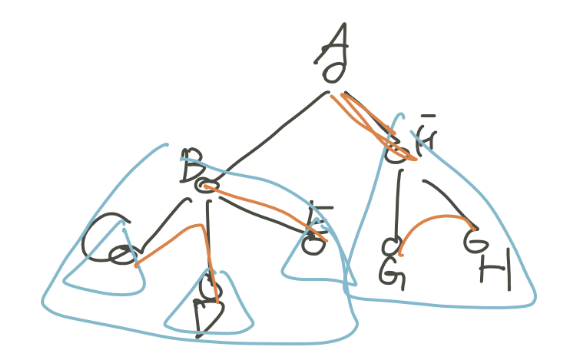{ width="250" }
		</figure>
		  
		  ---
		  
		  > 另解 :
		  
		  把題目的移動看成是兩點在做多個「交換」
		
		先考慮 leaf，leaf 一定至少需要跟他的父親交換，不然他沒其他方可交換了
		
		而交換完後在這個 leaf 的數值也就固定了
		
		也相當於我們可以直接把這個 leaf 刪掉，接下來就是子問題
		
		所以我們得到了一個 greedy 的作法
		
		每次找當前的 leaf
		
		- 如果沒有交換過，就和父節點交換，並將該 leaf 刪除，ans += 2
		
		- 如果 leaf 有交換過，只接就刪掉，ans 維持當前的數字
		
		這樣最後有可能還剩一個，隨便找一個相鄰結點再交換一次就好，一樣 ans += 2
		
		<figure markdown>
		    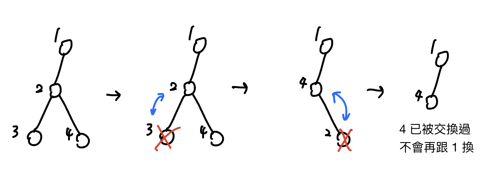{ width="450" }
		    <figcaption>最後還剩一個的例子<caption>
		  </figure>
	  	
		實作方面不需要真的移除 leaf，利用 dfs 讓他從 leaf 開始往上處理即可
		
		詳見代碼
		
		> 參考自 : [hackmd](https://hackmd.io/@E-5gxTGiSByBOKpvsaKa_g/HJDNb1Aev)


    ??? note "code"
    	```cpp linenums="1"
    	#include <bits/stdc++.h>
        #define pb push_back
        using namespace std;
        int n;
        int node[100001];
        vector<int> G[100001];
        int ans = 0;
    
        void dfs(int u, int par) {
            for (auto v : G[u]) {
                if (v != par) dfs(v, u);
            }
    
            if (node[u] == u) {
                if (u == 1) swap(node[1], node[G[1][0]]);
                else swap(node[u], node[par]);
                ans += 2;
            }
        }
    
        int main() {
            cin >> n;
            for (int i = 1; i < n; i++) {
                int u, v;
                cin >> u >> v;
                G[u].pb(v);
                G[v].pb(u);
            }
            for (int i = 1; i <= n; i++) node[i] = i;
    
            dfs(1, 0);
            cout << ans << endl;
            for (int i = 1; i <= n; i++) {
            	cout << node[i] << ' ';
            }
        }
        ```

### NPSC 真島與莉可麗絲

???+note "[2022 NPSC 高中組決賽 pE. 真島與莉可麗絲](https://tioj.ck.tp.edu.tw/problems/2309)"
	給一棵 $n$ 個點的樹，每次可以移除一條長度為質數的 path，構造一組解使整棵樹被移除，或輸出無解
	
	$n\le 2\times 10^5$
	
	??? note "思路"
		n 為偶數一定可以拆成很多個 2，奇數會拆出一個 3。從 leaf greedy，能兩兩配對就兩兩配對，最多只會有一條邊上傳，最後到 root 的時候（我們要保證一定可以配的完，所以要事先讓 degree 為偶數的點當 root），若剩下 2 的有奇數條，就讓其中一條 2 跟 1 配，其他 1 跟 1 配，2 獨自成為一組即可。
		
		實作上，先判沒有 degree 為偶數的點的 tree 無解，將 degree 為偶數的點當根，去 dfs（用 set 去維護 adjacency list），從 leaf 讓 1 跟 1 配，2 自己一組，到 root 的時候再做上面提到的即可

## BOI 2020 B2. Village (Maximum)

???+note "[BOI 2020 B2. Village (Maximum)](https://codeforces.com/contest/1387/problem/B2)"
	給一顆 $N$ 個點的樹，請將每個點 $i$ 移動到 $v_i$ $(i\neq v_i)$，花費為 $\text{dis}(i,v_i)$。構造 $v_1,v_2,\ldots,v_n$，使得花費**最多**
	
	$N\le 10^5$
	
	??? note "提示"
		若考慮以樹重心為根 ? 
		
		能不能讓每條路徑都經過樹重心
		
		註 : 樹重心移除後每個子樹大小 $\le n/2$
	
	??? note "思路"
		我們先對於每條邊獨立思考，最多多少個點可以從 $(u,v)$ 移動 ?
		
		答案是 $2\times \min(sz_u, n - sz_u)$ 
		
		若有辦法將這些邊以某種方法接起來，答案則為 
		
		$$\sum\limits_{\text{edge}\in (u,v)} 2\times \min(sz_u, n - sz_u)$$
		
		<figure markdown>
	      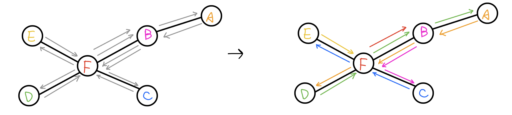{ width="600" }
	      <figcaption>可以證明上界是可以達到的，上圖為一個例子<caption>
	    </figure>
		
		觀察到這個試子跟樹重心的試子蠻像的，有點變成這題（CSES - Network Renovation）
		
		考慮樹重心為根，每個子樹的大小 $\le n/2$
		
		代表每個子樹以外的大小至少是 $n-n/2=n/2$，所以子樹內的點必定可以走到子樹以外，外面也一定有辦法全部都走進來
		
		也就每條邊會被走的次數就是 $2\times sz_u$ (這邊的 $sz$ 是以樹重心為根計算的)
		
		也就是符合上面的 $2\times \min(sz_u, n - sz_u)$
		
		<figure markdown>
	      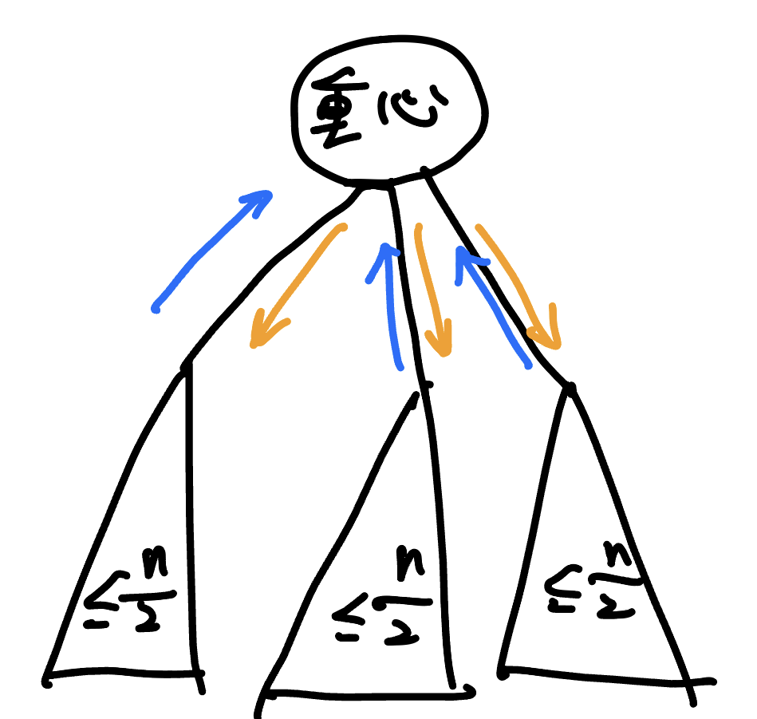{ width="200" }
	      <figcaption>將每個點都先推到 root(重心)，在讓他分配該往哪個子樹去<caption>
	    </figure>
	    
		至於構造的話，使得每個節點都不落入同一子樹中就行了
		
		以重心為根，子樹的 size 不會超過 $n/2$，所以依照 dfs 序 shift $n/2$ 格之後對應到的點一定在不同子樹
	
	??? note "code"
		```cpp linenums="1"
		#include <bits/stdc++.h>
	    using namespace std;
	
	    const int N = 1e5;
	    int n, C, s[N], dt, ds[N], ord[N];
	    vector<int> G[N];
	    long long ans;
		
		// 找樹重心
	    void find(int u = 0, int par = -1) {
	        s[u] = 1;
	        int w = 0;
	        for (auto v : G[u]) {
	            if (v == par)
	                continue;
	
	            find (v, u);
	            s[u] += s[v];
	            w = max(w, s[v]);
	        }
	
	        w = max(n - s[u], w);
	
	        if (w <= n / 2) {
	            C = u;
	        }
	    }
	
	    void dfs(int u = 0, int p = -1) {
	        ord[u] = dt;
	        ds[dt++] = u; // dfs 序
	        s[u] = 1;
	        for (int v : G[u]) {
	            if (v == p)
	                continue;
	            dfs(v, u);
	            ans += min(s[v], n - s[v]);
	            s[u] += s[v];
	        }
	    }
	
	    int main() {
	        ios::sync_with_stdio(0);
	        cin.tie(0);
	
	        cin >> n;
	        for (int i = 1, u, v; i < n; i++) {
	            cin >> u >> v, --u, --v;
	            G[u].push_back(v);
	            G[v].push_back(u);
	        }
	
	        find(); 
	        dfs(C);
	
	        cout << 2 * ans << "\n";
	        for (int i = 0; i < n; i++)
	            cout << ds[(ord[i] + n / 2) % n] + 1 << " ";
	    }
	    ```

## CF 963 B

???+note "[CF 963 B. Destruction of a Tree](https://codeforces.com/contest/963/problem/B)"
	給你一棵 $n$ 個點的樹，只能刪除度數為偶數的節點，節點刪除後，與它相連的邊也會刪除，問你能否把所有點刪除，可以的話構造任意一組解。
	
	$n\le 2\times 10^5$
	
	??? note "思路"
	    > 網路上常見方法 : 
	    
	    對於一個子樹，若子樹邊總和為偶數，那麼每次刪掉偶數邊的節點，最後一定會留下偶數邊，就可以刪完，剩下就只要證明為何不會出現總和偶邊子樹上的節點都是奇數邊而無法刪除的情況。
	
	    > 證明 :
	    
	    設偶數邊為 $2x$，奇數點為 $2x+1$
	    對於每個邊，都會被節點算兩次，所以將 $2x\times2=4x$
	    若要使節點都無法開始刪點（都是奇數邊），那麼節點邊數加總要等於 $4x$，但奇數個奇數總和必等於奇數，也就不符合邊數總和是奇數的假設，因此偶數邊必可以刪完。
	
	    > 我的思路 : 
	    
	    對於每個葉節點，邊數必為 $1$，那麼要刪除此葉節點，只能從他的父節點先刪除，有這個想法後，發現帶到一般節點邊數遍歷後剩奇數的情況亦相同。
	
	    那麼遍歷後剩偶數邊的情況，以下圖來說，若先刪 $pa$ 後刪 $u$，會造成 $u$ 變成奇數邊，這樣 $u$ 和 $v$ 也無法被刪 ，因為這邊的 $dfs$ 是底部遍歷上來，所以需要先刪除的子節點已刪除（接下來會寫甚麼情況必須先刪除），不存在再將 $u$ 的子節點刪掉，$u$ 又可以被刪除的情況，因此必須先刪 $u$ 後刪 $pa$。
	
	    總結來說，對於 $pa$ 的子節點會存在兩種情況 : 
	
	    1. 子節點為奇數邊，需先刪除 $pa$ 才能刪除子節點。
	
	    2. 子節點為偶數邊，需先刪除子節點。
	
	    <figure markdown>
	      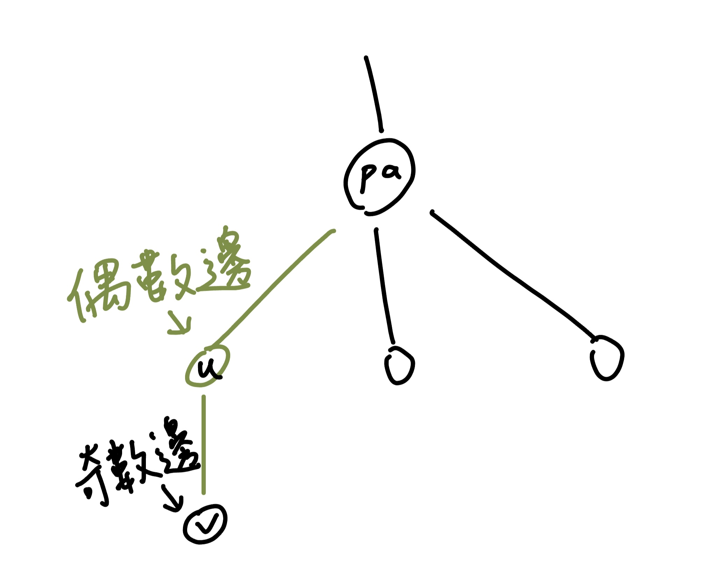{ width="300" }
	    </figure>
	
	    > 簡單說明實作方法 :
	
	    先用 $dfs1$ 從葉節點跑上去看每一個節點遍歷後剩下奇邊還是偶邊，若奇邊，會將該點 push_back 進 $ans$（case1），若偶邊，用 $vis$ 紀錄未加入 $ans$（case2）。
	
	    再用 $dfs2$ 從父節點跑下去，將未加入 $ans$ 加到裡面。
	
	    $ans$ 可以視為 $stack$ 的型態，先加入的代表後刪除。
	    
	??? note "code(by rahlin1004)"
		```cpp linenums="1"
		#include <bits/stdc++.h>
	    #define int long long
	    #define pb push_back
	    using namespace std;
	
	    const int MAXN=2e5+10,INF=1e18;
	    int n,vis[MAXN];
	    vector<vector<int>> G(MAXN);
	    vector<int> ans;
	
	    void dfs2(int u,int pa){
	        if(!vis[u]) ans.pb(u);
	        for(int v:G[u]){
	            if(v==pa) continue;
	            dfs2(v,u);
	        }
	    }
	
	    bool dfs1(int u,int pa){
	        int deg=G[u].size();
	        for(int v:G[u]){
	            if(v==pa) continue;
	            if(dfs1(v,u)) deg--;
	        }
	        if(deg%2==1){ //boom no
	            ans.pb(u);
	            vis[u]=1;
	            return false;
	        }
	        return true;
	    }
	
	    signed main(){
	        cin.tie(0);
	        cin.sync_with_stdio(0);
	
	        cin>>n;
	        for(int i=1;i<=n;i++){
	            int p;
	            cin>>p;
	            if(p==0) continue;
	            G[i].pb(p);
	            G[p].pb(i);
	        }
	
	        if(!dfs1(1,0)) cout<<"NO\n";
	        else{
	            cout<<"YES\n";
	            dfs2(1,0);
	            for(int i=ans.size()-1;i>=0;i--) cout<<ans[i]<<"\n";
	        }
	    }
	    ```

## 2022 YTP 初賽 p3

???+note "[2022 YTP 初賽 p3 ⿊⽩舞蹈機](https://www.tw-ytp.org/wp-content/uploads/2022/12/YTP2022PreliminaryContest_S1.pdf#page=10)"
	給一個 $n$ 點 $m$ 邊無向圖，每個點有一個權值 $c_i\in \{0,1 \}$，當目前選擇一條邊 $(u,v)$ 時，這條邊兩端的 $c_u,c_v$ 都會被 xor $1$。問能不能選一些邊使所有點的 $c_i$ 都是 $0$
	
	$n\le 10^5,m\le 2\times 10^5$
	
	??? note "思路"
		若 $c_i=1$ 的數量是基數，那必定無解。若有一條邊 $(u,v)$ 的 $c_u=c_v=1$，那勢必可以直接銷掉。都銷掉後剩下的每個 $c_i=1$ 的點都必須去找另一個比較遠的 $c_j=1$ 做消除（類似他的貢獻會移動過去），只是圖上的 path 不好找，我們可以將圖簡化成 Tree（spanning tree），他們的貢獻就會一起往 LCA 移動過去。我們就可以從 leaf greedy 的將 $c_i=1$ 的點移的貢獻往 root 的方向移動過去即可。
		
		實作上也不用真的去找 spanning tree，因為 DFS 的過程其實就是一顆 tree（下圖黑色的邊）
		
		<figure markdown>
	      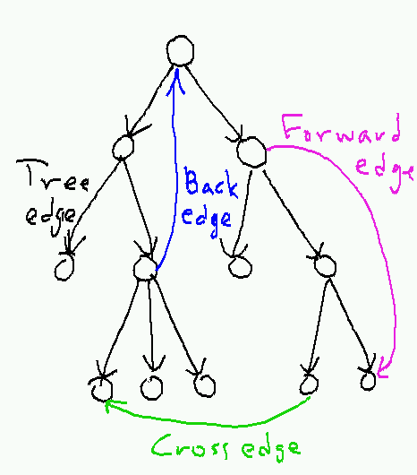{ width="300" }
	    </figure>
	    
	    直接把圖當成 Tree 來做就可以了
	    
	    ```cpp linenums="1"
	    void dfs(int u) {
	        vis[u] = 1;
	        if (a[u] == 1) sum++;
	        for (auto [v, eid] : G[u]) {
	            if (vis[v] == 1) continue;
	            dfs(v);
	            if (!dp[v]) continue;
	            ans.pb(eid);
	            dp[u] ^= 1;
	        }
	    }
	    ```
	    
	    ---
	    
	    > 我複雜的想法 :
	    
	    將圖轉成 spanning tree，將 $c_i=1$ 的點兩兩配對，在覆蓋他們之間的 path，然後再用樹上前綴和計算每個邊被覆蓋奇數或偶數次即可。只是這個實作至少兩百行起跳，在正式比賽不實用
	
	??? note "code(by rahlin1004)"
		```cpp linenums="1"
		#pragma GCC optimize("Ofast")
	    #pragma GCC optimize(2)
	    #include <bits/stdc++.h>
	    #define int long long
	    #define pb push_back
	    #define f first;
	    #define s second
	    #define pii pair<int,int>
	    #define pipi pair<int,pair<int,int>>
	    #define lowbit(x) x&(-x)
	
	    using namespace std;
	    const int INF=1e18,MAXN=2e5+10;
	    int n,m,a[MAXN],dp[MAXN],vis[MAXN],sum=0;
	    vector<vector<pii>> G(MAXN);
	    vector<int> ans;
	
	    void dfs(int u){
	        vis[u]=1;
	        if(a[u]==1) sum++;
	        for(auto [v,w]:G[u]){
	            if(vis[v]==1) continue;
	            dfs(v);
	            if(!dp[v]) continue;
	            ans.pb(w);
	            dp[u]^=1;
	        }
	    }
	
	    signed main(){
	        cin.tie(0);
	        cin.sync_with_stdio(0);
	
	        cin>>n>>m;
	        for(int i=1;i<=n;i++) {
	            cin>>a[i];
	            dp[i]=a[i];
	        }
	        for(int i=1;i<=m;i++){
	            int u,v;
	            cin>>u>>v;
	            G[u].pb({v,i});
	            G[v].pb({u,i});
	        }
	        for(int i=1;i<=n;i++){
	            if(vis[i]) continue;
	            sum=0;
	            dfs(i);
	            //cout<<"i "<<i<<" sum "<<sum<<"\n";
	            if(sum%2==1) {
	                cout<<"No "<<"\n";
	                exit(0);
	            }
	        }
	        cout<<"Yes\n";
	        cout<<ans.size()<<"\n";
	        for(auto ele:ans) cout<<ele<<" ";
	    }
		```

## CF 1436 D

???+note "[CF 1436 D. Bandit in a City](https://codeforces.com/problemset/problem/1436/D)"
	給定一棵 $n$ 個點的有根樹，強盜一開始在根節點，強盜每秒向下走一格。每個點都有一些村民，當強盜走到某個點時，點上的村民會各自向下走一個點，最終只能走到葉子。強盜想最大化抓到的村民，村民想最小化被抓到的人數，如果村民與強盜都 optimal，強盜能抓到多少村民
	
	$n \le 2\times 10^5$
	
	??? note "思路"
		分配村民時存在兩種情況
		
		1. 如果存在一個兒子 $v$，使得就算不給 $v$ 分配一個居民，最後還是 $v$ 子樹內的葉子節點居民最大，那麼就把問題規模縮小成以 $v$ 為根的子樹了（其他兒子就沒用了） 
		
		2. 如果不存在這種兒子 $v$，就存在一種分配方式使得所有葉子節點盡量平均
		
		遞迴下去，最終所有的情況一最後都變成了情況二（worst case 到情況 1一直從根到 leaf，但 leaf 上的村民跑不走了）
	
	??? note "code"
		```cpp linenums="1"
		#include <bits/stdc++.h>
	    using namespace std;
	    #define int long long
	    #define pb push_back
	
	    const int maxn = 2e5 + 10;
	
	    vector<int> G[maxn];
	    int a[maxn], leaf_cnt[maxn], sum[maxn];
	    int ans = 0;
	
	    void dfs(int u) {
	        sum[u] = a[u];
	
	        for (auto &v : G[u]) {
	            dfs(v);
	            leaf_cnt[u] += leaf_cnt[v];
	            sum[u] += sum[v];
	        }
	
	        if (!G[u].size()) leaf_cnt[u] = 1;
	
	        int left = (sum[u] % leaf_cnt[u]) == 0 ? 0 : 1;
	        ans = max(ans, sum[u] / leaf_cnt[u] + left);
	    }
	
	    signed main() {
	        ios::sync_with_stdio(false);
	        cin.tie(0);
	        int n;
	        cin >> n;
	
	        for (int i = 2; i <= n; i++) {
	            int x;
	            cin >> x;
	            G[x].pb(i);
	        }
	
	        for (int i = 1; i <= n; i++) {
	            cin >> a[i];
	        }
	
	        dfs(1);
	        cout << ans << '\n';
	    }
	    ```

## CF 982 C

???+note "[CF 982 C. Cut 'em all!](https://codeforces.com/contest/982/problem/C)"
	給一棵 $n$ 個點的樹，問你最多能切掉幾條邊，使得每個連通塊的大小都是偶數
	
	$n\le 2\times 10^5$
	
	??? note "思路"
		$n$ 為奇數時必定無解。所以當我們可以從 leaf 往 root 考慮，當遇到 sz[v] 為偶數則可以直接切，因為除了 u 的連通塊大小還是偶數之外，答案貢獻還 +1。
		
	??? note "code"	
		```cpp linenums="1"
		#include <bits/stdc++.h>
	    #define int long long
	    #define pii pair<int, int>
	    #define pb push_back
	    #define mk make_pair
	    #define F first
	    #define S second
	    #define ALL(x) x.begin(), x.end()
	    using namespace std;
	
	    const int maxn = 100005;
	    vector<int> G[maxn];
	    int sz[maxn];
	    int n, ans;
	
	    void dfs(int u, int par) {
	        sz[u] = 1;
	        for (auto v : G[u]) {
	            if (v == par) continue;
	            dfs(v, u);
	            sz[u] += sz[v];
	            if (sz[v] % 2 == 0) ans++;
	        }
	    }
	
	    signed main() {
	        cin >> n;
	
	        if (n & 1) {
	            cout << "-1\n";
	            exit(0);
	        }
	
	        for (int i = 1; i < n; i++) {
	            int u, v;
	            cin >> u >> v;
	            G[u].push_back(v);
	            G[v].push_back(u);
	        }
	        dfs(1, -1);
	        cout << ans << '\n';
	    }
		```

## 樹上匹配問題

### 題目1

???+note "樹上匹配問題 題目1"
	給定 $n$ 個點的樹，其中 $n$ 為偶數，我們要將所有頂點兩兩配對，其中點 $u$ 和點 $v$ 配對的權值為 $dis(u,v)$。現在要求將所有點兩兩配對，且要求計算最小/最大權重總和
	
	??? note "思路"
		【最小】
		
		$$
		\begin{aligned}
	    W&=\sum dis(u,v) \\
		&=\sum \text{depth}(u)+\text{depth}(v)-2\times \text{depth}(\text{lca}(u,v)) \\
	    &=\sum \text{depth}(v)- 2\times \sum \text{depth}(\text{lca}(u,v)) \\
	    \end{aligned}
		$$
		
		$\sum \text{depth}(v)$ 是可以直接算的，我們現在能做的就是將 $\sum \text{depth}(\text{lca}(u,v))$ 最小化，也就是在離 root 越近的點當 LCA 配對會越好
		
		我們可以對樹從 root 往下進行 DFS，並儘可能在當前的點 $u$ 將以 $v_1,v_2,\ldots, v_k$ 為 root 的子樹進行配對，也就是一直將兩個不同的子樹 $\texttt{tree}(v_i),\texttt{tree}(v_j)$ 裡面的點以 $\text{lca}=u$ 進行配對。
		
		所以這時以 $u$ 為 LCA 的答案貢獻就會是「配對數量 $\times \text{depth}(u)$」。
		
		【最大】
		
		可以在 dfs 的時候，盡量將 LCA 設定為目前遍歷的頂點，也就是從上面 dfs 下來的過程中能配就配，而求最小是從下面 dfs 回來時能配就配。
		
		> 另法 : 樹重心
		
		我們要盡量使點連到不同的子樹以內，考慮樹重心為根，我們可以將樹重心以下的子樹利用樹重心當作 LCA 做配對，因為點是偶數，所以一定可行。
		
		【證明】 : 為何以樹重心為根會是最佳解
		
		每條邊 $(u,v)$ 的貢獻上界是 $\min (sz_u, n - sz_u)$。注意到以樹重心為根的每條邊匹配的方向都是朝著樹重心，觀察會發現剛好每條邊都有用到這個上界。所以其實答案可以直接寫成 $ans=\sum \limits_{(u,v) \in \text{edge}} \min (sz_u, n - sz_u)$。
		
		如果題目是要構造一組解的話，將點利用 dfs 序 sort 好，第 i 項與第 i + n 項配對即可。

### 2023 IOIC 308

???+note "<a href="/wiki/graph/images/ioic_308.html" target="_blank">2023 IOIC 308 . 數字遊戲</a>"
	給定 $a_1, a_2, \ldots, a_{2N}$，Alice 可以將這個數列任意排列，之後 Bob 要做最少次操作使得 $a_{i} = a_{i+N}$ 對所有 $i$ 從 $1$ 到 $N$ 都成立，Bob 每次可以進行的操作為選擇一個足標 $i$，將 $a_i$ 改成 $\lfloor \frac{a_i}{2} \rfloor,2a_i$ 或 $2a_i+1$。Alice 想讓 Bob 需要的操作次數盡量多，那最多可以是多少？
	
	Alice 會進行 $Q$ 次操作，每一次操作都會選擇數列的某個數修改成新的數字，輸出修改後整個陣列的答案是多少。
	
	$N,Q\le 10^5,1\le a_i\le 10^6$
	
	??? note "思路"
		將問題轉換成 0-1 Trie，會發現 $\lfloor \frac{a_i}{2} \rfloor,2a_i, 2a_i+1$ 得操作分別對應到往 parent 走，往下面 0 的邊走，往下面 1 的邊走。
		
		<figure markdown>
	      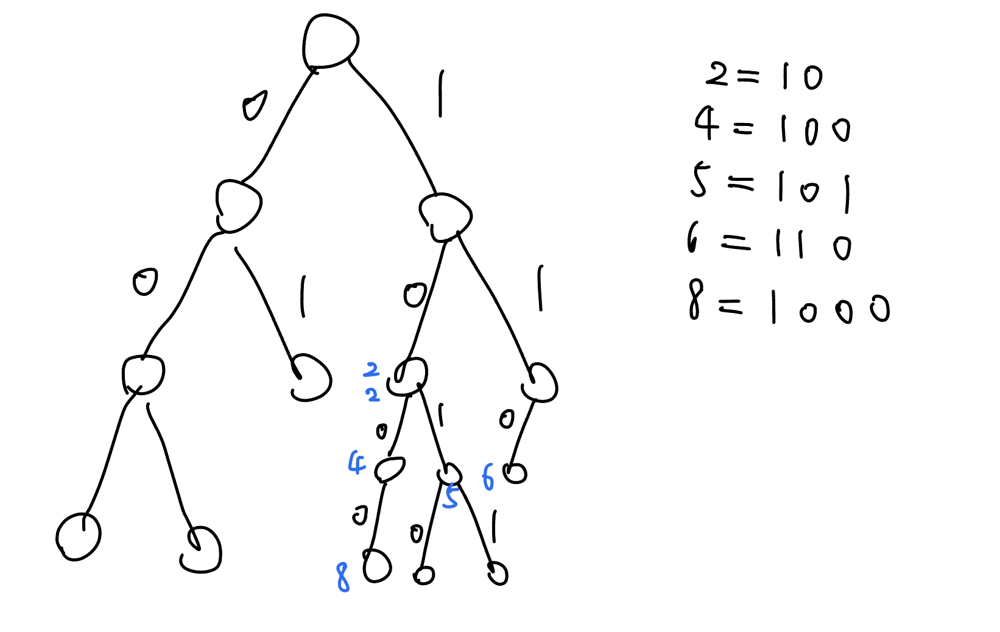{ width="400" }
	    </figure>
	    
	    這樣問題就變成 : 給一顆 BST，問兩兩匹配的最大權重總和
	    
	    跟上面那題一樣，我們用從 root 往下 DFS 的方式去計算答案，而且因為是 BST，所以我們計算完某個點 $u$ 時可以直接繼續 DFS 在裡面的數字比較少的 $v$（詳見代碼），所以過程會是一個從 root 往下的 path，Trie 的深度是 $O(\log n)$，所以時間複雜度是好的
		
	??? note "code"
		```cpp linenums="1"
		#include <bits/stdc++.h>
	    using namespace std;
	
	    const int SIZE = 2e5 + 5;
	    const int TSIZ = 20 * SIZE;
	
	    int n, q, sum;
	    long long ans;
	    int a[SIZE];
	    int siz, cnt[TSIZ], to[TSIZ][2], e[TSIZ];
	    // siz : stamp, cnt[] : 子樹大小總和
	    // to[][0/1] : 紀錄 01Trie 每個點的編號
	    // e[] : Trie 上的某個點上有幾個數字
	
	    void ins(string s, int add) {
	        int pos = 0;
	        cnt[0] += add;
	        sum += add * ((int)s.size());
	        for (char c : s) {
	            int b = c - '0';
	            if (!to[pos][b]) to[pos][b] = ++siz;
	            pos = to[pos][b];
	            cnt[pos] += add;
	        }
	        e[pos] += add;
	    }
	
	    int que() {
	        int re = sum;
	        int pos = 0, dep = 0, all = 2 * n;
	        for (int i = 20; i >= 0 && all; i--) {
	            dep++;
	            int c0 = to[pos][0] ? cnt[to[pos][0]] : 0;
	            int c1 = to[pos][1] ? cnt[to[pos][1]] : 0;
	            int ce = e[pos];
	            int mn = min({c0 + ce, c1 + ce, all / 2});
	            re -= 2 * (dep - 1) * mn;
	            all -= 2 * mn; 
	            if (c0 <= c1) pos = to[pos][1];
	            else pos = to[pos][0];
	            if (!pos) return re;
	        }
	        return re;
	    }
	
	    string f(int x) {
	        string t;
	        while (x) {
	            if (x & 1) t += "1";
	            else t += "0";
	            x >>= 1;
	        }
	        reverse(t.begin(), t.end());
	        return t;
	    }
	
	    signed main() {
	        cin >> n;
	        for (int i = 1; i <= 2 * n; i++) {
	            cin >> a[i];
	            ins(f(a[i]), 1);
	        }
	        cin >> q;
	        while (q--) {
	            int p, x;
	            cin >> p >> x;
	            ins(f(a[p]), -1);
	            a[p] = x;
	            ins(f(a[p]), 1);
	            cout << que() << '\n';
	        }
	    }
		```

???+note "[洛谷 P4556 [Vani有约会] 雨天的尾巴](http://www.luogu.com.cn/problem/P4556)"
	給一顆 $n$ 個點的樹，每個點上都有一個背包，一開始是空的。有 $q$ 筆操作:

    - $\text{add}(u, v, x)$: 將 $u$ 到 $v$ 的 path 上的點的背包都放入 $x$
    
    最後對於每個點輸出背包最多的數字（輸出最小可能的答案）
    
    $n,q\le 10^5,1\le x\le 10^5$
    
    ??? note "思路"
    	先考慮 path 的 case，發現我們可將 add 操作想成好幾個從 $u$ 到 $v$ interval，我們就可以用 sweep line 從左到右掃過去，用 map 之類的 data structrue 維護，複雜度 $O(q\log n)$
    	
    	<figure markdown>
          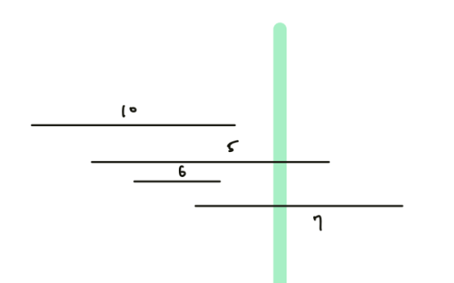{ width="300" }
        </figure>
        
        Tree 的 case 考慮樹鏈剖分，將一次 add 變成在 $\log n$ 條 path 的 case 即可，複雜度 $O(q\log ^2 n)$

???+note "[CF 1919 D. 01 Tree](https://www.luogu.com.cn/problem/CF1919D)"
	給你一顆完全二元樹，與兒子相連的兩條邊權恰好一個是 0，一個是 1。目前不知道樹的形態。但已知，依照 dfs 序，葉子結點的權重恰好是長度為 n 的序列 a。權重定義為 root 到 node 的邊權總和。
	
	$n\le 2\times 10^5, 0 \le a_i \le n - 1$
	
	??? note "思路"
		【轉化題意】
		
		樹真的比較抽象。發現，你可以按照這樣的方法來嘗試解構一顆完全二元樹：找到兩個兄弟葉子節點，刪除它們。此時它們的父親變成葉子結點。由於是一顆完全二元樹，每次一定能找到兩個葉子兄弟節點，知道只剩下一個點。
		
		【題目的性質】
		
		題目中的樹還有一個特點，就是兄弟節點的深度差為 $1$。 結合兩個特點，反映在序列上就是：每次選擇 $a_i$，滿足 $|a_i - a_{i+1}| = 1$，刪除 $a_i$ 和 $a_{i+1}$（兄弟葉子結點），然後在這個位置加入 $\min(a_i, a_{i+1})$（父親節點）。
		
		問題簡化為：每次選擇一個位置，滿足存在相鄰的位置權值比它小 1，然後刪除它，最終能否得到 $a = [0]$。
		
		【作法分析】
		
		可以發現，序列的最大值**只能被其它元素刪掉**。這意味著我們可以貪心地刪除所有序列最大值。如果有元素不能被刪掉，那麼一定不合法。刪除的一個比較簡單的寫法是，注意到一個最大值連續段，只要某個端點能被刪除，就可以全被刪除；否則，是刪不掉的。如果我們刪完了序列最大值，問題就變成了子問題，同樣地解決就好了。至於刪點，可以用鍊錶（用 set 模擬）。
		
	??? note "code"
		```cpp linenums="1"
		#include <iostream>
	    #include <list>
	    #include <vector>
	    using namespace std;
	
	    vector<list<int>::iterator> v[200005];
	
	    bool solve() {
	        int n;
	        list<int> a;
	        cin >> n;
	        for (int i = 0; i < n; i++) {
	            v[i].clear();
	        }
	        for (int i = 0, x; i < n; i++) {
	            cin >> x;
	            a.push_back(x);
	            v[x].push_back(--a.end());
	        }
	        for (int i = n - 1; i >= 1; i--) {
	            for (auto &it : v[i]) {
	                if ((it != a.begin() && *prev(it) == i - 1) || (it != --a.end() && *next(it) == i - 1)) {
	                    a.erase(it);
	                    it = a.end();
	                } else if (it == --a.end() || *next(it) != i) {
	                    return false;
	                }
	            }
	            for (auto &it : v[i]) {
	                if (it != a.end()) {
	                    a.erase(it);
	                }
	            }
	        }
	        return a.size() == 1 && a.back() == 0;
	    }
	
	    signed main() {
	        ios::sync_with_stdio(false);
	        cin.tie(0), cout.tie(0);
	        int t;
	        cin >> t;
	        while (t--) {
	            cout << (solve() ? "Yes\n" : "No\n");
	        }
	        return 0;
	    }
	    ```

???+note "[TOI 2023 三模 p3. 最穩定的薪水 (Salary)](https://drive.google.com/file/d/1N5fByr6BaZSbs63N8JggtMqwzCiWkHME/view)"
	給一棵 $n$ 個點的樹，第 $i$ 個節點可能有兩種狀況：**已開發**或**未開發**，對**已開發**的城市，薪水為 $x_i$，而對於**未開發**的城市，薪水一開始為 $x_i = 0$，而這些城市會不斷的（同時或不同時）調漲員工薪水，對這些城市而言，定義 $N(i)$ 是該點的鄰居集合而 $c_i$ 為加碼的常數，那這次薪水的調漲將會是

    $$x_i \leftarrow \max\left\{x_i, c_i + \frac 1 {|N(i)|}\sum_{j\in N(i)}x_j\right\}$$
    
    已知在任意次的調整後所有城市的薪資都會達到一個固定的數值，對所有**未開發**的城市輸出這個最終固定的 $x_i$
    
    $1 \leq n \leq 10^6, 0 \leq,$ 初始的 $x_i,c_i \leq 10^6$
     
    ??? note "思路"
    	$x_i$ 跟 $x_i$ 取 max 那裏其實可以省略不用看，因為經過調整後一定不會變小。我們定義一個城市固定的變量是 $c_i$ 而會變動的是 $d_i$。
    	
    	可以發現，目前連任意一個節點的 $d_i$ 都很難求出，所以我們考慮從最簡單的葉節點下手。我們嘗試直接去將葉節點的 $d_i$ 求出來，但發現他會用到他 parent 的 $d_i$ 值，而他 parent 的 $d_i$ 也會需要用到 parent 的 $d_i$，所以無法直接求出。
    	
    	<figure markdown>
          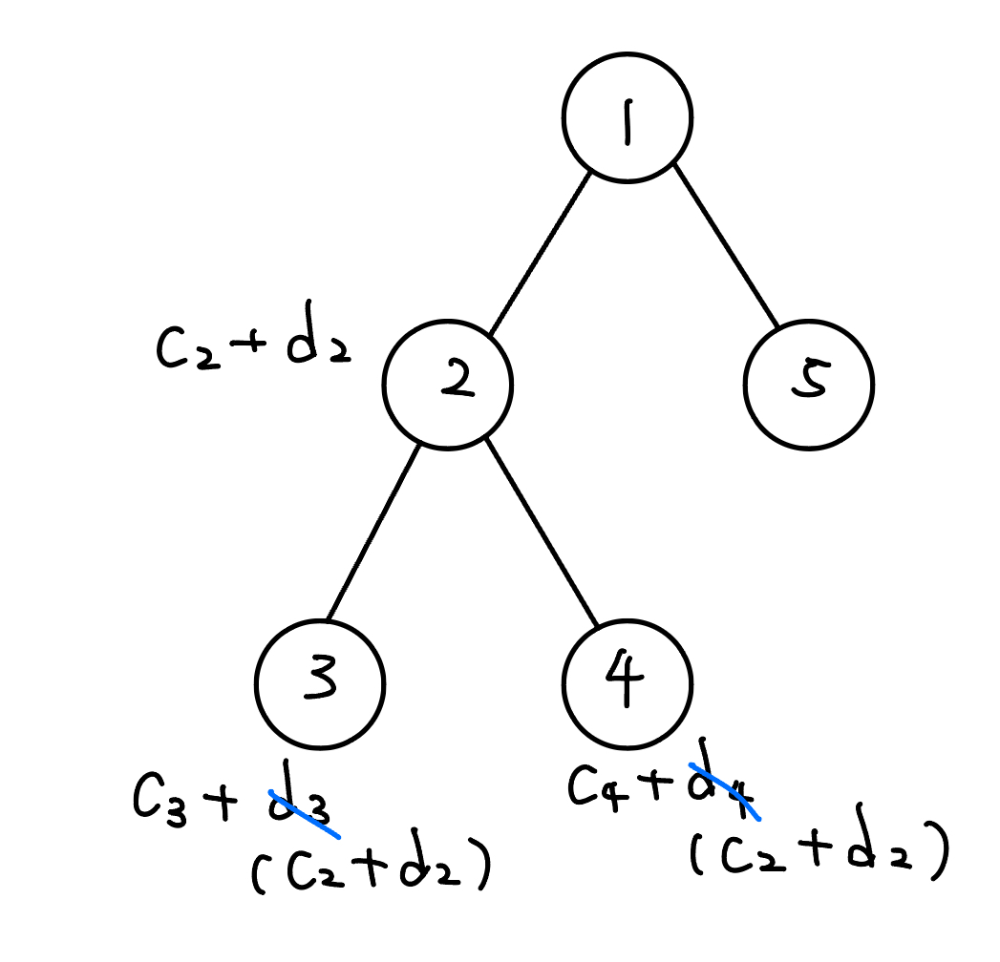{ width="250" }
        </figure>
        
        但這給我們一個啟發，我們雖然不能直接靠葉節點求出來，但我們可以將問題縮小，如下圖。我們將葉節點用他的 parent 的 $d_i$ 來表示，並把他代入到 parent 的值中。
        
        <figure markdown>
          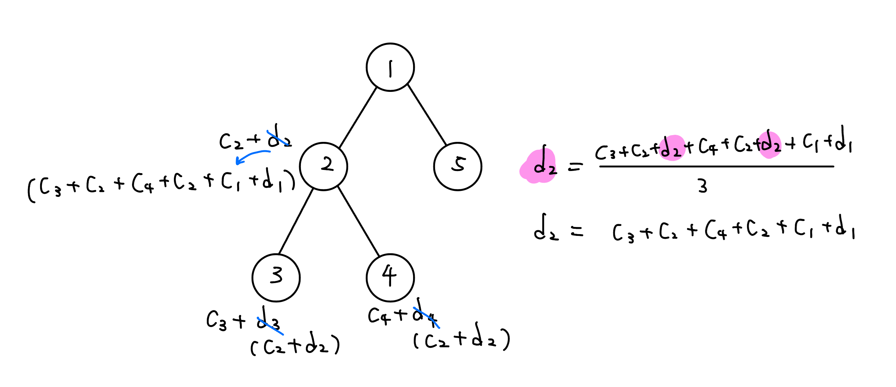{ width="500" }
          <figcaption>$d_2$ 實上還可以將其化簡，見右邊的過程</figcaption>
        </figure>
        
        再來就是子問題。最後，推到 root 的時候，因為 root **沒有 parent** 的干擾，以至於他的 $d_i$ 可以直接求出來，因為只剩下一堆已知的數值的 $c_i$。由此，我們可以再從 root 逆推回去，依序由上而下將所有點的 $d_i$ 求出來，即解決這題。
        
        <figure markdown>
          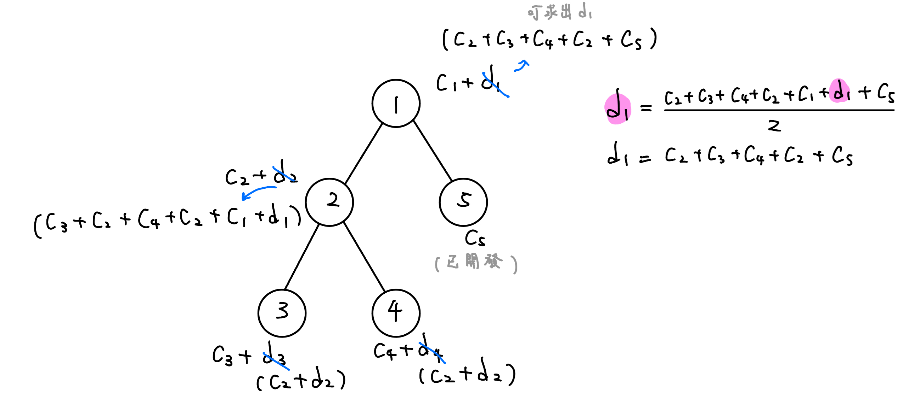{ width="500" }
          <figcaption>假設 5 這個節點是已開發的（讓讀者知道已開發的點的情況）</figcaption>
        </figure>


​     	