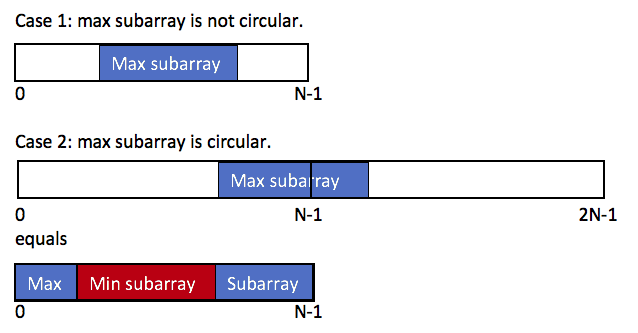

## 環狀
### 問題
???+note "[Maximum Sum Circular Subarray](https://leetcode.com/problems/maximum-sum-circular-subarray/)"
	- 給一個環形陣列，問最大連續子陣列

	- 不能選空的

### 題解

<figure markdown>
  { width="500" }
</figure>

- $ans=\max \begin{cases} \texttt{max subarray} \\ \sum a_i-\texttt{min subarray}\end{cases}$

- 不能選到空的 $\Rightarrow$ 全部都是負的時候只 $\texttt{return max subbary}$ 

#### proof
- $\texttt{Case 2: pre+suf}$

$$\begin{align} \max(\texttt{pre} + \texttt{suf}) &= \max(\texttt{total sum} - \texttt{subarray})
\\ &= \texttt{total sum} + \max(-\texttt{subarray})
 \\ &= \texttt{total sum} - \min(\texttt{subarray}) \end{align}$$

#### 實作
- 技巧 : 環上問題把陣列變成 2n 比較好做

- 變形: TIOJ 2119 質感測試

## 線段樹維護
- 變形: [2020 花中三模 pB](https://codeforces.com/group/GG44hyrVLY/contest/301661/problem/B)

## k個子陣列

- 發現答案 $=0 \Rightarrow \texttt{return max(a[i])}$ 
- [2022 nhspc-mock pB](https://www.csie.ntu.edu.tw/~b11902109/PreNHSPC2022/IqwxCSqc_Pre_NHSPC_zh_TW.pdf)

## 第 k 大
???+ note "[TIOJ 1208.第K大連續和](https://tioj.ck.tp.edu.tw/problems/1208)"
	- 輸出 $\texttt{k-th Subarray Sum}$

## 2D
???+note "[nhspc 2019 pD](https://sorahisa-rank.github.io/nhspc-fin/2019/problems.pdf)"
	給定一個 $n\times m$ 的矩陣，問可以框起來的長方形最大是多少
	
	??? note "思路"
	    - $O(n^2)$ 枚舉 $\texttt{col}$
	
	    - 把問題轉換成一維的 $\texttt{Maximum Subarray}$

## 翻轉一次
???+note "algoseacow 作業"
	給定一個長度 $n$ 的整數陣列 $a$ ，你可以選陣列的一段翻轉，使最大連續子序列和最大
		??? note "思路"
			- $\texttt{pre(i)+suf(i+1)}$

