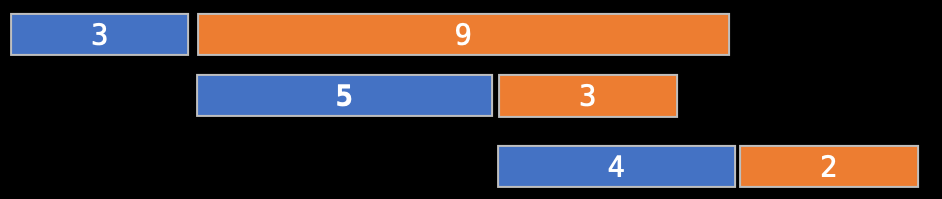

- <https://zerojudge.tw/ShowProblem?problemid=b231>

- <https://tioj.ck.tp.edu.tw/problems/1072>

- file:///C:/Users/yozen/Downloads/%E5%B1%B1%E5%A7%86Greedy.pdf

- <https://slides.com/fhvirus/1/fullscreen#/3/7>

- http://pisces.ck.tp.edu.tw/~peng/index.php?action=showfile&file=f92769faf90359fc0de317dfbe25d71873539c009

???+ note "[TIOJ 1072](https://tioj.ck.tp.edu.tw/problems/1072)"
	有 $n$ 個人要吃飯，第 $i$ 個人想吃的食物需要 $C_i$ 時間才能煮好，而他吃掉食物所花的時間為 $E_i$ ，且廚師同一時間只能煮一個食物，最小化所有人都吃完飯的時間。

	??? note "思路"
		不管哪道食物先煮，總共需要煮的時間都一樣。想要縮短總工時，最好先煮吃飯時間較長的食物。
		<figure markdown>
	    	{ width="500"}
	    	  <figcaption>藍色代表煮的時間，橘色代表吃的時間</figcaption>
	    </figure>
		??? note "證明"
			假設由演算法得到的吃飯的順序為 $a_1, a_2,\ldots, a_n$ ，則此序列一定滿足特性 $E_{a_i} \ge E_{a_{i+1}}$ 。假設有另外一組吃飯順序為 $b_1, b_2, · · · , b_n$，且不滿足該特性，則一定存在兩個相鄰的人 $b_i , b_i+1$ 滿足 $E_{b_i} < E_{b_{i+1}}$ 。如果將這兩個人的吃飯順序對調， 則考慮第 $j$ 個人吃飯結束的時間 (對調前為 $t_1(j)$ ，對調後為 $t_2(j)$ )，可以以下四種人的情況： 
	
	        1. $j < i$：  
	           對調前，結束的時間為 $t_1(j) = \sum \limits_{k=1}^j C_{b_k} + E_{b_j}$； 
	           對調後，結束的時間為 $t_2(j) = \sum \limits_{k=1}^j C_{b_k} + E_{b_j}$。  
	        2. $j = i$：  
	           對調前，結束的時間為 $t_1(j) = t_1(i)= \sum \limits_{k=1}^{i-1} C_{b_k} + C_{b_i}+E_{b_i}$  
	           對調後，結束的時間為 $t_2(j) = t_2(i)= \sum \limits_{k=1}^{i-1} C_{b_k} + C_{b_{i+1}}+C_{b_i}+E_{b_i}$ 。
	
	        3. $j = i + 1$：  
	           對調前，結束的時間為 $t_1(j) = t_1(i+1)= \sum \limits_{k=1}^{i-1} C_{b_k} + C_{b_i}+C_{b_{i+1}}+E_{b_{i+1}}$ ；  
	           對調後，結束的時間為 $t_2(j) = t_2(i+1)= \sum \limits_{k=1}^{i-1} C_{b_k} + C_{b_{i+1}}+E_{b_{i+1}}$。 
	
	        4. $j > i + 1$：  
	           對調前，結束的時間為 $t_1(j) = \sum \limits_{k=1}^j C_{b_k} + E_{b_j}$；  
	           對調後，結束的時間為 $t_2(j) = \sum \limits_{k=1}^j C_{b_k} + E_{b_j}$。  
	
	        我們要比較的是 $\max\{t_1(j)\}$ 和 $\max\{t_2(j)\}$ $(1 \le j \le n)$ ，可以發現會讓 $t_1(j)$ 和 $t_2(j)$ 不同值的只有 $j = i$ 和 $j = i + 1$ ，而且 
	
	        $$\begin{cases}t_1(i + 1) \ge t_2(i) \\ t_1(i + 1) \ge t_2(i + 1)\end{cases}$$
	
	        所以 $\max\{t_1(j)\} \ge \max\{t_2(j)\}$，也就是對調之後，最後吃完的時間一定不會比對調前差。 最後，經過不斷的兩兩對調，一定可以將序列 $b$ 變成序列 $a$ 。最後吃完的時間必為非嚴格遞減，得證序列 $a$ 是這個問題的最優解。
	        
	        > ref : <https://www.csie.ntu.edu.tw/~sprout/algo2021/homework/hand05.pdf>

???+note "[TIOJ 1579.來自未來的新台幣](https://tioj.ck.tp.edu.tw/problems/1579)"
	有⼀些⾯額為 1,5,10,50,100,500,1000 的錢幣，問你⽤這些硬幣最⼩湊不出來的錢是多少?

