## 組合數計算

### 一覽

- 答案不做 mod
	- $10^6$ 次查詢 $n,k\le 64$ → <font color="#00A2E8">暴力建表</font>

- 答案 mod $P$ ， $P$ 是質數
	- $10^6$ 次查詢 $n,k\le 10^6,P=10^9+7$ → <font color="#00A2E8">模逆元建表</font>
	- $10^6$ 次查詢 $n\le 10^9, k\le 30,P=10^9+7$ → <font color="#00A2E8">乘法 + 模逆元</font>
	- $10^5$ 次查詢 $n,k\le 10^{18},P\le 10^6$ → <font color="#00A2E8">Lucas 定理</font>

### 一、暴力建表

範圍 : 

- 答案不做 mod，$10^6$ 查詢，$n,k\le 64$

第 $n$ 個東西拿 or 不拿，得 $C^n_k=C^{n-1}_{k-1}+C^{n-1}_k$

???+note "code"
	```cpp linenums="1"
    void build() {
        C[0][0] = 1;
        for (int i = 1; i <= n; i++) {
            for (int j = 0; j <= i; j++) {
                if (j == 0) C[i][j] = 1;
                else C[i][j] = C[i - 1][j] + C[i - 1][j - 1];
            }
        }
    }
    ```

### 二、模逆元建表

範圍 : 答案 mod 質數，$10^6$ 次查詢 $n,k\le 10^6,P=10^9+7$

??? info "推導轉移式"
	令 $m=k\times i + r$，其中 $k = \left\lfloor \frac{m}{i} \right\rfloor,r = m \bmod i$，則
	
	$$
	\begin{align*}
	& \implies & 0          & \equiv k \cdot i + r   & \mod m \\
	& \iff & r              & \equiv -k \cdot i      & \mod m \\
	& \iff & r \cdot i^{-1} & \equiv -k              & \mod m \\
	& \iff & i^{-1}         & \equiv -k \cdot r^{-1} & \mod m
	\end{align*}
	$$

??? note "code"
	```cpp linenums="1"
    long long pre[MAXN];   // i! % p
    long long inv[MAXN];   // i 對 p 模逆元
    long long prei[MAXN];  // i! 對 p 的模逆元

    void build(int n) {
        pre[1] = pre[0] = 1, inv[1] = inv[0] = 1, prei[1] = prei[0] = 1;
        for (int i = 2; i <= n; i++) {
            pre[i] = pre[i - 1] * i % M;
            inv[i] = (M - M / i * inv[p % i] % M) % M;
            prei[i] = prei[i - 1] * inv[i] % M;
        }
    }

    int C(int n, int k) {
        return pre[n] * prei[k] % M * prei[n - k] % M;
    }
    ```

### 三、乘法 + 模逆元

範圍: $10^6$ 次查詢 $n\le 10^9, k\le 30,P=10^9+7$ 

$$
C^n_k = \frac{n \times (n - 1) \times \ldots \times (n - k + 1)}{1 \times 2 \times \ldots \times k}
$$

一項一項乘即可，除法部分需使用模逆元

- 法1: 
	- $A =  n \times (n - 1) \times \ldots \times (n - k + 1) \mod{P}$
	- $B = (k!) \mod{P}$
	- $(A / B) \mod{P} = A \times \texttt{inv}(B) \mod{P}$
	- 所以只需要 $O(k)$ 去計算 $A,B$ 然後取 $\texttt{inv}(B)$ 即可，總複雜度 $O(k+\log P)$

- 法2:
	- $n/1 \times (n-1) / 2 \times (n-2) / 3 \times \ldots \times (n-i+1) / i$
	- 也可以說是在帕斯卡三角形「橫著走」
	- 每項都取模逆元，總複雜度 $O(k\log P)$

???+note "[Atcoder abc156 D - Bouquet](https://atcoder.jp/contests/abc156/tasks/abc156_d)"
    有 $n$ 個不同的花，要挑其中非 $0$ 個出來，但不能挑 $a$ 個或 $b$  個

    $n\le 10^9,a,b\le 10^5$
    
    ??? note "思路"
    	答案為 $2^n-1-\binom{n}{a}-\binom{n}{b}$

### 四、Lucas 定理

範圍 : 

- 答案 mod 質數，$10^5$ 次查詢 $n,k\le 10^{18},P\le 10^6$

- 答案 mod 合數，$n \le 10^9, k=30, M \approx 10^9$

	- 中國剩餘定理分解出質數，然後套用 Lucas 定理[^2]

$$
C^n_m\equiv C^{n \space \text{mod}\space p}_{m \space \text{mod}\space p}\cdot C^{\lfloor n/p\rfloor}_{\lfloor m/p \rfloor} \pmod{p}
$$

例如我們要求 $C^5_2 \pmod{2}$，那可以先列出:

$5=1\times 2^2+0\times 2^1+1\times 2^0$

$2=0\times 2^2+1\times 2^1 + 0\times 2^0$

那麼答案就會是 $C^1_0\times C^0_1\times C^1_0$。特別地，若 $C^n_k$ 的 $k>n$，代表從 $n$ 個東西取出大於 $n$ 個東西，顯然是不可能，所以方法數為 $0$

??? info "Lucas 定理證明"
	假設我們是求 $C^n_m$，令 $n=sp+q,m=tp+r$

    考慮 $(1+x)^n$ ，其中 $C^n_m$ 會是 $x^m$ 的係數
    
    $(1+x)^n=(1+x)^{sp+q}=((1+x)^p)^s\times (1+x)^q$
    
    而又可以寫成 $(1+x^p)^s\times (1+x)^q$（最下面有證明）
    
    $\Rightarrow (1+x^p)^s\times (1+x)^q$
    
    $\Rightarrow (1+C^s_1 x^p+C^s_2 x^{2p}+\ldots)\times(1+C^q_1 x^1 + C^q_2 x_2 + \ldots)$
    
    可以發現 $x^m$ 的係數就會 $=$ $x^{tp}$ 的係數 $\times$ $x^r$ 的係數，也就是 $C^n_m=C^s_t\times C^q_r$
    
    跟 Lucas 定理的 $C^n_m=C^{n/p}_{m/p}\times C^{n\% p}_{m\% p}$ 是一樣的
    
    > 證明: $(1+x)^p \equiv 1+x^p \pmod{p}$
    >
    > $C^p_i=\frac{p!}{i!\times (p-i)!}$ 在 $i=1\ldots (p-1)$ 時，mod $p$ 會是 $0$
    > 
    > $$
    > \begin{align}
    > (1+x)^p &= C^p_0x^0+C^p_1x^1+C^p_2x^2+\ldots + C^p_px^p \\
    > &\equiv 1+0+0+x^p \pmod{p} \\
    > &\equiv x^p \pmod{p}
    > \end{align}
    > $$

???+note "code"
	```cpp linenums="1"
    const int M = 31;

    int Lucas(int n, int k) {
        if (k == 0) return 1;
        return (Lucas(n / M, k / M) * C(n % M, k % M)) % M;
    }
    ```

> 證明詳見 : [這篇博客](https://blog.csdn.net/Qiuker_jl/article/details/109528164?spm=1001.2101.3001.6661.1&utm_medium=distribute.pc_relevant_t0.none-task-blog-2%7Edefault%7ECTRLIST%7ERate-1-109528164-blog-119976665.pc_relevant_3mothn_strategy_recovery&depth_1-utm_source=distribute.pc_relevant_t0.none-task-blog-2%7Edefault%7ECTRLIST%7ERate-1-109528164-blog-119976665.pc_relevant_3mothn_strategy_recovery&utm_relevant_index=1)

## 常用的組合等式

- 帕斯卡三角形性質
	- $C^n_k=C^{n-1}_k+C^{n-1}_k$
	- 帕斯卡三角形第 $n$ 層第 $k$ 項為 $C^n_k$
	- 橫向走 $C^n_k=C^n_{k-1}\times \frac{(n - k + 1)}{k}$

	- 同一層總和
    	- 第 $n$ 層的數字總和為 $2^n$
    	- 第 $n$ 層的奇數項總和 $2^{n-1}$（$\frac{(1+1)^n - (1-1)^n}{2}$）

- 二項式定理
	- $\displaystyle (x+y)^n = \sum \binom{n}{i} \times x^i \times y^{(n-i)}$

<figure markdown>
  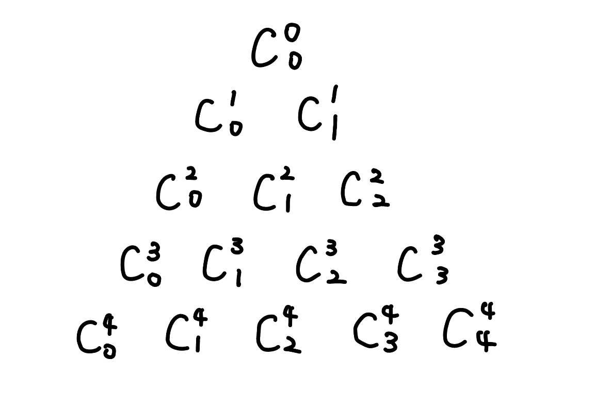{ width="300" }
  <figcaption>帕斯卡三角形</figcaption>
</figure>

## n 球 m 箱問題

先來歸類一下差別

- 球: 箱子內放入了什麼球有差 

- 箱: 箱子的順序有差

### 一、球異箱異

每顆球有 $m$ 種可能性，所以答案為 $m \times m \times ..=m^n$

### 二、球同箱異

隔板法，在 $n+(m-1)$ 個內選 $m-1$ 個當作隔板，也就是 $C^{n+m-1}_{m-1}$

???+note "[CSES - Distributing Apples](https://cses.fi/problemset/task/1716)"
	有 $n$ 個相異箱子，$m$ 個相同球，求分配方法數
	
	$n,m\le 10^6$

### 三、球異箱同

令 $dp(i, j)$ 為已放完編號 $1\ldots i$ 物品，已使用 $j$ 箱。

轉移 $dp(i, j) =dp(i-1, j-1)+ dp(i-1, j)\times j$

### 四、球同箱同

等同於找有幾個長度為 $m$ 總和為 $n$ 的非遞減數列。考慮 $dp(i, j)$ 為長度為 $i$ 的遞增陣列，總和為 $j$，每項至少都是正整數。

轉移 $dp(i, j) = dp(i-1, j-1) + dp(i, j - i)$

<figure markdown>
  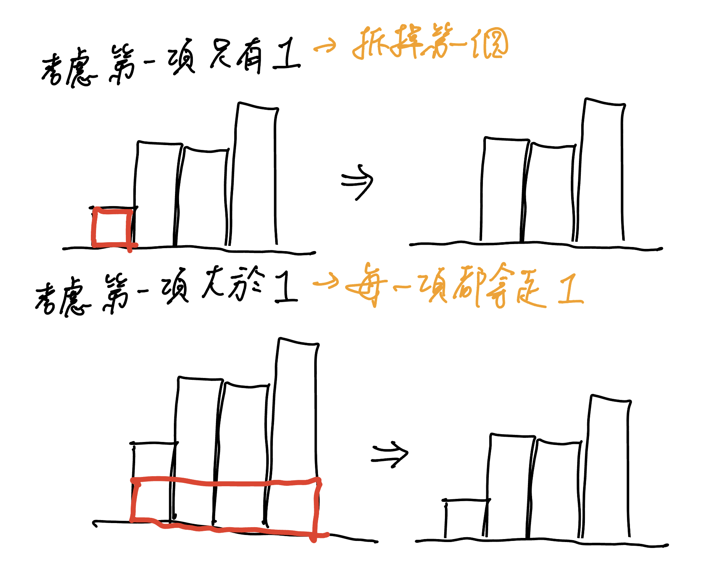{ width="400" }
</figure>

## 環上色

???+note "問題"
	將 $n$ 個點鏈塗上 $k$ 種顏色，相同顏色的兩個點至少要間隔 $m$ 個節點，求出方法數
	
### m=1

- dp(i, 0/1) 跟第一個是不同顏色/相同
- $dp(i, 0)=dp(i-1, 0) \times (k-2) + dp(i-1, 1) \times (k-1)$
- $dp(i, 1)=dp(i-1, 0)$
- 初始化 dp(1, 1) = k
- ans = dp(n, 0)

### m=2

- dp(i, s): 考慮前 i 的東西，s 最後三個分別有沒有跟第一個一樣顏色，其中 s 可能是 000, 001, 010, 100
- $dp(i, 000)=dp(i-1, 100) \times (k-3) + dp(i-1, 000) \times (k-4)$
- $dp(i, 001)=dp(i-1, 000)$
- $dp(i, 010)=dp(i-1, 001) \times (k-3)$
- $dp(i, 100)=dp(i-1, 010) \times (k-3)$
- 初始化 $dp(3, 100) = k \times (k - 1) \times (k - 2)$
- ans = dp(n, 000)

## 環排列

又為第一類斯特林函數。令 $s(n,k)$ 為有 $n$ 個人，$k$ 組的循環排列方法數，依照圖論，我們可以將他轉成一堆有向環[^1]。轉移式考慮第 $n$ 個人要「接」在哪個人的後面，或自己開一組，得 

$$s(n,k)=(n-1) \times s(n-1,k)+s(n-1,k-1)$$

???+note "[Zerojudge b685. 5. 課堂抽籤](https://zerojudge.tw/ShowProblem?problemid=b685)"
	給一個長度為 $n$ 的陣列 $a_1, \ldots ,a_n$，代表 $i$ 與 $a_i$ 同組。現在有些 $a_i$ 是 $0$，代表沒分到組，問有幾種方法可分成 $m$ 組
	
	$n\le 10^7$
	
	??? note "思路"
	    
	    會發現是由一些連通塊，每個連通塊是環 or chain，環的部分代表已經分好組，我們就需要將 `m--`，chain 的部分視為一個物品（孤立點也是），就變成問 $s(n,k)$ 了
	    
	    > 這個其實就是 [Stirling number](https://zh.wikipedia.org/zh-tw/%E6%96%AF%E7%89%B9%E7%81%B5%E6%95%B0)
	    
	??? note "code"
		```cpp linenums="1"
		#include <bits/stdc++.h>
	    using namespace std;
	
	    const int MAXN = 1024;
	    const long long MOD = 1000007;
	    long long dp[MAXN][MAXN];
	    int A[MAXN], used[MAXN];
	
	    int main() {
	        dp[0][0] = dp[1][1] = 1;
	        for (int i = 2; i < MAXN; i++) {
	            for (int j = 1; j <= i; j++)
	                dp[i][j] = (dp[i-1][j-1] + dp[i-1][j] * (i-1))%MOD;
	        }
	        int testcase, n, m;
	        scanf("%d", &testcase);
	        while (testcase--) {
	            scanf("%d %d", &n, &m);
	            for (int i = 1; i <= n; i++) {
	                scanf("%d", &A[i]);
	            }
	            memset(used, 0, sizeof(used));
	            int cnt = 0;
	            for (int i = 1; i <= n; i++) {
	                if (used[i]) {
	                    continue;
	                }
	                int x = i;
	                while (x && used[x] == 0) {
	                    used[x] = 1;
	                    x = A[x];
	                }
	                if (x == i)	{
	                    m--;
	                }
	                if (x == 0)	{
	                    cnt++;
	                }
	            }
	            if (m < 0) {
	                puts("0");
	            } else {
	                printf("%lld\n", dp[cnt][m]);
	            }
	        }
	        return 0;
	    }
	    ```

## 卡特蘭數

### 走格子

???+note "走格子問題"
	給 $n\times n$ 的 Grid，從格子的左下角走到格子的右上角，只能向上或向右走，且不超過對稱軸（不經過紅色的線），有幾種走法
	
    <figure markdown>
      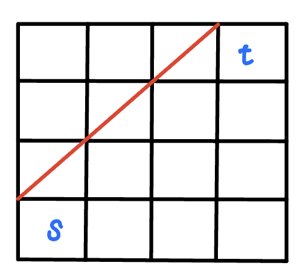{ width="150" }
    </figure>

<figure markdown>
  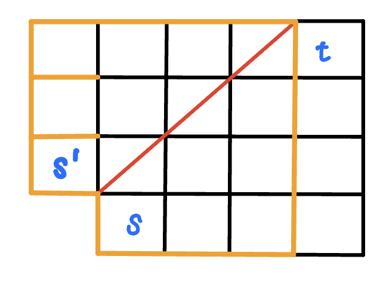{ width="200" }
</figure>

從 s 開始有走到有紅色線的格子，相當於從 s' 開始走到有紅色線的格子（從紅色線對稱過去）。

<figure markdown>
  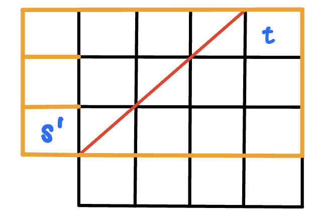{ width="250" }
</figure>

所以不合法方法數 

= 從 s 經過紅色線，在到 t 的方法數 

= 從 s’ 經過紅色線，在到 t 的方法數

而從 s’ 到 t **必然**會經過紅色線，所以又相當於 s’ 到 t 的方法數，也就是 $C^{2n-2}_{n-2}$。所以答案就是 $C^{2n-2}_{n-1}-C^{2n-2}_{n-2}$

???+note "例題"
	有一個 $n\times n$ 的棋盤格，從 $(1,1)$ 走到 $(n,n)$，每次只能將 $x$ 加上 1 或是將 $y$ 加上 1，過程中不能經過 $y = x - 1$ 的格子，有幾種走法
	
	??? note "思路"	
		下面延伸出來一個寬為 $n-2$ 的矩形，所以答案就是 $C^{2n-2}_{n-1}-C^{2n-2}_{n-2}$
		
	    <figure markdown>
	      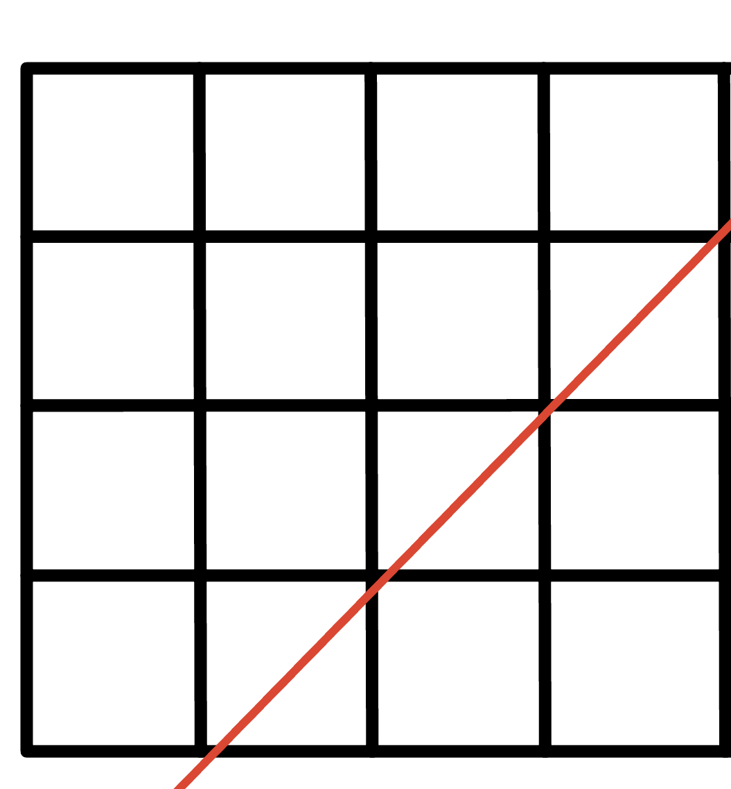{ width="300" }
	    </figure>

???+note "[Atocder abc205 E - White and Black Balls](https://atcoder.jp/contests/abc205/tasks/abc205_e)"

	有一個 $n\times m$ 的 Grid，只能往右或往上，問從 $(0, 0)$ 到達 $(n,m)$ 且 $y\le x+k$ 的方法數
	
	$0\le n,m\le 10^6, 1\le n + m, 0\le k\le n$
	
	??? note "思路"
		顯然一定得經過終點，所以需要符合 $n\le m+k$
	
		$y\le x+k\Rightarrow$ 不能經過 $y=x+k+1$
	
	    <figure markdown>
	      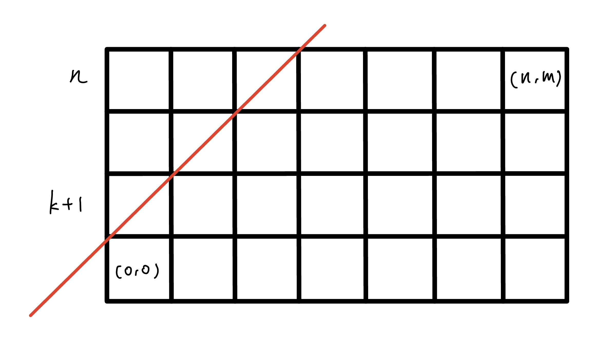{ width="300" }
	    </figure>
	
	    代表我們用卡特蘭數想法所畫出來的矩形的高會是 $n-(k+1)+1$，代表要走 $n-(k+1)$ 步，所以答案就是 
	    
	    $$
	    C^{n+m}_n-C^{n+m}_{n-(k+1)}
	    $$
	    
	??? note "code"
		```cpp linenums="1"
		#include <bits/stdc++.h>
	    #define int long long
	    using namespace std;
	
	    const int MAXN = 2e6 + 10;
	    const int M = 1e9 + 7;
	    int prei[MAXN], pinv[MAXN], pref[MAXN];
	
	    void build() {
	        prei[0] = prei[1] = pinv[0] = pinv[1] = pref[0] = pref[1] = 1;
	        for (int i = 2; i < MAXN; i++) {
	            pref[i] = pref[i - 1] * i % M;
	            pinv[i] = (M - (M/i) * pinv[M % i] % M) % M;
	            prei[i] = prei[i - 1] * pinv[i] % M;
	        }
	    } 
	
	    int C(int n, int k) {
	        return pref[n] * prei[k] % M * prei[n - k] % M;
	    }
	
	    signed main() {
	        int n, m, k;
	        cin >> n >> m >> k;
	        build();
	        if (n > m + k) {
	            cout << 0 << '\n';
	        } else {
	            cout << (C(n + m, n) - C(n + m, n - (k + 1)) + M) % M << '\n';
	        }
	    } 
		```

### 括號

???+note "問題"
	求 n 對括號形成的合法序列數量
	
第一個觀點是把問題轉換成「走格子問題」。第二種觀點就是假設目前已經選了一組括號，那剩下的可以選括號內，或括號外，設答案為 $f(n)$，我們列出轉移式

$$
\begin{align} f(n) = &f(0)\times f(n-1) \\ + &f(1) \times f(n-2) \\ + &f(2)\times f(n-3) \\ + & \ldots \end{align}
$$

那麼依照「走格子問題」問題的結論，我們可以得知 $f(n)=C^{2n}_{n}-C^{2n}_{n-1}$

???+note "[CSES - Bracket Sequences I](https://cses.fi/problemset/task/2064)"
	問長度是 $n$ 合法括號序列有幾個
	
	$n\le 10^6$
	
	??? note "思路"
		看成走格子問題
		
		- opening ↔ 往右
	
		- closing ↔ 往上
	
		以 $n=6$ 來說，圖會長這樣:
		
		<figure markdown>
	      { width="150" }
	    </figure>

???+note "[CSES - Bracket Sequences II](https://cses.fi/problemset/task/2187)"
	給你一個未完成的括號序列，求以此延伸長度為 $n$ 個合法括號序列有幾個
	
	$n\le 10^6$
	
	??? note "思路"
		跟上一題一樣，只是變成走了一些格子，把多餘的格子去掉一樣用卡特蘭數解決
	
	    <figure markdown>
	      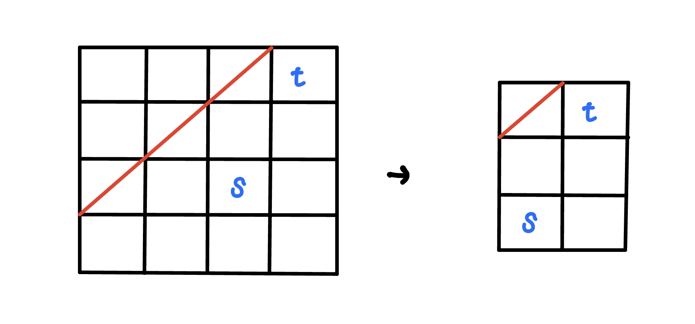{ width="300" }
	      <figcaption>s = ((), n = 6</figcaption>
	    </figure>
	    
	??? note "code"
		```cpp linenums="1"
		int solve(int strlen, string s) {
			int n = strlen / 2, m = strlen / 2;
	        int cnt = 0;
	        for (int i = 0; i < s.size(); i++) {
	            if (s[i] == '(') {
	                m--;
	                cnt++;
	            } else {
	                n--;
	                cnt--;
	            }
	        }
	        return (C(n + m, n) - C(n + m, m + cnt + 1) + M) % M;
		} 
		```

???+note "棧的出棧順序"
	給定 $n$ 個數，一個空棧（stack） $S$，每次棧指向入棧或出棧操作，他們的出棧順序有多少種 ?
	
	??? note "思路"
		想成「求 n 對括號形成的合法序列數量」

### 凸多邊形劃分為三角形

???+note "問題"
	求 n + 2 邊形區域劃分成 n 個三角形區域的方法數
	
我們先固定底邊，然後枚舉底邊的 traingle，再看**底邊的 traingle 的左邊、右邊**還能放幾個

<figure markdown>
  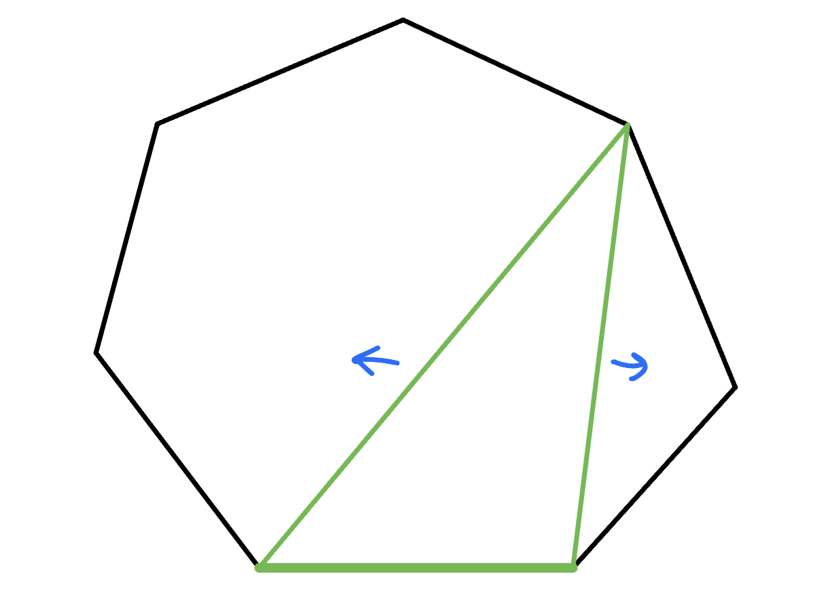{ width="300" }
  <figcaption>以這個例子來說，左邊能放 n - 2 個，右邊能放 1 個</figcaption>
</figure>

令能構出 n 個 traingle 的解為 $f(n)$，我們可以列出:

$$
\begin{align} f(n) = &f(0)\times f(n-1) \\ + &f(1) \times f(n-2) \\ + &f(2)\times f(n-3) \\ + & \ldots \end{align}
$$

發現轉移式跟括號問題一模一樣，所以答案也就是 $f(n)=C^{2n}_{n}-C^{2n}_{n-1}$

### 二元樹數量

???+note "問題"
	求 n 個節點的合法二元樹數量

我們可以看成「n 對括號形成的合法序列數量」，將左括號想成往下走，將右括號想成往回走，以下面這棵 binary tree 來說

<figure markdown>
  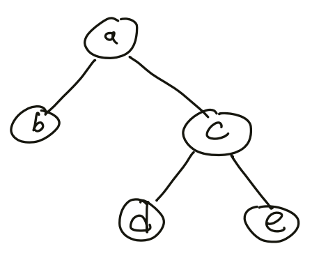{ width="250" }
</figure>

這就是他所形成的括號序列:

<figure markdown>
  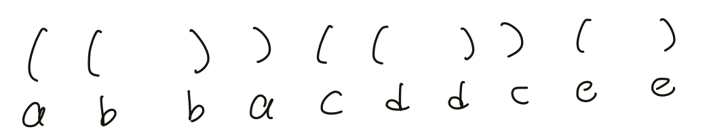{ width="400" }
</figure>

## 排容原理

### 球異箱異 - 沒空箱

???+note "第二類斯特林函數"
	$n$ 個不同東西要分到 $m$ 個不同箱子，每個箱子至少放一個東西，總共有幾種放法。
	
考慮「全部 $-$ 非法」，也就是「全部放法 $-$ 一箱以上沒東西」 = $m^n  - m \times (m-1)^n$。但這樣是否會多扣? 若有兩個空箱的 case，會被扣掉兩次，有 $k$ 個空箱的 case，會被扣掉 $k$ 次。

我們使用排容原理，答案就是

<center>

全 $-$ 至少1箱空 $+$ 至少2箱空 $+...+$ 至少 $m$ 箱空

$m^n-C^{m}_{1} \times (m-1)^{n}+C^{m}_{2} \times (m-2)^{n}+\ldots+C^{m}_{m} \times (m-m)^{n}$

</center>

???+note "code"
	```cpp linenums="1"
    int F(int n, int m) {
        int ret = 0;
        for (int i = 0; i <= m; i++) {
            ret += ((i & 1) ? -1 : 1) * fastpow(m - i, n, M) * C(m, i) % M;
            ret = (ret % M + M) % M;
        }
        return ret;
    }
    ```

???+note "[CSES - Counting Sequences](https://cses.fi/problemset/task/2228)"
	問有幾種長度為 $n$ 的序列滿足每項都介於 $[1, k]$，且 $1\ldots k$ 皆至少出現一次

	$k\le n\le 10^6$
	
	??? note "思路"
		若考慮對於每一項要選什麼，會發現很難做。我們逆向思考，變成看 $1\ldots k$ 每個要選那些 index，更具體來說，有 $k$ 個不同箱子，要放入 $n$ 個不同的球，每箱至少放一個有多少種放法。這個就可以用我們上面講到的排容原理來實現。

### 錯排

???+note "[CSES - Christmas Party](https://cses.fi/problemset/task/1717)"
	有 $n$ 個人，每人各要送一個禮物。問有幾種方法，使每人收到一個禮物（自己送自己收）
	
	$n\le 10^6$

## 經典問題

???+note "n 個 p 面骰子"
	有 $n$ 個 $K$ 面骰（數字分別是 $1\sim K$），各丟一次，求 $n$ 個骰子中出現點數最大值的期望值，設計 DP 狀態並列出轉移求解此題。

	??? note "法 1"
	
	    - 思考 $\texttt{max}$ 已經固定的情況
	        - 骰到 $\texttt{max}$ 的機率 $\texttt{?}$ 
	
	    - 設目前骰到的 $\texttt{max}$ 的點數為 $i$
	        - 共有 $i^n-(i-1)^n$ 種方法數骰到的最大點數是 $i$
	        - 最多到 $i$ 的方法數 $-$ 最多只有到 $i-1$ 的方法數 $=i^n-(i-1)^n$
	        - 只要該方法數內沒有一個是 $i$ 就會被扣掉的概念
	        - 故骰到點數 $i$ 的機率為 $P_i=(\frac{i}{K}^n-\frac{i - 1}{K}^n)$
	        - $E[x]=\sum \limits_{i=1}^n P_i \times i$
	
	    ```cpp
	    void solve1 () {
	        double ans = 0, pre = 0;
	
	        vector<double> p (K + 1, 1);
	        for (int i = 1; i <= K; i++) {
	            for (int j = 1; j <= n; j++) {
	                p[i] = (double) p[i] * i / K;
	            }
	        }
	
	        for (int i = 1; i <= K; i++) {
	            double now = p[i];
	            ans += (double) (now - pre) * i;
	            pre = now;
	        }
	        cout << fixed << setprecision(6) << ans;
	    }
	    ```
	
	??? note "法2"
	    - 令 $dp(n,k)$ 表示丟 $n$ 次骰子的情況下，最大值為 $k$ 的機率
	
	    - $dp(n,k)=P($已經有$k)+P($這局才骰到$k)$
	
	    - $\begin{align} dp(n, k)  \end{align}$
	
	    - 在配合前綴優化
	
	    $$\begin{align}dp(n,k) &= \frac{k}{K}dp(n-1, k) + \frac{1}{K} [ dp(n-1, k-1) + dp(n-1, k-2) + dp(n-1, k-3) + \dots + dp(n-1, 1) ] \\ &= \frac{k}{K}dp(n-1, k)+dp(n,k-1)-\frac{k-1}{K}dp(n-1, k-1)+\frac{1}{K}dp(n-1,k-1) \end{align}$$
	
	    ```cpp
	    void solve2 () {
	        for (int k = 1; k <= K; k++) dp[1][k] = (double) 1 / K;
	
	        // O (nk^2)
	        for (int i = 2; i <= n; i++) {
	            for (int k = 1; k <= K; k++) {
	                double ret = 0;
	                for (int j = 1; j <= k - 1; j++) {
	                    ret = (double) ret + dp[i - 1][j];
	                }
	                ret = (double) ret / K;
	                dp[i][k] = (double) ret + ((double) k / K) * dp[i - 1][k]; 
	            }   
	        }
	
	        // O (nk)
	        for (int i = 2; i <= n; i++) {
	            for (int k = 1; k <= K; k++) {
	                double ret = 0;
	
	                dp[i][k] = ((double)k / K) * dp[i - 1][k] + dp[i][k - 1] 
	                           - ((double)(k - 1) / K) * dp[i - 1][k - 1] 
	                           + ((double)1 / K) * dp[i - 1][k - 1];
	            }
	        }
	
	        double res = 0;
	        for (int k = 1; k <= K; k++) {
	            res = (double) res + dp[n][k] * k;
	        }
	
	        cout << fixed << setprecision (6) << res << "\n";
	    } 
	    ```

???+note "期望抽取次數"
	有 $n$ 種物品，每種物品被抽到的機率都是 $1/n$。求在 $n$ 個物品中至少抽過 $i$ 種不同物品至少一次的期望所需抽取次數，設計 DP 狀態並列出轉移求解此題。
	
	??? note "思路"
		- $dp[i]=dp[i-1]+\frac{n}{n-i-1}$
	
	    - $10$ 次有兩次會中
	
	    - 代表 $5$ 次中 $1$ 次

???+note "環排列類似題 [Hackerrank - Construct the Array](https://www.hackerrank.com/challenges/construct-the-array/problem)"
	給 $n,k,x$，問有幾個長度為 $n$ 的陣列以 $1$ 為開頭，$x$ 為結尾，中間的數字皆在 $1\ldots k$，且相鄰的皆不同
	
	$3\le n\le 10^5, 2\le k\le 10^5, 1\le x\le k$
	
	??? note "思路"
		類似環排列來定義 dp 狀態，dp(i, 0 / 1) = 第 i 格有沒有放 1，相鄰接不同的方法數
		
		初始狀態的話我們可以從後面往前看，也就是 $x$ 當開頭，$1$ 當結尾，這樣我們結尾都是固定的。
		
		- 若 $x=1:$ dp(0, 0) = 0, dp(0, 1) = 1
	
		- otherwise: dp(0, 0) = 1, dp(0, 1) = 0
	
		轉移的話 :
		
		- dp(i, 0) = dp(i - 1, 1) * (k - 1) + dp(i - 1, 0) * (k - 2)
	
		- dp(i, 1) = dp(i - 1, 0)
	
		最後的答案自然就是最後一格放 1 的方法數，也就是 dp(n - 1, 1)
	
	??? note "code"
		```cpp linenums="1"
		long long countArray(int n, int k, int x) {
	        const int M = 1e9 + 7;
	        vector<vector<long long>> dp(n, vector<long long>(2));
	        dp[0][1] = (x == 1);
	        dp[0][0] = !dp[0][1];
	        for (int i = 1; i < n; i++) {
	            dp[i][0] = (dp[i - 1][1] * (k - 1) + dp[i - 1][0] * (k - 2)) % M;
	            dp[i][1] = dp[i - 1][0] % M;
	        }
	        return dp[n - 1][1];
	    }
		```

???+note "[LeetCode 903. Valid Permutations for DI Sequence](https://leetcode.com/problems/valid-permutations-for-di-sequence/)"
	給一個長度 $n$ 的字串 $s$，字元只包含 D 和 I。計算有幾個 $0\ldots n$ 的permutation，滿足 :
	
	- 若 $s_i=$ `D`，$p_i > p_{i+1}$
	
	- 若 $s_i=$ `I`，$p_i < p_{i+1}$
	
	$n\le 200$
	
	??? note "思路"
		考慮前面 i 個東西是 0~i 的排列，紀錄最後一項是什麼
	
		dp(i, j) : p[0] ~ p[i] 是 0~i 的排列，且 p[i] 為 j 的合法排列數量
		
		dp(i, j) = 
		
		- if (s[i] == 'I'): dp(i-1, 0) + dp(i-1, 1) + ... + dp(i-1, j-1)
	
		- if (s[i] == 'D'): dp(i-1, j) + dp(i-1, j+1) + ... + dp(i-1, i-1)
	
		Decrease 的轉移就是最後一項放 j，將前面 p[0, i-1] 大於等於 j 的通通 +1

???+note "[EOJ 3029. 不重复正整数](https://acm.ecnu.edu.cn/problem/3029/)"
	給 $n$，問將 $n$ 拆分為若干不重複的正整數之和，且數字皆不同，且每個數字皆在 $[1, m]$ 之間，有幾種方案 
	
	$n\le 50, m\le 20$
	
	??? note "思路"
		設 $dp(i,j)=$ 用  $1\ldots i$ 裡不重複的數字表示 $j$ 的方法數。轉移的化有兩種選法: 選 $i$，不選 $i$，所以列出
		
	    $$
	    dp(i,j)=dp(i-1,j)+dp(i-1,j-i)
	    $$
	    
	    類似背包問題，時間複雜度 $O(\sum \limits_{i=1}^t n_im_i)$
	    
	??? note "code"
		```cpp linenums="1"
		#include "bits/stdc++.h"
	
	    using namespace std;
	    using u64 = uint64_t;
	
	    int main() {
	        u64 t;
	        cin >> t;
	        for (u64 query = 0; query < t; ++query) {
	            cout << "case #" << query << ":\n";
	            u64 n, m;
	            cin >> n >> m;
	            vector<u64> dp(n + 1, 0);
	            dp[0] = 1;
	            for (u64 i = 1; i <= m; ++i) {
	                for (u64 j = n; j >= i; --j) {
	                    dp[j] += dp[j - i];
	                }
	            }
	            cout << dp[n] << '\n';
	        }
	    }
		```

???+note "[CSES - Xor Pyramid](https://cses.fi/problemset/task/2419)"

    給一個長度為 $n$ 的序列 $a_1, \ldots ,a_n$，將這個序列放在金字塔的最底層，金字塔的每一項為左下 xor 右下，問金字塔的頂層數字
    
    $n\le 2\times 10^5, 1\le a_i\le 10^9$
    	
    ??? note "思路"
    	對於金字塔的一項，被算到的次數為「左上被算到的次數 + 右上被算到的次數」，那麼因為頂層被算到的次數會是 $1$，我們就可以嘗試將每一項被算到的次數寫出來，會發現恰好是帕斯卡三角形。所以對於 $a_i$，被算到的次數為 $C^{n-1}_{i-1}$，因為 xor 只在意奇偶性，所以若 mod 2 為 0 就不用算，否則就將答案 xor 一次就好。$C^n_k$ 可以用 Lucas 定理或線性蓋出來

???+note "[CF 1444 B. Divide and Sum](https://codeforces.com/problemset/problem/1444/B)"
	給你一個長度為 $2n$ 的序列 $a$，將它們平均分成兩組，對第一組做遞增排序，得到序列 $x$，第二組做遞減排序，得到序列 $y$，求對於所有可能的 $x,y$，$\sum \limits_{i=1}^n |x_i-y_i|$ 的總和

	$n\le 1.5\times 10^5, 1\le a_i \le 10^9$
	
	??? note "思路"
		考慮 $x_i,y_i$ 的關係，將 $a$ 小到大排序後，會發現  $x_i,y_i$ 恰好是一個在前 $n$ 個，一個在後 $n$ 個，所以答案就是 
		
		$$\binom{2n}{n}\times (\sum \limits_{i=n+1}^{2n}a_i - \sum \limits_{i=1}^n a_i)$$

???+note "comb 8-10"
	給定四個數字 $a,b,c,l$，問同時滿足以下條件的 tuple$(i,j,k)$ 有幾種

    - $(i+a,j+b,k+c)$ 可構成面積大於 0 的三角形的三邊長
    
    - $i+j+k\le l$
    
    ??? note "思路"
    	這題為排容原理的應用，主要難點在推式子，利用「所有的組合情況 - 不滿足條件的情況」計算答案。
    
        1. 所有的組合情況
    
           $l=i$ 時，為 $n$ 個同物分 3 個不同箱，方法數 $C^{i+2}_2$，枚舉 $i=0\ldots l$ 加總。
    
        2. 不滿足條件的情況：
    
        	三角形須滿足兩邊之和大於第三邊，不滿足時則第三邊**大於等於**其它兩邊之和。枚舉 $a, b, c$ 當第三邊的情況，計算不合法的情況。對於合法的情況，設 a + i, b + j, c + k 要形成三角形，若 a+i 是最大邊，則:
        	
        $$
        \begin{cases}
        (a+i) < (b+j) + (c+k) \\
        i+j+k\le l
        \end{cases}
        $$
        
        不合法的情況就是
        
        $$
        \begin{cases}
        (a+i) \ge (b+j) + (c+k) \\
        i+j+k\le l
        \end{cases}
        $$
        
        當我們固定 a+i 後，j, k 的範圍就是
        
        $$
        \begin{cases}
        j+k\le a-b-c+i  \\
        j+k\le i+l
        \end{cases}
        $$
        
        令 $j+k\le x$，那麼 
    
        - $j=0$ 時，$k=0\ldots x$，共 $x+1$ 種可能
    
        - $j=1$ 時，$k=0\ldots (x-1)$，共 $x$ 種可能
    
        - ...
    
        - $j=x$ 時，$k=0$，共 $1$ 種可能
    
        所以總共 $1+\ldots +(x+1)=\frac{(x+2)\times (x+1)}{2}$
    
    ??? note "code"
        ```cpp linenums="1"
        #include <algorithm>
        #include <iostream>
    
        using namespace std;
    
        long long cal(long long a, long long b, long long c, long long l) {
            long long ans = 0;
            for (long long i = max(b + c - a, 0LL); i <= l; i++) {
                long long x = min(l - i, a + i - b - c);
                ans += (1 + x) * (2 + x) / 2;
            }
            return ans;
        }
    
        int main() {
            long long a, b, c, l;
            cin >> a >> b >> c >> l;
            long long ans = 0;
            for (long long i = 0; i <= l; i++) ans += (i + 1) * (i + 2) / 2;
            ans -= cal(a, b, c, l);
            ans -= cal(b, a, c, l);
            ans -= cal(c, a, b, l);
            cout << ans << '\n';
        }
        ```

???+note "[CSES - Grid Paths](https://cses.fi/problemset/task/1078)"
	給一個 $n\times n$ 的 Grid，一開始在 $(1, 1)$，目標走到 $(n,n)$。給 $m$ 個放置障礙物的位置，只能往左或往右，問在不經過障礙物的前提下有幾種走法
	
	$n\le 10^6, m\le 1000$
	
	??? note "思路"
		dp(i) = 走到 i 合法的路徑數
		
		轉移式的話，就是「全 - 走到 j 之後才不合法的路徑數量」
		
		$$dp(i)=\binom{x+y-2}{x-1}-\sum\limits_{x_j \leq x_i, y_j \leq y_i}{dp_j \times \binom{x_i - x_j + y_i - y_j}{x_i - x_j}}$$
		
		最後的算答案可以在終點放一個障礙物，答案就是 dp(m + 1)

[^1]: 例如 (D), (A, B, C)，<a href="/wiki/math/images/15.png" target="_blank">見此圖</a>

[^2]: <a href="/wiki/math/images/20.png" target="_blank">見此圖</a> 參考自 [stackexchange 博客](https://math.stackexchange.com/questions/95491/n-choose-k-bmod-m-using-chinese-remainder-theorem)

---

## 參考資料

- <https://zhuanlan.zhihu.com/p/609104268>