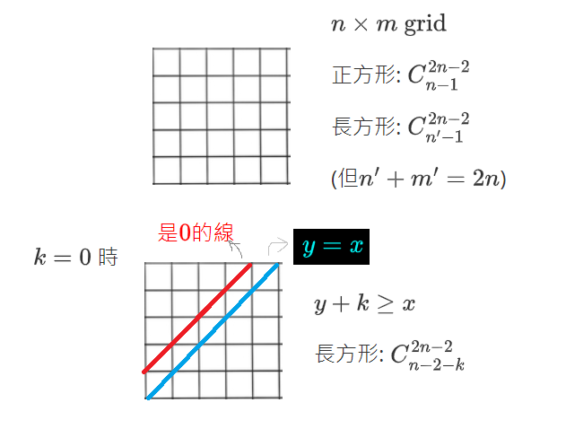
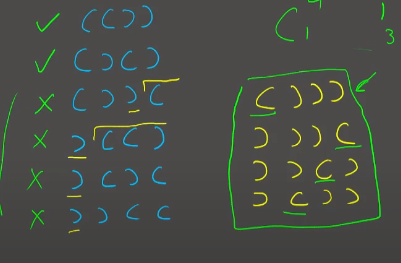
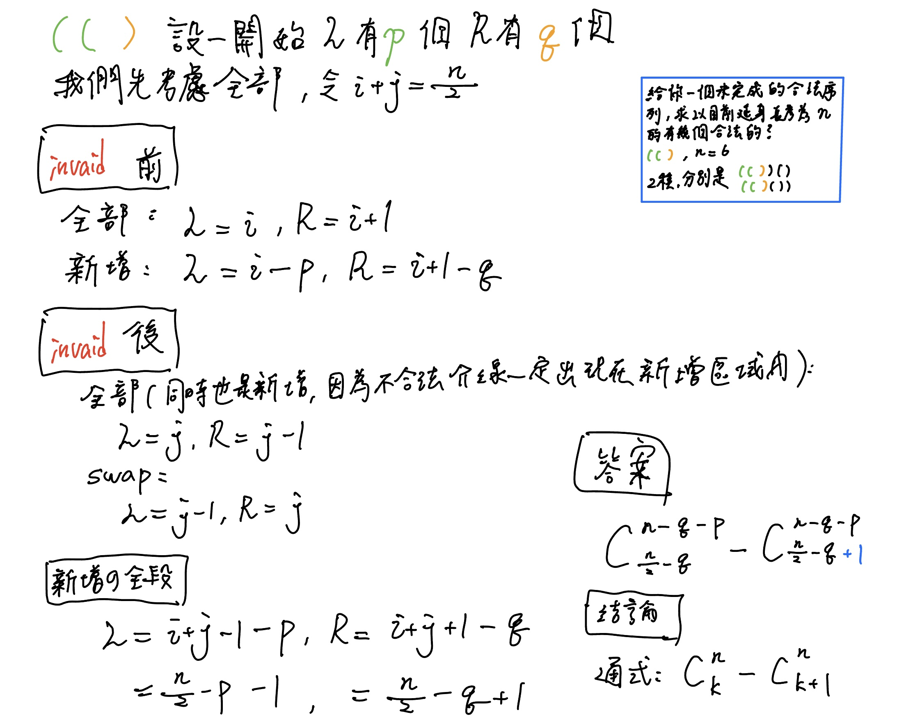

## 組合數計算

### 一覽

- 答案不做 mod
	- $10^6$ 次查詢 $n,k\le 64$ → <font color="#00A2E8">暴力建表</font>
	- 單次查詢 $n,k\le 1000$ → <font color="#00A2E8">大數運算</font>

- 答案 mod $P$ ， $P$ 是質數
	- $10^6$ 次查詢 $n,k\le 10^6,P=10^9+7$ → <font color="#00A2E8">使用模逆元</font>
	- $10^6$ 次查詢 $n\le 10^9, k\le 30,P=10^9+7$ → <font color="#00A2E8">使用模逆元</font>
	- $10^5$ 次查詢 $n,k\le 10^{18},P\le 1000$ → <font color="#00A2E8">Lucas 定理</font>

- 答案 mod $M$，$M$ 不是質數
	- $10^6$ 次查詢 $n\times k\le 10^5,P\approx 10^9$ → <font color="#00A2E8">暴力建表</font>
	- $10^6$ 次查詢 $n\le 10^9,k\le 30,P\approx 10^9$ → <font color="#00A2E8">中國剩餘定理 or gcd</font>

### 暴力建表

範圍 : 

- 答案不做 mod，$10^6$ 查詢，$n,k\le 64$

- 答案 mod 合數，$n \times k \le 10^5$

第 $n$ 個東西拿 or 不拿，得 $C(n, k) = C(n-1, k-1) + C(n-1, k)$

???+note "code"
	```cpp linenums="1"
    void build() {
        C[0][0] = 1;
        for (int i = 1; i <= n; i++) {
            for (int j = 0; j <= i; j++) {
                if (j == 0) C[i][j] = 1;
                else C[i][j] = C[i - 1][j] + C[i - 1][j - 1];
            }
        }
    }
    ```

### 模逆元建表

範圍 : 答案 mod 質數，$10^6$ 次查詢 $n,k\le 10^6,P=10^9+7$

??? info "推導轉移式"
	令 $m=k\times i + r$，其中 $k = \left\lfloor \frac{m}{i} \right\rfloor,r = m \bmod i$，則
	
	$$
	\begin{align*}
	& \implies & 0          & \equiv k \cdot i + r   & \mod m \\
	& \iff & r              & \equiv -k \cdot i      & \mod m \\
	& \iff & r \cdot i^{-1} & \equiv -k              & \mod m \\
	& \iff & i^{-1}         & \equiv -k \cdot r^{-1} & \mod m
	\end{align*}
	$$

??? note "code"
	```cpp linenums="1"
    void build() {
        prei[0] = prei[1] = pinv[0] = pinv[1] = pref[0] = pref[1] = 1;
        for (int i = 2; i < maxn; i++) {
            pref[i] = pref[i - 1] * i % M;
            pinv[i] = (M - (M/i) * pinv[M % i] % M) % M;
            prei[i] = prei[i - 1] * pinv[i] % M;
        }
    } 

    int C(int n, int k) {
        return pref[n] * prei[k] % M * prei[n - k] % M;
    }
    ```

### Lucas 定理

範圍 : 

- 答案 mod 質數，$10^5$ 次查詢 $n,k\le 10^{18},P\le 1000$

- 答案 mod 合數，$n \le 10^9, k=30, M \approx 10^9$

	- 中國剩餘定理分解出質數，然後套用 Lucas 定理

C(n, k) % P = C(n / P, k / P) * C(n % P, k % P) % P

???+note "code"
	```cpp linenums="1"
    const int M = 31;

    int Lucas(int n, int k) {
        if (k == 0) return 1;
        return (Lucas(n / M, k / M) * C(n % M, k % M)) % M;
    }
    ```

> 證明詳見 : [這篇博客](https://blog.csdn.net/Qiuker_jl/article/details/109528164?spm=1001.2101.3001.6661.1&utm_medium=distribute.pc_relevant_t0.none-task-blog-2%7Edefault%7ECTRLIST%7ERate-1-109528164-blog-119976665.pc_relevant_3mothn_strategy_recovery&depth_1-utm_source=distribute.pc_relevant_t0.none-task-blog-2%7Edefault%7ECTRLIST%7ERate-1-109528164-blog-119976665.pc_relevant_3mothn_strategy_recovery&utm_relevant_index=1)

## n 球 m 箱問題

先來歸類一下差別

- 球: 箱子內放入了什麼球有差 

- 箱: 箱子的順序有差

### 一、球異箱異

每顆球有 $m$ 種可能性，所以答案為 $m \times m \times ..=m^n$

### 二、球同箱異

隔板法，在 $n+(m-1)$ 個內選 $m-1$ 個當作隔板，也就是 $C^{n+m-1}_{m-1}$

???+note "[CSES - Distributing Apples](https://cses.fi/problemset/task/1716)"
	有 $n$ 個相異箱子，$m$ 個相同球，求分配方法數
	
	$n,m\le 10^6$

### 三、球異箱同

令 $dp(i, j)$ 為已放完編號 $1\ldots i$ 物品，已使用 $j$ 箱。

轉移 $dp(i, j) =dp(i-1, j-1)+ dp(i-1, j)\times j$

### 四、球同箱同

等同於找有幾個長度為 $m$ 總和為 $n$ 的非遞減數列。考慮 $dp(i, j)$ 為長度為 $i$ 的遞增陣列，總和為 $j$，每項至少都是正整數。

轉移 $dp(i, j) = dp(i-1, j-1) + dp(i, j - i)$

<figure markdown>
  { width="400" }
</figure>

## 環上色

???+note "問題"
	將 $n$ 個點鏈塗上 $k$ 種顏色，相同顏色的兩個點至少要間隔 $m$ 個節點，求出方法數
	
### m=1

- dp(i, 0/1) 跟第一個是不同顏色/相同
- $dp(i, 0)=dp(i-1, 0) \times (k-2) + dp(i-1, 1) \times (k-1)$
- $dp(i, 1)=dp(i-1, 0)$
- 初始化 dp(1, 1) = k
- ans = dp(n, 0)

### m=3

- dp(i, s): 考慮前 i 的東西，s 最後三個分別有沒有跟第一個一樣顏色，其中 s 可能是 000, 001, 010, 100
- $dp(i, 000)=dp(i-1, 100) \times (k-3) + dp(i-1, 000) \times (k-4)$
- $dp(i, 001)=dp(i-1, 000)$
- $dp(i, 010)=dp(i-1, 001) \times (k-3)$
- $dp(i, 100)=dp(i-1, 010) \times (k-3)$
- 初始化 $dp(3, 100) = k \times (k - 1) \times (k - 2)$
- ans = dp(n, 000)

## 環排列

令 $s(n,k)$ 為有 $n$ 個人，$k$ 組的循環排列方法數，依照圖論，我們可以將他轉成一堆有向環[^1]。轉移式考慮第 $n$ 個人要「接」在哪個人的後面，或自己開一組，得 

$$s(n,k)=(n-1) \times s(n-1,k)+s(n-1,k-1)$$

???+note "[Zerojudge b685. 5. 課堂抽籤](https://zerojudge.tw/ShowProblem?problemid=b685)"
	給一個長度為 $n$ 的陣列 $a_1, \ldots ,a_n$，代表 $i$ 與 $a_i$ 同組。現在有些 $a_i$ 是 $0$，代表沒分到組，問有幾種方法可分成 $m$ 組
	
	$n\le 10^7$
	
	??? note "思路"
	    
	    會發現是由一些連通塊，每個連通塊是環 or chain，環的部分代表已經分好組，我們就需要將 `m--`，chain 的部分視為一個物品（孤立點也是），就變成問 $s(n,k)$ 了
	    
	    > 這個其實就是 [Stirling number](https://zh.wikipedia.org/zh-tw/%E6%96%AF%E7%89%B9%E7%81%B5%E6%95%B0)
	    
	??? note "code"
		```cpp linenums="1"
		#include <bits/stdc++.h>
	    using namespace std;
	
	    const int MAXN = 1024;
	    const long long MOD = 1000007;
	    long long dp[MAXN][MAXN];
	    int A[MAXN], used[MAXN];
	
	    int main() {
	        dp[0][0] = dp[1][1] = 1;
	        for (int i = 2; i < MAXN; i++) {
	            for (int j = 1; j <= i; j++)
	                dp[i][j] = (dp[i-1][j-1] + dp[i-1][j] * (i-1))%MOD;
	        }
	        int testcase, n, m;
	        scanf("%d", &testcase);
	        while (testcase--) {
	            scanf("%d %d", &n, &m);
	            for (int i = 1; i <= n; i++) {
	                scanf("%d", &A[i]);
	            }
	            memset(used, 0, sizeof(used));
	            int cnt = 0;
	            for (int i = 1; i <= n; i++) {
	                if (used[i]) {
	                    continue;
	                }
	                int x = i;
	                while (x && used[x] == 0) {
	                    used[x] = 1;
	                    x = A[x];
	                }
	                if (x == i)	{
	                    m--;
	                }
	                if (x == 0)	{
	                    cnt++;
	                }
	            }
	            if (m < 0) {
	                puts("0");
	            } else {
	                printf("%lld\n", dp[cnt][m]);
	            }
	        }
	        return 0;
	    }
	    ```

## 卡特蘭數

### 走格子

<figure markdown>
  { width="400" }
</figure>

### 括號

???+note "[CSES - Bracket Sequences I](https://cses.fi/problemset/task/2064)"
	問長度是 $n$ 合法括號序列有幾個
	
	??? note "思路"
		- 從 $\texttt{invaild}$ 之後切成兩部分
	    - $\texttt{swap invaild}$ 之後的那一段的 $\texttt{L,R}$ 
	    - 假設前面有 $\texttt{L}$ 有 $i$ 個 $\texttt{R}$ 有 $i + 1$ 個 ( $\texttt{R}$ 剛好多一個才能 $\texttt{invaild}$)
	    - 那後面 $\texttt{L}$ 有 $j$ 個 $\texttt{R}$ 有 $j - 1$ 其中 $i+j=\frac{n}{2}$
	    - $\texttt{swap(L,R)}$ (後面段) 那 $\texttt{L = j-1, R = j}$ 
	    - 這樣目前整段就是 $L=i+j-1,R=i+j+1$
	    - 令 $k=i+j$ 而這些正是 $C^n_{k+1}$ 的 $\texttt{R}$ 的排列
	    - 答案就是 $C^n_{k}-C^{n}_{k+1}=\frac{1}{n+1}C^n_k$
	
	    	<figure markdown>
	          { width="300" }
	        </figure

???+note "[CSES - Bracket Sequences II](https://cses.fi/problemset/task/2187)"
	給你一個未完成的括號序列，求以此延伸長度為 $n$ 個合法括號序列有幾個
	
	??? note "思路"
			<figure markdown>
	          { width="300" }
	        </figure>

## 排榮原理

### 球異箱異 - 沒空箱

???+note "題目"
	$n$ 個不同東西要分到 $m$ 個不同箱子，每個箱子至少放一個東西，總共有幾種放法。
	
考慮「全部 $-$ 非法」，也就是「全部放法 $-$ 一箱以上沒東西」 = $m^n  - m \times (m-1)^n$。但這樣是否會多扣? 若有兩個空箱的 case，會被扣掉兩次，有 $k$ 個空箱的 case，會被扣掉 $k$ 次。

我們使用排容原理，答案就是

<center>

全 $-$ 至少1箱空 $+$ 至少2箱空 $+...+$ 至少 $m$ 箱空

$m^n-C^{m}_{1} \times (m-1)^{n}+C^{m}_{2} \times (m-2)^{n}+\ldots+C^{m}_{m} \times (m-m)^{n}$

</center>

???+note "code"
	```cpp linenums="1"
    int F(int n, int m) {
        int ret = 0;
        for (int i = 0; i <= m; i++) {
            ret += ((i & 1) ? -1 : 1) * fastpow(m - i, n, M) * C(m, i) % M;
            ret = (ret % M + M) % M;
        }
        return ret;
    }
    ```

## 經典問題

???+note "n 個 p 面骰子"
	有 $n$ 個 $K$ 面骰（數字分別是 $1\sim K$），各丟一次，求 $n$ 個骰子中出現點數最大值的期望值，設計 DP 狀態並列出轉移求解此題。

	??? note "法 1"
	
	    - 思考 $\texttt{max}$ 已經固定的情況
	        - 骰到 $\texttt{max}$ 的機率 $\texttt{?}$ 
	    - 設目前骰到的 $\texttt{max}$ 的點數為 $i$
	        - 共有 $i^n-(i-1)^n$ 種方法數骰到的最大點數是 $i$
	        - 最多到 $i$ 的方法數 $-$ 最多只有到 $i-1$ 的方法數 $=i^n-(i-1)^n$
	        - 只要該方法數內沒有一個是 $i$ 就會被扣掉的概念
	        - 故骰到點數 $i$ 的機率為 $P_i=(\frac{i}{K}^n-\frac{i - 1}{K}^n)$
	        - $E[x]=\sum \limits_{i=1}^n P_i \times i$
	
	    ```cpp
	    void solve1 () {
	        double ans = 0, pre = 0;
	
	        vector<double> p (K + 1, 1);
	        for (int i = 1; i <= K; i++) {
	            for (int j = 1; j <= n; j++) {
	                p[i] = (double) p[i] * i / K;
	            }
	        }
	
	        for (int i = 1; i <= K; i++) {
	            double now = p[i];
	            ans += (double) (now - pre) * i;
	            pre = now;
	        }
	        cout << fixed << setprecision(6) << ans;
	    }
	    ```
	
	??? note "法2"
	    - 令 $dp(n,k)$ 表示丟 $n$ 次骰子的情況下，最大值為 $k$ 的機率
	    - $dp(n,k)=P($已經有$k)+P($這局才骰到$k)$
	    - $\begin{align} dp(n, k)  \end{align}$
	    - 在配合前綴優化
	
	    $$\begin{align}dp(n,k) &= \frac{k}{K}dp(n-1, k) + \frac{1}{K} [ dp(n-1, k-1) + dp(n-1, k-2) + dp(n-1, k-3) + \dots + dp(n-1, 1) ] \\ &= \frac{k}{K}dp(n-1, k)+dp(n,k-1)-\frac{k-1}{K}dp(n-1, k-1)+\frac{1}{K}dp(n-1,k-1) \end{align}$$


        ```cpp
        void solve2 () {
            for (int k = 1; k <= K; k++) dp[1][k] = (double) 1 / K;
    
            // O (nk^2)
            for (int i = 2; i <= n; i++) {
                for (int k = 1; k <= K; k++) {
                    double ret = 0;
                    for (int j = 1; j <= k - 1; j++) {
                        ret = (double) ret + dp[i - 1][j];
                    }
                    ret = (double) ret / K;
                    dp[i][k] = (double) ret + ((double) k / K) * dp[i - 1][k]; 
                }   
            }
    
            // O (nk)
            for (int i = 2; i <= n; i++) {
                for (int k = 1; k <= K; k++) {
                    double ret = 0;
    
                    dp[i][k] = ((double)k / K) * dp[i - 1][k] + dp[i][k - 1] 
                               - ((double)(k - 1) / K) * dp[i - 1][k - 1] 
                               + ((double)1 / K) * dp[i - 1][k - 1];
                }
            }
    
            double res = 0;
            for (int k = 1; k <= K; k++) {
                res = (double) res + dp[n][k] * k;
            }
    
            cout << fixed << setprecision (6) << res << "\n";
        } 
        ```

???+note "期望抽取次數"
	有 $n$ 種物品，每種物品被抽到的機率都是 $1/n$。求在 $n$ 個物品中至少抽過 $i$ 種不同物品至少一次的期望所需抽取次數，設計 DP 狀態並列出轉移求解此題。
	
	??? note "思路"
		- $dp[i]=dp[i-1]+\frac{n}{n-i-1}$
	    - $10$ 次有兩次會中
	    - 代表 $5$ 次中 $1$ 次

???+note "環排列類似題 [Hackerrank - Construct the Array](https://www.hackerrank.com/challenges/construct-the-array/problem)"
	給 $n,k,x$，問有幾個長度為 $n$ 的陣列以 $1$ 為開頭，$x$ 為結尾，中間的數字皆在 $1\ldots k$，且相鄰的皆不同
	
	$3\le n\le 10^5, 2\le k\le 10^5, 1\le x\le k$
	
	??? note "思路"
		類似環排列來定義 dp 狀態，dp(i, 0 / 1) = 第 i 格有沒有放 1，相鄰接不同的方法數
		
		初始狀態的話我們可以從後面往前看，也就是 $x$ 當開頭，$1$ 當結尾，這樣我們結尾都是固定的。
		
		- 若 $x=1:$ dp(0, 0) = 0, dp(0, 1) = 1
	
		- otherwise: dp(0, 0) = 1, dp(0, 1) = 0
	
		轉移的話 :
		
		- dp(i, 0) = dp(i - 1, 1) * (k - 1) + dp(i - 1, 0) * (k - 2)
	
		- dp(i, 1) = dp(i - 1, 0)
	
		最後的答案自然就是最後一格放 1 的方法數，也就是 dp(n - 1, 1)
	
	??? note "code"
		```cpp linenums="1"
		long long countArray(int n, int k, int x) {
	        const int M = 1e9 + 7;
	        vector<vector<long long>> dp(n, vector<long long>(2));
	        dp[0][1] = (x == 1);
	        dp[0][0] = !dp[0][1];
	        for (int i = 1; i < n; i++) {
	            dp[i][0] = (dp[i - 1][1] * (k - 1) + dp[i - 1][0] * (k - 2)) % M;
	            dp[i][1] = dp[i - 1][0] % M;
	        }
	        return dp[n - 1][1];
	    }
		```

???+note "[LeetCode 903. Valid Permutations for DI Sequence](https://leetcode.com/problems/valid-permutations-for-di-sequence/)"
	給一個長度 $n$ 的字串 $s$，字元只包含 D 和 I。計算有幾個 $0\ldots n$ 的permutation，滿足 :
	
	- 若 $s_i=$ `D`，$p_i > p_{i+1}$
	
	- 若 $s_i=$ `I`，$p_i < p_{i+1}$
	
	$n\le 200$
	
	??? note "思路"
		考慮前面 i 個東西是 0~i 的排列，紀錄最後一項是什麼
	
		dp(i, j) : p[0] ~ p[i] 是 0~i 的排列，且 p[i] 為 j 的合法排列數量
		
		dp(i, j) = 
		
		- if (s[i] == 'I'): dp(i-1, 0) + dp(i-1, 1) + ... + dp(i-1, j-1)
	
		- if (s[i] == 'D'): dp(i-1, j) + dp(i-1, j+1) + ... + dp(i-1, i-1)
	
		Decrease 的轉移就是最後一項放 j，將前面 p[0, i-1] 大於等於 j 的通通 +1

???+note "[EOJ 3029. 不重复正整数](https://acm.ecnu.edu.cn/problem/3029/)"
	給 $n$，問將 $n$ 拆分為若干不重複的正整數之和，且數字皆不同，且每個數字皆在 $[1, m]$ 之間，有幾種方案 
	

	$n\le 50, m\le 20$

[^1]: 例如 (D), (A, B, C)，<a href="/wiki/math/images/15.png" target="_blank">見此圖</a>