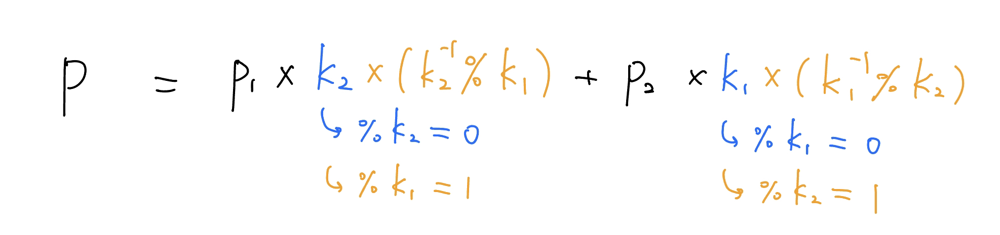

## 互質

???+note "general 的問題"
	給你一套方程組如下，其中模數 $k_i$ 兩兩互質，求出最小正整數解 $x$ ，如果沒有則輸出 $-1$

    $$
    \begin{align}
    \begin{aligned}
    x &\equiv p_1 \pmod {k_1} \\
    x &\equiv p_2 \pmod {k_2} \\
    &\ \vdots \\
    x &\equiv p_n \pmod {k_n}
    \end{aligned}
    \end{align}
    $$

### 想法

先考慮兩個式子的版本

$$
\begin{align}
x &\equiv p_1 \pmod {k_1} \\
x &\equiv p_2 \pmod {k_2} \\
\end{align}
$$

由於 $\gcd(k_1,k_2)=1$，所以 $x$ 的形式會是 $x=k_1\times k_2+P$。我們列出 

$$x \pmod{k_1\times k_2}  = P$$

我們現在要來計算 $P$，使得 $\begin{cases} P \pmod{k_1} \equiv p_1 \\ P \pmod{k_2} \equiv p_2 \end{cases}$

<figure markdown>
  { width="500" }
</figure>

$$\Rightarrow P=p_1\times k_2\times (k_2^{-1} \pmod{k_1}) + p_2 \times k_1 \times (k_1^{-1}\pmod{k_2})$$

### 實作

???+note "code"
	```cpp linenums="1"
    pair<int, int> CRT(int k1, int p1, int k2, int p2) {
        int K = k1 * k2;
        __int128 P = ((__int128)((p1 * k2) % K) * get_inv(k2, k1)) % K 
                    + ((__int128)((p2 * k1) % K) * get_inv(k1, k2)) % K;
        P = (P % K + K) % K;
        return {K, P};
    }
    ```
    
???+note "互質模板測試 [LOJ 10212 #10212. 「一本通 6.4 例 4」曹冲养猪](https://loj.ac/p/10212)"
	給好 n 個 x % a[i] = b[i]，a[i] 兩兩互質，問最小的 x
	
	$n\le 10, 1\le b_i\le a_i\le 1000$
	
	??? note "實作細節"
		可能會 overflow，要開 `__int128`
		
	??? note "code"
		```cpp linenums="1"
		#include <bits/stdc++.h>
	    #define int long long
	    #define pb push_back
	    #define mk make_pair
	    #define F first
	    #define S second
	    #define ALL(x) x.begin(), x.end()
	
	    using namespace std;
	
	    pair<int, int> extgcd(int a,int b) {
	        if (b == 0) {
	            // a * x + 0 * y = gcd(a, 0) = a
	            return {1, 0};
	        }
	        auto p = extgcd(b, a % b);
	        return {p.S, p.F - (a / b) * p.S};
	    }
	
	    int get_inv(int a, int m) {
	        pair<int, int> p = extgcd(a, m);
	        int x = p.F;
	        return (x % m + m) % m;
	    }
	
	    pair<int, int> CRT(int k1, int p1, int k2, int p2) {
	        int K = k1 * k2;
	        __int128 P = ((__int128)((p1 * k2) % K) * get_inv(k2, k1)) % K 
	                    + ((__int128)((p2 * k1) % K) * get_inv(k1, k2)) % K;
	        P = (P % K + K) % K;
	        return {K, P};
	    }
	
	    signed main() {
	        int n;
	        cin >> n;
	        pair<int, int> cur;
	        for (int i = 1; i <= n; i++) {
	            int k, p;
	            cin >> k >> p; // x % k = p
	            if (i == 1) {
	                cur.F = k, cur.S = p;
	            } else {
	                cur = CRT(cur.F, cur.S, k, p);
	            }   
	        }
	        cout << cur.S << '\n';
	    } 
	    ```

## 不互質

???+note "不互質的版本"
	給你一套方程組如下，其中模數 $k_i$ 不一定互質，求出最小正整數解 $x$ ，如果沒有則輸出 $-1$

    $$
    \begin{align}
    \begin{aligned}
    x &\equiv p_1 \pmod {k_1} \\
    x &\equiv p_2 \pmod {k_2} \\
    &\ \vdots \\
    x &\equiv p_n \pmod {k_n}
    \end{aligned}
    \end{align}
    $$

### 想法

先以兩兩來看

$$\begin{cases} x\equiv p_1\pmod {k_1} \\x\equiv p_2\pmod {k_2} \end{cases}$$

$\Rightarrow \begin{cases} x=k_1x_1+p_1 \tag{1} \\x=k_2x_2+p_2 \end{cases}$

$k_1x_1+p_1=k_2x_2+p_2$

$k_1x_1+k_2(-x_2)=p_2-p_1\space \space \space \space \text{(1)}$

我們下面主要要解的是 $x_1$ 所以跟 $x_2$ 係數的正負沒什麼關西，所以以下都寫正號

> 貝祖定理: 在 $ax+by=m$ 中， 若且唯若 $m$ 是 $a$ 及 $b$ 的最大公因數 $\gcd(a,b)$ 的倍數，有整數解

若 $x_1,x_2$ 有解，則整除 $\gcd(k_1,k_2) \mid p_2-p_1$ ， 如果不是的話代表無解

令 $\gcd(k_1,k_2)=d$，與 $p_2 - p_1 = c$

$\Rightarrow \frac{k_1}{d} \times x_1 + \frac{k_2}{d} \times x_2 = \frac{c}{d} \space \space \space \space \text{(2)}$

其中 $\frac{k_1}{d}$ 與 $\frac{k_2}{d}$ 互質

設 $x^\prime_1$ 為 $\frac{k_1}{d} \times x^\prime_1 + \frac{k_2}{d} \times x^\prime_2 = 1$ 的解，這個可以用 extgcd 算出來。故 $(2)$ 式中 $x_1$ 的解可為 $x_1 \equiv \frac{c}{d} \times x^\prime_1$ 代回 $(1)$，不過實作上這邊要 $x_1$ 可能會 overflow，所以我們可以使 $x_1$ 的一部分分到 $x_2$[^1]，畢竟我們不需維護 $x_2$，不會有 overflow 的問題。所以 $x_1 \equiv \frac{c}{d} \times x^\prime_1 \pmod{\frac{k_2}{d}}$。

最後，我們得到新的限制式 :

$$x\equiv k_1 \times x_1 + p_1 \pmod{\text{lcm}(k_1,k_2)}$$

### 實作

??? note "code"
	```cpp linenums="1"
    pair<int, int> CRT(int k1, int p1, int k2, int p2) {
        int c = p2 - p1; 
        int d = __gcd(k2, k1);
        assert(c % d == 0); // c % d != 0 無解
        
        int x = (c * extgcd(k1/d, k2/d).F) / d % (k2 / d);
        
        int K = (k1 * k2) / d; // lcm = (a * b) / gcd(a, b)
        int P = (p1 + k1 * x) % K; 

        return {K, ((P > 0) ? P : P + K)};
    }
    ```

???+note "不互質模板測試 [洛谷 P4777 【模板】扩展中国剩余定理（EXCRT）](https://www.luogu.com.cn/problem/P4777)"
	給好 n 個 x % a[i] = b[i]，a[i] 不一定兩兩互質，問最小的 x
	
	$n\le 10, 1\le b_i\le a_i\le 1000$
	
    ??? note "code"
        ```cpp linenums="1"
        #include <bits/stdc++.h>
        #define int long long
        #define pii pair<int, int>
        #define pb push_back
        #define mk make_pair
        #define F first
        #define S second
        #define ALL(x) x.begin(), x.end()
        using namespace std;

        int p[100005], k[100005]; 
        int n;

        pair<int, int> extgcd(int a,int b) {
            if (b == 0) {
                // a * x + 0 * y = gcd(a, 0) = a
                return {1, 0};
            }
            auto p = extgcd(b, a % b);
            return {p.S, p.F - (a / b) * p.S};
        }

        pair<int, int> CRT(int k1, int p1, int k2, int p2) {
            int c = p2 - p1; 
            int d = __gcd(k2, k1);

            int x = (__int128) ((__int128) c * extgcd(k1/d, k2/d).F) / d % (k2 / d);

            int K = (__int128) ((__int128) k1 * k2) / d;
            int P = (__int128) (p1 + k1*x) % K; 

            return {K, ((P > 0) ? P : P + K)};
        }

        signed main() {
            int n;
            cin >> n;
            pair<int, int> cur;
            for (int i = 1; i <= n; i++) {
                int k, p;
                cin >> k >> p; // x % k = p
                if (i == 1) {
                    cur.F = k, cur.S = p;
                } else {
                    cur = CRT(cur.F, cur.S, k, p);
                }   
            }
            cout << cur.S << '\n';
        } 
        ```

---

## 參考資料

- [資料1](https://blog.csdn.net/weixin_43602607/article/details/108270977?ops_request_misc=%257B%2522request%255Fid%2522%253A%2522165719694016781685328819%2522%252C%2522scm%2522%253A%252220140713.130102334..%2522%257D&request_id=165719694016781685328819&biz_id=0&utm_medium=distribute.pc_search_result.none-task-blog-2~blog~sobaiduend~default-3-108270977-null-null.185%5Ev2%5Econtrol&utm_term=%E4%B8%AD%E5%9B%BD%E5%89%A9%E4%BD%99%E5%AE%9A%E7%90%86%20%E4%B8%8D%E4%BA%92%E8%B4%A8&spm=1018.2226.3001.4450)
- [資料2](https://img-blog.csdnimg.cn/20191006130325870.jpg?x-oss-process=image/watermark,type_ZmFuZ3poZW5naGVpdGk,shadow_10,text_aHR0cHM6Ly9ibG9nLmNzZG4ubmV0L0MyMDIwMzE0Mw==,size_16,color_FFFFFF,t_70)

- <https://hackmd.io/@coffee5427/CRT>

[^1]: 見<a href="/wiki/math/images/8.png" target="_blank">此處</a>