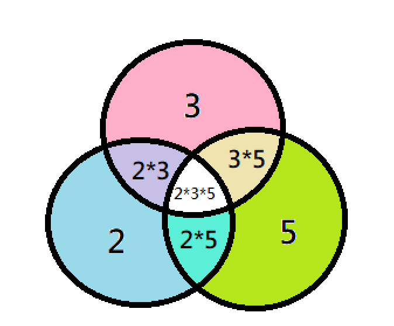

## 歐拉函數性質

- [歐拉函數證明 1](https://hackmd.io/@coffee5427/euler1)
- [歐拉函數證明 2](https://hackmd.io/@coffee5427/euler2)
- [中國剩餘定理](https://hackmd.io/@coffee5427/CRT)

??? info "$n=\sum \phi(d)$，其中 $d$ 是 $n$ 的因數"
    我們把 $1 ...n$ 分成跟 $\gcd(n,x)=d$ 

    例如 $12$ 的因數有 $\{1,2,3,4,6,12\}$ ，我們可以把 $1..12$ 的數分成幾類
    
    > $x$ 跟 $12$ 的 $\gcd$ 是 $12$，$x$ 可能是 $\{12\}$
    >
    > $x$ 跟 $12$ 的 $\gcd$ 是 $6$，$x$ 可能是 $\{6\}$
    >
    > $x$ 跟 $12$ 的 $\gcd$ 是 $4$，$x$ 可能是 $\{4,8\}$
    >
    > $x$ 跟 $12$ 的 $\gcd$ 是 $3$，$x$ 可能是 $\{3,9\}$
    >
    > $x$ 跟 $12$ 的 $\gcd$ 是 $2$，$x$ 可能是 $\{2,10\}$
    >
    > $x$ 跟 $12$ 的 $\gcd$ 是 $1$，$x$ 可能是 $\{1,5,7,11\}$
    
     $n=d\times d'$
    
    $\gcd(d,x)=1\Rightarrow \gcd(d\times d', x \times d' ) = d'$
    
    代表說我們只需要找跟 $d$ 互質的數再把它乘 $d'$ 就可以得到 $gcd$ 為 $d'$ 的數了!
    
    例如 $n=12,d=3$ 
    
    $x=\{1,2\}$ 同乘 $d'=12/3=4$ 倍 $\Rightarrow \{4,8\}$
    
    而 $x$ 想要跟 $\gcd(n,x\times d')=d'$ 就必須符合
    
     $n\ge x\times d' \ge d'$ 又 $n=d\times d'$ $\Rightarrow d\times d'\ge x\times d' \ge d'\Rightarrow d\ge x \ge 1$ ($x=d$ 只有在 $x=d=1$)
    
    就是說去找他每個 $\phi(d)$ 的總和，簡單來想就是把 $1..n$ 拆成 $gcd$ 是 $d_1,d_2,..$ 這幾種，每個 $\phi(d)$ 裡面的數都可以用個 $d'$ 幫你調整成 $1..n$ 裡面的數

???+note "類題"
	求 $\gcd(1,n) + \gcd(2,n) + \ldots + \gcd(n,n)$
	
	??? note "思路"
	    - 上面性質的變化題
	    - 觀察 gcd 出來只會是 n 的因數
	    - 答案就是 $\sum \phi(d) \times \frac{n}{d}$ 其中 $d$ 是 $n$ 的因數

## 因數

### 因數個數,和,乘積

???+note "[CSES - Divisor Analysis](https://cses.fi/problemset/task/2182)"
	給 $N=(a_1)^{b_1}\times (a_2)^{b_2}\times (a_3)^{b_3}\times \ldots$，求 :
	
    - 因數個數
    
    - 因數和
    
    - 因數乘積
    
    ??? note "思路"
    
        > 因數個數
    
        - $D=(b_1 +1)\times (b_2 + 1) \times (b_3 + 1)\times ..$
    
        ```cpp=39
        cnt = (cnt * ((b + 1) % M)) % M;
        ```
    
        > 因數和
    
        - 例如 $12=2^2\times 3^1$
        - $\texttt{sum}=(2^0+2^1+2^2)\times (3^0+3^1)$
        - 例如 $(2^0+2^1+2^2)$
            - 等比級數和 $\frac{a\times (r^n+1)}{r+1}=\frac{1\times (r^{b+1}+1)}{a+1}$
    
        ```cpp 
        sum = (sum * ((fastpow (a, b + 1, M) - 1LL) * inv(a - 1LL) % M)) % M;
        ```
    
        > 因數乘積
    
        - $N^{D \div 2}$
            - $D=(b_1 +1)\times (b_2 + 1) \times (b_3 + 1)\times ..$
            - 倆倆組成一個為 $N$ 的 pair
        - $D$ 是奇數
            - 代表 $b_1..b_n$ 都是偶數
            - 可以把 $N^{D \div 2}$ 拆成 $\sqrt{N}^{D}$
        - $D$ 是偶數
            - 直接把某個 $b_i+1$ 除 $2$ 就好
    
        ```cpp 
        sqt = (sqt * (fastpow (a, b / 2, M) % M)) % M;


        if ((b + 1) % 2 == 0) {
            if (fg) {
                D = (D * (b + 1)) % (M - 1);
                continue;
            }
            D = (D * ((b + 1)/2)) % (M - 1);
            fg = 1;
        }
        else {
            D = (D * (b + 1)) % (M - 1);
        }
        ```
    
        > bug
    
        - $D$ 在計算的時候(因數乘積)，因為他是 $D$ 次方是次方，所以必須 $\pmod{M-1}$ 
    
        > $\texttt{Fermat's little theorem}$
        > 
        > $a\times a^{p-2}\equiv 1 \pmod{p}$
        $a^{p-1}\equiv 1 \pmod{p}$
        
    ??? note "code"
    	```cpp linenums="1"
        #include <bits/stdc++.h>
        #define int long long
        #define lowbit(x) (x & (-x))
        #define pii pair<int, int>
        #define pb push_back
        #define mk make_pair
        #define F first
        #define S second
        using namespace std;
    
        const int INF = 2e18;
        const int maxn = 2e5 + 5;
        const int M = 1e9 + 7;
    
        int n , k;
    
        int fastpow (int a, int b, int m) {
            int ret = 1;
            while (b != 0) {
                if (b & 1) ret = (ret * a) % m;
                a = (a * a) % m;
                b >>= 1;
            }
    
            return ret;
        }
    
        int inv (int x) {
            return fastpow (x, M - 2, M);
        }
    
        void solve() {
            int sum = 1, cnt = 1, num = 1, sqt = 1;
            cin >> n;
            int a, b;
            int fg = 0, D = 1;
            for (int i = 1; i <= n; i++) {
                cin >> a >> b;
                cnt = (cnt * ((b + 1) % M)) % M;
                num = (num * (fastpow(a, b, M) % M)) % M;
                sqt = (sqt * (fastpow (a, b / 2, M) % M)) % M;
                sum = (sum * ((fastpow (a, b + 1, M) - 1LL) * inv(a - 1LL) % M)) % M;
                if ((b + 1) % 2 == 0) {
                    if (fg) {
                        D = (D * (b + 1)) % (M - 1);
                        continue;
                    }
                    D = (D * ((b + 1)/2)) % (M - 1);
                    fg = 1;
                }
                else {
                    D = (D * (b + 1)) % (M - 1);
                }
            }
    
            int res = (fg ? fastpow (num, D, M) : fastpow (sqt, D, M));
            cout << cnt << " " << sum << " " << res << "\n";
        }
    
        signed main() {
            // ios::sync_with_stdio(0);
            // cin.tie(0);
            int t = 1;
            //cin >> t;
            while (t--) {
                //init();
                solve();
            }
        }
        ```

## 篩法

???+note "code"
	```cpp linenums="1"
	bitset<maxn> p;  // bool p[maxn];
	void sieve() {    
		p.set();
        // 全部設定成 true    
        p[0] = p[1] = false;    
        for (int i = 2; i < maxn; i++) {
            if (!p[i]) continue;        
            for (int j = i + i; j < maxn; j += i) {
            	p[j] = false;        
            }    
        }
    }
	```

???+note "例題"
	給你一個陣列問你 $\gcd(a[i], a[j])$ 最大多少 
	
	??? note "思路"
	    - 紀錄每個數字出現的數字 ++
	    - 篩法過程去看 $i$ 的倍數可以碰到的是不是 >= 2
	
	??? note "code"
	    ```cpp linenums="1"
	    for (int i = 0; i < n; i++) {
	        cin >> a[i];
	        is[a[i]]++;
	    }
	    int mx = 1;
	    for (int i = 1e6; i >= 2; i--) {
	        int ans = 0;
	        for (int j = i; j <= 1e6; j += i) {
	            ans += is[j];
	        }
	        if (ans >= 2) {
	            mx = max(i, mx);
	        }
	    }
	    cout << mx;
	    ```

### 紀錄出現的質因數

??? note "紀錄出現的質因數 code"
	```cpp linenums="1"
    for (int i = 2; i <= maxn; i++) {
        if (!prime[i]) {
            fact[i].pb(i); // 紀錄質因數
            for (int j = 2 * i; j <= maxn; j += i) {
                fact[j].pb(i);
                prime[j] = 1;
            }
        }
    }
    ```


???+note "例題"
	給 $q$ 個範圍在 $[1, M]$ 正整數，需輸出這 $q$ 個數字質因數分解的結果，例：$720$ 要輸出 $720=2^4 \times 3^2 \times 5$。請設計一個演算法解決上述問題，需要滿足 :

    - 時間複雜度至多 $O(M \log M + q \log M)$
    
    - 空間複雜度至多 $O(M)$
    
    ??? note "code"
        ```cpp linenums="1"
        void solve () {
            for (int i = 2; i <= maxn; i++) {
                if (!prime[i]) {
                    fact[i].pb(i);
                    for (int j = 2 * i; j <= maxn; j += i) {
                        if(fact[j].empty())	fact[j].pb(i);
                        prime[j] = 1;
                    }
                }
            }
            int q;
            cin >> q;
            while (q--) {
                cin >> n;
                while (n != 1) {
                    int fct = fact[n][0], cnt = 0;
                    while (n % fct == 0) {
                        n /= fct;
                        cnt++;
                    }
                    cout << fct << "^" << cnt << (n != 1 ? " x " : "");
                }
                cout << "\n";	
            }
        }
        ```

### 篩法 + 排容

???+note "[CSES - Counting Coprime Pairs](https://cses.fi/problemset/task/2417)"
	給 $n$ 個正整數 $a_1,\ldots ,a_n$，問有幾組 pair $(i,j)$ 滿足 $\gcd(a_i,a_j)=1$
	
	$n\le 10^5, a_i\le 10^6$
	
	??? note "思路"
	    cnt[x] 表示 x 的倍數有幾個，d(x) 表示 gcd 是 x 的 pair 有幾個，$d(x) = C^{cnt[x]}_2 - d(2\times x) - d(3\times x)-d(4\times x)-\ldots$，從**大到小**跑過來就不會有重複算的問題
	
	??? note "code"
	    ```cpp linenums="1"
	    #include <bits/stdc++.h>
	    #define int long long
	    #define pii pair<int, int>
	    #define pb push_back
	    #define mk make_pair
	    #define F first
	    #define S second
	    #define ALL(x) x.begin(), x.end()
	
	    using namespace std;
	
	    const int INF = 2e18;
	    const int maxn = 1e6 + 5;
	    const int M = 1e9 + 7;
	
	    long long cnt[maxn];
	    long long dp[maxn];
	
	    signed main () {
	        int n;
	        cin >> n;
	        for (int i = 1 ; i <= n ; i++) {
	            int x;
	            cin >> x;
	            cnt[x]++;
	        }
	        for (int i = maxn ; i >= 1 ; i--) {
	            long long tot = 0;
	            long long minus = 0;
	            for (int j = i ; j <= maxn ; j += i) {
	                tot += cnt[j];
	                minus += dp[j];
	            }
	            dp[i] = tot * (tot - 1) / 2 - minus;
	        }
	        cout << dp[1] << '\n';
	    }
	    ```

## 排容原理

莫比烏斯函數 $\mu (i)=\pm1 \lor 0$，代表目前這塊要是加的還是減的。$\sum_d=cnt[d]\times \mu(d)$ 其中 $d$ 是 $x$ 的因數, $cnt[d]$ 代表 $d$ 的倍數在目前集合內的數量

<figure markdown>
  { width="300" }
  <figcaption>例如以 30 來說，3這塊要是 +，5這塊要是 +，3 * 5 會重複算到，所以要扣掉</figcaption>
</figure>

??? note "code"
    ```cpp linenums="1"
    // mobius[i] 代表 μ(i)
    mobius[1] = 1;
    for (int i = 2; i <= maxn; i++) {
        mobius[i] = 1;
        for (auto it : fact[i]) {
            if ((i / it) % it == 0) { 
                // 每種質因數只能有 1 個
                // ex: 12 不行因為 12 = 2^2 * 3 ，可以被 2 * 3 = 6 取代
                //我們想取類似 2, 3, 5, 2 * 3, 3 * 5, 2 * 3 * 5 這種數
                mobius[i] = 0;
            }
            mobius[i] *= -1;
        }
    }
    ```

### 類題

???+note "[CF 1285 F](https://codeforces.com/contest/1285/problem/F)"
	
	??? note "思路"
		- $lcm(a,b)=\frac{a\times b}{\gcd(a,b)}$
	    - 所以我們根據 gcd 將 $a$ 陣列來分類，$\text{mul}_\text{k}$ 代表 $a[i]$ 能被 $k$ 整除的集合，我們把符合這個條件的 $a[i]$ 通通塞進這個 $\text{mul}_\text{k}$ 集合，在塞進去時要把 $a[i]\div k$ ，如果我們只看這個集合那問題就變成從這個集合內挑出兩個數字 **且** 兩個數字要互質(gcd=1)，相乘起來要最大
	    - 單調 stack 維護上面這個動作如果我挑兩個數字，我們先將 $\text{mul}_\text{k}$ 由大到小 sort， $\text{mul}_\text{k}[i],\text{mul}_\text{k}[j]$ 那如果對於 $\text{mul}_\text{k}[i]$ 有一個 $\text{mul}_\text{k}[j']$ 乘起來會比較大，那麼 $j'$ 一定小於 $j$ (越小越大)
		
	??? note "code"
	    ```cpp linenums="1"
	    #include <bits/stdc++.h>
	    #define int long long
	    #define pii pair<int, int>
	    #define pb push_back
	    using namespace std;
	
	    const int maxn = 1e5;
	    int a[maxn + 5], mobius[maxn + 5], in[maxn + 5];
	    bool prime[maxn + 5];
	    vector<int> facts[maxn + 5],fact[maxn + 5]; 
	    int cnt[maxn + 5];
	    int n;
	
	    void add (int x) {
	        for (auto it : facts[x]) {
	            cnt[it]++;
	        }
	    }
	
	    void del (int x) {
	        for (auto it : facts[x]) {
	            cnt[it]--;
	        }
	    }
	
	    signed main () {
	        ios::sync_with_stdio(0);
	        cin.tie(0);
	        cin >> n;
	        int ans = 0;
	        for (int i = 1; i <= n; i++) {
	            cin >> a[i], in[a[i]]++;
	            ans = max(ans, a[i]); // lcm 最小一定也是自己
	        }
	        for (int i = 2; i <= maxn; i++) {
	            if (!prime[i]) {
	                fact[i].pb(i); // 紀錄質因數
	                for (int j = 2 * i; j <= maxn; j += i) {
	                    fact[j].pb(i);
	                    prime[j] = 1;
	                }
	            }
	        }
	        for (int i = 1; i <= maxn; i++) {
	            for (int j = i; j <= maxn; j += i) {
	                facts[j].pb(i); // 紀錄因數
	            }
	        }
	        mobius[1] = 1;
	        for (int i = 2; i <= maxn; i++) {
	            mobius[i] = 1;
	            for (auto it : fact[i]) {
	                if ((i / it) % it == 0) { 
	                    // 每種質因數只能有 1 個
	                    // ex: 12 不行因為 12 = 2^2 * 3 ，可以被 2 * 3 = 6 取代
	                    //我們想取類似 2, 3, 5, 2 * 3, 3 * 5, 2 * 3 * 5 這種數
	                    mobius[i] = 0;
	                }
	                mobius[i] *= -1;
	            }
	        }
	        for (int i = 1; i <= maxn; i++) { // 枚舉 gcd
	            stack<int> stk;
	            int res = 0;
	            // 目前集合 mul[i]
	            for (int it = maxn / i; it >= 1; it--) {// 列舉 a/gcd, b/gcd
	                if (!in[it * i]) continue; //不在陣列內不跑
	                int coprime = 0; // 計算目前有幾個數與 it 互質
	                for (auto it2 : facts[it]) {
	                    coprime += cnt[it2] * mobius[it2]; // 排容
	                }
	                if (coprime) {
	                    while (stk.size()) { // 單調 stack
	                        if (__gcd(stk.top(), it) == 1) {
	                            if (coprime == 1) break;
	                            coprime --;
	                        }
	                        del(stk.top());
	                        stk.pop();
	                    }
	                    res = max(res, 1LL * i * stk.top() * it); // a/gcd * b/gcd 要再乘 gcd 才是答案
	                }
	                add(it);
	                stk.push(it);
	            }
	            while (stk.size()) {
	                del(stk.top());
	                stk.pop();
	            }
	            ans = max(ans, res); 
	        }
	        cout << ans << "\n";
	    }
	    ```

???+note "[CSES - Prime Multiples](https://cses.fi/problemset/task/2185)"
	給 $k$ 個兩兩相異的質數 $a_1,\ldots, a_k$，問 $1\ldots n$ 有多少個數字可被至少一個給定的質數整除
	
	$n\le 10^{18},k\le 20,2\le a_i\le n$
	
	??? note "思路"
		莫比烏斯函數
		
	??? note "code"
	    ```cpp linenums="1"
	    // CSES 2185
	
	    void solve() {
	        int ans = 0;
	        for (int mask = 1; mask < (1 << k); mask++) {
	            int x = 1;
	            int sz = __builtin_popcountll(mask);
	            for (int i = 0; i < k; i++) {
	                if (mask & (1 << i)) {
	                    if (x > n/a[i]) { 
	                        // x*a[i] > n
	                        // 超過範圍了不用算
	                        x = n + 1;
	                        break;
	                    }
	                    x *= a[i];
	                }
	            }
	            // Mobius: +1, -1
	            // n/x 倍數個數
	            if (sz & 1) ans += n / x;
	            else ans -= n / x;
	        }
	        cout << ans << "\n";
	    }
	    ```

???+note "類題"
	給 $n$ 個介於 $[1,M]$ 的整數，計算有幾對數字的 $\gcd$ 是二的冪次方。請設計一個時間複雜度至多 $O(M\log M)$ 的演算法解決上述問題
	
	??? note "思路"
	
	    直接計算每個數字分別為多少個 pair 的 gcd。
	    
	    使用 DP
	    
	    - DP 狀態
	    
	        dp(i) = gcd 為 i 的 pair 數量
	        
	    - DP 轉移
	    
	        x 為 i 的倍數數量
	        
	        dp(i) = C(x,2) - dp(i∗2) - dp(i∗3) - ....
	        
	    - DP 答案
	
	        所有 2 的冪次 DP 值加總
	        
	    - 時間複雜度
	
	        使用篩法實作 O(nlogn)
	        
	??? note "code"
	    ```cpp linenums="1"
	    long long cnt[maxn];
	    long long dp[maxn];
	    int main () {
	        int n;
	        cin >> n;
	        for (int i = 1 ; i <= n ; i++) {
	            int x;
	            cin >> x;
	            cnt[x]++;
	        }
	        long long ans = 0;
	        for (int i = 1000000 ; i >= 1 ; i--) {
	            long long tot = 0;
	            long long mi = 0;
	            for (int j = i ; j <= 1000000 ; j += i) {
	                tot += cnt[j];
	                mi += dp[j];
	            }
	            dp[i] = tot * (tot - 1) / 2 - mi;
	            if (__builtin_popcount(i) == 1) {
	                ans += dp[i];
	            }
	        }
	        cout << ans << '\n';
	    }
	    ```
	    
???+note "[全國賽模擬賽 2023 pI. 子集合和 (SOS)](https://www.csie.ntu.edu.tw/~b11902109/PreNHSPC2022/IqwxCSqc_Pre_NHSPC_zh_TW.pdf#page=25)"
	令函數 $f(S)=S\times \prod\limits_{x\in S}x$，問 $\sum\limits_{S\subseteq A} f(S)$
	
	$1\le n\le 10^6, 1\le a_i\le 10^9$
	
	??? note "思路"
		觀察到可能跟 $(a_1 + 1)(a_2 + 1)(a_3 + 1) \ldots (a_n + 1)$ 有關
		
		答案為 
		
		$$a_1(a_2 + 1)(a_3 + 1) \ldots (a_n + 1)+a_2(a_1 + 1)(a_3 + 1) \ldots (a_n + 1) + a_n(a_1 + 1)(a_2 + 1) \ldots (a_{n-1} + 1)$$
		
		預處理 $(a_1+1)(a_2+1)(a_3+1)...(a_n+1)$ 即可