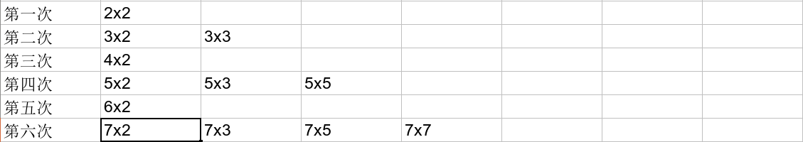

## 質數測試

???+note "問題"
	檢查一個數 $n$ 是否為質數
	
我們只需要去枚舉在 $[2, \sqrt{n}]$[^1] 內的數是否能整除 $n$ 即可，複雜度 $O(\sqrt{n})$

???+note "code"
	```cpp linenums="1"
	bool isPrime(int n) {    
		if (n == 1) return false;
        for (int i = 2; i * i <= n; i++) {
        	if (n % i == 0) {
        		return false;
            }
         }
         return true;
    }
	```

## 因數分解

???+note "質因數分解"
	將 $n$ 做質因數分解

枚舉 $i = 2 \ldots \sqrt{n}$，若 $n/i$ 可以整除，則持續 $n$ /= $i$ 將 $n$ 中的質因數 $i$ 都消掉，最後只有 1 個質因數會大於等於 $\sqrt{n}$，在特判就好。複雜度 $O(\sqrt{n})$

???+note "code"
	```cpp linenums="1"
	vector<int> prime_factors(int n) {
        vector<int> ret;
        for (int i = 2; i * i <= n; i++) {
            if (n % i == 0) {
                while (n % i == 0) {
                    ret.push_back(i);
                    n /= i;
                }
            }
        }
        if (n > 1) ret.push_back(n);
        return ret;
    }
	```


## 篩法

???+note "問題"
	給 $n$，問 $\le n$ 的數字內有那些數是質數呢 ?
	
### 埃式篩法

從小到大考慮每個數，若他還沒被篩掉，代表他是質數，則我們將他的倍數都篩掉。
如果用粗估，根據調和級數，內迴圈次數顯然不會多過 $O(n \log n)$。實上，因為質數很稀疏，有人算出來它是 $O(n \log \log n)$。

???+note "code"
	```cpp linenums="1"
	bitset<MAXN> is_prime;
	
    void sieve() {
        is_prime.set();
        is_prime[0] = is_prime[1] = false;
        for (int i = 2; i < MAXN; i++) {
            if (!is_prime[i]) continue;
            for (int j = i + i; j < MAXN; j += i) {
                is_prime[j] = false;
            }
        }
    }
    ```

### 線性篩法

可以發現有些數字會被重複篩掉很多次。我們讓每個數字都只會被最小的質數篩掉，複雜度 $O(n)$。例如說一個數字 n 可以表示成 n = p * k，其中 p 是 n 的最小質因數，k 為剩下來的數字，n 就只會被 p * k 這個組合給篩掉。假設目前跑到 i，那麼我們就枚舉 j，讓 i * prime[j] 都標記為合數（這邊 prime[j] 就是 i * prime[j] 的最小質數，i 的意義只是上面的 k 而已），當跑到 i % prime[j] == 0 的時候，代表 i * prime[j + 1], i * prime[j + 2], ... 的最小質數就不會是 prime[j + 1], prime[j + 2], ... 而是 prime[j]，也就代表我們繼續篩的話就不能保證每個數字都只被篩掉一次。而且這些數字可以表示成 (比 i 大的數字) * prime[j]，所以一定會在後面跑到。 

我們將線性篩法每一輪會篩掉的數字列出來看看:

<figure markdown>
  { width="500" }
</figure>

從圖上我們看到，第一列篩掉的是最小質因數是 2 的數，第二列篩掉的是最小質因數為 3 的數，依次類推，可以把所有的合數都篩掉。

???+note "code"
	```cpp linenums="1"
	bitset<MAXN> is_prime;
    vector<int> prime;

    void linear_sieve() {
        is_prime.set(); 
        is_prime[0] = is_prime[1] = false;
        for (int i = 2; i < MAXN; i++) {
            if (is_prime[i]) prime.push_back(i);
            for (int j = 0; i * prime[j] < MAXN; j++) {
                is_prime[i * prime[j]] = false;
                if (i % prime[j] == 0) break;
            }
        }
    }
    ```

### 應用

埃式篩法雖然複雜度較差，但能用來計數，實用性較高，很多問題能搭配篩法加上其他資料結構來處理，而線性篩就只能用來找質數

???+note "[CSES - Counting Coprime Pairs](https://cses.fi/problemset/task/2417)"
	給一個長度為 $n$ 的陣列，問互質的 pair$(a_i, a_j)$ 有幾對
	
	$n\le 10^5, 1\le a_i \le 10^6$
	
	??? note "思路"
	    cnt[x] 表示 x 的倍數有幾個，d(x) 表示 gcd 是 x 的 pair 有幾個，$d(x) = C^{cnt[x]}_2 - d(2\times x) - d(3\times x)-d(4\times x)-\ldots$，從**大到小**跑過來就不會有重複算的問題
	
	??? note "code"
	    ```cpp linenums="1"
	    #include <bits/stdc++.h>
	    #define int long long
	    #define pii pair<int, int>
	    #define pb push_back
	    #define mk make_pair
	    #define F first
	    #define S second
	    #define ALL(x) x.begin(), x.end()
	
	    using namespace std;
	
	    const int INF = 2e18;
	    const int maxn = 1e6 + 5;
	    const int M = 1e9 + 7;
	
	    long long cnt[maxn];
	    long long dp[maxn];
	
	    signed main() {
	        int n;
	        cin >> n;
	        for (int i = 1 ; i <= n ; i++) {
	            int x;
	            cin >> x;
	            cnt[x]++;
	        }
	        for (int i = maxn ; i >= 1 ; i--) {
	            long long tot = 0;
	            long long minus = 0;
	            for (int j = i ; j <= maxn ; j += i) {
	                tot += cnt[j];
	                minus += dp[j];
	            }
	            dp[i] = tot * (tot - 1) / 2 - minus;
	        }
	        cout << dp[1] << '\n';
	    }
	    ```

???+note "類題"
	給 $n$ 個介於 $[1,M]$ 的整數，計算有幾對數字的 $\gcd$ 是二的冪次方。請設計一個時間複雜度至多 $O(M\log M)$ 的演算法解決上述問題
	
	??? note "思路"
	
	    直接計算每個數字分別為多少個 pair 的 gcd。
	    
	    使用 DP
	    
	    - DP 狀態
	    
	        dp(i) = gcd 為 i 的 pair 數量
	        
	    - DP 轉移
	    
	        x 為 i 的倍數數量
	        
	        dp(i) = C(x,2) - dp(i∗2) - dp(i∗3) - ....
	        
	    - DP 答案
	
	        所有 2 的冪次 DP 值加總
	        
	    - 時間複雜度
	
	        使用篩法實作 O(nlogn)
	        
	??? note "code"
	    ```cpp linenums="1"
	    long long cnt[maxn];
	    long long dp[maxn];
	    int main() {
	        int n;
	        cin >> n;
	        for (int i = 1 ; i <= n ; i++) {
	            int x;
	            cin >> x;
	            cnt[x]++;
	        }
	        long long ans = 0;
	        for (int i = 1000000 ; i >= 1 ; i--) {
	            long long tot = 0;
	            long long mi = 0;
	            for (int j = i ; j <= 1000000 ; j += i) {
	                tot += cnt[j];
	                mi += dp[j];
	            }
	            dp[i] = tot * (tot - 1) / 2 - mi;
	            if (__builtin_popcount(i) == 1) {
	                ans += dp[i];
	            }
	        }
	        cout << ans << '\n';
	    }
	    ```

???+note "[CSES - Prime Multiples](https://cses.fi/problemset/task/2185)"
	給 $k$ 個兩兩相異的質數 $a_1,\ldots, a_k$，問 $1\ldots n$ 有多少個數字可被至少一個給定的質數整除
	
	$n\le 10^{18},k\le 20,2\le a_i\le n$
	
	??? note "思路"
		因為 k = 20，我們可以枚舉用到的質數，看在 [1, n] 內，**同時**擁有這些質數的數字有幾個
		
		可是這樣會算到重複的，我們利用排容原理，將看集合大小的奇偶性來判斷是加是減
		
	??? note "code"
	    ```cpp linenums="1"
	    #include <bits/stdc++.h>
	    #define int long long
	    using namespace std;
	
	    const int MAXN = 2e5 + 5;
	    int n, k;
	    int a[MAXN];
	
	    signed main() {
	        cin >> n >> k;
	        for (int i = 0; i < k; i++) {
	            cin >> a[i];
	        }
	
	        int ans = 0;
	        for (int mask = 1; mask < (1 << k); mask++) {
	            int x = 1;
	            int sz = __builtin_popcountll(mask);
	            for (int i = 0; i < k; i++) {
	                if (mask & (1 << i)) {
	                    if (x * a[i] > n) {
	                        // 超過範圍了不用算
	                        x = n + 1;
	                        break;
	                    }
	                    x *= a[i];
	                }
	            }
	            // n/x 為 x 的倍數個數
	            if (sz & 1) {
	                ans += n / x;
	            } else {
	                ans -= n / x;
	            }
	        }
	        cout << ans << "\n";
	    }
	    ```

## 因數

??? info "n 的因數數量平均有 O(log n) 個"
	根據篩法，1~n 的因數個數總和為 O(n log n)，也就是平均有 O(log n) 個因數

??? info "$n$ 的因數數量上限可以用 $O(n^{1/3})$ 來估計"
	見 [CF Blog](https://codeforces.com/blog/entry/14463)

### 因數個數,和,乘積

???+note "[CSES - Divisor Analysis](https://cses.fi/problemset/task/2182)"
	給 $p_1, \ldots ,p_n$，與 $k_1, \ldots ,k_n$，代表 $x=p_1^{k_1}\times p_n^{k_n}$，求 $x$ 的:
	
    - 因數個數
    
    - 因數和
    
    - 因數乘積
    
    $n\le 10^5, 2\le p_i\le 10^6, 1\le k_i\le 10^9$
    
    ??? note "思路"
    
        > 因數個數
    
        根據公式，因數個數 $(k_1 +1)\times (k_2 + 1) \times (k_3 + 1)\times ..$
    
        > 因數和
    	
    	對於每個質因數我們都可以用等比級數和公式將他加起來，例如 $12=2^2\times 3^1$，$\texttt{sum}=(2^0+2^1+2^2)\times (3^0+3^1)$，$(2^0+2^1+2^2)$ 就可以用 $\displaystyle \frac{a\times (r^n - 1)}{r - 1}$ 將他加起來
    	
        > 因數乘積
    
        也就是要計算 $x^{d \div 2}$，其中 $d=(k_1 +1)\times \ldots \times (k_n + 1)$，因為可以觀察到就是因數乘積好幾個乘起來是 $x$ 的 pair。我們以下分 case 討論:
        
        - 當 $d$ 是奇數
            - 代表 $k_1, \ldots ,k_n$ 都是偶數
            - 可以把 $x^{d \div 2}$ 拆成 $\sqrt{x}^{d}$
    
        - $d$ 是偶數
            - 直接把某個為偶數的 $k_i+1$ 除 $2$ 就好
    
        > bug
    
        $d$ 在計算的時候(因數乘積)，因為 $d$ 是次方，為 $M-1$ 一循環，所以必須 $\pmod{M-1}$ 
    
        > $\texttt{Fermat's little theorem}$
        > 
        > $a\times a^{p-2}\equiv 1 \pmod{p}$
        $a^{p-1}\equiv 1 \pmod{p}$
        
    ??? note "code"
    	```cpp linenums="1"
        #include <bits/stdc++.h>
        #define int long long
        using namespace std;
    
        const int M = 1e9 + 7;
        int n, k;
    
        int fastpow(int a, int b, int m) {
            int ret = 1;
            while (b != 0) {
                if (b & 1) ret = (ret * a) % m;
                a = (a * a) % m;
                b >>= 1;
            }
    
            return ret;
        }
    
        int inv(int x) {
            return fastpow(x, M - 2, M);
        }
    
        signed main() {
            int ans2 = 1, ans1 = 1, num = 1, sqt = 1;
            cin >> n;
            int fg = 0, d = 1;
            for (int i = 1; i <= n; i++) {
                int p, k;
                cin >> p >> k;
                ans1 = (ans1 * ((k + 1) % M)) % M;
                ans2 = (ans2 * ((fastpow(p, k + 1, M) - 1) * inv(p - 1) % M)) % M;
    
                // calculate ans3
                num = (num * (fastpow(p, k, M) % M)) % M;
                sqt = (sqt * (fastpow(p, k / 2, M) % M)) % M;
                if ((k + 1) % 2 == 0) {
                    if (fg) {
                        d = (d * (k + 1)) % (M - 1);
                        continue;
                    }
                    d = (d * ((k + 1) / 2)) % (M - 1);
                    fg = 1;
                } else {
                    d = (d * (k + 1)) % (M - 1);
                }
            }
    
            int ans3 = (fg ? fastpow(num, d, M) : fastpow(sqt, d, M));
            cout << ans1 << " " << ans2 << " " << ans3 << "\n";
        }
        ```

### 紀錄出現的質因數

fact[i] 紀錄 i 最小的質因數，在做質因數分解的時候就可以做 $O(\log n)$ 次 $O(1)$ 查表的質因數分解

??? note "紀錄出現的質因數 code"
	```cpp linenums="1"
    for (int i = 2; i <= maxn; i++) {
        if (!prime[i]) {
            fact[i].pb(i); // 紀錄質因數
            for (int j = 2 * i; j <= maxn; j += i) {
                fact[j].pb(i);
                prime[j] = 1;
            }
        }
    }
    ```

???+note "n 的質因數分解"
	給 $q$ 個範圍在 $[1, M]$ 正整數，需輸出這 $q$ 個數字質因數分解的結果，例：$720$ 要輸出 $720=2^4 \times 3^2 \times 5$。請設計一個演算法解決上述問題，需要滿足 :

    - 時間複雜度至多 $O(M \log M + q \log M)$
    
    - 空間複雜度至多 $O(M)$
    
    ??? note "code"
        ```cpp linenums="1"
        void solve () {
            for (int i = 2; i <= maxn; i++) {
                if (!prime[i]) {
                    fact[i].pb(i);
                    for (int j = 2 * i; j <= maxn; j += i) {
                        if(fact[j].empty())	fact[j].pb(i);
                        prime[j] = 1;
                    }
                }
            }
            int q;
            cin >> q;
            while (q--) {
                cin >> n;
                while (n != 1) {
                    int fct = fact[n][0], cnt = 0;
                    while (n % fct == 0) {
                        n /= fct;
                        cnt++;
                    }
                    cout << fct << "^" << cnt << (n != 1 ? " x " : "");
                }
                cout << "\n";	
            }
        }
        ```	

???+note "多次詢問 n 的因數"
	給 $q$ 筆查詢，每筆詢問需要列出 $n$ 的所有因數
	
	??? note "思路"
		[CF Blog](https://codeforces.com/blog/entry/84036)
	
		使用上面的技巧在 $O(n)$ 預處理，$O(\log n)$ 得到 $n={p_1}^{a_1}{p_2}^{a_2}{p_3}^{a_3}\ldots$，我們就可以枚舉 $0 \leq b_i \leq a_i$ 來得到因數 ${p_1}^{b_1}{p_2}^{b_2}{p_3}^{b_3}\ldots$，根據因數數量的估計，這個會花 $O(n^{1/3})$，所以整體的複雜度是 $O(n^{1/3})$

## 歐拉函數性質

### 性質一

歐拉函數（Euler's totient function），即 $\varphi(n)$，表示的是小於等於 $n$ 和 $n$ 互質的數的個數，$\varphi(1)=1$。

其中 

$$\displaystyle \varphi(n)=n \left ( 1-\frac{1}{p_1} \right )\left( 1-\frac{1}{p_2} \right)\ldots \left( 1-\frac{1}{p_r} \right)$$

??? info "證明"
	令 $n=6$
	

    $$\begin{align}\phi(n) &= n- n\times \frac{1}{2}-n\times \frac{1}{3}+n\times (\frac{1}{2}\times \frac{1}{3}) \\ &=n\times (1-\frac{1}{2}-\frac{1}{3}+\frac{1}{2}\times \frac{1}{3}) \\ &= n\times (1-\frac{1}{2})\times (1-\frac{1}{3}) \end{align}$$
    
    其中第二到第三部是因式分解。可以看得出來我們是先將 n 裡面 2 的倍數先刪掉，3 的倍數刪掉，再將 6 的倍數加回來。

???+note "問題"
	給定正整數 $n$，輸出 $\varphi (n)$
	
	$n\le 10^{12}$
	
	??? note "思路"
	
	    $O(\sqrt{n})$ 找出所有質因數
	
	??? note "code"
	    ```cpp linenums="1"
	    int euler_phi(int n) {
	        int ans = n;
	        for (int i = 2; i * i <= n; i++) {
	            if (n % i == 0) {
	                ans = ans / i * (i - 1);
	                while (n % i == 0) {
	                    n /= i;
	                }
	            }
	        }
	        if (n > 1) ans = ans / n * (n - 1);
	        return ans;
	    }
	    ```

???+note "問題"
	給定正整數 $n$，輸出 $\varphi(1), \varphi(2), \ldots ,\varphi(n)$
	
	$n\le 2\times 10^5$
	
	??? note "思路"
		在篩法過程順便計算
	
	??? note "build phi"
	    ```cpp linenums="1"
	    vector<int> build_phi(int n) {    
	        vector<int> phi(n, 0);
	        for (int i = 1; i <= n; i++) {
	            phi[i] = i;
	        }
	        for (int i = 2; i <= n; i++){
	            if (phi[i] == i) {            
	                for (int j = i; j <= n; j += i) {
	                    phi[j] = phi[j] / i * (i - 1);
	                }             		
	            }    
	        } 
	        return phi;
	    }
	    ```

### 性質二

??? info "$n=\sum \varphi(d)$，其中 $d$ 是 $n$ 的因數"
    例如 $12$ 的因數有 $\{1,2,3,4,6,12\}$ ，我們可以把 $1..12$ 的數分成幾類

    -  $x$ 跟 $12$ 的 $\gcd$ 是 $12$，$x$ 可能是 $\{12\}$
    
    -  $x$ 跟 $12$ 的 $\gcd$ 是 $6$，$x$ 可能是 $\{6\}$
    
    -  $x$ 跟 $12$ 的 $\gcd$ 是 $4$，$x$ 可能是 $\{4,8\}$
    
    -  $x$ 跟 $12$ 的 $\gcd$ 是 $3$，$x$ 可能是 $\{3,9\}$
    
    -  $x$ 跟 $12$ 的 $\gcd$ 是 $2$，$x$ 可能是 $\{2,10\}$
    
    -  $x$ 跟 $12$ 的 $\gcd$ 是 $1$，$x$ 可能是 $\{1,5,7,11\}$
    
    那麼要使 $x$ 跟 $n$ 的 gcd 是 $d$，只能是 $x=d\times$(跟 $\frac{n}{d}$ 互質的數字)，其實就是 $\varphi(d)$ 裡面所包含的數
    
    - $x$ 跟 $12$ 的 $\gcd$ 是 $12$，$\varphi(1)=1$，$x$ 可能是 $\{1\times 12\}$
    - $x$ 跟 $12$ 的 $\gcd$ 是 $6$，$\varphi(2)=1$，$x$ 可能是 $\{1\times 6\}$
    
    - $x$ 跟 $12$ 的 $\gcd$ 是 $4$，$\varphi(3)=2$，$x$ 可能是 $\{1\times 4, 2\times 4\}$
    
    - $x$ 跟 $12$ 的 $\gcd$ 是 $3$，$\varphi(4)=2$，$x$ 可能是 $\{1\times 3,3\times 3\}$
    
    - $x$ 跟 $12$ 的 $\gcd$ 是 $2$，$\varphi(6)=2$，$x$ 可能是 $\{1\times 2, 5\times 2\}$
    
    - $x$ 跟 $12$ 的 $\gcd$ 是 $1$，$\varphi(12)=4$，$x$ 可能是 $\{1\times 1,1\times 5,1\times 7,1\times 11\}$

???+note "求 phi(因數總和)"
	求 phi(因數總和)，不能利用上面的公式
	
	??? note "思路"
		先花費 O(sqrt(n)) 幫 n 做質因數分解，還有找到所有的因數。而 n 的因數個數最多 O(n^{1/3})。
        
        在來我們會遇到的問題就是: 對於每個因數 x，計算 phi(x) 要花多少時間 ?
        
        因為 x 的質因數，一定也都是 n 的質因數，所以只需要 O(log n) 即可計算，總複雜度是 O(n^{½} + n^{⅓} * log n) = O(n^0.5) 

		
???+note "類題"
	求 $\gcd(1,n) + \gcd(2,n) + \ldots + \gcd(n,n)$
	
	??? note "思路"
		$\gcd=\frac{n}{d}$ 的有 $\phi(d)$ 個，答案就是 $\sum \phi(d) \times \frac{n}{d}$ 其中 $d$ 是 $n$ 的因數

???+note "[TOI 2019 四模 pC. 歐拉與TOT](https://codeforces.com/contest/1114/problem/F)"

## 題目

???+note "[2020 TOI pC. 銀河捷運](https://tioj.ck.tp.edu.tw/problems/2190)"

    給數對 $(x_1,y_1),(x_2,y_2)$，與模數 $M$，問 $(x_3, y_3)$。$(x_1,y_1),(x_2,y_2),(x_3,y_3)$ 都符合:
    
    $$
    y\equiv mx+k\pmod{M}
    $$
    
    已知:
    
    - $m=(y_2-y_1)\cdot (x_2-x_1)^{M-2}$
    
    - $x_1+x_2+x_3=m^2\pmod{m}$
    
    有 $t$ 筆輸入，$t\le 10^5,2\le M<2^{31}$
    
    ??? note "思路"
    	1. $m=(y_2-y_1)\cdot (x_2-x_1)^{M-2}$
        2. $k=(y_1-mx_1)$ % $M$
        3. $x_3=(m^2-x_1-x_2)$ % $M$
        4. $y_3=(mx_3+k)$ % $M$

???+note "[CF 1445 C. Division](https://codeforces.com/contest/1445/problem/C)"
	t 筆查詢，每筆給定 p, q，求滿足以下條件的最大 x
	
	- p % x == 0
	
	- x % q != 0
	
	$t\le 50, 1\le p\le 10^{18}, 1\le q\le 10^9$
	
	??? note "思路"
		可以觀察到若 p % q != 0 則 x = p。若 p % q == 0 的時候，考慮標準因式，我們只要將 p 與 q 共同的某一項降到 q 的次方底下即可
		
		例如:
		
		- p = 2<sup>1</sup> * 3<sup>3</sup> * 5<sup>2</sup>
	
		- q = 3<sup>2</sup> * 5<sup>1</sup>
	
		x 只能是 p 削掉與 q 共同的項才合法，所以我們只考慮 3, 5。
		
		- 削掉 3: x = 2<sup>1</sup> * 3<sup>1</sup> * 5<sup>2</sup>
	
		- 削掉 5: x = 2<sup>1</sup> * 3<sup>3</sup> * 5<sup>0</sup>
	
		顯然削掉 3 可以讓 x 更大
		
	??? note "code"
		```cpp linenums="1"
		#include <bits/stdc++.h>
	    #define int long long
	    using namespace std;
	
	    const int MAXN = 10001;
	    int t, p, q;
	
	    int f(int i) {
	        if (i == 1) return 1;
	        int k = p;
	        while (k % q == 0) {
	            k /= i;
	        }
	        return k;
	    }
	
	    signed main() {
	        cin >> t;
	        while (t--) {
	            cin >> p >> q;
	            int ans = -1e18;
	            if (p % q != 0) {
	                cout << p << "\n";
	            } else {
	                for (int i = 1; i * i <= q; i++) {
	                    if (q % i == 0) {
	                        ans = max(ans, f(i));
	                        ans = max(ans, f(q / i)); // 可能會有質數 > sqrt(n)
	                    }
	                }
	                cout << ans << "\n";
	            }
	        }
	    }
		```

[^1]: 若 $n=p\times q$，則 $\min(p,q)\le \sqrt{n}$
