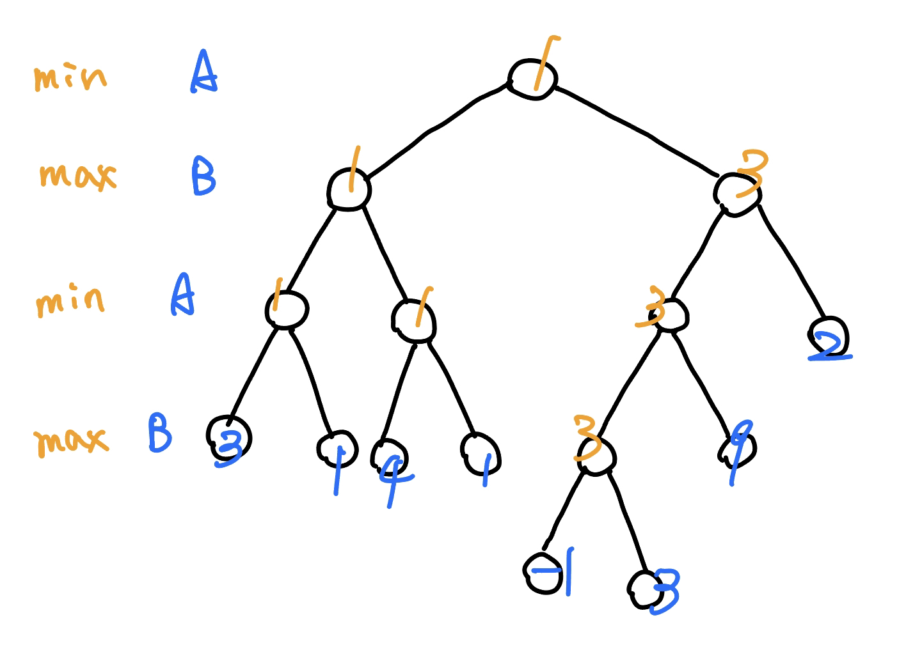
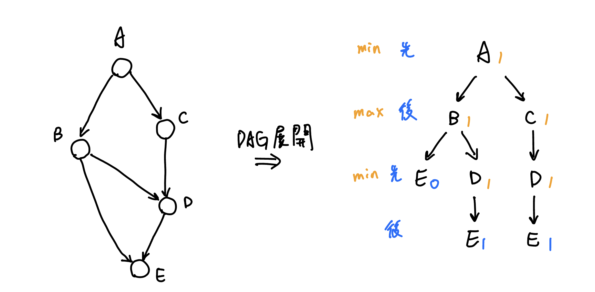
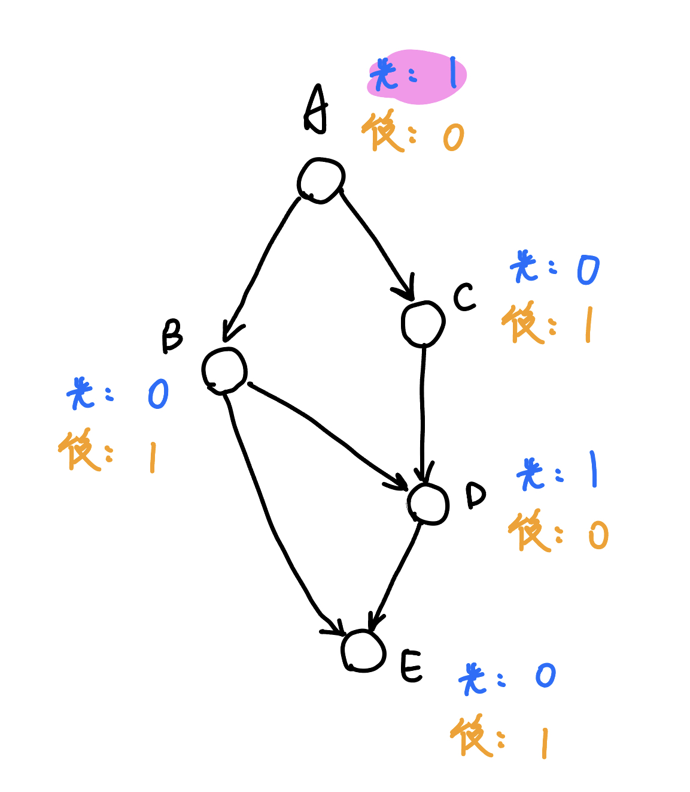
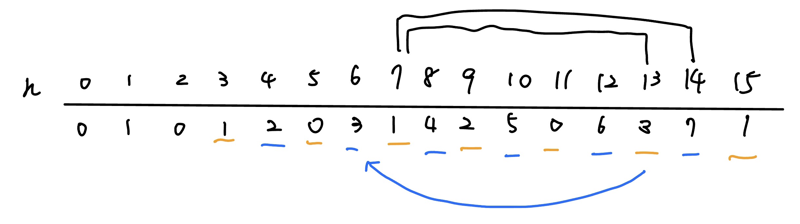
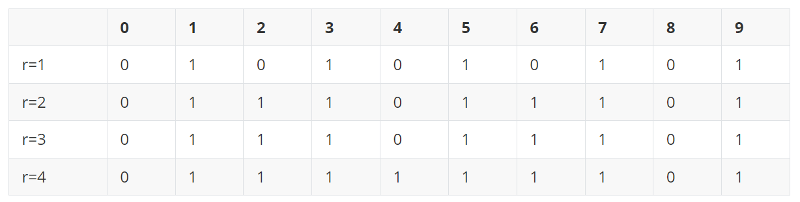
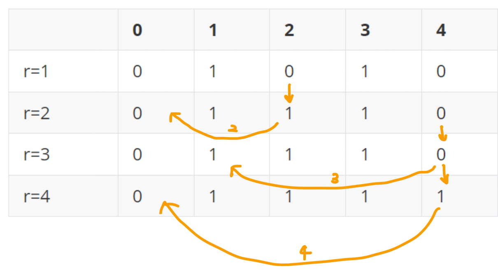

## 賽局 DP

簡單來說就是暴力跑

???+note "[CSES - Stick Game](https://cses.fi/problemset/task/1729)"
	有 $n$ 個石頭，每次可以拿走 $P=\{p_1,p_2,\ldots,p_k\}$ 個，A, B 輪流取，不能拿就輸。問誰贏
	
	$n\le 10^6,k\le 100,1\le p_i\le n$
	
	??? note "思路"

???+note "[LeetCode 877. Stone Game](https://leetcode.com/problems/stone-game/description/)"

???+note "[Atcoder DP Contest L - Deque](https://atcoder.jp/contests/dp/tasks/dp_l)"
	
???+note "[Atcoder DP Contest K - Stones](https://atcoder.jp/contests/dp/tasks/dp_k)"


## Nim Game

### 證明

- 「先手會贏」的狀態，存在一個走法走到「先手會輸」的狀態

- 「先手會輸」的狀態，不管怎麼走都是走到「先手會贏」的狀態

### 例題

???+note "單堆 Nim Game"
	有 $n$ 個石頭，每次要拿 $1\ldots 5$ 個，A, B 輪流拿，不能拿石頭的人就輸了。問誰贏
	
	??? note "思路"
		
		以不嚴謹的角度看，若先手取了 $x$ 個，那麼後手一定可以取 $y$ 使 $x+y=6$，這麼一來當 n % 6 == 0 時，先手就輸了。那當 n % 6 != 0 時，先手就可以先拿走 $x$ 個使得 n % 6 == 0，這樣又變回上面的 n % 6 == 0 先手必輸的 case 了。
		
	    先手可以贏 iff n % 6 != 0
	    
	    - n % 6 != 0 的狀態存在一個走法走到 n % 6 = 0 的狀態
	
	    - n % 6 = 0 的狀態不管怎麼走都是走到 n % 6 != 0 的狀態

???+note "[CSES - Nim Game I](https://cses.fi/problemset/task/1730)"
	有 $n$ 堆石頭，分別有 $a_1, \ldots , a_n$ 個，Alice, Bob 輪流玩一個 game，輪到自己時可以選其中一堆，拿至少一個石頭，不能拿就輸。問誰贏

	$1\le n \le 2\times 10^5,1\le a_i \le 10^9$
	
	??? note "思路"
		n = 1，先手贏，iff $a_1 > 0$。
	    
	    n = 2，先手贏 iff $a_1 \neq a_2$。
	    
	    - $a_1 \neq a_2$ 的狀態 : 
	    	
	    	存在一個走法走到 $a_1 = a_2$ 的狀態
	    	
	    - $a_1 = a_2$ 的狀態 : 
	    	
	    	不管怎麼走都是走到 $a_1 \neq a_2$ 狀態
	    	
	    general $n$ : 先手會贏 iff $a_1 \oplus a_2 \oplus \ldots a_n \neq 0$
	    	
	    - $a_1 \oplus a_2 \oplus \ldots a_n \neq 0$ 的狀態 : 
	    	
	    	存在一個走法走到 $a_1 \oplus a_2 \oplus \ldots a_n = 0$ 的狀態
	    
	    - $a_1 \oplus a_2 \oplus \ldots a_n = 0$ 的狀態 : 
	    
	    	不管怎麼走都是走到 $a_1 \oplus a_2 \oplus \ldots a_n \neq 0$ 的狀態
	        
	        - [11011, 01000, 00101] xor = 10110 → [01101, 01000, 00101] xor = 00000
	
	        - [01011, 11001, 10101] xor = 00111 → [01011, 11001, 10010] xor = 00000

## Grundy number

幫每個狀態定義一個 Grundy number（又稱 SG 函數） $G(x)$，輸的狀態的 $G(x) = 0$

其他的狀態 $G(x) = \text{mex} \{ G(y) \mid x \space 可以到 \space y\}$[^1]

???+note "單堆 Nim Game - 套用 Grundy number"
	有 $n$ 個石頭，每次要拿 $1\ldots 5$ 個，A, B 輪流拿，不能拿石頭的人就輸了。問誰贏
	
	??? note "思路"
		
		我們可以列出轉移式，$G(n)=\text{mex}\{G(n-1),\ldots ,G(n-5) \}$，我們將表格列出來
		
		$$
	    \begin{array}{c|ccccccccccccc}
	        n & 0 & 1 & 2 & 3 & 4 & 5 & 6 & 7 & 8 & 9 & 10 & 11 & 12\\
	        \hline
	        G(n) & 0 & 1 & 2 & 3 & 4 & 5 & 0 & 1 & 2 & 3 & 4 & 5 & 0\\
	    \end{array}
	    $$
	    
	    可以發現在這個題目 G(n) = n % 6

## Sprague–Grundy theorem

又稱 SG 定理，有 k 盤 Game（不管完任何 Game 都可以），每次可以選擇一個盤面做操作，直到沒有任何盤面能做操作為止，會有 

$$
G(\{x_1,x_2,\ldots, x_k\})=G(x_1)\oplus G(x_2)\oplus \ldots \oplus G(x_k)
$$

??? info "證明"
    
    【數學歸納法 - 證明】: G({X, Y}) = G(X) $\oplus$ G(Y) 
    
    Base case: G(0, 0) = 0 = G(0) $\oplus$ G(0)
    
    Induction step: 已知 G({X, Y}) = mex{ G({x, y}) }，又能走到的 G({x, y}) 已滿足 G({x, y}) = G(x) $\oplus$ G(y)
    
    > 當 G(x) = t，一定會滿足 x 可以走到 grundy 值是 0 ... (t-1) 的狀態
    
    令 G(X) $\oplus$ G(Y) = t，我們要證明 0 ... (t-1) 的 grundy number 都可以走到，且 t 走不到
    
    - G({x, y}) 無法包含到 t :
    	
    	令 u = G(X), v = G(Y)，u $\oplus$ v = t。X, Y 只能動一個，分兩種 case :
    	
    	- 動 X → x: (非 u) $\oplus$ v != t
    
    	- 動 Y → y: u $\oplus$ (非 v) != t
    	
        所以動了一步之後 G(x) $\oplus$ G(y) 一定不是 t
        
    - G({x, y}) 可以完全包含到 0 ... (t-1) :
        
        令 u = G(X), v = G(Y)，如果想要變成 s，看 s 跟 t 從高位看過去哪一位開始 t[i] = 1, s[i] = 0，去看 u[i], v[i] 哪一個是 1 就是去改動他
        
    有了這個證明後，k 盤 Game 就只是將 x[1], ..., x[k] 兩兩合併，也就是兩兩 xor 即可

???+note "[CSES - Nim Game II](https://cses.fi/problemset/task/1098)"
    有 $n$ 堆石頭，分別有 $a_1, \ldots , a_n$ 個，Alice, Bob 輪流玩一個 game，輪到自己時可以選其中一堆，拿 1...3 個石頭，不能拿就輸。問誰贏

	$1\le n \le 2\times 10^5,1\le a_i \le 10^9$
	
	??? note "思路"
		先把每一堆想成一個單獨的 game, 計算 G(x) = x % 4，利用 SG 定理將他們 xor 起來

???+note "例題"
	有 $n$ 堆石頭，分別有 $a_1, \ldots , a_n$ 個，Alice, Bob 輪流玩一個 game，每次可以做其中一個操作 

    - 從某一堆拿走 $1$ 個石頭
    
    - 或平分成相同數量的很多堆
    
    不能拿就輸。問誰贏
    
    ??? note "思路"
    	[12] → [4, 4, 4] → [3, 4, 4] → [3, 2, 2, 4]
    	
        SG(6) 
        = mex{ SG(5), SG(3) $\oplus$ SG(3), SG(2) $\oplus$ SG(2) $\oplus$ SG(2), SG(1) $\oplus$ SG(1) $\oplus$ SG(1) $\oplus$ SG(1) $\oplus$ SG(1) $\oplus$ SG(1)}
        = mex{SG(5), SG(2)}
        
        n = 10^5 ，直接計算 SG(1) … SG(n)（枚舉因數，類似篩法），time: O(n log n)
        
        n = 10^9 幫 SG(i) 找規律

???+note "[YTP 2022 高中程式挑戰營 p11](https://www.tw-ytp.org/wp-content/uploads/2022/12/YTP2022FinalContest_S2_TW.pdf#page=32)" 
    有 n 筆 query。每筆給出 x 堆石頭，兩種操作，無法操作就輸
    
    - 選一堆，移除 1 個
    - 選一堆，拆成 1, 2, 3, …, k 個，前提 n = 1+2+…+k
    
    [2, 5, 10] → [1, 5, 10] → [1, 5, 1, 2, 3, 4]
    
    x <= C = 10^9, n <= 2 * 10^5
    
    ??? note "思路"
    	- SG(x) =
    	
            - mex{ SG(x-1) } if x != k(k+1)/2
    
            - mex{ SG(x-1), SG(1) $\oplus$ SG(2)$\oplus$ ... $\oplus$ SG(k) } if x = k(k+1)/2
    
        - x = k(k+1)/2 的狀態不會太多，只有 O( sqrt(C) ) 個
    
        - 假設 SG( k * (k+1)/2 ) = 2, 如何計算 SG( (k+1) * (k+2)/2 )?
            - if x $\in$ [ k * (k+1)/2 + 1, (k+1) * (k+2)/2 - 1], SG(x) = 0 → SG(x+1) = 1
    
    		- 0, 1 交替，可以從上一個 k * (k + 1) / 2 很快的推出來
    
        - 實作上把 x = k(k+1)/2 都建表算好，過程中可以用一個只會單調遞增的 pointer 紀錄 k 算到哪裡，每個 a[i] binary search 找到小於 a[i] 的第一個 k * (k+1)/2 的地方，即可推出是 0 還是 1

## Tree

### Min Max Tree

???+note "題目"
	給一個 Tree，每個 leaf 上都有一個數字。從 root 開始，A, B 輪流，每次要往下走一層，A 希望停在小的，B 希望停在大的，問最後會停在哪裡
	
	??? note "思路"
		<figure markdown>
	      { width="300" }
	    </figure>
	    
	    從 leaf 往上做上去

???+note "[TIOJ  1092 . A.跳格子遊戲](https://tioj.ck.tp.edu.tw/problems/1092)"
	給一張 $n$ 點 $m$ 邊的 DAG。A, B 從起點往終點輪流跳，跳到終點的人獲勝，問誰獲勝
	
	$n\le 10^4,m\le 10^5$
	
	??? note "思路"
		我們先將 DAG 展開，變成 Tree 比較好套用 Min Max Tree 的概念。設先手是 $0$，後手是 $1$，那麼先手就要取 min，後手取 max。
	
		<figure markdown>
	      { width="500" }
	    </figure>
		
		我們重新回到 DAG 上考慮，DAG 上終點就是我們 Tree 上的 Leaf，所以我們可以從終點慢慢推回起點，每個點維護先手，與後手的值（這樣兩個點之間才能轉移，u 的先手從 v 的後手轉移，...），最後的答案就是起點的先手值
	    
	    <figure markdown>
	      { width="300" }
	    </figure>
	    
	    ---
	    
	    這題也可以用下面的 Game Tree 做，一樣是將 Leaf（終點） 先定 Grundy Number = 0，然後慢慢做回起點去

### Game Tree

???+note "[LOJ #10243. 「一本通 6.7 例 3」移棋子游戏](https://loj.ac/p/10243)"
	給一張 $n$ 點 $m$ 邊的 DAG。給定 $k$ 個棋子，A, B 輪流，每步可以將任意一顆棋子沿一條有向邊移動到另一個點，無法移動者輸掉遊戲，問誰先手贏還輸。
	
	$n\le 2000,m\le 6000,1\le k\le n$
	
	??? note "思路"
		因為每個問題都是獨立的，可以利用 SG 定理將他們的 Grundy Number xor 起來。每個問題我們可以將 DAG 想成 Tree，這樣 Leaf 就會是那些 out degree 是 0 的點。先定這些點的 Grundy Number = 0，然後慢慢做回起點去
		
	??? note "code"
		```cpp linenums="1"
		#include <bits/stdc++.h>
	    #define int long long
	    #define pii pair<int, int>
	    #define pb push_back
	    #define mk make_pair
	    #define F first
	    #define S second
	    #define ALL(x) x.begin(), x.end()
	
	    using namespace std;
	
	    const int INF = 2e18;
	    const int maxn = 3e5 + 5;
	    const int M = 1e9 + 7;
	
	    int n, m, k;
	    vector<int> G[maxn];
	    int vis[maxn], sg[maxn];
	
	    int mex(vector<int>& a) {
	        int n = a.size();
	
	        vector<bool> v(n + 1, false);
	        for (int x : a) {
	            if (x <= n) v[x] = true;
	        }
	
	        for (int i = 0; i <= n; i++) {
	            if (v[i] == false) return i;
	        }
	        return -1;
	    }
	
	    int dfs(int u) {
	        if (vis[u]) return sg[u];
	        if (G[u].size() == 0) {
	            sg[u] = 0;
	            return sg[u];
	        }
	        vis[u] = true;
	
	        vector<int> used;
	        for (auto v : G[u]) {
	            used.pb(dfs(v));
	        }
	        sg[u] = mex(used);
	        return sg[u];
	    }
	
	    signed main() {
	        cin >> n >> m >> k;
	        for (int i = 0; i < m; i++) {
	            int u, v;
	            cin >> u >> v;
	            G[u].pb(v);
	        }
	
	        int res = 0;
	        while(k--) {
	            int x;
	            cin >> x;
	            res ^= dfs(x);
	        }
	        cout << (res == 0 ? "lose" : "win") << '\n';
	    } 
		```

## 題目

???+note "[CSES - Stair Game](https://cses.fi/problemset/task/1099)"
	有 $n$ 個石堆編號 $1,2,\ldots ,n$，每堆一開始有 $a_i$ 個。A, B 輪流，每次可以將任意數量的石頭從 $k$ 移到 $k-1$，其中 $k\neq 1$，不能動就輸。問誰贏
	
	$1\le n\le 2\times 10^5,0\le a_i \le 10^9$
	
	??? note "思路"
		相當於在 even 項玩 Nim Game
	
		結論 : 先手會贏 iff $a_2\oplus a_4\oplus a_6\oplus \ldots \neq 0$
		
		- 「先手會贏」的狀態，存在一個走法走到「先手會輸」的狀態
		
			相當於玩 Nim Game，先手直接動 even 項的到 odd 項
			
		- 「先手會輸」的狀態，不管怎麼走都是走到「先手會贏」的狀態
			
			分兩種 case 討論 :
			
			- 動 odd 到 even
				
				下一輪，先手再把同個數的石頭從 even 動到 odd，又回到先手會輸的狀態
				
			- 動 even 到 odd
	
				相當於玩 Nim Game，不管怎麼走都是走到 $a_2\oplus a_4\oplus a_6\oplus \ldots \neq 0$ 的狀態

???+note "[CSES - Grundy's Game](https://cses.fi/problemset/task/2207)"
	有一堆 $n$ 個石頭，A, B 輪流，每次可以將一堆 Split 成兩堆數量不同的，不能動就輸，問誰贏。共 $t$ 筆測資
	
	$t\le 10^5,n\le 10^6$
	
	??? note "思路"
		觀察到若 $n > 2000$ 時先手必勝，$n\le 2000$ 暴力跑，$>2000$ 直接輸出 first

???+note "[CSES - Another Game](https://cses.fi/problemset/task/2208)"
	有 $n$ 堆石頭，分別有 $a_1, \ldots , a_n$ 個，Alice, Bob 輪流玩一個 game，輪到自己時可以選其中好幾堆，每堆拿至少一個石頭，不能拿就輸，問誰贏
	
	$1\le n\le 2\times 10^5,1\le a_i\le 10^9$
	
	??? note "思路"
		打表後可以觀察到，$a_i$ 都是偶數時，先手必輸
		
		【證明】:
		
		- 「$a_i$ 有一些奇數」的狀態，存在一個走法走到「$a_i$ 都是偶數」的狀態
	
		- 「$a_i$ 都是偶數」的狀態，不管怎麼走都是走到「$a_i$ 有一些奇數」的狀態

???+note "[2016 全國賽 p3. 拈 (Nim)](https://tioj.ck.tp.edu.tw/problems/1940)"
	有一堆 $n$ 個石頭，A, B 輪流，每次可從這堆石頭中取走 $1\ldots \lfloor n/k \rfloor$ 顆石頭，問 Grundy number $G(n)$
	
	$n\le 10^9,k=1$ or $2$
	
	??? note "思路"
		$k=1$ 的 case 一定是 n % (n + 1) = n
		
		$k=2$ 的 case 去觀察會發現 even 項都是 n / 2，odd 項恰好是自己能覆蓋的區間的前一個數，可以去遞迴，複雜度 $O(\log n)$
		
		<figure markdown>
	      { width="500" }
	    </figure>
		
	??? note "code"
		```cpp linenums="1"
		#include <bits/stdc++.h>
	    #define int long long
	    #define pii pair<int, int>
	    #define pb push_back
	    #define mk make_pair
	    #define F first
	    #define S second
	    #define ALL(x) x.begin(), x.end()
	
	    using namespace std;
	
	    int f(int n) {
	        if (n == 0) return 0;
	        if (n == 1) return 1;
	        if (n == 2) return 0;
	        if (n % 2 == 0) return n / 2;
	        else return f(n / 2);
	    }
	
	    signed main() {
	        int n, k;
	        cin >> k >> n;
	        if (k == 1) {
	            cout << n << '\n';
	        } else {
	            cout << f(n) << '\n';
	        }
	    } 
		```

???+note "Wythoff's game [洛谷 P2252 [SHOI2002] 取石子游戏|【模板】威佐夫博弈](https://www.luogu.com.cn/problem/P2252)"
	一開始有兩堆個石頭，每個回合可以選一堆，A, B 輪流，每輪可以做其中一個操作 

    - 從其中一堆取走任意數量的石頭
    
    - 或從兩堆取走相同數量的石頭
    
    不能拿就輸。問誰贏

???+note "<a href="/wiki/math/images/C. 取石子遊戲 (kgame).html" target="_blank">2022 IONC C. 取石子遊戲 (kgame)</a>"
	一開始有 $n$ 顆石頭與一個正整數 $k$，有兩個人會輪流取出一些石頭。

    假設遊戲進行了 $m$ 輪，並且取出的石頭數量的序列為 $a_1, a_2, \ldots, a_m$，那麼必須要滿足以下兩個條件：
    
    - 對於 $i = 1, 2, \ldots, m$，$1 \le a_i \le k-1$。
    
    - 對於 $j = 1, 2, \ldots, m-1$，$a_j + a_{j+1} \le k$。
    
    先將石頭取完的那個人獲勝，若是雙方都無法將石頭取完即視為平手。在已知 $n$、$k$ 的情況下，請問誰有必勝策略？在一筆測資中，你需要處理 $T$ 組輸入。
    
    $1 \le T \le 10^5,1 \le k \le 10^{18},1 \le k \le n$
    
    ??? note "思路"
    	例如說先手取了 $x$ 之後，後手一定可以取 $y$ 使 $x+y=K$，也就代表當 n % k = 0 時先手必輸。那麼無解的 case 呢 ? 當 k = 1 時。
    	
    ??? note "code"
    	```cpp linenums="1"
    	#include <bits/stdc++.h>
        #define int long long
        using namespace std;
    
        signed main() {
            int q;
            cin >> q;
            while(q--) {
                int n, k;
                cin >> n >> k;
                if (k == 1) {
                    cout << "RedLeaf\n";
                } else if (n % k == 0) {
                    cout << "Leaf\n";
                } else {
                    cout << "Red\n";
                }
            }
        } 
    	```

???+note "[TOI 2021 二模 p1. 石頭（Stone）](https://drive.google.com/file/d/1_mpY6D95d8Da7zR8YMabTMvCJIlNWBg6/view)"
	有 $n$ 堆石頭，第 $i$ 堆 $a_i$ 個，Alice, Bob 進行 Nim，但每次拿的石頭數量單調遞減，且第一步不能拿超過 $r$ 個石頭，問第一步有幾種可能的拿取方式

	$1 \le n \le 10^5, 1 \le r, a_i \le 10^9$
	
	??? note "思路"
	    【subtask 1: 1 <= n <= 3, 1 <= r, a[i] <= 100】
	
	    令 dp(A, B, C, r) 為這一輪拿 r 個，是否會贏。可以令 S(A, B, C, r) = S(A, B, C, r-1) or dp(A, B, C, r)，使用 prefix or 優化。	
	
	    <center>
	    dp(A, B, C, r) = {dp(A-r, B, C, 1~r) or dp(A, B-r, C, 1~r) or dp(A, B, C-r, 1~r) }
	    </center>
	    
	    【subtask 3: n = 1】
	
	    令 dp(A, B, C, r) 為目前最多拿 r 個，我們分別考慮 r = 1, 2, 3 的轉移:
	
	    r = 1 時我們只需要考慮 A 的奇偶性，所以列出：
	
	    dp(A, r = 1) = max{ 1-dp(A-1, r = 1) } = A % 2。
	
	    r = 2 我們可以拿一個或兩個，所以 dp(A, r = 2) = max{ 1-dp(A-2, r = 2), 1-dp(A-1, r = 1) }，可以發現 1-dp(A-1, r = 1) 恰好是上面 dp(A, r = 1) 的狀態，所以我們又可以列出
	
	    dp(A, r = 2) = max{ 1-dp(A-2, r = 2), dp(A, r = 1) }
	
	    同理， r = 3 時列出
	
	    dp(A, r = 3) = max{ 1-dp(A-3, r = 3), 1-dp(A-2, r = 2), 1-dp(A-1, r = 1) }<br>&nbsp;&nbsp;&nbsp;&nbsp;&nbsp;&nbsp;&nbsp;&nbsp;&nbsp;&nbsp;&nbsp;&nbsp;&nbsp;&nbsp;&nbsp;&nbsp;&nbsp;&nbsp;&nbsp;&nbsp;&nbsp;= max{ 1-dp(A-3, r = 3), dp(A, r=2) }
	
	    如果打表的話會發現恰好是以 0111... 的循環節出現，例如若 r = 1，循環節為 01，長度為 2；若 r = 2 ~ 3，循環節為 0111，長度為 4；若 r = 4 ~ 7，循環節為 01111111，長度為 8。所以我們可以總結出 dp(A, r) 就是 [A % r 以下最大的二的冪次] % 4 != 0，例如說 r = 2 就是 [A % 4] != 0。
	
	    <figure markdown>
	      { width="500" }
	    </figure>
	
	    用分析的角度想，就是我們可以發現每格都是上面那格與 1 - 前面那格取 max，所以在跑 r 的時候幾乎可以把 r - 1 那一個 row 給抄下來，看 0 的地方的前 r 格是不是 0，是的話這格就是 1。我們發現 r = 2 與 r = 3 是一模一樣的，因為 r = 3 在 r = 2 為 0 的地方往前 3 格並沒有碰到 0（手不夠長），但到 r = 4 時就剛好可以摸到了，然後要一直到 r = 8 才能使連續的 1 再變的更長。
	
	    <figure markdown>
	      { width="400" }
	    </figure>
	
	    【subtask 2: r = 1, r = 2】
	
	    我們用程式將 dp(A, B, C, r = 2) 都打表出來，會發現我們完全找不到規律，所以我們就先把是位置 (A, B, C) 給印出來，考慮賽局理論常常用 xor，我們試著將 A xor B xor C，結果發現他們都剛剛好是 2 的倍數，也就是 % 2 = 0，因為我們上面的子題有推理過會每 r 個循環一次，所以我們可以列出如果 dp(A, B, C, r) 是 0 iff (A ^ B ^ C) % 2 == 0 。
	
	    【subtask all】
	
	    我們一樣用程式去檢查 dp(A, B, C, r) 在 r = 1, 2, 4, 8 會不會像上面一樣具有讓循環節變長，且恰好是 2 的冪次的跡象，也就是例如  dp(A, B, C, 2) 需要去等於 dp(A, B, C, 3)。我們發現是確實的，所以我們可以得出最後的結論：ans = 0 iff xor{ a[i] } % d == 0，其中 d 為 r 以下最大的二的冪次。

???+note "[POI2016 Nim z utrudnieniem](https://www.luogu.com.cn/problem/P5970)"
	有 $n$ 堆石頭，分別有 $a_1, \ldots , a_n$ 個，Alice, Bob 輪流玩一個 game，輪到自己時可以選其中一堆，拿至少一個石頭，不能拿就輸。在遊戲開始前問，B 可以丟掉若干堆石子，但是必須保證丟掉的堆數是 $d$ 的倍數，且不能丟掉所有石子。問 Bob 有幾種丟掉方案，可以讓 Bob 贏

	$1\le n \le 2\times 10^5,1\le a_i \le 10^9$
	
	??? note "思路"
		首先我們要知道一個結論：Bob 必勝當且僅當最初的所有石子數異或和 = 0。這是 Nim 遊戲的結論。我們令 $dp(i, j, k)$ 表示現在看到 $i$，已丟掉的堆數$\mod d = j$，剩下的石堆 xor 起來是 $k$，轉移式為 $dp(i, j , k)=dp(i - 1,j,k) + dp(i-1,j-1,k\oplus a_i)$。這樣的複雜度是 $O(n\times d\times \max \{ a_i \})$，會 TLE。有一個很巧妙的性質是：對於一個任意的數字 $x$，他和比自己小的數字 xor 起來不會超過 $2x$。所以我們可以將 $a$ 數組由小到大排序，這樣掃到第 $i$ 堆的時候我們 $k$ 這維不用枚舉到 $m$，只需要枚舉到 $2a_i$ 就行了，這樣均攤下來會變 $O(d\times (2a_1+2a_2+\ldots +2a_n))$，差不多是 $O(d\times \sum a_i)=O(md)$。空間的部分可能有點大，我們使用滾動數組省略 $i$ 的那維即可。我們採用滾動數組是由 $j$ 大到小去更新，這樣才把新的狀態算過來，但當 $j=0$ 時應該要從 $j=d-1$ 這邊轉移過來，但此時 $j=d-1$ 已經是新的狀態，所以我們這個可能要開個 tmp 陣列另外存一下 $j=d-1$ 的 $dp(j,k)$。最後的答案 xor 出來應該要是 xor{a_i} ^ [刪掉的] 要 = 0，所以 [刪掉的] = xor{a_i}
		
	??? note "code"
		```cpp linenums="1"
		 #include <bits/stdc++.h>
         #define int long long
         using namespace std;

         const int N = 500000 + 5;
         const int mod = 1e9 + 7;

         int sum, n, d, a[N], dp[11][1 << 20], tmp[1 << 20];

         signed main() {
             cin >> n >> d;
             for (int i = 1; i <= n; ++i) {
                 cin >> a[i];
                 sum ^= a[i];
             }
             sort(a + 1, a + 1 + n);
             dp[0][0] = 1;
             for (int i = 1; i <= n; ++i) {
                 int max = 1;
                 while (max <= a[i]) {
                     max <<= 1;
                 }
                 for (int k = 0; k < max; ++k) {
                     tmp[k] = dp[d - 1][k];
                 }
                 for (int j = d - 1; j > 0; j--) {
                     for (int k = 0; k < max; k++) {
                         dp[j][k] = (dp[j][k] + dp[j - 1][k ^ a[i]]) % mod;
                     }
                 }
                 for (int k = 0; k < max; k++) {
                     dp[0][k] = (dp[0][k] + tmp[k ^ a[i]]) % mod;
                 }
             }
             if (n % d == 0) {
                 dp[0][sum] -= 1;
                 // 扣除所有都選的狀態
             }
             cout << (dp[0][sum] + mod) % mod;
             return 0;
         }
		```
	
???+note "[CF 1194 D. 1-2-K Game](https://codeforces.com/contest/1194/problem/D)"
	有 $n$ 個石頭，每次拿 $1$ 個, $2$ 個, **或** $k$ 個，A, B 輪流拿，不能拿石頭的人就輸了。問誰贏
	
	$0\le n\le 10^9,3\le k\le 10^9$
	
	??? note "思路"
		打表，觀察，詳細可見 [Yuihuang's 題解](https://yuihuang.com/cf-1194d/)

???+note "[codeforces 603C. Lieges of Legendre](https://codeforces.com/problemset/problem/603/C)"

???+note "[codeforces 305E. Playing with String](https://codeforces.com/problemset/problem/305/E)"

???+note "[2022 npsc 高中組初賽 pF.取蜜柑](https://tioj.ck.tp.edu.tw/problems/2303)"
	
	??? note "思路"
		如果數字>1，那可以都視為2，因為(x>1) x就可以決定要一次拿全部或者拿到剩1個，除了1,1,...1,x 和 1,1,1,1,1 都是1/2 ，1,11..x如果位數是偶數那是1/2,奇數是 (x/2+1)/x

---

## 參考資料

- <https://blog.csdn.net/a_forever_dream/article/details/104813148>

- <https://hackmd.io/@cOBW6f27TLewMLxYuitcdw/BktH-2A6_>


[^1]: mex : 最小不存在的非負整數。更詳細介紹見<a href="/wiki/math/special/mex" target="_blank">此處</a>
