## 向量運算

### 向量內積 dot

以下圖來說，dot(AB, AC) = dot(AC, AB) = |AD| * |AB| 

<figure markdown>
  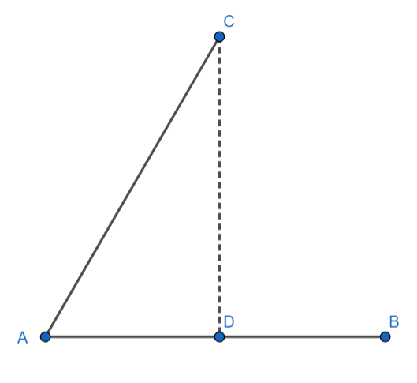{ width="200" }
</figure>

### 向量外積 cross

右手定則，順時鐘為負，逆時鐘為正。以下圖來說，cross(AB, AC) = |AB| * |AD|

<figure markdown>
  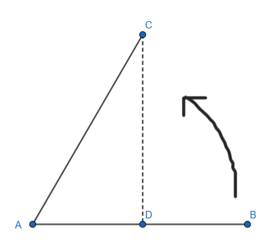{ width="200" }
</figure>

??? note "模板整理"
	```cpp linenums="1"
	using Point = pair<double, double>;
    #define x first
    #define y second
    Point operator+(Point a, Point b) {
        return {a.x + b.x, a.y + b.y};
    }
    Point operator-(Point a, Point b) {  
        return {a.x - b.x, a.y - b.y};
    }
    Point operator*(Point a, double d) { 
        return {d * a.x, d * a.y};
    }
    double dot(Point a, Point b) {  
        return a.x * b.x + a.y * b.y;
    }
    double cross(Point a, Point b) { 
        return a.x * b.y - a.y * b.x;
    }
	```

## 凸多邊形面積

將多邊形的各頂點逆時鐘排列，對於每個點利用外積之和可以求出一多邊形面積，
相關資訊可查詢：測量師公式(Surveyor’s Formula)

<figure markdown>
  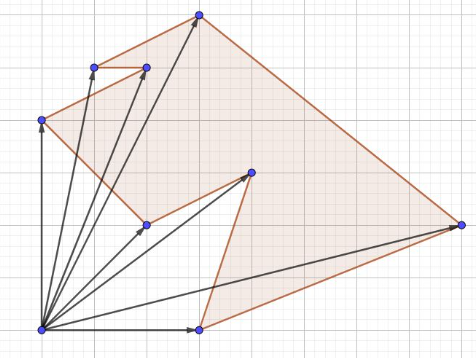{ width="300" }
</figure>

???+note "code"
	```cpp linenums="1"
	double area(vector<Point> &points) {
        int n = points.size();
        double ret = 0;
        for (int i = 1; i < n; i++) {
            ret += cross(points[i], points[i - 1]);
        }
        ret += cross(points[0], points[n - 1]);
        return fabs((double)ret / 2);
    }
	```

???+note "[CSES - Polygon Area](https://cses.fi/problemset/task/2191)"
	給一個 n 個點構成的多邊形，求其面積，點的順序可能是順時針或是逆時針
	
	$1\le n\le 1000$

## 線段相交判定

???+note "問題"
	給兩個線段的端點座標，判斷是否有交點

    <figure markdown>
      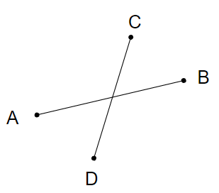{ width="250" }
    </figure>

我們先判斷 A, B 是否在 CD 兩側，也就是看 cross(AB, AC) 與 cross(AB, AD) 是否正負號不同，然後判斷，判斷 C, D 是否在 AB 兩側，也就是看 corss(AB, AC) 與 cross(AB, AD) 是否正負號不同，兩者都符合時，必定相交

<figure markdown>
  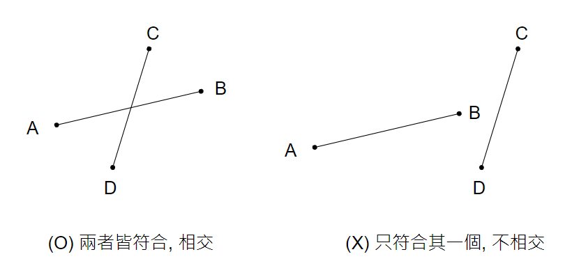{ width="400" }
</figure>

???+note "目前的 code"
	```cpp linenums="1"
	int sign(long long x) {
        if (x < 0) {
            return -1;
        } else if (x == 0) {
            return 0;
        } else {
            return 1;
        }
    }
    bool intersection(Point a, Point b, Point c, Point d) {
        int c1 = sign(cross(b - a, c - a)) * sign(cross(b - a, d - a));
        int c2 = sign(cross(d - c, a - c)) * sign(cross(d - c, b - c));
        if (c1 == -1 && c2 == -1) return true;
        return false;
    }
    ```
    
但若發生 cross = 0 的 case 呢 ? 可能會發生三點共線

<figure markdown>
  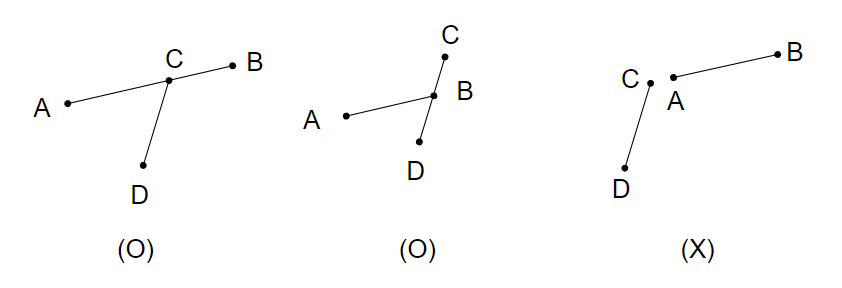{ width="450" }
</figure>

cross 有 0 的合法 case 至少會有三點共線，所以我們直接將可能的 case 列出來:

- A 在 CD 線段上，回傳 true

- B 在 CD 線段上，回傳 true

- C 在 AB 線段上，回傳 true

- D 在 AB 線段上，回傳 true

??? question "如何判斷一個點 C 在一個線段 AB 上 ?"
	首先要判斷 C 是否在「直線」 AB 上，也就是 cross(AB, AC) 是否為 0
	
	若在「直線」 AB 上的話，再來就要判斷是否在 A, B 之間
	
	<figure markdown>
	  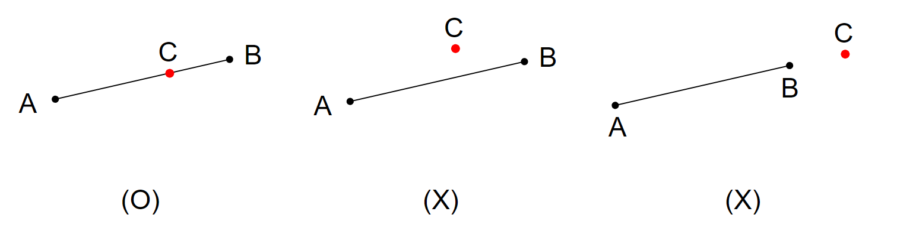{ width="450" }
	</figure>
	
	```cpp linenums="1"
	bool onseg(Point a, Point b, Point c) {
	    if (cross(b - a, c - a) != 0) return false;
	    if (sign(dot(b - a, c - a)) < 0) return false;
	    if (sign(dot(a - b, c - b)) < 0) return false;
	    return true;
	}
	```

???+note "code"
	```cpp linenums="1"
	bool onseg(Point a, Point b, Point c) {
        if (cross(b - a, c - a) != 0) return false;
        if (sign(dot(b - a, c - a)) < 0) return false;
        if (sign(dot(a - b, c - b)) < 0) return false;
        return true;
    }
    bool intersection(Point a, Point b, Point c, Point d) {
        int c1 = sign(cross(b - a, c - a)) * sign(cross(b - a, d - a));
        int c2 = sign(cross(d - c, a - c)) * sign(cross(d - c, b - c));
        if (c1 == 1 || c2 == 1) return false;
        if (c1 < 0 && c2 < 0) return true;
        if (onseg(a, b, c)) return true;
        if (onseg(a, b, d)) return true;
        if (onseg(c, d, a)) return true;
        if (onseg(c, d, b)) return true;
        return false;
    }
	```

???+note "[CSES - Line Segment Intersection](https://cses.fi/problemset/task/2191)"
	有 $t$ 筆詢問，每筆給定兩個線段，詢問是否相交（可能有三點共線）
	
	$t\le 10^5, -10^9 \le x, y\le 10^9$

## 找到兩個直線的交點

???+note "問題"
	給定兩條直線，找出交點座標
	
	<figure markdown>
	  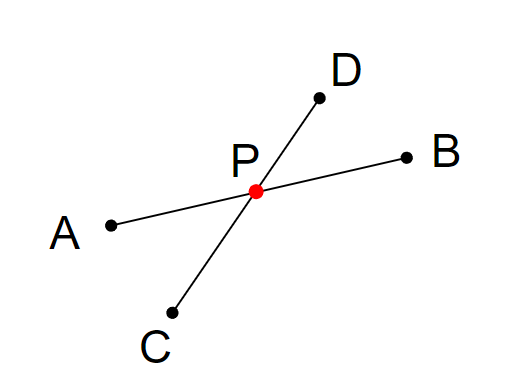{ width="200" }
	</figure>

利用向量伸縮，$\begin{align}\overrightarrow{CP}=\frac{\ell_2}{\ell_1}\times\overrightarrow{CD}\end{align}$

<figure markdown>
  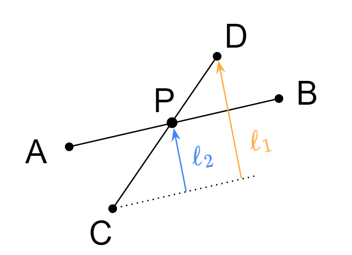{ width="300" }
</figure>

至於 $\ell_1, \ell_2$ 我們都可以用外積求出來:

- $\begin{align}\ell_1=\frac{\overrightarrow{AB}\times{\overrightarrow{CD}}}{|\overrightarrow{AB}|}\end{align}$

- $\begin{align}\ell_2=\texttt{-}\frac{\overrightarrow{AB}\times{\overrightarrow{AC}}}{|\overrightarrow{AB}|}\end{align}$

注意這邊 $\ell_2$ 的計算我們有加負號，要使 $\ell_1, \ell_2$ 正負號相同。最後，可得到

$$
\begin{align}P=C+(\texttt{-}\frac{\overrightarrow{AB}\times\overrightarrow{AC}}{\overrightarrow{AB}\times \overrightarrow{CD}})\times\overrightarrow{CD}\end{align}
$$

???+note "code"
	```cpp linenums="1"
	Point intersection_point(Point a, Point b, Point c, Point d) {
		double ratio = (double)cross(b - a, c - a) / cross(b - a, d - c);
        return c - ratio * (d - c);
    }
	```

## 距離

### 一、點到線段

若點在線短端點之內，就看點與線段的垂直距離，若點在線段端點之外，就看點到端點的距離。

<figure markdown>
  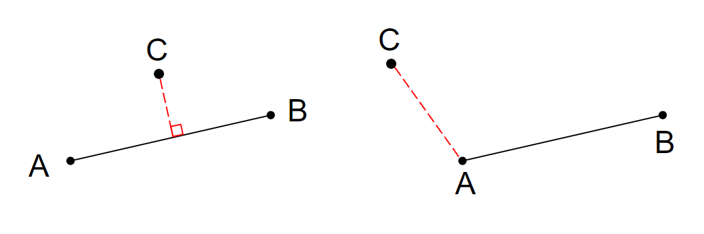{ width="400" }
</figure>

???+note "code"
	```cpp linenums="1"
	double disPS(Point a, Point b, Point c) {
        // Seg(a, b) Point(c)
        if (onseg(a, b, c)) return 0;
        if (dot(c - a, b - a) < 0) return dis(c, a);
        if (dot(c - b, a - b) < 0) return dis(b, a);

        return (double)abs(cross(c - a, b - a)) / len(b - a);
    }
    ```

### 二、線段到線段

兩線段相交，距離為零；兩線段不相交，窮舉所有的端點到線段距離，取最短者（不可能是選在中間，因為把中間選的點往兩端其中一端移動一定會更好）

<figure markdown>
  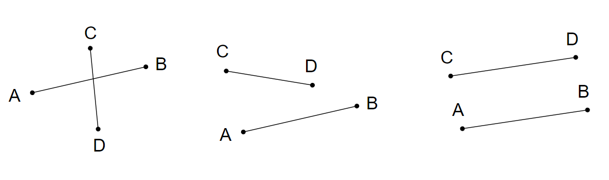{ width="400" }
</figure>

???+note "code"
	```cpp linenums="1"
    double disSS(Point a, Point b, Point c, Point d) {
        // Seg(a, b) Seg(c, d)
        if (intersect(a, b, c, d)) return 0;

        return min({disPS(a, b, c), disPS(a, b, d),
                    disPS(c, d, a), disPS(c, d, b)});
    }
    ```

## 判斷點是否在圖形內

### 凸包包含測試

把凸包想成由一些三角形組成，可用二分搜在哪個三角形內

<figure markdown>
  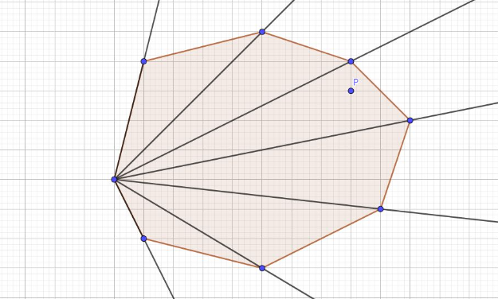{ width="300" }
</figure>

??? note "code"
	```cpp linenums="1"
    #include <bits/stdc++.h>
    #define int long long
    #define pii pair<int, int>
    #define pb push_back
    #define mk make_pair
    #define x first
    #define y second
    #define ALL(x) x.begin(), x.end()

    using namespace std;
    using PQ = priority_queue<int, vector<int>, greater<int>>;
    using Point = pair<long long, long long>;
    
    const int INF = 2e18;
    const int maxn = 3e5 + 5;
    const int M = 1e9 + 7;
    const int EPS = 1e-7;
    
    Point operator+(Point a, Point b) {
        return {a.x + b.x, a.y + b.y};
    }
    
    Point operator-(Point a, Point b) {
        return {a.x - b.x, a.y - b.y};
    }
    
    Point operator*(Point a, double d) {
        return {a.x * d, a.y * d};
    }
    
    int dot(Point a, Point b) {
        return a.x * b.x + a.y * b.y;
    }
    
    int cross(Point a, Point b) {
        return a.x * b.y - a.y * b.x;
    }
    
    int abs2(Point a) {
        // 計算 a 的長度平方
        return dot(a, a);
    }
    
    int sign(double x) {
        if (abs(x) < EPS) return 0;
        return x > 0 ? 1 : -1;
    }
    
    int onseg(Point a, Point b, Point c) {
        if (cross(c - a, b - a) != 0) return false;
        if (dot(c - a, b - a) < 0) return false;
        if (dot(a - b, c - b) < 0) return false;
    
        return true;
    }
    
    bool traingle(Point a, Point b, Point c, Point d) {
        // 判斷點是否在三角形內 traingle(a, b, c), Point(d)
        if (onseg(a, b, d)) return 1;
        if (onseg(b, c, d)) return 1;
        if (onseg(c, a, d)) return 1;
    
        int c1 = sign(cross(b - a, d - a));
        int c2 = sign(cross(c - b, d - b));
        int c3 = sign(cross(a - c, d - c));
    
        if (c1 == 1 && c2 == 1 && c3 == 1) return 1;
        return 0;
    }
    
    vector<Point> prep(vector<Point> p) {
        int n = p.size();
    
        auto comp = [&](Point a, Point b) {
            return a.x < b.x || (a.x == b.x && a.y < b.y);
            // x 做為排序的第一順位，再來是 y
        };
    
        int pos = 0;
        for (int i = 1; i < n; i++) {
            if (comp(p[i], p[pos])) pos = i;
        }
        rotate(p.begin(), p.begin() + pos, p.end());
        // new p = [pos ~ end] + [begin ~ pos - 1]
        // ex: p = {1,2,3,4,5,6,7}
        // rotate (p.begin(), p.begin() + 3, p.end())
        // new p = {3,4,5,6,7,1,2}
    
        for (int i = 1; i < n; i++) {
            p[i] = p[i] - p[0];
        }
        return p;
    }
    
    int inconvex(vector<Point> p, Point a) {
        p = prep(p); // input 的 p 必須是逆時鐘
        a = a - p[0];
        int n = p.size();
    
        // 在凸包下方
        if (cross(p[1], a) != 0 &&
            sign(cross(p[1], a)) != sign(cross(p[1], p[n - 1])))
            return false;
    
        // 在凸包上方
        if (cross(p[n - 1], a) != 0 &&
            sign(cross(p[n - 1], a)) != sign(cross(p[n - 1], p[1])))
            return false;
    
        // 在 p[1]~p[0]
        if (cross(p[1], a) == 0)
            return abs2(p[1]) >= abs2(a);
    
        int l = 1, r = n - 1;
        while (l < r - 1) {
            int mid = (l + r) >> 1;
            if (cross(p[mid], a) >= 0)
                l = mid;
            else
                r = mid;
        }
    
        return traingle({0, 0}, p[l], p[l + 1], a);
    }
    
    signed main() {
        vector<Point> p = {{5, 1}, {8, 3}, {7, 6}, {3, 8}, {1, 2}};
        Point tar = {-3, 3};
    
        cout << (inconvex(p, tar) ? "YES" : "NO") << "\n";
    }
    ```

### 多邊形包含測試

找射線，算線段交的次數，奇數次為內部，偶數次為外部。但射線可能恰好相交於端點上，這樣會壞掉，解決辦法就是讓射線的斜率射為無限大，使得沒有題目範圍內的整數點會在上面，例如說射線向量 = (1, 2e9 + 1)

<figure markdown>
  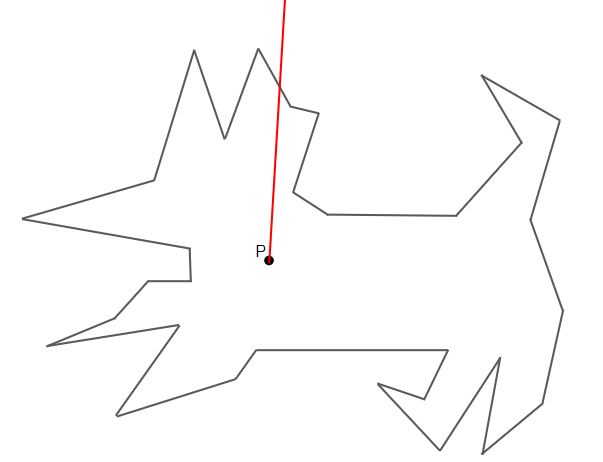{ width="300" }
</figure>

??? note "code"
	```cpp linenums="1"
	#include <bits/stdc++.h>
    #define int long long
    #define x first
    #define y second
    using namespace std;
    using Point = pair<double, double>;

    int n, m;
    vector<Point> p; 
    
    Point operator+(Point a, Point b) {
        return {a.x + b.x, a.y + b.y};
    }
    
    Point operator-(Point a, Point b) {
        return {a.x - b.x, a.y - b.y};
    }
    
    Point operator*(Point a, double d) {
        return {a.x * d, a.y * d};
    }
    
    int dot(Point a, Point b) {
        return a.x * b.x + a.y * b.y;
    }
    
    int cross(Point a, Point b) {
        return a.x * b.y - a.y * b.x;
    }
    
    int sign(int x) {
        if (x < 0) return -1;
        if (x == 0) return 0;
        return 1;
    }
    
    bool onseg(Point a, Point b, Point c) {
        if (cross(c - a, b - a) != 0) return false;
        if (dot(c - a, b - a) < 0) return false;
        if (dot(a - b, c - b) < 0) return false;
    
        return true;
    }
    
    int intersect(Point a, Point b, Point c, Point d) {
        int c1 = sign(cross(b - a, c - a)) * sign(cross(b - a, d - a));
        int c2 = sign(cross(d - c, b - c)) * sign(cross(d - c, a - c));
        if (c1 == 1 || c2 == 1) return false; 
        if (c1 == -1 && c2 == -1) return true; 
        if (onseg(a, b, c)) return true;
        if (onseg(a, b, d)) return true;
        if (onseg(c, d, a)) return true;
        if (onseg(c, d, b)) return true;
        return false;
    }
    
    void solve() {
        Point tar;
        cin >> tar.x >> tar.y;
        for (int i = 1; i < n; i++) {
            if (onseg(p[i - 1], p[i], tar)) {
                cout << "BOUNDARY";
                return;
            }
        }
        if (onseg(p[0], p[n - 1], tar)) {
            cout << "BOUNDARY";
            return;
        }
        Point cmp = tar + (Point){1, 2e9 + 1};
        int cnt = 0;
        for (int i = 1; i < n; i++) {
            if (intersect(p[i - 1], p[i], cmp, tar)) {
                cnt++;
            }
        }
        if (intersect(p[0], p[n - 1], cmp, tar)) {
            cnt++;
        }
        if (cnt & 1) cout << "INSIDE";
        else cout << "OUTSIDE";
    }
    
    signed main(){
        cin >> n >> m;
        p.resize(n);
        for (int i = 0; i < n; i ++) {
            cin >> p[i].x >> p[i].y;
        }
        while (m--) {
            solve();
            cout << "\n";
        }
    }
    ```

## 凸包

???+note "問題"
	給一些在二為平面上的點，選一些點使得這些點連線能夠包住所有點
	
二維平面上的凸包是一個凸多邊形，在所有點的外圍繞一圈即得凸包。另外，**最頂端、最底端、最左端、最右端的點**，一定是凸包上的點（因為如果不是的話，就沒任何點能包住他們）

<figure markdown>
  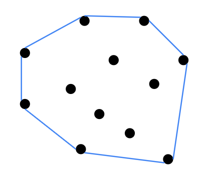{ width="200" }
</figure>

### Andrew Monotone Chain(單調鏈)

首先將所有點以 x 座標小到大排序，當 x 座標相同則以 y 座標小到大排序。

用最左邊的點，與最右邊的點，可以把平面分成上下兩半，上面的就是上凸包，下面的就是下凸包。先從起點開始，按照順序掃描，找到下半凸包。再從終點開始，按照相反順序掃描，找到上半凸包。合起來就是完整的凸包

<figure markdown>
  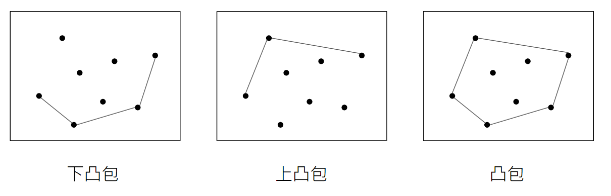{ width="550" }
</figure>

這邊就以找下凸包為例，排序好後第一個點，也就是最左邊的點，一定會在凸包裡面，所以我們將他加入，之後，當新的點新增進來時，若加來發現會與前面的向量呈現「凹陷狀態」，也就是 cross < 0[^1]，則一直 pop 當前凸包尾端的點直到不會凹陷，因為這些被 pop 的點都會被新的點與之前的點所連接的向量包含住

<figure markdown>
  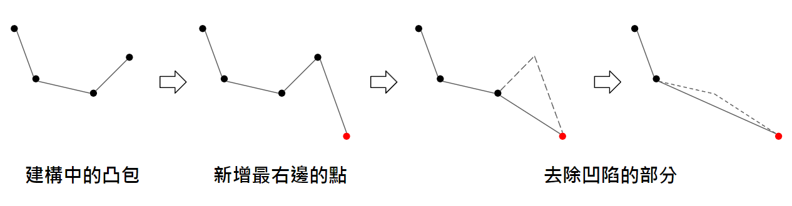{ width="650" }
</figure>

複雜度的瓶頸在排序，所以複雜度是 O(n log n)

??? note "code"
	```cpp linenums="1"
	vector<Point> convex_hull(vector<Point> p) {
        int n = p.size(), m = 0;
        sort(p.begin(), p.end());

        vector<Point> h;
        for (int i = 0; i < n; i++) {
            while (m >= 2 && cross(p[i] - h[m - 1], h[m - 1] - h[m - 2]) < 0) {
                h.pop_back(), m--;
            }
            h.push_back(p[i]), m++;
        }
    	
    	// 因為 h.back() 一定是 p[n - 1], 所以可以直接接在上面繼續做
        for (int i = n - 2; i >= 0; i--) {
            while (m >= 2 && cross(p[i] - h[m - 1], h[m - 1] - h[m - 2]) < 0) {
                h.pop_back(), m--;
            }
            h.push_back(p[i]), m++;
        }
        return h;
    }
    ```

???+note "[CSES - Convex Hull](https://cses.fi/problemset/task/2195/)"
	給 n 個二維座標點，求出凸包
	
	$3\le n\le 2\times 10^5, |x|, |y| \le 10^9$
	
	??? note "code"
		```cpp linenums="1"
		#include <bits/stdc++.h>
	    #define int long long
	    #define pii pair<int, int>
	    #define mk make_pair
	    #define pb push_back
	    #define x first
	    #define y second
	    #define ALL(x) x.begin(), x.end()
	    using namespace std;
	    using Point = pair<int, int>;
	
	    int n;
	    vector<Point> p; 
	
	    Point operator+(Point a, Point b) {
	        return {a.x + b.x, a.y + b.y};
	    }
	
	    Point operator-(Point a, Point b) {
	        return {a.x - b.x, a.y - b.y};
	    }
	
	    Point operator*(Point a, double d) {
	        return {a.x * d, a.y * d};
	    }
	
	    int dot(Point a, Point b) {
	        return a.x * b.x + a.y * b.y;
	    }
	
	    int cross(Point a, Point b) {
	        return a.x * b.y - a.y * b.x;
	    }
	
	    int sign(int x) {
	        if (x < 0) return -1;
	        if (x == 0) return 0;
	        return 1;
	    }
	
	    bool onseg(Point a, Point b, Point c) {
	        if (cross(c - a, b - a) != 0) return false;
	        if (dot(c - a, b - a) < 0) return false;
	        if (dot(a - b, c - b) < 0) return false;
	
	        return true;
	    }
	
	    int intersect(Point a, Point b, Point c, Point d) {
	        int c1 = sign(cross(b - a, c - a)) * sign(cross(b - a, d - a));
	        int c2 = sign(cross(d - c, b - c)) * sign(cross(d - c, a - c));
	        if (c1 == 1 || c2 == 1) return false; 
	        if (c1 == -1 && c2 == -1) return true; 
	        if (onseg(a, b, c)) return true;
	        if (onseg(a, b, d)) return true;
	        if (onseg(c, d, a)) return true;
	        if (onseg(c, d, b)) return true;
	        return false;
	    }
	
	    vector<Point> convex_hull(vector<Point> p) {
	        int n = p.size(), m = 0;
	        sort(p.begin(), p.end());
	
	        vector<Point> h;
	        for (int i = 0; i < n; i++) {
	            while (m >= 2 && cross(p[i] - h[m - 1], h[m - 1] - h[m - 2]) < 0) {
	                h.pop_back(), m--;
	            }
	            h.push_back(p[i]), m++;
	        }
	
	        // 因為 h.back() 一定是 p[n - 1], 所以可以直接接在上面繼續做
	        for (int i = n - 2; i >= 0; i--) {
	            while (m >= 2 && cross(p[i] - h[m - 1], h[m - 1] - h[m - 2]) < 0) {
	                h.pop_back(), m--;
	            }
	            h.push_back(p[i]), m++;
	        }
	        return h;
	    }
	
	    signed main() {
	        cin >> n;
	        p.resize(n);
	        for (int i = 0; i < n; i++) {
	            cin >> p[i].x >> p[i].y;
	        }
	
	        vector<Point> h = convex_hull(p);
	        cout << h.size() - 1 << "\n";
	        for (int i = 0; i < h.size() - 1; i++) {
	            cout << h[i].x << " " << h[i].y << "\n";
	        }
	    }
	    ```

???+note "[Kattis -	Robot Protection](https://open.kattis.com/contests/igo32n/problems/robotprotection)"
	給 $n$ 個點，要先求出凸包，再求凸包的面積
	
	$1\le n\le 10^4, |x_i|,|y_i|\le 10^4$
	
	??? note "細節"
		注意直接套我們上面的凸包模板，加上面積公式即可，就算凸包模板起點會現兩次也是 ok 的，不能在最後把起點 pop 掉
		
		把最後重複出現的起點 pop 掉也可以，但要記得將 area() 函式內的細節改一下，防止 n = 1 時，凸包把所有點都 pop 掉的 edge case
		
		```cpp
		double area(vector<Point> &points) {
	        int n = points.size();
	        int ret = 0;
	        for (int i = 1; i < n; i++) {
	            ret += cross(points[i], points[i - 1]);
	        }
	        // 前面加上 if (n)，防止 n = 0
	        if (n) ret += cross(points[0], points[n - 1]);
	        return fabs((double)ret / 2);
	    }
		```
		
		> submission: <http://codepad.org/EYXy2YG2>
		
	??? note "code"
		```cpp linenums="1"
		#include <bits/stdc++.h>
	    #define int long long
	    #define pii pair<int, int>
	    #define mk make_pair
	    #define pb push_back
	    #define x first
	    #define y second
	    #define ALL(x) x.begin(), x.end()
	    using namespace std;
	    using Point = pair<int, int>;
	
	    Point operator+(Point a, Point b) {
	        return {a.x + b.x, a.y + b.y};
	    }
	
	    Point operator-(Point a, Point b) {
	        return {a.x - b.x, a.y - b.y};
	    }
	
	    Point operator*(Point a, double d) {
	        return {a.x * d, a.y * d};
	    }
	
	    int dot(Point a, Point b) {
	        return a.x * b.x + a.y * b.y;
	    }
	
	    int cross(Point a, Point b) {
	        return a.x * b.y - a.y * b.x;
	    }
	
	    double area(vector<Point> &points) {
	        int n = points.size();
	        int ret = 0;
	        for (int i = 1; i < n; i++) {
	            ret += cross(points[i], points[i - 1]);
	        }
	        ret += cross(points[0], points[n - 1]);
	        return fabs((double)ret / 2);
	    }
	
	    vector<Point> convex_hull(vector<Point> p) {
	        int n = p.size(), m = 0;
	        sort(p.begin(), p.end());
	
	        vector<Point> h;
	        for (int i = 0; i < n; i++) {
	            while (m >= 2 && cross(p[i] - h[m - 1], h[m - 1] - h[m - 2]) < 0) {
	                h.pop_back(), m--;
	            }
	            h.push_back(p[i]), m++;
	        }
	
	        for (int i = n - 2; i >= 0; i--) {
	            while (m >= 2 && cross(p[i] - h[m - 1], h[m - 1] - h[m - 2]) < 0) {
	                h.pop_back(), m--;
	            }
	            h.push_back(p[i]), m++;
	        }
	        return h;
	    }
	
	    int n;
	    void solve() {
	        vector<Point> p; 
	        p.resize(n);
	        for (int i = 0; i < n; i++) {
	            cin >> p[i].x >> p[i].y;
	        }
	        vector<Point> h = convex_hull(p);
	        cout << fixed << setprecision(2) << area(h) << '\n';
	    }
	    signed main() {
	        while (cin >> n) {
	            if (n == 0) break;
	            solve();
	        }
	    }
	    ```

## 極角排序

一般用這個即可，不用自定義 cmp，其中 atan2 的值域是 [-180, 180]

??? note "code"
	```cpp linenums="1"
	bool cmp(Point a, Point b) {
        return atan2(a.y, a.x) < atan2(b.y, b.x) ;
    }
    ```

???+note "[TOI 2020 pD. 質感測試](https://tioj.ck.tp.edu.tw/problems/2191)"
	給 $n$ 個二維座標平面的點，第 $i$ 個點有權重 $w_i$，問任意通過原點的直線，能掃過的點的權重總和最大是多少
	
	$n\le 3\times 10^5, -1000\le w_i\le 1000, |x_i|, |y_i| \le 10^5$
	
	??? note "思路"
		【觀察】: 任意通過原點的直線 ↔ 一條斜率為 m 的直線
	
		按照斜率排序，問題就變成了 Maximum Cirricular Subarray

???+note "[TOI 2019 pA. 四點共線 (collinearity)](https://sorahisa-rank.github.io/oi-toi/2019/problems.pdf)"
	 給 n 個點，問輸出四點共線中最小字典序的
	 
	$n\le 3000$
	
	??? note "思路"
		開一個 map 存斜率
		
		枚舉第一個點 i，再枚舉其他點 j，將 (key, value) = (i 跟 j 的斜率, j) 加入 map 中，看可能的斜率中字典序最小的那個即可

## 最近點對問題

### 分治

先把整個陣列 p 按照 x 小到大 sort。以中位數當 pivot，依照 x 軸分成左、右兩堆，遞迴求解子問題，再來 Combine 的部分，我們把以中位數那條線左右距離 <= d 的點都拿出來，按照 y 小到大 sort，對於每個點都只要看周圍至多 6 個點的距離即可，因為我們可以利用類似 Merge sort 的方式得到已 y 小到大 sort 的 p'，所以複雜度是 O(n log n)

```
combine(d, P, mid) {
	P 只留 x \in [mid - d, mid + d]
	每個 P 內的 point，只和上下 8 個點算 distance
	用類似雙指針維護
}

DC(P) {
	(d1, P_L') = DC(P.前半)
	(d2, P_R') = DC(P.後半)
	P' = merge(P_L', P_R') by y 小到大
	d = min(d1, d2)
	combine(d, P', mid)
}
```

### sweep line

sweep line 從 y 小到大掃過每個點，維護一個 set表示目前還與 sweep line 的點距離 <= d 的點，每次只要跟距離 sweep line 前後 6 個點算距離即可

```
sort(p) y 小到大
set 由 x 小到大
l = 1
for r = 1...n:
	while p[l].y <= p[r].y - D:
		刪 p[l]
	找 set 內, p[r].x 前後 6 個點 lower_bound 更新 D
	set.insert(p[r])
```

[^1]: 見<a href="/wiki/math/images/51.png" target="_blank">此圖</a>