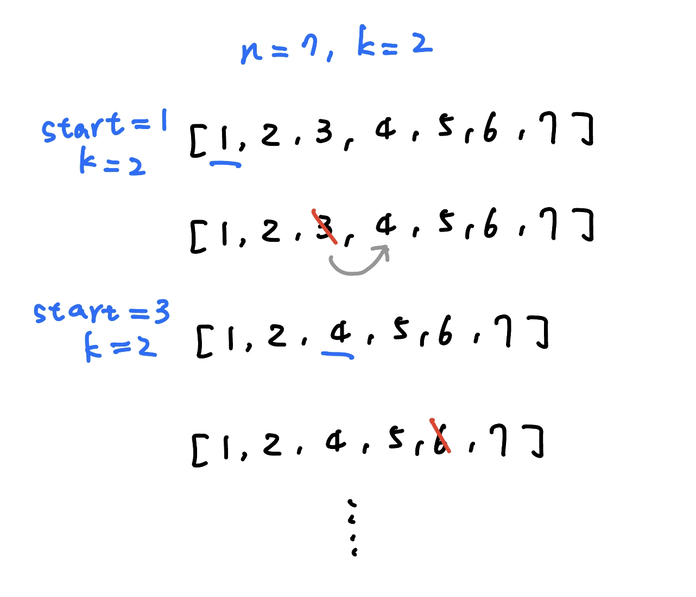
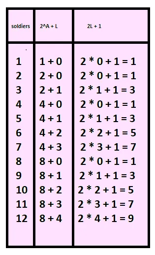

都是想辦法當前的問題轉移到子問題，在某些題目可以配合資料結構計算答案

## 求第 k 次被刪的

???+note "[CSES - Josephus Queries](https://cses.fi/problemset/task/2164)"
	有 $n$ 個人，每次格一個刪，有 $q$ 次詢問 :
	
	- $\text{query}(k):$ 輸出第 $k$ 次被刪的
	
	$n,k\le 10^9,q\le 10^5$
	
	??? note "思路"
		n 是奇數與偶數的 case 分開討論，然後想辦法變子問題，記得當 n = 1 時要特判。
		
		複雜度 T(n, k) = T(n/2, k - (n / 2)) + O(1) $\Rightarrow O(\log n)$。 
	
	??? note "code"
        ```cpp linenums="1"
        #include <bits/stdc++.h>
        #define int long long
        #define pii pair<int, int>
        #define pb push_back
        #define mk make_pair
        #define F first
        #define S second
        using namespace std;

        int ifloor(int a, int b){
            if(b < 0) a *= -1, b *= -1;
            if(a < 0) return (a - b + 1) / b;
            else return a / b;
        }

        int iceil(int a, int b){
            if(b < 0) a *= -1, b *= -1;
            if(a > 0) return (a + b - 1) / b;
            else return a / b;
        }

        int F (int n, int k) {
            if (n == 1) return 1;
            if (k <= iceil(n, 2)) {
                if (n % 2 == 0) return 2 * k;
                else return (2 * k) % n;
            }

            int idx;
            if (n % 2 == 0) idx = F(n / 2, k - (n / 2));
            else idx = F(ifloor(n, 2), k - iceil(n, 2));

            int now_index;
            if (n % 2 == 0) now_index = 2 * idx - 1;
            else now_index = 2 * idx + 1;
            return now_index;
        }

        void solve() {
            int n, k;
            cin >> n >> k;
            cout << F (n, k) << "\n";
        }

        signed main() {
            // ios::sync_with_stdio(0);
            // cin.tie(0);
            int t = 1;
            cin >> t;
            while (t--) {
                solve();
            }
        }
        ```

## 求刪掉順序
	
???+note "[CSES - Josephus Problem II](https://cses.fi/problemset/task/2163)"
	有 $n$ 個人，每隔 $k$ 個刪，求刪掉順序
	
	$1\le n\le 2\times 10^5,0\le k\le 10^9$
	
	??? note "思路"
		<figure markdown>
          { width="300" }
        </figure>
        
        當第 3 項被刪除後，start 就變成子問題第 3 項。也就代表第 x 項被移除後，會變成子問題 (x + k) % n 項（0-base）


	??? note "code"
		```cpp linenums="1"
        #include<bits/stdc++.h>
        #include <bits/extc++.h>

        using namespace __gnu_pbds;
        template <typename T>
        using rank_set = tree<T, null_type, std::less<T>, rb_tree_tag,
                                                   tree_order_statistics_node_update>;
        using namespace std;

        signed main() {
            int n, k;
            rank_set<int> s;
            cin >> n >> k;
            for (int i = 1; i <= n; i++) {
                s.insert(i);
            }

            int start = k % n;
            while(n--) {
                auto y = s.find_by_order(start); // 0-base
                cout<< *y << ' ';
                s.erase(y);
                if (n) {
                    start = start % n;
                    start = (start + k) % n;
                }
            }
        }
        ```

## 求最後存活的

???+note "約瑟夫問題"
	有 $n$ 個人（0-base），每隔 $k-1$ 刪，求最後存活的
	
	$1\le k\le n\le 10^5$
	
	??? note "思路"
		一樣去觀察如何轉移到子問題，因為在刪掉當前這輪的數字後，會發現子問題的 start 恰為當前陣列第 $k$ 項。又因為是 0-base，所以可推出以下轉移式 
	
		$$F(1)=0,F(n)=F(n-1)+k \pmod{n}$$
		
	??? note "code"

        ```cpp linenums="1"
        void solve () {
            int F = 0;
            for (int i = 2; i <= n; i++) {
                F = (F + k) % i;
            }
            cout << F << "\n"; // 0-base
        }
        ```

???+note "約瑟夫問題 special case: k = 2"
	有 $n$ 個人（0-base），每隔 $1$ 格刪，求最後存活的
	
	$n=10^{18},k=2$
	
	??? note "思路"
		先暴力建表，然後觀察
		
		<figure markdown>
          { width="300" }
        </figure>
        
    ??? note "code"
    	```cpp linenums="1"
    	int getSafePosition(int n) {
            int L = n - highestOneBit(n);
            return 2 * L  + 1;
        }
    	```