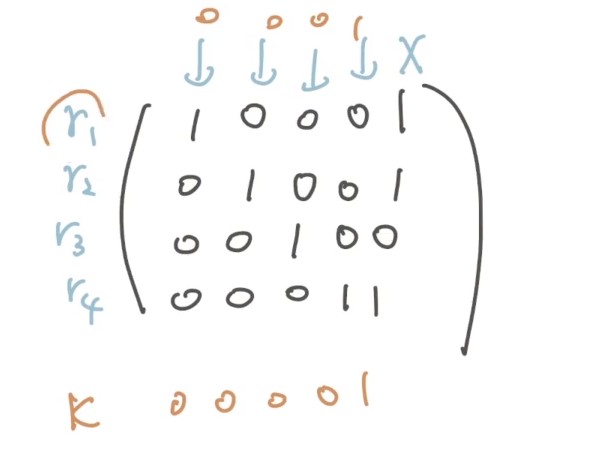
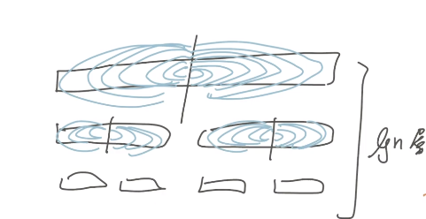

## Maximum Xor Subset

???+ note "[LOJ 113. 最大异或和](https://loj.ac/p/113)"
	給 $a_1\sim a_n$，問選一些元素 $\texttt{XOR}$ 起來，最大是多少
	
	- $O(n\log n)$
	??? note "想法"
		- 高斯消去
		
		- 線性基
	??? note "full code" 
	    ```cpp linenums="1"
	    #include <bits/stdc++.h>
	    #define int long long
	    #define pii pair<int, int>
	    #define pb push_back
	    #define mk make_pair
	    #define F first
	    #define S second
	    #define ALL(x) x.begin(), x.end()
	    #define bit(i) (1LL << i)
	
	    using namespace std;
	
	    const int INF = 2e18;
	    const int maxn = 3e5 + 5;
	    const int M = 1e9 + 7;
	    const int K = 60;
	
	    int n;
	    vector<int> a;
	
	    struct gauss {
	        vector<int> v;
	
	        void init () {
	            v.resize (K);
	            fill (ALL(v), -1);
	        }
	
	        void insert (int x) {
	            for (int i = K - 1; i >= 0; i--) {
	                if ((x & bit (i)) && v[i] != -1) {
	                    x ^= v[i];
	                }
	                else if ((x & bit (i)) && v[i] == -1) {
	                    v[i] = x;
	                    return;
	                }
	            }
	        }
	
	        int query () {
	            int x = 0;
	            for (int i = K - 1; i >= 0; i--) {
	                if (v[i] != -1 && (x & bit (i)) == 0) {
	                    x ^= v[i];
	                }
	            }
	            return x;
	        }
	    };
	
	    void init () {
	        cin >> n;
	        a.clear ();
	        a.resize (n);
	        for (int i = 0; i < n; i++) {
	            cin >> a[i];
	        } 
	    }
	
	    void solve () {
	        gauss G;
	        G.init ();
	
	        for (int x : a) {
	            G.insert (x);
	        }
	
	        cout << G.query () << "\n";
	    } 
	
	    signed main() {
	        // ios::sync_with_stdio(0);
	        // cin.tie(0);
	        int t = 1;
	        //cin >> t;
	        while (t--) {
	            init ();
	            solve();
	        }
	    }
	    ```

???+ note "類似題 [XORSUB](https://www.codechef.com/problems/XORSUB)"
    給 $a_1\sim a_n$，和 $x$，問選一些元素 $\texttt{XOR}$ 起來，再跟 $x\texttt{ XOR}$ 最大是多少
    
    - $O(n\log n)$
    
    ??? note "full code"
        ```cpp linenums="1"
        #include <bits/stdc++.h>
        #define int long long
        #define pii pair<int, int>
        #define pb push_back
        #define mk make_pair
        #define F first
        #define S second
        #define ALL(x) x.begin(), x.end()
        #define bit(i) (1LL << i)
    
        using namespace std;
    
        const int INF = 2e18;
        const int maxn = 3e5 + 5;
        const int M = 1e9 + 7;
        const int K = 60;
    
        int n, x;
        vector<int> a;
    
        struct gauss {
            vector<int> v;
    
            void init () {
                v.resize (K);
                fill (ALL(v), -1);
            }
    
            void insert (int x) {
                for (int i = K - 1; i >= 0; i--) {
                    if ((x & bit (i)) && v[i] != -1) {
                        x ^= v[i];
                    }
                    else if ((x & bit (i)) && v[i] == -1) {
                        v[i] = x;
                        return;
                    }
                }
            }
    
            int query (int tar) {
                int x = tar;
                for (int i = K - 1; i >= 0; i--) {
                    if (v[i] != -1 && (x & bit (i)) == 0) {
                        x ^= v[i];
                    }
                }
                return x;
            }
        };
    
        void init () {
            cin >> n >> x;
            a.clear ();
            a.resize (n);
            for (int i = 0; i < n; i++) {
                cin >> a[i];
            } 
        }
    
        void solve () {
            gauss G;
            G.init ();
    
            for (int x : a) {
                G.insert (x);
            }
    
            cout << G.query (x) << "\n";
        } 
    
        signed main() {
            // ios::sync_with_stdio(0);
            // cin.tie(0);
            int t = 1;
            cin >> t;
            while (t--) {
                init ();
                solve();
            }
        }
        ```

## k-th Xor Subset

???+ note "[HDU 3949](https://vjudge.net/problem/HDU-3949)"
    給 $a_1,...,a_n$ 問第 $k$ 小的 $\texttt{XOR subset}$ 是多少
	

	??? note "想法"
	    - 假設在消去的之後線性基大小只有 $r$
	    - 若答案比 $2^r$ 還大，那就湊不出來
	    - 剩下就是把 $k$ 做二進制分解如果第 $i$ 個 $\texttt{bit}$ 是 $1$ 就把 $\texttt{ans XOR }$ 有被控制的第 $i$ 大的 $\texttt{bit}$
	    
	    <figure markdown>
	      { width="250" }
	    </figure>
	
	??? note "code" 
	    ```cpp linenums="1"
	    struct gauss {
	        vector<int> v;
	        vector<int> u;
	
	        void init () {
	            v.resize (K);
	            fill (ALL(v), -1);
	        }
	
	        void insert (int x) {
	            for (int i = 0; i < K; i++) {
	                if (v[i] != -1 && (x & (1LL << i))) {
	                    x ^= v[i];
	                }
	            }
	            if (x == 0) return;
	            int p = K;
	            while ((x & (1LL << p)) == 0) p--;
	            v[p] = x;
	            for (int i = 0; i < K; i++) {
	                if (i == p) continue;
	                if (v[i] == -1) continue;
	
	                if (v[i] & (1LL << p)) v[i] ^= v[p];
	            }
	        }
	
	        int query () {
	            int x = 0;
	            for (int i = K - 1; i >= 0; i--) {
	                if (v[i] != -1 && (x & bit (i)) == 0) {
	                    x ^= v[i];
	                }
	            }
	            return x;
	        }
	
	        void rebuild () {
	            u.clear ();
	            for (int i = K - 1; i >= 0; i--) {
	                if (v[i] != -1) {
	                    u.pb (i);
	                } 
	            }
	        }
	
	        int find (int k) {
	            // 記得 find 之前先 rebuild 來初始化 u
	            int sz = u.size (); 
	            if (sz != n) k--; // 可以湊出 0，要扣掉 0 的那位
	            if (k >= bit (sz)) return -1; 
	
	            int cnt = sz - 1, ret = 0;
	            for (auto i : u) {
	                if (k & bit (cnt)) {
	                    ret ^= v[i];
	                } 
	                cnt--;
	            }
	            return ret;
	        }
	    };
	    ```

???+ note "類似題"
    - 給 $a_1,...,a_n$ 和 $x$，問 $x$ 是第幾小的 
    ??? note "想法"
    	- 看他哪個 $\texttt{bit}$ 有選，對應出來有選沒選的二進位就是他的 $\texttt{rank}$

## Atcoder Xor

???+note "[Atcoder XOR 2](https://atcoder.jp/contests/arc098/tasks/arc098_b)"
	??? note "想法"
		- 雙指針，前綴和

???+note "[Atcoder XOR 3](https://atcoder.jp/contests/abc141/tasks/abc141_f)"
	??? note "想法"
        - 令分成的兩堆 $\texttt{XOR}$ 和 $s_1,s_2$

        - 若在二進位下第 $i$ 位是 $1$ 的個數是奇數
        	- 奇 $=$ 奇 $+$ 偶
        	- 故 $s_1,s_2$ 其中一個的第 $i$ 位也一定是奇數
        	- 直接先把所有的 $a_i$ 的第 $i$ 位設為 $0$
        	- 答案直接加上奇數位數的總和
    
        - 偶數的部分發現 $s_1'\oplus s_2'=0$ (被刪掉奇數位數的異或和)
    		- 因為每位都只剩下偶數個數，自然就是 $0$
          	- $\Rightarrow s_1'=s_2'$
          	- 不管 $s_1'$ 選啥，$s_2'$ 的值也一定跟 $s_1'$ 相同
         
        - 最後只要在目前的 $a_1'\sim a_n'$ 做 $\texttt{Maximum Xor Subset}$ 即可


???+ note "[Atcoder XOR 4](https://atcoder.jp/contests/abc147/tasks/abc147_d)"
	??? note "想法"
		- 對於每個 $\texttt{bit}$ 算前面出現幾個 $1,0$

	??? note "full code"
	    ```cpp linenums="1"
	    #include <bits/stdc++.h>
	    #define int long long
	    #define pii pair<int, int>
	    #define pb push_back
	    #define mk make_pair
	    #define F first
	    #define S second
	    #define ALL(x) x.begin(), x.end()
	    #define bit(x) (1LL << x)
	
	    using namespace std;
	    using PQ = priority_queue<int, vector<int>, greater<int>>;
	
	    const int INF = 2e18;
	    const int maxn = 3e5 + 5;
	    const int M = 1e9 + 7;
	    const int K = 60;
	
	    int n;
	    int a[maxn];
	
	    void init () {
	        cin >> n;
	        for (int i = 1; i <= n; i++) {
	            cin >> a[i];
	        }
	    }
	
	    int get (int j) {
	        int x = 0, y = 0, ret = 0;
	        for (int i = 1; i <= n; i++) {
	            if (a[i] & bit (j)) {
	                ret = (ret + (y * (bit (j) % M)) % M) % M;
	                x++;
	            } 
	            else {
	                ret = (ret + (x * (bit (j) % M)) % M) % M;
	                y++;
	            }
	        }
	        return ret;
	    }
	
	    void solve () {
	        int ans = 0;
	        for (int i = 0; i < K; i++) {
	            ans = (ans + get (i)) % M;
	        }
	
	        cout << ans << "\n";
	    } 
	
	    signed main() {
	        // ios::sync_with_stdio(0);
	        // cin.tie(0);
	        int t = 1;
	        //cin >> t;
	        while (t--) {
	            init();
	            solve();
	        }
	    } 
	    ```


## 線性基大小

???+ note "例題"
	- 給定陣列 $a_1,...,a_n$ 問可以 $\texttt{XOR}$ 成多少種數字
  	
  	??? note "想法"
  		- 假設在消去的之後線性基大小只有 $r$，那答案就是 $2^{r}$

???+ note "延伸"
	- 給一個陣列 $a_1,...,a_n$，問有多少個子集 $\texttt{XOR}$ 為 $0$

  	??? note "想法"
  		- 假設在消去的之後線性基大小只有 $r$，那答案就是 $2^{n-r}$

???+ note "變化"
	- 給一個陣列 $a_1,...,a_n$，問有多少種 $\texttt{subset}$ 可以組成 $x$
	
	??? note "想法"
	    - 我們先判斷是否可以湊出 $x$
	
	    - 如果可以，我們可以透過 $\texttt{XOR}$ 一些 $0$ 也可以得到 $x$
	
	    - 假設在消去的之後線性基大小只有 $r$
	
	    - 所以答案就是 $2^{n-r}$ (也就是用那些 $0$ 來組合)

## 資料結構

???+ note "例題1"
	給定一顆樹，問對於每個點，他以下的 $\texttt{subtree}$ 可以 $\texttt{XOR}$ 出多少種異或和
	??? note "想法"
        - 把樹開成線段樹，每個節點維護一個線性基

        - 每個線性基的大小最多是 $O(\log C)$
        	- 因為最多只會控制全部的 $\texttt{bit}$
    
        - 每次 $\texttt{insert}$ 花 $O(\log C)$
    
        - $O(n\log^2 C)$

???+ note "例題2"
    給一個陣列 $a_1,...,a_n$，$q$ 筆以下詢問
    
    - $\text{query}(l,r):a_l\sim a_r$ 的 $\texttt{Maximum Xor Subset}$ 
    
    - 每筆詢問複雜度 $O(\log^3 C)$ 回答
    
    ??? note "想法"
        - 線段樹維護
    
        - 合併 $O(\log^2 C)$
    
        - $O(\log C)$ 層

???+ note "例題3"
    給一個陣列 $a_1,...,a_n$，$q$ 筆以下詢問
    
    - $\text{query}(l,r):a_l\sim a_r$ 的 $\texttt{Maximum Xor Subset}$ 
    
    - 每筆詢問複雜度 $O(\log^2 C)$ 回答
    
    ??? note "想法"
        <figure markdown>
          { width="300" }
        </figure>
    
        - 建構 $\texttt{pre}$，$\texttt{suf}$，每層有 $n$ 個東西
    
        - 每次再 $\texttt{insert}$ 一個東西花 $O(\log C)$
    
        - 查詢相當於合併某個 $\texttt{suf}$ 跟每個 $\texttt{pre}$
        	- $O(\log^2 C)$
    
        - $\begin{cases} \text{total build: } O(n\log^2 C) \\ \text{total query:}O(q\log^2 C)\end{cases}$

## 參考

- <https://taodaling.github.io/blog/2020/12/25/%E7%BA%BF%E6%80%A7%E5%9F%BA/>