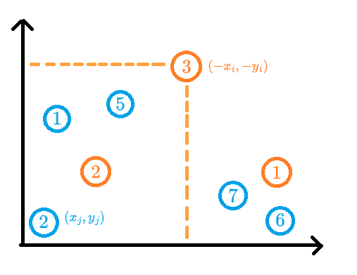

## 三维偏序
### 非嚴格
???+ note "非嚴格三维偏序"
    給 $n$ 個三維空間的點 $(x,y,z)$，問對於第 $i$ 個點，有幾個 $j$ 滿足 $x_j\ge x_i,y_j\ge y_i,z_j\ge z_i$
    
    ??? note "[洛谷 P3810 三维偏序](https://www.luogu.com.cn/problem/P3810) code"
    	```cpp linenums="1"
    	#include <bits/stdc++.h>
        #define int long long
        #define pii pair<int, int>
        #define pb push_back
        #define mk make_pair
        #define lowbit(x) (x & (-x))
        #define F first
        #define S second
        #define ALL(x) x.begin(), x.end()
    
        using namespace std;
        using PQ = priority_queue<int, vector<int>, greater<int>>;
    
        const int INF = 2e18;
        const int maxn = 3e5 + 5;
        const int M = 1e9 + 7;
    
        int n, C;
        int ans[maxn];
    
        struct triple {
            int a, b, c, cnt, res;
    
            bool operator== (triple &other) {
                if (a == other.a && b == other.b && c == other.c)
                    return true;
                return false;
            }
        } a[maxn];
    
        int cmpA (triple A, triple B) {
            if (A.a != B.a) return A.a < B.a;
            if (A.b != B.b) return A.b < B.b;
            return A.c < B.c;
        }
    
        int cmpB (triple A, triple B) {
            if (A.b != B.b) return A.b < B.b;
            return A.c < B.c;
        }
    
        struct BIT {
            int n;
            vector<int> bit;
    
            void init (int _n) {
                n = _n;
                bit.resize (n + 1);
            }
    
            void add (int x, int d) {
                while (x <= n) {
                    bit[x] += d;
                    x += lowbit (x);
                }
            }
    
            int query (int x) {
                int ret = 0;
                while (x > 0) {
                    ret += bit[x];
                    x -= lowbit (x);
                }
                return ret;
            }
        } bit;
    
        void CDQ (int l, int r) {
            if (l == r) return;
    
            int mid = (l + r) / 2;
            CDQ (l, mid), CDQ (mid + 1, r);
    
            sort (a + l, a + mid + 1, cmpB);
            sort (a + mid + 1, a + r + 1, cmpB);
    
            int i = l, j = mid + 1;
            while (j <= r) {
                while (i <= mid && a[i].b <= a[j].b) {
                    bit.add (a[i].c, a[i].cnt);
                    i++;
                }
                a[j].res += bit.query (a[j].c);
                j++;
            }   
    
            // undo
            for (int k = l; k < i; k++) {
                bit.add (a[k].c, -a[k].cnt);
            }
            return;
        }
    
        void solve () {
            cin >> n >> C;
    
            vector<triple> tmp (n);
            for (int i = 0; i < n; i++) {
                cin >> tmp[i].a >> tmp[i].b >> tmp[i].c;
            }
            sort (ALL (tmp), cmpA);
    
            int m = 0, cnt = 0;
            for (int i = 0; i < n; i++) {
                if (i && tmp[i] == tmp[i - 1]) {
                    a[m].cnt++;
                }
                else {
                    m++;
                    a[m].a = tmp[i].a;
                    a[m].b = tmp[i].b;
                    a[m].c = tmp[i].c;
                    a[m].cnt = 1;
                } 
            }
            bit.init (C);


            CDQ (1, m);
            for (int i = 1; i <= m; i++) ans[a[i].res + a[i].cnt - 1] += a[i].cnt;
    
            for (int i = 0; i < n; i++) cout << ans[i] << "\n"; 
        } 
    
        signed main() {
            // ios::sync_with_stdio(0);
            // cin.tie(0);
            int t = 1;
            //cin >> t;
            while (t--) {
                solve();
            }
        } 
        ```


### 嚴格

???+ note "[Zerojudge c571.三維偏序](https://zerojudge.tw/ShowProblem?problemid=c571)"
    給 $n$ 個三維空間的點 $(x,y,z)$，問對於第 $i$ 個點，有幾個 $j$ 滿足 $x_j>x_i,y_j>y_i,z_j>z_i$
    
    ??? note "code"
     	```cpp linenums="1"
     	#include <bits/stdc++.h>
        #define int long long
        #define pii pair<int, int>
        #define pb push_back
        #define mk make_pair
        #define lowbit(x) (x & (-x))
        #define F first
        #define S second
        #define ALL(x) x.begin(), x.end()
    
        using namespace std;
        using PQ = priority_queue<int, vector<int>, greater<int>>;
    
        const int INF = 2e18;
        const int maxn = 3e5 + 5;
        const int M = 1e9 + 7;
    
        int n, C;
        int ans[maxn];
        vector<int> idx;
    
        struct triple {
            int a, b, c, id;
    
            bool operator== (triple &other) {
                if (a == other.a && b == other.b && c == other.c)
                    return true;
                return false;
            }
        } a[maxn];
    
        int cmpA (triple A, triple B) {
            if (A.a != B.a) return A.a > B.a;
            if (A.b != B.b) return A.b > B.b;
            return A.c > B.c;
        }
    
        int cmpB (triple A, triple B) {
            if (A.b != B.b) return A.b > B.b;
            return A.c > B.c;
        }
    
        struct BIT {
            int n;
            vector<int> bit;
    
            void init (int _n) {
                n = _n;
                bit.resize (n + 1);
            }
    
            void add (int x, int d) {
                while (x > 0) {
                    bit[x] += d;
                    x -= lowbit (x);
                }
            }
    
            int query (int x) {
                int ret = 0;
                while (x <= n) {
                    ret += bit[x];
                    x += lowbit (x);
                }
                return ret;
            }
        } bit;
    
        void CDQ (int ql, int qr) {
            if (ql == qr) return;
    
            int qmid = (ql + qr) / 2;
            CDQ (ql, qmid), CDQ (qmid + 1, qr);
    
            int l = idx[ql], mid = idx[qmid + 1] - 1, r = idx[qr + 1] - 1;
            vector<triple> left, right;
            for (int i = l; i <= mid; i++) {
                left.pb (a[i]);
            }
    
            for (int i = mid + 1; i <= r; i++) {
                right.pb (a[i]);
            }
            sort (ALL (left), cmpB);
            sort (ALL (right), cmpB);
    
            int i = 0, j = 0;
    
            while (j < (int)right.size()) {
                while (i < (int)left.size () && left[i].b > right[j].b) {
                    bit.add (left[i].c, 1);
                    i++;
                }
                ans[right[j].id] += bit.query (right[j].c + 1);
                j++;
            }   
    
            // undo
            for (int k = 0; k < i; k++) {
                bit.add (left[k].c, -1);
            }
            return;
        }
    
        void solve () {
            cin >> n;
    
            for (int i = 0; i < n; i++) {
                cin >> a[i].a >> a[i].b >> a[i].c;
                a[i].id = i;
            }
            sort (a, a + n, cmpA);
    
            int m = 0, tot = 0;
            for (int i = 0; i < n; i++) {
                if (i && a[i - 1].a != a[i].a) {
                    tot++;
                    idx.pb (i);
                }
                else if (i == 0) tot++, idx.pb (0);
            }
            bit.init (n);
            idx.pb (n);
    
            CDQ (0, tot - 1);
    
            for (int i = 0; i < n; i++) {
                cout << ans[i] << "\n";
            }
        } 
    
        signed main() {
            ios::sync_with_stdio(0);
            cin.tie(0);
            int t = 1;
            //cin >> t;
            while (t--) {
                solve();
            }
        } 
        ```

## 例題
### 矩形加矩形求和
???+note "[CSES Forest Queries II](https://cses.fi/problemset/task/1739)"
	在二維平面上，支持以下操作
	
	- 支持在一個矩形區域內加一個數字
	
	- 每次詢問一個矩形區域的和
	
	??? note "思路"
		「詢問一個矩形區域的和」可以看做是四個詢問 $(x_i,y_i)$ 的數值總和
		
		$$\small ans=sum(x_2,y_2)-sum(x_1-1,y_2)-sum(x_2,y_1-1)+sum(x_1-1,x_2-1)$$
	    
	    那要怎麼維護操作先後順序呢 ? 我們可以多加一為 $z$ 表示此操作的時間戳記，問題就變成
	    
	    給定一個 $(x_i,y_i,z_i)$ 詢問 $\begin{cases}x_j \le x_i \\ y_j \le y_i \\ z_j \le z_i \end{cases}$ 的權值總和

  


### APIO 2019 路燈


### NPSC 忙碌的國度
???+note "[NPSC 2019 高中組 pB. 忙碌的國度](https://contest.cc.ntu.edu.tw/npsc2019/teamclient/final-senior.pdf)"
	有 $n$ 間公司和 $m$ 間餐廳，每個員工有位置 $(x_i,y_i)$ 和下班時間 $t_i$，每間餐廳有位置 $(p_i,q_i)$，關閉時間 $c_i$ 和美味程度 $v_i$
	
    第 $i$ 個人可以吃到第 $j$ 個餐廳必須滿足
    
    $$ t_i + |p_j − x_i| + |q_j − y_i| \le c_j$$
    
    問對每個員工能吃到的餐廳(最多一間)的最大美味程度
    
    ??? note "思路"
    	假設 $\begin{cases} p_j \le x_i \\ q_j \le y_i \end{cases}$ 那我們可將式子拆成
    	
    	$$\begin{align}& t_i + (x_i - p_j) + (y_i − q_i) \le c_j \\ \Rightarrow\space & t_i + x_i  + y_i \le p_j + q_j + c_j\end{align}$$
    	
    	兩點即變成 $(x,y,z)=\begin{cases}(x_i, \space y_i,\space  t_i + x_i  + y_i) \\ (p_j,\space q_j,\space  p_j + q_j + c_j) \end{cases}$
    	
    	問題就變成給 $(x_i,y_i,z_i)$ 問 
    	
    	$$\large \max\limits_{x_j \space \le  \space x_i \space \wedge\space  y_j \space \le \space y_i \space \wedge \space z_j \space \ge \space z_i} \{v_j \}$$
    	
    	另外 3 種大小關西也同理

### 全國賽 百萬刮刮樂

???+note "[2022 全國賽 pF. 百萬刮刮樂](https://sorahisa-rank.github.io/nhspc-fin/2022/problems.pdf#page=17)"
	給定 $(a_i,b_i,c_i)$ 與 $w_i$ 問對於所有**相異**且符合以下條件的 $i,j$， $w_i+w_j$ 可能是多少
	
	$$\begin{cases}w_i+w_j\le a_i + a_j \\ w_i+w_j\le b_i + b_j \\ w_i + w_j \le c_i+c_j\end{cases}$$
	
	<li>$1\le n \le 2\times 10^5$<br>
	<li>$0\le a_i,b_i,c_i \le 6\times 10^6$<br>
	<li>$w_i \in \{10^6,2\times 10^6, 3\times 10^6\}$<br>
	
	??? note "思路"
		> 法 1 : CDQ 分治
		
		$$\begin{cases}w_j - a_j\le -w_i + a_i \\ w_j - b_j\le -w_i + b_i \\ w_j - c_j \le -w_i + c_i\end{cases} \Rightarrow \begin{cases}x_j\le -x_i \\ y_j \le -y_i \\ z_j \le -z_i \end{cases}$$
		
		所以對於符合 $\begin{cases}x_j\le -x_i \\ y_j \le -y_i \\ z_j \le -z_i \end{cases}$ 的這些 $j$ 我們可以去看 
		
		$w_j=\{10^6,2\times 10^6, 3\times 10^6\}$ 分別有幾個
		
		所以線段樹必須維護 $w_j$ 值為 $\{10^6,2\times 10^6, 3\times 10^6\}$ 分別的個數
		
		記得要特判 $w_i=w_j$ 的 case
		
		時間複雜度 : $O(n\log^2 n)$
		
		> 法 2 : 線段樹維護
		
		另一種方法也差不多，我們先分別枚舉好 $w_i,w_j$ 的值
		
		問題就變成找對於每個 $i$ **有沒有** $j$ 符合 $\begin{cases}x_j\le -x_i \\ y_j \le -y_i \\ z_j \le -z_i \end{cases}$ 的就好
		
		所以我們可以直接將用掃描線從左到右掃，然後對於 $(-x_i,-y_i,-z_i)$ 要去 
	    
	    $$\texttt{query_min} (-y_i)$$ 
		
		就是看之前 $y_j \le -y_i$ 的最小 $z_j$
		
		只是這樣可能會使得 $j=i$，就不合法了，所以**還須維護次小**
		
		<figure markdown>
          { width="400" }
        </figure>

		
		時間複雜度 : $O(n\log n)$

