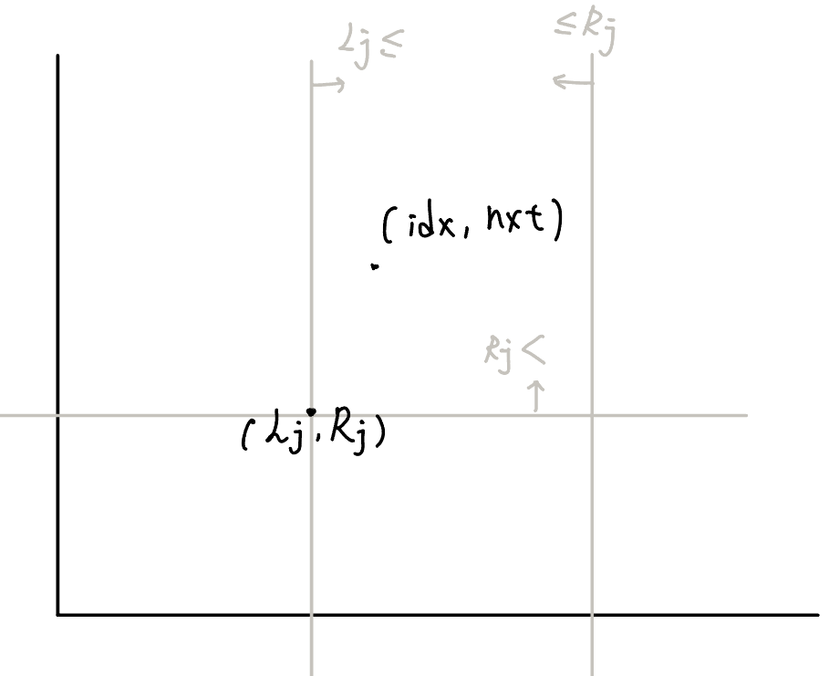
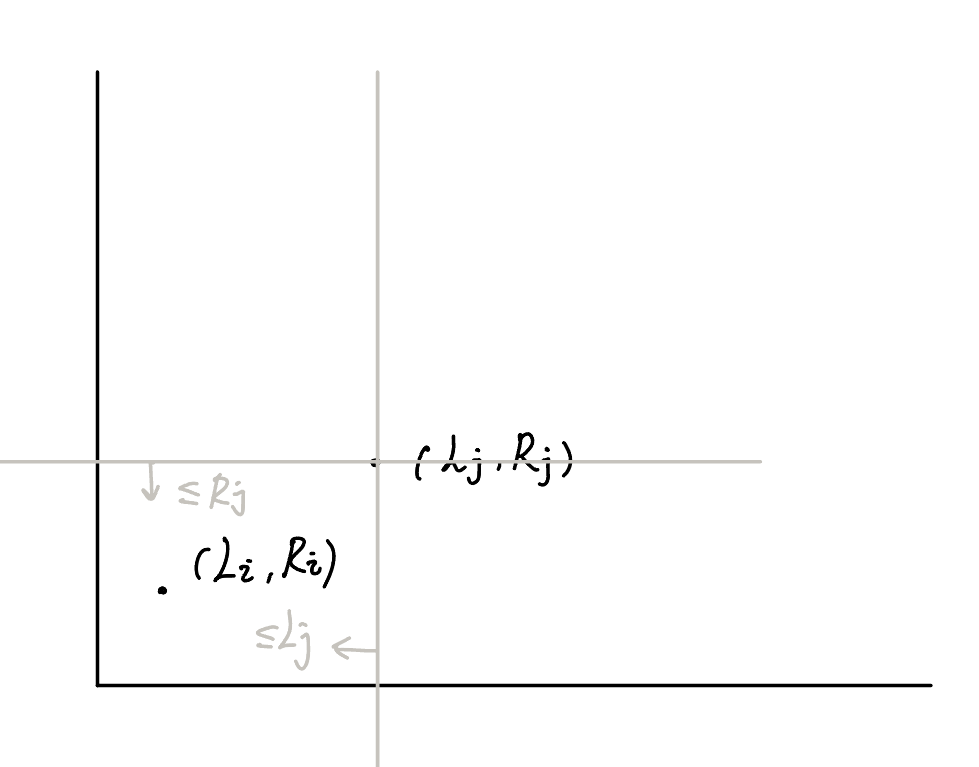

## 模板

按照值域進行分治，並非 index

### 非嚴格

???+ note "[洛谷 P3810 三维偏序](https://www.luogu.com.cn/problem/P3810)"
    給 $n$ 個三維空間的點 $(x,y,z)$，問對於第 $i$ 個點，有幾個 $j$ 滿足 $x_j\ge x_i,y_j\ge y_i,z_j\ge z_i$
    
    ??? note "code"
    	```cpp linenums="1"
    	#include <bits/stdc++.h>
        #define int long long
        #define pii pair<int, int>
        #define pb push_back
        #define mk make_pair
        #define lowbit(x) (x & (-x))
        #define F first
        #define S second
        #define ALL(x) x.begin(), x.end()
    
        using namespace std;
        using PQ = priority_queue<int, vector<int>, greater<int>>;
    
        const int INF = 2e18;
        const int maxn = 3e5 + 5;
        const int M = 1e9 + 7;
    
        int n, C;
        int ans[maxn];
    
        struct triple {
            int a, b, c, cnt, res;
    
            bool operator== (triple &other) {
                if (a == other.a && b == other.b && c == other.c)
                    return true;
                return false;
            }
        } a[maxn];
    
        int cmpA (triple A, triple B) {
            if (A.a != B.a) return A.a < B.a;
            if (A.b != B.b) return A.b < B.b;
            return A.c < B.c;
        }
    
        int cmpB (triple A, triple B) {
            if (A.b != B.b) return A.b < B.b;
            return A.c < B.c;
        }
    
        struct BIT {
            int n;
            vector<int> bit;
    
            void init (int _n) {
                n = _n;
                bit.resize (n + 1);
            }
    
            void add (int x, int d) {
                while (x <= n) {
                    bit[x] += d;
                    x += lowbit (x);
                }
            }
    
            int query (int x) {
                int ret = 0;
                while (x > 0) {
                    ret += bit[x];
                    x -= lowbit (x);
                }
                return ret;
            }
        } bit;
    
        void CDQ (int l, int r) {
            if (l == r) return;
    
            int mid = (l + r) / 2;
            CDQ (l, mid), CDQ (mid + 1, r);
    
            sort (a + l, a + mid + 1, cmpB);
            sort (a + mid + 1, a + r + 1, cmpB);
    
            int i = l, j = mid + 1;
            while (j <= r) {
                while (i <= mid && a[i].b <= a[j].b) {
                    bit.add (a[i].c, a[i].cnt);
                    i++;
                }
                a[j].res += bit.query (a[j].c);
                j++;
            }   
    
            // undo
            for (int k = l; k < i; k++) {
                bit.add (a[k].c, -a[k].cnt);
            }
            return;
        }
    
        void solve () {
            cin >> n >> C;
    
            vector<triple> tmp (n);
            for (int i = 0; i < n; i++) {
                cin >> tmp[i].a >> tmp[i].b >> tmp[i].c;
            }
            sort (ALL (tmp), cmpA);
    
            int m = 0, cnt = 0;
            for (int i = 0; i < n; i++) {
                if (i && tmp[i] == tmp[i - 1]) {
                    a[m].cnt++;
                }
                else {
                    m++;
                    a[m].a = tmp[i].a;
                    a[m].b = tmp[i].b;
                    a[m].c = tmp[i].c;
                    a[m].cnt = 1;
                } 
            }
            bit.init (C);


            CDQ (1, m);
            for (int i = 1; i <= m; i++) ans[a[i].res + a[i].cnt - 1] += a[i].cnt;
    
            for (int i = 0; i < n; i++) cout << ans[i] << "\n"; 
        } 
    
        signed main() {
            // ios::sync_with_stdio(0);
            // cin.tie(0);
            int t = 1;
            //cin >> t;
            while (t--) {
                solve();
            }
        } 
        ```


### 嚴格

???+ note "[Zerojudge c571.三維偏序](https://zerojudge.tw/ShowProblem?problemid=c571)"
    給 $n$ 個三維空間的點 $(x,y,z)$，問對於第 $i$ 個點，有幾個 $j$ 滿足 $x_j>x_i,y_j>y_i,z_j>z_i$
    
    ??? note "code"
     	```cpp linenums="1"
     	#include <bits/stdc++.h>
        #define int long long
        #define pii pair<int, int>
        #define pb push_back
        #define mk make_pair
        #define F first
        #define S second
        #define ALL(x) x.begin(), x.end()
        #define lowbit(x) (x & (-x))
    
        using namespace std;
    
        const int INF = 2e18;
        const int maxn = 3e5 + 5;
        const int M = 1e9 + 7;
    
        struct triple {
            int x, y, z, id;
        };
    
        struct BIT {
            int n;
            vector<int> bit;
    
            void init (int _n) {
                n = _n;
                bit.resize (n + 1);
            }
    
            void add (int x, int d) {
                x++;
                while (x > 0) {
                    bit[x] += d;
                    x -= lowbit (x);
                }
            }
    
            int query (int x) {
                x++;
                int ret = 0;
                while (x <= n) {
                    ret += bit[x];
                    x += lowbit (x);
                }
                return ret;
            }
        }bit;
    
        bool cmpX (triple &A, triple &B) {
            if (A.x != B.x) return A.x < B.x;
            if (A.y != B.y) return A.y > B.y;
            return A.z > B.z;
        }
    
        bool cmpY (triple &A, triple &B) {
            if (A.y != B.y) return A.y > B.y;
            return A.z > B.z;
        }
    
        int n;
        int ans[maxn];
    
        void solve (int l, int r, vector<triple> &a) {
            int mid = (l + r) / 2;
            if (l == r) return;


            vector<triple> aLeft, aRight;
            for (auto [x, y ,z, id] : a) {
                if (x <= mid) aLeft.pb ({x, y, z, id});
                else aRight.pb ({x, y, z, id});
            }
            solve (l, mid, aLeft); solve (mid + 1, r, aRight);
    
            sort (ALL (aLeft), cmpY); sort (ALL (aRight), cmpY);
    
            int i = 0, j = 0;
            while (i < aLeft.size ()) {
                while (j < aRight.size () && aRight[j].y > aLeft[i].y) {
                    bit.add (aRight[j].z, 1);
                    j++;
                }
                ans[aLeft[i].id] += bit.query (aLeft[i].z + 1);
                i++;
            }
    
            for (int k = 0; k < j; k++) {
                bit.add (aRight[k].z, -1);
            }
        }
    
        vector<triple> a;
    
        void init () {
            cin >> n;
            a.resize (n);
    
            for (int i = 0; i < n; i++) {
                cin >> a[i].x >> a[i].y >> a[i].z;
                a[i].id = i;
                a[i].x--, a[i].y--, a[i].z--;
            }
        }
    
        void work () {
            sort (ALL (a), cmpX);
    
            bit.init (n);
            solve (0, n - 1, a);
            for (int i = 0; i < n; i++) {
                cout << ans[i] << "\n";
            }
        } 
    
        signed main() {
            ios::sync_with_stdio(0);
            cin.tie(0);
            int t = 1;
            //cin >> t;
            while (t--) {
                init();
                work();
            }
        } 
        ```

## 例題
### 矩形加矩形求和
???+note "[CSES Forest Queries II](https://cses.fi/problemset/task/1739)"
	在二維平面上，支持以下操作
	
	- 支持在一個矩形區域內加一個數字
	
	- 每次詢問一個矩形區域的和
	
	??? note "思路"
		「詢問一個矩形區域的和」可以看做是四個詢問 $(x_i,y_i)$ 的數值總和
		
		$$\small ans=sum(x_2,y_2)-sum(x_1-1,y_2)-sum(x_2,y_1-1)+sum(x_1-1,x_2-1)$$
	    
	    那要怎麼維護操作先後順序呢 ? 我們可以多加一為 $z$ 表示此操作的時間戳記，問題就變成
	    
	    給定一個 $(x_i,y_i,z_i)$ 詢問 $\begin{cases}x_j \le x_i \\ y_j \le y_i \\ z_j \le z_i \end{cases}$ 的權值總和
	
	??? note "code"
		```cpp linenums="1"
		#include <algorithm>
	    #include <cassert>
	    #include <iostream>
	    #include <utility>
	    #include <vector>
	
	    #define int long long
	    #define pii pair<int, int>
	    #define pb push_back
	    #define mk make_pair
	    #define F first
	    #define S second
	    #define lowbit(x) (x & (-x))
	    #define ALL(x) x.begin(), x.end()
	
	    using namespace std;
	
	    const int maxn = 3e5 + 5;
	
	    int n, q;
	    int ans[maxn], op[maxn];
	    int g[1005][1005], pre[1005][1005];
	
	    struct triple {
	        int a, b, c, cnt, x, id;
	        // (z, x, y), cnt, multiply, org qry idx
	    };
	
	    vector<triple> a;
	    int t = 0;
	
	    void add_event(int i, int j, int cnt, int x, int id) {
	        if (i <= 0) return;
	        if (j <= 0) return;
	        a.pb({t++, i, j, cnt, x, id});
	    }
	
	    int cmpA(const triple &A, const triple &B) {
	        if (A.a != B.a) return A.a < B.a;
	        if (A.b != B.b) return A.b < B.b;
	        return A.c < B.c;
	    }
	
	    int cmpB(const triple &A, const triple &B) {
	        if (A.b != B.b) return A.b < B.b;
	        return A.c < B.c;
	    }
	
	    struct BIT {
	        vector<int> bit;
	        int n;
	
	        void init(int _n) {
	            n = _n;
	            bit.resize(n + 1);
	        }
	
	        void add(int x, int d) {
	            assert(x != 0);
	            while (x <= n) {
	                bit[x] += d;
	                x += lowbit(x);
	            }
	        }
	
	        int query(int x) {
	            int ret = 0;
	            while (x > 0) {
	                ret += bit[x];
	                x -= lowbit(x);
	            }
	            return ret;
	        }
	    } bit;
	
	    void CDQ(int l, int r) {
	        if (l == r) return;
	        // cout << l << ' ' << r << endl;
	
	        int mid = (l + r) / 2;
	        CDQ(l, mid);
	        CDQ(mid + 1, r);
	        // sort(a.begin() + l, a.begin() + mid + 1, cmpB);
	        // sort(a.begin() + mid + 1, a.begin() + r + 1, cmpB);
	
	        int i = l;
	        for (int j = mid + 1; j <= r; j++) {
	            while (i <= mid && a[i].b <= a[j].b) {
	                bit.add(a[i].c, a[i].cnt);
	                i++;
	            }
	
	            ans[a[j].id] += a[j].x * bit.query(a[j].c);
	        }
	
	        for (int k = l; k < i; k++) {
	            bit.add(a[k].c, -a[k].cnt);
	        }
	
	        inplace_merge(a.begin() + l, a.begin() + mid + 1, a.begin() + r + 1, cmpB);
	    }
	
	    void solve() {
	        cin >> n >> q;
	
	        for (int i = 1; i <= n; i++) {
	            for (int j = 1; j <= n; j++) {
	                char c;
	                cin >> c;
	                if (c == '*') {
	                    g[i][j] = 1;
	                    pre[i][j]++;
	                }
	            }
	        }
	
	        for (int i = 1; i <= n; i++) {
	            for (int j = 1; j <= n; j++) {
	                pre[i][j] =
	                    pre[i][j] + pre[i - 1][j] + pre[i][j - 1] - pre[i - 1][j - 1];
	                // cout << "i:" << i << ",j:" << j << ",pre:" << pre[i][j] << "\n";
	            }
	        }
	
	        for (int cs = 1; cs <= q; cs++) {
	            cin >> op[cs];
	            if (op[cs] == 1) {
	                int i, j;
	                cin >> i >> j;
	
	                if (g[i][j] == 1) {
	                    add_event(i, j, -1, 0, 0);
	                    g[i][j] = 0;
	                } else {
	                    add_event(i, j, +1, 0, 0);
	                    g[i][j] = 1;
	                }
	            } else {
	                int i1, i2, j1, j2;
	                cin >> i1 >> j1 >> i2 >> j2;
	                i1--, j1--;
	                add_event(i2, j2, 0, +1, cs);
	                add_event(i1, j2, 0, -1, cs);
	                add_event(i2, j1, 0, -1, cs);
	                add_event(i1, j1, 0, +1, cs);
	                ans[cs] += pre[i2][j2] - pre[i1][j2] - pre[i2][j1] + pre[i1][j1];
	            }
	        }
	
	        sort(ALL(a), cmpA);
	
	        bit.init(1024);
	        CDQ(0, (int)a.size() - 1);
	
	        for (int i = 1; i <= q; i++) {
	            if (op[i] == 1) continue;
	
	            cout << ans[i] << '\n';
	        }
	    }
	
	    signed main() {
	        ios::sync_with_stdio(0);
	        cin.tie(0);
	
	        solve();
	    }
	    ```

- 類似題 : [APIO 2019 路燈](https://loj.ac/p/3146)


### NPSC 忙碌的國度
???+note "[NPSC 2019 高中組 pB. 忙碌的國度](https://contest.cc.ntu.edu.tw/npsc2019/teamclient/final-senior.pdf)"
	有 $n$ 間公司和 $m$ 間餐廳，每個員工有位置 $(x_i,y_i)$ 和下班時間 $t_i$，每間餐廳有位置 $(p_i,q_i)$，關閉時間 $c_i$ 和美味程度 $v_i$
	
    第 $i$ 個人可以吃到第 $j$ 個餐廳必須滿足
    
    $$ t_i + |p_j − x_i| + |q_j − y_i| \le c_j$$
    
    問對每個員工能吃到的餐廳(最多一間)的最大美味程度
    
    ??? note "思路"
    	假設 $\begin{cases} p_j \le x_i \\ q_j \le y_i \end{cases}$ 那我們可將式子拆成
    	
    	$$\begin{align}& t_i + (x_i - p_j) + (y_i − q_i) \le c_j \\ \Rightarrow\space & t_i + x_i  + y_i \le p_j + q_j + c_j\end{align}$$
    	
    	兩點即變成 $(x,y,z)=\begin{cases}(x_i, \space y_i,\space  t_i + x_i  + y_i) \\ (p_j,\space q_j,\space  p_j + q_j + c_j) \end{cases}$
    	
    	問題就變成給 $(x_i,y_i,z_i)$ 問 
    	
    	$$\large \max\limits_{x_j \space \le  \space x_i \space \wedge\space  y_j \space \le \space y_i \space \wedge \space z_j \space \ge \space z_i} \{v_j \}$$
    	
    	另外 3 種大小關西也同理

### 全國賽 百萬刮刮樂

???+note "[2022 全國賽 pF. 百萬刮刮樂](https://sorahisa-rank.github.io/nhspc-fin/2022/problems.pdf#page=17)"
	給定 $(a_i,b_i,c_i)$ 與 $w_i$ 問對於所有**相異**且符合以下條件的 $i,j$， $w_i+w_j$ 可能是多少
	
	$$\begin{cases}w_i+w_j\le a_i + a_j \\ w_i+w_j\le b_i + b_j \\ w_i + w_j \le c_i+c_j\end{cases}$$
	
	<li>$1\le n \le 2\times 10^5$<br>
	<li>$0\le a_i,b_i,c_i \le 6\times 10^6$<br>
	<li>$w_i \in \{10^6,2\times 10^6, 3\times 10^6\}$<br>
	
	??? note "思路"
		> 法 1 : CDQ 分治
		
		$$\begin{cases}w_j - a_j\le -w_i + a_i \\ w_j - b_j\le -w_i + b_i \\ w_j - c_j \le -w_i + c_i\end{cases} \Rightarrow \begin{cases}x_j\le -x_i \\ y_j \le -y_i \\ z_j \le -z_i \end{cases}$$
		
		所以對於符合 $\begin{cases}x_j\le -x_i \\ y_j \le -y_i \\ z_j \le -z_i \end{cases}$ 的這些 $j$ 我們可以去看 
		
		記得要特判 $w_i=w_j$ 的 case，可以預先在 ans[i] 裡消除其貢獻
		
		時間複雜度 : $O(n\log^2 n)$
		
		> 法 2 : 線段樹維護
		
		另一種方法也差不多，我們先分別枚舉好 $w_i,w_j$ 的值
		
		問題就變成找對於每個 $i$ **有沒有** $j$ 符合 $\begin{cases}x_j\le -x_i \\ y_j \le -y_i \\ z_j \le -z_i \end{cases}$ 的就好
		
		所以我們可以直接將用掃描線從左到右掃，然後對於 $(-x_i,-y_i,-z_i)$ 要去 
	    
	    $$\texttt{query_min} (-y_i)$$ 
		
		就是看之前 $y_j \le -y_i$ 的最小 $z_j$ **有幾個**
		
		$w_i=w_j$ 時也需預先扣掉自己的貢獻
		
		<figure markdown>
	      { width="400" }
	    </figure>
		
		時間複雜度 : $O(n\log n)$
		
		> 法 3 : 線段樹維護 by twpca
		
		每張卡片的 W 值只有幾種可能而已，可以枚舉所有可能的 W<sub>x</sub> + W<sub>y</sub>， 把問題從最大化的問題變成判定性問題。
	
		給一個中獎金額 C，目前所有的彩券有沒有辦法湊到這個中獎金額？ 重新整理題目的條件變成：
	
	    - A<sub>x</sub> + A<sub>y</sub> ≥ C
	
	    - B<sub>x</sub> + B<sub>y</sub> ≥ C
	
	    - C<sub>x</sub> + C<sub>y</sub> ≥ C
		
		那就可以
		
		- A: 預先排序用雙指針維護
		
	    - B: 作為樹狀結構的 index 區間查詢
	    
	    - C: 作為樹狀結構的 value 查詢區間最大值
	    
	    因為每個 tuple 的 W<sub>i</sub> 可能不同，所以可能需要兩棵線段樹

        時間複雜度 : $O(n\log n)$

### TIOJ 2030

???+note "[TIOJ 2030.盩僰麌過街 人人喊打](https://tioj.ck.tp.edu.tw/problems/2030)"
	給你長度為 $N$ 的序列 $a_1\sim a_N$，請支援 $Q$ 次以下操作 :
	
	- $1\space p\space v:$ 把 $a_p$ 改成 $v$
	
	- $2\space L\space R\space V:$ 設置一道雷射光在 $[L,R]$，強度為 $V$，保證之前沒有左界在 $L$ 的雷射光
	
	- $3\space L:$ 移除左界在 $L$ 的雷射光，保證之前有一個左界在 $L$ 的雷射光
	
	- $4\space L\space R:$ 計算 $[L,R]$ 之間的不重複數字，以及 $[L,R]$ 之間所有被完全覆蓋在內的雷射光強度總和
	
	$N,Q\le 10^5$
	
	??? note "思路"
		
		$(L_j,R_j,t_j)$
		
		更改想成兩個步驟，消除 $a_p$ 的貢獻，加入 $v$ 的貢獻
		
		$-a_p$ :
		
		存 $(idx,nxt,t_i),-1:$ 
		
		index, 在之前 $a_p$ 出現的那個時刻下一次出現的位置, 現在的時間戳記 
		
		$$\begin{cases}L_j \le idx\\ idx \le R_j \\ t_i < t_j \\ nxt > R_j \end{cases}$$
		
		改成 $v:$
		
		存 $(idx,nxt,t_i),+1:$ 
		
		index, 在現在 $v$ 下一次出現的位置, 現在的時間戳記 
		
		$$\begin{cases}L_j \le idx\\ idx \le R_j \\ t_i < t_j \\ nxt > R_j \end{cases}$$
		
		<figure markdown>
	      { width="300" }
	    </figure>
		
		$+(L_i, R_i, t_i),+V:$ 加入的時刻
		
		$-(L_i, R_i, t_i),-V:$ 加入的時刻
		
		$$\begin{cases}t_j > t_i\\ L_j \ge L_i \\ R_i \ge R_j\end{cases}$$
		
		<figure markdown>
	      { width="300" }
	    </figure>


### 洛谷 动态逆序对

???+note "[洛谷 P3157 [CQOI2011]动态逆序对](https://www.luogu.com.cn/problem/P3157)"
	現在給出 $1\sim n$ 的一個排列，按照某種順序依次刪除 $m$ 個元素
	
	在每次刪除一個元素之前統計整個序列的逆序數對的個數
	
	$n\le 10^5,m\le 5\times 10^4$
	
	??? note "思路"
		
		對於初始的陣列，我們的 tuple 就是 $(i,a_i,t_i=1),+1$
		
		然後先算好逆序數對個數
		
		再來對每一次的刪除，我們先 query$(i,a_i,t_i)$，然後加入 tuple $(i,a_i,t_i),-1$
		
		對於每個 query $(i,a_i,t_i)$ 我要算那些 $j$ 滿足 $\begin{cases}i<j\\ a_i > a_j \\ t_i \ge t_j\end{cases}$
