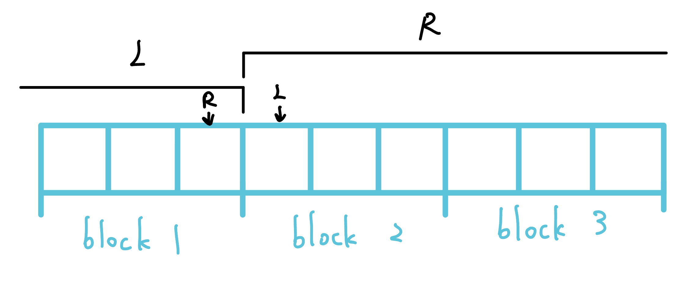

## 介紹

### 將 query 排序

分成 sqrt(n) 個 block

每筆 Query 按照 : 

1. 左界所屬 Block 從小排至大

2. 若左界 block 相同，則將右界從小排至大

???+note "code"
	```cpp linenums="1"
	struct Query {
        int l, r, block_id;

        bool operator<(const Query &rhs) const {
            if (block_id != rhs.block_id) {
                return block_id < rhs.block_id;
            } else {
                return r < rhs.r;
            }
        }
    };
    ```

### 暴力移動 pointer

注意先擴大（add），再縮小（del）[^1]

???+note "code"
	```cpp linenums="1"
	int l = -1, r = 0;
	for (auto &i : Query) {
		while (l > i.l) add(--l);
		while (r > i.r) add(++r);
		while (l < i.l) del(l++);
		while (r > i.r) del(r--);
	}
	```

### 維護 data structure

- O(1) 新增/刪除

- O(sqrt(n)) 查詢

    - 總和
    - x 出現的次數
    - mode
    - 第 k 小

### 複雜度

- left pointer

    - 同塊 : 同個 block 裡面 l 最多移動 sqrt(n) 格，O(Q * sqrt(n))
    - 不同 : 不同 block 之間的總移動距離為 O(N)

- right pointer

    - 同塊 : 每個 block 裡面 r 最多會移動 N 格，共 sqrt(N) 個 block，O(N * sqrt(N))
    - 不同 : 換 block 最多 sqrt(N) 次，每次最多移動 N 格，O(N * sqrt(N))

每 k 個當一個 block :

- left: 同個 block 每次移動 k，共 Q 次 ⇒ O(Q * k)

- right: N / k 個 block，每個 block O(N) ⇒ O(N * (N / k))

## 題目

把問題轉換換成 add, del, query，其中讓 add, del 快，query 慢

???+note "[CF 86 D. Powerful Array](https://codeforces.com/problemset/problem/86/D)"

	給一個長度為 $n$ 的陣列 $a_1,\ldots ,a_n$，有 $q$ 筆詢問 :
	
	- 給一個區間 $[l,r]$，將區間內每種數字與其出現的次數平方的乘積加總後輸出
	
	$n,q\le 2\times 10^5,1\le a_i \le 10^6$
	
	??? note "思路"

???+note "[Zerojudge b417. 區間眾數](https://zerojudge.tw/ShowProblem?problemid=b417)"
	給一個長度為 $n$ 的陣列 $a_1,\ldots ,a_n$，$q$ 次詢問一個區間的 :
	
	- 眾數出現的次數
	
	- 多少種數字可當眾數
	
	$n\le 10^5,q\le 10^6$
	
	??? note "思路"
		- freq[i] : i 出現次數
	
	    - cnt[i] : 幾種數字的出現次數為 i
	
	    - mode : 眾數的出現次數
		
	??? note "code"
		```cpp linenums="1"
		#include <bits/stdc++.h>
	    #define int long long
	    #define pii pair<int, int>
	    #define mk make_pair
	    #define pb push_back
	    using namespace std;
	
	    const int maxn = 1e5 + 5;
	    int cnt[maxn], freq[maxn], a[maxn], mode;
	    int n, q;
	
	    struct Query {
	        int l, r, block_id, query_id;
	
	        bool operator<(const Query &rhs) const {
	            if (block_id != rhs.block_id) {
	                return block_id < rhs.block_id;
	            } else {
	                return r < rhs.r;
	            }
	        }
	    };
	
	    void add(int x) {
	        cnt[freq[x]]--;
	        freq[x]++;
	        cnt[freq[x]]++;
	        if (freq[x] > mode) mode = freq[x];
	    }
	
	    void del(int x) {
	        cnt[freq[x]]--;
	        freq[x]--;
	        cnt[freq[x]]++;
	        if (cnt[mode] == 0) mode--;
	    }
	
	    signed main() {
	        cin >> n >> q;
	        vector<Query> query;
	        for (int i = 0; i < n; i++) {
	            cin >> a[i];
	        }
	        int lb, rb;
	        int k = sqrt(n);
	        for (int i = 0; i < q; i++) {
	            cin >> lb >> rb;
	            lb--, rb--;
	            query.pb({lb, rb, lb / k, i});
	        }
	        sort(query.begin(), query.end());
	
	        int l = 0, r = -1;
	        vector<pii> ans(q);
	        for (int i = 0; i < q; i++) {
	            Query now = query[i];
	
	            while (l > now.l) add(a[--l]);
	            while (r < now.r) add(a[++r]);
	            while (l < now.l) del(a[l++]);
	            while (r > now.r) del(a[r--]);
	
	            ans[now.query_id] = {mode, cnt[mode]};
	        } 
	
	        for (auto &p : ans) {
	            cout << p.first << " " << p.second << "\n";
	        }
	    }
	    ```

???+note "[LOJ #6285. 数列分块入门 9](https://loj.ac/p/6285)"
	給一個長度為 $n$ 的陣列 $a_1,\ldots ,a_n$，$n$ 次詢問一個區間的最小眾數

	$n\le 10^5$
	
	??? note "思路"
		離散化，預處理 dp[i][j] = block(i) ~ block(j) 的眾數，可以枚舉 i 然後 O(n) 做下去，時間複雜度 O(n * sqrt(n))，當預到一個 query(l, r) 時，可以分成 l ~ r 之間的完整 block，與左右不完整的 block 來做，完整 block 直接查表，不完整 block 直接暴力跑即可，過程中要檢查 l r 之間 x 出現的次數可用 vector[x] 存 x 出現的 index 然後去 lower bound，複雜度 O(q * sqrt(n) * log n)
		
		> 參考 : <https://blog.csdn.net/hypHuangYanPing/article/details/81260095>

???+note "[LOJ #6762. 「THUPC 2021」本质不同逆序对](https://loj.ac/p/6762)"
	給一個長度為 $n$ 的陣列 $a_1,\ldots ,a_n$，$q$ 次詢問一個區間的逆序數對數量

	$n\le 10^5,m\le 5\times 10^5$

CSES - Distinct Value Query (多種作法)
TIOJ 1699 Problem I 害蟲決戰時刻
atcoder ABC 174 F
codeforces 86 D

## 帶修改莫隊

### 介紹

把詢問的區間 [l, r] 擴充時間這個維度 ⇒ (l, r, t)。(l, r, t) 可以翻譯為「在詢問 [l, r] 之前要先處理 0~t 的修改」，排序跟普通莫隊不太一樣，是 L_block → **R_block** → t

???+note "struct code"
	```cpp linenums="1"
	struct Query {
        int l, r, t, l_block, r_block, qid;

        bool operator<(const Query &rhs) const {
            if (l_block == rhs.l_block) {
                if (r_block == rhs.r_block) {
                    return t < rhs.t;
                } else {
                    return r_block < rhs.r_block;
                }
            } 
            return l_block < rhs.l_block;
        }
    };
    ```

??? info "時間複雜度為 $O(n^{\frac{5}{3}})$"
	相當於 $n \times n\times n$ 的三維空間，放 $n$ 個點，找一個路徑經過所有點移動距離最小值最差是多少呢？
	
	一個維度放 $n^{1/3}$ 個，每個維度的長度是 $n$，所以間距取 $n / n^{1/3} = n^{2/3}$。共要走 $n - 1$ 邊，每邊長 $n^{2/3}$，所以是 $O(n \times n^{2/3}) = O(n^{5/3})$。
	
	Block 的大小可以取 $n^{2/3}$，讓每個維度的數量最平均
	
	> 此證明不嚴謹，若要嚴謹證明可見[莫队时间复杂度和块长分析](https://zhuanlan.zhihu.com/p/595026012)

### 指針移動

當 updates 有影響到當前 [ql, qr] 的話，才需要 add, del，不然就直接修改陣列上的元素即可

???+note "code"
	```cpp linenums="1"
	int l = 0, r = -1, t = -1;
    for (auto [ql, qr, qt, l_block, r_block, qid] : query) {
        while (ql < l) ds.add(--l);
        while (r < qr) ds.add(++r);
        while (l < ql) ds.del(l++);
        while (qr < r) ds.del(r--);
        while (t < qt) ds.modify_add(ql, qr, ++t);
        while (t > qt) ds.modify_del(ql, qr, t--);
        ans[qid] = ds.ans;
    }
	```

???+note "[CF 940 F. Machine Learning](https://codeforces.com/problemset/problem/940/F)"
	給一個長度為 $n$ 個陣列 $a_1,\ldots ,a_n$，有以下 $q$ 個操作 :
	
	- $\text{mex}(l,r):$ 輸出區間數字出現次數的 mex
	
	- $\text{update}(i,x):$ 將 $a_i$ 改成 $x$
	
	$n,q\le 10^5,1\le a_i \le 10^9$

???+note "[洛谷 P1903 [国家集训队] 数颜色 / 维护队列](https://www.luogu.com.cn/problem/P1903)"
	給一個長度為 $n$ 的陣列 $a_1,\ldots ,a_n$，q 筆以下操作： 
	
	- 單點改值 
	
	- 問區間 $[l, r]$ 中 distinct number 數量
	
	$n,q\le 1.4 \times 10^5$
	
	??? note "code"
		```cpp linenums="1"
		#include <bits/stdc++.h>
	    #define int long long
	    #define pii pair<int, int>
	    #define pb push_back
	    #define mk make_pair
	    #define F first
	    #define S second
	    #define ALL(x) x.begin(), x.end()
	
	    using namespace std;
	
	    const int INF = 2e18;
	    const int maxn = 1e6 + 5;
	    const int M = 1e9 + 7;
	
	    struct Query {
	        int l, r, t, l_block, r_block, qid;
	
	        bool operator<(const Query &rhs) const {
	            if (l_block == rhs.l_block) {
	                if (r_block == rhs.r_block) {
	                    return t < rhs.t;
	                } else {
	                    return r_block < rhs.r_block;
	                }
	            } 
	            return l_block < rhs.l_block;
	        }
	    };
	
	    int n, q;
	    int ans[maxn];
	    vector<Query> query;
	
	    struct DS {
	        static const int N = 1e6 + 5;
	        int ans = 0;
	        vector<int> cnt;
	        vector<int> a;
	        vector<pii> updates;
	        stack<pii> stk;
	
	        DS(vector<int> b) {
	            cnt.resize(N);
	            a = b;
	        }
	
	        void add_event(int idx, int val) {
	            updates.pb({idx, val});
	        }
	        void add(int x) {
	            x = a[x];
	            if (cnt[x] == 0) {
	                ans++;
	            }
	            cnt[x]++;
	        }
	        void del(int x) {
	            x = a[x];
	            cnt[x]--;
	            assert(cnt[x] >= 0);
	            if (cnt[x] == 0) {
	                ans--;
	            }
	        }
	        void modify_add(int l, int r, int t) {
	            auto [idx, val] = updates[t];
	            if (l <= idx && idx <= r) {
	                stk.push({idx, a[idx]});
	                del(idx);
	                a[idx] = val;
	                add(idx);
	            } else {
	                stk.push({idx, a[idx]});
	                a[idx] = val;
	            }
	        }
	        void modify_del(int l, int r, int t) {
	            assert(stk.size());
	            auto [idx, val] = stk.top();
	            stk.pop();
	            if (l <= idx && idx <= r) {
	                del(idx);
	                a[idx] = val;
	                add(idx);
	            } else {
	                a[idx] = val;
	            }
	        } 
	    };
	
	    signed main() {
	        ios::sync_with_stdio(0);
	        cin.tie(0);
	        cin >> n >> q;
	        int k = pow(n, (double)2/(double)3);
	        vector<int> a(n);
	        for (int i = 0; i < n; i++) {
	            cin >> a[i];
	        }
	
	        DS ds(a);
	        int uid = -1, qid = -1;
	        for (int i = 0; i < q; i++) {
	            char c;
	            cin >> c;
	            if (c == 'R') {
	                int idx, val;
	                cin >> idx >> val;
	                idx--;
	                uid++;
	                ds.add_event(idx, val);
	            } else if (c == 'Q') {
	                int l, r;
	                cin >> l >> r;
	                l--, r--;
	                qid++;
	                query.pb({l, r, uid, l / k, r / k, qid});
	            }
	        }
	        sort(ALL(query));
	        int l = 0, r = -1, t = -1;
	        for (auto [ql, qr, qt, l_block, r_block, qid] : query) {
	            while (ql < l) ds.add(--l);
	            while (r < qr) ds.add(++r);
	            while (l < ql) ds.del(l++);
	            while (qr < r) ds.del(r--);
	            while (t < qt) ds.modify_add(ql, qr, ++t);
	            while (t > qt) ds.modify_del(ql, qr, t--);
	            ans[qid] = ds.ans;
	        }
	        for (int i = 0; i <= qid; i++) {
	            cout << ans[i] << '\n';
	        }
	    } 
	    ```

## 回滾莫隊

可處理加值易，刪除難的問題。一個典型的例子就是區間最值。添加時，我仍然可以只看新加進來的數，將其與目前的最值比較，但由於 ans 是單個值，一旦刪除時把最值給刪了，那麼我們就又得重新枚舉區間。

回滾莫隊的思想，就是把所有刪除操作給去掉（當然，如果是添加操作不好處理，回滾莫隊則是把所有添加操作去掉）

### 算法

初始化 : 

- L 在 block 的右端點加 1
- R 在 block 的右端點
- 將同一個 block 內的按照 r 小到大排序（相反則為大到小）

<figure markdown>
  { width="500" }
</figure>

如果詢問的 ql, qr 所屬的塊相同，那麼暴力掃描區間回答詢問

如果詢問的左右端點所屬的塊不同：

-   不斷將 R 擴展到 qr
-   不斷將 L 擴展到 ql
-   回答詢問
-   將 L rollback 回 block 的右端點加 1

最後要到下一個 block 的時候，再將 R 給 rollback 回來，然後一樣初始化 L, R，...

### 複雜度

假設回滾莫隊的分塊大小是 $k$： 

- 對於左、右端點在同一個塊內的詢問，可以在 $O(k)$ 時間內計算

- 對於其他詢問，考慮左端點在相同塊內的詢問，它們的右端點單調遞增，移動右端點的時間複雜度是 $O(n)$，而左端點單次詢問的移動不超過 $k$，因為有 $\displaystyle \frac{n}{k}$ 個塊，所以總複雜度是 $\displaystyle O(qk+\frac{n^2}{k})$，取 $\displaystyle k=\frac{n}{\sqrt {q}}$ 最優，時間複雜度為 $O(n\sqrt{q})$。

???+note "[JOISC 2014 Day1 历史研究](https://loj.ac/p/2874)"
	給一個長度為 $n$ 的陣列 $a_1,\ldots ,a_n$ 和 $q$ 筆詢問，每次詢問一個區間 $[l, r]$ 內重要度最大的數字，要求輸出其重要度。一個數字 $x$ 重要度的定義為 $x$ 乘上 $x$ 在區間內出現的次數。
	
	$1\le n,m\le 10^5,1\le a_i\le 10^9$
	
	??? note "思路"
		回滾莫隊，過程中在 add 維護答案並更新答案，del 只維護答案（見代碼）
		
	??? note "code"
		```cpp linenums="1"
		#include <bits/stdc++.h>
	    #define int long long
	    #define pii pair<int, int>
	    #define pb push_back
	    #define mk make_pair
	    #define F first
	    #define S second
	    #define ALL(x) x.begin(), x.end()
	
	    using namespace std;
	
	    const int INF = 2e18;
	    const int maxn = 3e5 + 5;
	    const int M = 1e9 + 7;
	
	    struct Query {
	        int l, r, l_block, r_block, qid;
	
	        bool operator<(const Query &rhs) const {
	            if (l_block == rhs.l_block) {
	                return r < rhs.r;
	            }
	            return l_block < rhs.l_block;
	        }
	    };
	
	    int n, q, k;
	    vector<int> a, b;
	    vector<Query> query;
	    int cnt[maxn], L[maxn], R[maxn], ans[maxn];
	
	    void add(int x, int &ans) {
	        cnt[x]++;
	        ans = max(ans, cnt[x] * b[x]);
	    }
	
	    void del(int x) {
	        cnt[x]--;
	    }
	
	    void init() {
	        cin >> n >> q;
	
	        a = vector<int>(n);
	        b = vector<int>(n);
	        for (int i = 0; i < n; i++) {
	            cin >> a[i];
	            b[i] = a[i];
	        }
	        sort(ALL(b));
	        b.resize(unique(ALL(b)) - b.begin());
	
	        for (int i = 0; i < n; i++) {
	            a[i] = lower_bound(ALL(b), a[i]) - b.begin();
	        }
	        k = sqrt(n);
	        int l, r;
	        for (int i = 0; i < q; i++) {
	            cin >> l >> r;
	            l--, r--;
	            query.pb({l, r, l / k, r / k, i});
	        }
	        sort(ALL(query));
	
	        // 為了方便, 先預處理好每個 block 的左右界
	        int tot = n / k;
	        for (int i = 0; i < tot; i++) {
	            L[i] = i * k;
	            R[i] = (i + 1) * k - 1;
	        }
	        if (R[tot - 1] < n - 1) {
	            tot++;
	            L[tot - 1] = R[tot - 2] + 1;
	            R[tot - 1] = n - 1;
	        }
	    }
	
	    void solve() {
	        int l = 0, r = -1, last_block = -1, res = 0;
	        for (auto [ql, qr, l_block, r_block, qid] : query) {
	            if (last_block < l_block) {
	                while (last_block != -1 && r > R[last_block]) del(a[r--]);
	                l = R[l_block] + 1;
	                r = R[l_block];
	                last_block = l_block;
	                res = 0;
	            }
	
	            if (l_block == r_block) {
	                vector<int> cnt(b.size());
	                for (int i = ql; i <= qr; i++) {
	                    cnt[a[i]]++;
	                    ans[qid] = max(ans[qid], cnt[a[i]] * b[a[i]]);
	                }
	            } else {
	                while (r < qr) add(a[++r], res);
	                int tmp = res;
	                while (l > ql) add(a[--l], tmp);
	                ans[qid] = tmp;
	                while (l < R[l_block] + 1) del(a[l++]);
	            }
	        }
	        for (int i = 0; i < q; i++) {
	            cout << ans[i] << '\n';
	        }
	    }
	
	    signed main() {
	        init();
	        solve();
	    } 
	    ```

???+note "[CF edu dsu B. Number of Connected Components on Segments](https://codeforces.com/edu/course/2/lesson/7/3/practice/contest/289392/problem/B)"
	給一張 n 個點，給 m 條邊，有 q 筆查詢 :
	
	- query(l, r): 只保留 edge[l ... r] 的邊，圖上共有幾個連通塊
	
	$1\le n,m,q \le 5\times 10^4$
	
	??? note "思路"
		回滾莫隊思路，配合 rollback dsu，詳見代碼
		
	??? note "code"
		```cpp linenums="1"
		#include <bits/stdc++.h>
	    #define int long long
	    #define pii pair<int, int>
	    #define pb push_back
	    #define mk make_pair
	    #define F first
	    #define S second
	    #define ALL(x) x.begin(), x.end()
	
	    using namespace std;
	
	    const int INF = 2e18;
	    const int maxn = 3e5 + 5;
	    const int M = 1e9 + 7;
	
	    struct Edge {
	        int u, v;
	    };
	
	    struct DSU {
	        DSU (int n) : n(n) {
	            sz = vector<int>(n, 1);
	            par = vector<int>(n);
	            cnt = n;
	            for (int i = 0; i < n; i++) {
	                par[i] = i;
	            }
	        }
	        void merge(Edge e) {
	            int x = find (e.u), y = find (e.v);
	            if (x == y) {
	                stk.push ({x, x});
	                return;
	            }
	
	            if (sz[x] < sz[y]) swap(x, y);
	            sz[x] += sz[y]; par[y] = x;
	            cnt--;
	            stk.push({x, y});
	        }
	        void undo() {
	            assert(stk.size());
	            auto [x, y] = stk.top ();
	            stk.pop ();
	            if (x == y) return;
	            sz[x] -= sz[y]; par[y] = y;
	            cnt++;
	        }
	        int cc() {
	            return cnt;
	        }
	
	    private :
	        int n, cnt;
	        vector<int> sz;
	        vector<int> par;
	        stack<pii> stk;
	
	        int find(int x) {
	            if (par[x] == x) return x;
	            else return find(par[x]);
	        }
	    };
	
	    struct Query {
	        int l, r, l_block, r_block, qid;
	
	        bool operator<(const Query &rhs) const {
	            if (l_block == rhs.l_block) {
	                return r < rhs.r;
	            }
	            return l_block < rhs.l_block;
	        }
	    };
	
	    int n, m, q, k;
	    vector<Edge> edges;
	    vector<Query> query;
	    int L[maxn], R[maxn], ans[maxn];
	
	    void init() {
	        cin >> n >> m;
	
	        for (int i = 0; i < m; i++) {
	            int u, v;
	            cin >> u >> v;
	            u--, v--;
	            edges.pb({u, v});
	        }
	        k = sqrt(m);
	
	        cin >> q;
	        int l, r;
	        for (int i = 0; i < q; i++) {
	            cin >> l >> r;
	            l--, r--;
	            query.pb({l, r, l / k, r / k, i});
	        }
	        sort(ALL(query));
	
	        int tot = m / k;
	        for (int i = 0; i < tot; i++) {
	            L[i] = i * k;
	            R[i] = (i + 1) * k - 1;
	        }
	        if (R[tot - 1] < m - 1) {
	            tot++;
	            L[tot - 1] = R[tot - 2] + 1;
	            R[tot - 1] = m - 1;
	        }
	    }
	
	    void solve() {
	        DSU dsu(n);
	        int l = -1, r = m, last_block = -1, r_cnt = 0;
	        for (auto [ql, qr, l_block, r_block, qid] : query) {
	            if (last_block < l_block) {
	                while (r_cnt > 0) {
	                    dsu.undo();
	                    r_cnt--;
	                }        
	                l = R[l_block] + 1;
	                r = R[l_block];
	                last_block = l_block;
	            }
	            if (l_block == r_block) {
	                for (int i = ql; i <= qr; i++) {
	                    dsu.merge(edges[i]);
	                }
	                ans[qid] = dsu.cc();
	                for (int i = ql; i <= qr; i++) {
	                    dsu.undo();
	                }
	            } else {
	                while (r < qr) {
	                    dsu.merge(edges[++r]);
	                    r_cnt++;
	                }
	
	                int l_cnt = 0;
	                while (l > ql) {
	                    dsu.merge(edges[--l]);
	                    l_cnt++;
	                }
	                ans[qid] = dsu.cc();
	                while (l_cnt > 0) {
	                    dsu.undo();
	                    l_cnt--;
	                }
	                l = R[l_block] + 1;
	            }
	        }
	        for (int i = 0; i < q; i++) {
	            cout << ans[i] << '\n';
	        }
	    }
	
	    signed main() {
	        init();
	        solve();
	    } 
	    ```

???+note "[TIOJ 1902 . 「殿仁．王，不認識，誰啊？」，然後他就死了……](https://tioj.ck.tp.edu.tw/problems/1902)"
	給一個長度為 $n$ 的序列 $a_1,\ldots ,a_n$，有 $q$ 筆詢問 : 
	
	- 給區間 [l, r]，問在這個區間內的 maximum xor sum
	
	$n,q\le 10^5,a_i\le 10^9$

## 樹上莫隊

???+note "[SPOJ COT2](https://www.spoj.com/problems/COT2/)"
	給一個 n 個點的樹，每個點有一個權值 $w_i$，有 q 筆詢問如下 :
	
	- $\text{query}(u,v):$ 輸出 u 到 v 的路徑上 distinct number 數量
	
	$n\le 4\times 10^4,q\le 10^5$
	
---

## 參考資料

- <https://sam571128.codes/2020/10/03/MO-Algorithm/>

- <https://cp.wiwiho.me/mo-algorithm/>

- <https://docs.google.com/document/d/11-Ho9_nnds76VdfBfDQC7U1sYjXVrlNgEurdZ4ykL4s/edit#heading=h.isbo4ewxeenw>

- <https://drive.google.com/file/d/1F73WYrDtwoH_VtjYK4qicKDuEFDu9OqY/view>

- <https://hackmd.io/@iceylemon157/HkdBTBJEK>

- <https://www.cnblogs.com/RioTian/p/15113195.html>

- <https://zhuanlan.zhihu.com/p/369836899>

[^1]: [2, 5] → [6, 7] 如果先移動左邊，可能會變成 [6, 5]，無法保證左界小於等於右界