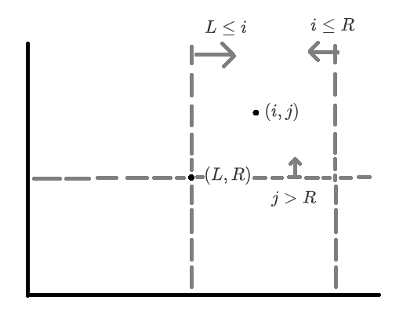
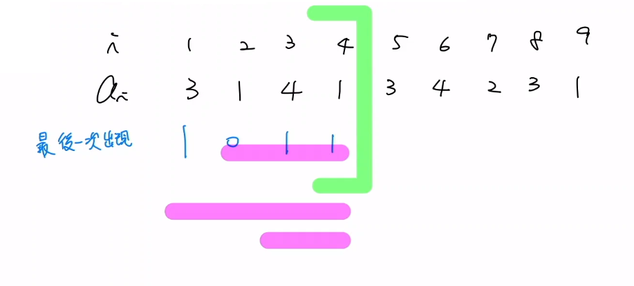

### CSES 1734

???+note "[CSES - Distinct Values Queries](https://cses.fi/problemset/task/1734)"
    給你長度為 $n$ 的陣列 $a_1,...,a_n$，有 $q$ 個查詢
    
    - 輸出 $a_i,...,a_j$ 之間有幾種不同的數字
    
    $n,q\le 2\times 10^5$
    
    ??? note "思路一"
    	考慮對於每個數字下一個數字出現在哪裡
    	
    	令目前的 index 在 $i$，下一次出現在 $j$
    	
    	問題就變成對於每個 $[L,R]$ 你要找出有幾個 $(i,j)$ 符合 $\begin{cases}L \le i \\ i \le R \\ j>R \end{cases}$
    	
    	可以將問題轉換在二維平面上
    	
    	<figure markdown>
          { width="300" }
        </figure>
        
    ??? note "思路二"
    	先將 $[L_i,R_i]$ 按照 $R_i$ 小到大 sort
    	
    	對於每個點維護一個權值，若是當前最後一個出現的話權值就是 $1$，否則是 $0$
    	
    	每個 $[L_i,R_i]$ 只需區間求和即可
    	
    	<figure markdown>
          { width="500" }
        </figure>

???+note "[CF 1858 E2. Rollbacks (Hard Version)](https://codeforces.com/contest/1858/problem/E2)"
	維護一個 DS，支援 :
	
	- push_back(x)

	- pop_back(k) : pop back 最後 k 個

	- rollback : 跳回上一次 push_back 或 pop_back 之前的狀態

	- query : 問當前 DS 裡面有幾個 distinct number

	$1\le q\le 10^6,1\le x\le 10^6$
	
	??? note "備註"
		此題也有離線做法，只是下面分享的是跟離線無關的，但跟 distinct number 有關的
		
	??? note "思路"
		我們只需要維護每個數字最一開始出現的位置，與當前陣列每一項是多少。
		
		- push_back(x)
		
			我們只要檢查當前的 x 是否為第一次出現，是的話 ans[n] = ans[n - 1] + 1
		
		- pop_back(k)

			將當前 n -= k 即可
			
		- rollback

			開一個 stack 將之前 push_back, pop_back 有改到的東西全部變成他們之前的值即可
			
		- query

			直接輸出 ans[n]
		
		> 參考 : <a href="/wiki/offline/images/10.png" target="_blank">codeforces comment</a>
		
	??? note "code"
		```cpp linenums="1"
		#include <cstdio>
        #include <vector>
        #include <cstring>
        using namespace std;
        const int N = 1e6 + 1;

        int q, a[N], n, occur[N], ans[N];
        char c;


        struct change {
            int *pos, val;
            change(int *pos, int val) : pos(pos), val(val) {}
        };
        vector<vector<change>> stk;

        int main(){
            memset(occur, 0x3f, sizeof(occur));
            scanf("%d", &q);
            for (int i = 1; i <= q; i++) {
                scanf(" %c", &c);
                if(c == '+') {
                    vector<change> cng;
                    int x;
                    scanf("%d", &x);
                    if(occur[x] > n || a[occur[x]] != x) {
                        cng.push_back(change(&occur[x], occur[x]));
                        occur[x] = n + 1;
                        cng.push_back(change(&ans[n + 1], ans[n + 1]));
                        ans[n + 1] = ans[n] + 1;
                    } else {
                        cng.push_back(change(&ans[n + 1], ans[n + 1]));
                        ans[n + 1] = ans[n];
                    }
                    cng.push_back(change(&a[n + 1], a[n + 1]));
                    a[n + 1] = x;
                    cng.push_back(change(&n, n));
                    n = n + 1;
                    stk.push_back(cng);
                } else if(c == '-') {
                    vector<change> cng;
                    int x;
                    scanf("%d", &x);
                    cng.push_back(change(&n, n));
                    n = n - x;
                    stk.push_back(cng);
                } else if(c == '!') {
                    vector<change> lst = stk.back();
                    stk.pop_back();
                    for(change elem : lst)
                        *elem.pos = elem.val;
                } else {
                    printf("%d\n", ans[n]);
                    fflush(stdout);
                }
            }
            return 0;
        }
        ```
		
???+note "類似題 [CF 1000F](https://codeforces.com/problemset/problem/1000/F)"
    給你 $a_1,...,a_n$，有 $q$ 個查詢
    
    - 隨便輸出一個 $a_l,...,a_r$  之間只出現一次的數
    
    ??? note "思路"
        - 我們假設 $a_i$ 上一次出現的地方是 $a_j$ 其中 $i<j$
    
        - $\texttt{seg}[i]:\begin{cases} j & \texttt{if j exist} \\ -\texttt{INF} &\texttt{otherwise}\end{cases}$
    
        - 對於 $\texttt{query(l,r)}$ 只要去 $\texttt{query_min(l,r)}$ 檢查是否比 $l$ 小即可
    
        - 記得在 $\texttt{query_min(l,r)}$ 要存任意一個符合答案的數

???+note "自創題"
    給你 $a_1,...,a_n$，和一個數 $x$，有 $q$ 個查詢
    
    輸出在 $a_l,..., a_r$ 之間存在幾個只出現一次的數
    
    ??? note "思路"
        - 只要將 $\texttt{CSES}$ 上面那題
    
        - 把查詢 $[l, r]$ 按照 $l$ 從大到小處理
    
        - 對於在位置 $l$ 後面的數字 $x$
    
        - 如果是第一次出現設定成 $+1$
    
        - 如果是第二次出現設定成 $-1$
### Atcoder abc250_e
???+note "[E - Prefix Equality](https://atcoder.jp/contests/abc250/tasks/abc250_e)"
    給你 $a_1,...,a_n$ 與 $b_1,...,b_n$，有 $q$ 個查詢
    
    - 問 $\texttt{set}(a_1,...,a_i)$ 和 $\texttt{set}(b_1,...,b_j)$ 是否相同
    
    暴力作法無法通過
    
    ??? note "思路"    
        - $\texttt{seg}[i]$ 存 $a_i$ 這個數字在 $b$ 陣列首次出現的 $\texttt{index}$
    
        - $\text{query}$ 就直接看 $\texttt{seg.query_max(1,i)}$ 是否比 $\texttt{j}$ 小，比 $\texttt{j}$ 小代表是相同的

#### 類似題
???+note "[选数异或](http://oj.ecustacm.cn/problem.php?id=2024)"
    給你 $a_1,...,a_n$，和一個數 $x$，有 $q$ 個查詢
    
    - 問 $[l,r]$ 中是否有兩個數 $\texttt{XOR}$ 起來等於 $x$
    
    ??? note "思路"
        - [解答](https://blog.csdn.net/m0_52398496/article/details/124608594?spm=1001.2014.3001.5502)

### RMQ
???+note "[Static Range Minimum Queries](https://cses.fi/problemset/task/1647)"
    給你 $a_1,...,a_n$，有 $q$ 個查詢
    
    - 問 $a_l,...,a_r$ 的最小值
    
    註$\texttt{:}$ 使用單調 $\texttt{stack}$ 來解決此問題
    
    ??? note "思路"
        - 依照 $r$ $\texttt{sort}$
    
        - 對於相同 $r$ 的 $\texttt{query}$，按照 $l$ 去 $\texttt{lower_bound}$
    
        - 因為單調 $\texttt{stack}$ 是遞增的，所以找到第一個 $idx \ge l$  一定是最好的 $\texttt{min}$
        
        - 小的一定都會把大的砍掉

### CSES  2416
???+note "[Increasing Array Queries](https://cses.fi/problemset/task/2416)"
    給你 $a_1,...,a_n$，有 $q$ 個查詢
    
    - 如果你一個步驟可以 $\texttt{modify}(a[i],+1)$ 
    
    - 請問你最少需要幾個步驟可以使 $a_l,...,a_r$ 非嚴格遞增

### TIOJ 最小公倍數

???+note "[TIOJ 1872.最小公倍數](https://tioj.ck.tp.edu.tw/problems/1872)"
	給你 $N$ 個數，$Q$ 筆詢問 :
	
	- 計算 $c_l,\ldots ,c_r$ 的最小公倍數
	
	$N,Q\le 10^6, c_i\le 10^6$


​	


- CSES - Pizzeria Queries

- CSES - Polynomial Queries