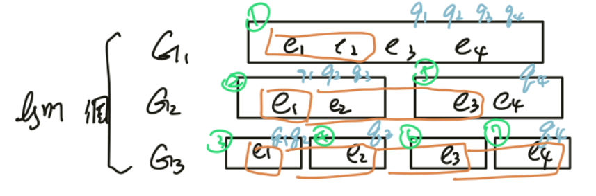
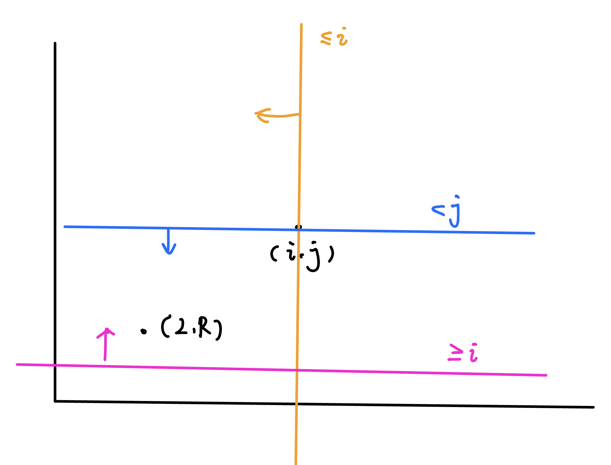

## 介紹
### 算法精神
先想單一詢問的時候可以怎麼利用值域二分搜

一定會在「答案」所在的值域進行分治，我們將答案的值域列為 $[l,r]$

同時也需要維護在當前分治到的值域下的詢問編號，我們把它叫做 $[ql,qr]$

若詢問並沒有單調性，那就必須自己跑過 $ql\sim qr$，再開兩個陣列將他們分成左右兩類

若詢問有單調性，尋找切點，直接分治 (連結 : dp 優化 - 決策性單調)

我們假設 $[ql,qr]$ 的切點叫做 $t$， $\displaystyle\text{mid}=\frac{l+r}{2}$

$$
\texttt{solve (l, r, qL, qR)}=\begin{cases} \texttt{solve (l, mid, qL, t)} \\ \texttt{solve (mid + 1, r, t + 1, qR)}\end{cases}
$$

### 步驟

1. 將問題轉成單一詢問 (如果只有一個要怎麼做)
2. 如何計算 cost
3. 二分搜的範圍 (上界，下界)
4. 如何分治

### 範例
#### 靜態區間 k 小
???+note "[洛谷 P3834 - 【模板】可持久化线段树 2](https://www.luogu.com.cn/problem/P3834)"
	給長度為 $n$ 的序列，$q$ 筆詢問
	
	- $\text{query(}a_l\sim a_r,k):$ 回答 $a_l\sim a_r$ 中第 $k$ 小的數值是多少<br>
	
	$n,q\le 2\times 10^5,|a_i|\le 10^9$
	
	??? note "code"
		```cpp linenums="1"
		#include <bits/stdc++.h>
	    #define int long long
	    #define pii pair<int, int>
	    #define pb push_back
	    #define mk make_pair
	    #define F first
	    #define S second
	    #define ALL(x) x.begin(), x.end()
	    #define lowbit(x) (x & (-x))
	
	    using namespace std;
	
	    const int INF = 2e18;
	    const int maxn = 3e5 + 5;
	    const int M = 1e9 + 7;
	
	    struct BIT {
	        int n;
	        vector<int> bit;
	
	        void init (int _n) {
	            n = _n;
	            bit.resize (n + 1);
	        }
	
	        void add (int x, int d) {
	            while (x <= n) {
	                bit[x] += d;
	                x += lowbit (x);
	            }
	        }
	
	        int query (int x) {
	            int ret = 0;
	            while (x > 0) {
	                ret += bit[x];
	                x -= lowbit (x);
	            }
	            return ret;
	        }
	    } bit;
	
	    struct qry {
	        int l, r, k, id;
	    };
	
	    int n, q;
	    int arr[maxn], a[maxn], ans[maxn];
	
	    void solve (int l, int r, vector<int> &idx, vector<qry> &q) {
	        if (l == r) {
	            for (auto [ql, qr, k, id] : q) {
	                ans[id] = l;
	            }
	            return;
	        }
	
	        int mid = (l + r) / 2;
	
	        vector<int> iLeft, iRight;
	        for (auto id : idx) {
	            if (a[id] <= mid) {
	                bit.add (id, 1);
	                iLeft.pb (id);
	            }
	            else iRight.pb (id);
	        }
	
	        vector<qry> qLeft, qRight;
	        for (auto [ql, qr, k, id] : q) {
	            int t = bit.query (qr) - bit.query (ql - 1);
	            if (k <= t) {
	                qLeft.pb ({ql, qr, k, id});
	            }
	            else {
	                qRight.pb ({ql, qr, k - t, id});
	            }
	        }
	
	        for (auto id : idx) {
	            if (a[id] <= mid) bit.add (id, -1);
	        }
	        vector<int>().swap (idx);
	        vector<qry>().swap (q);
	
	        solve (l, mid, iLeft, qLeft);
	        solve (mid + 1, r, iRight, qRight);
	    }
	
	    void work () {
	        cin >> n >> q;
	        vector<int> d;
	        for (int i = 1; i <= n; i++) {
	            cin >> arr[i];
	            d.pb (arr[i]);
	        }
	        sort (ALL (d));
	        d.resize (unique (ALL (d)) - d.begin ());
	
	        vector<int> idx;
	        for (int i = 1; i <= n; i++) {
	            a[i] = lower_bound (ALL (d), arr[i]) - d.begin () + 1;
	        }
	        for (int i = 1; i <= n; i++) {
	            idx.pb (i);
	        }
	        vector<qry> qry;
	        for (int i = 1; i <= q; i++) {
	            int l, r, k;
	            cin >> l >> r >> k;
	            qry.pb ({l, r, k, i});
	        }
	        bit.init (n);
	
	        solve (1, d.size (), idx, qry);
	        for (int i = 1; i <= q; i++) {
	            cout << d[ans[i] - 1] << "\n";
	        }
	    } 
	
	    signed main() {
	        // ios::sync_with_stdio(0);
	        // cin.tie(0);
	        int t = 1;
	        //cin >> t;
	        while (t--) {
	            work();
	        }
	    } 
	    ```


#### 動態區間 k 小
???+note "[洛谷 P2617 - Dynamic Rankings](https://www.luogu.com.cn/problem/P2617)"
	給長度為 $n$ 的序列，$q$ 筆詢問
	
	- $\text{query(}a_l\sim a_r,k):$ 回答 $a_l\sim a_r$ 中第 $k$ 小的數值是多少<br>
	- $\text{modify(}a_i,x):$ 將 $a_i$ 的數值改成 $x$
	
	$n,q\le 2\times 10^5$
	
	??? note "思路"
		1. 把原先 $a_i$ 的貢獻給扣除<br>
		2. 將 $x$ 的貢獻加入
	
	??? note "code"
		```cpp linenums="1"
		#include <bits/stdc++.h>
	    #define int long long
	    #define pii pair<int, int>
	    #define pb push_back
	    #define mk make_pair
	    #define lowbit(x) (x & (-x))
	    #define F first
	    #define S second
	    #define ALL(x) x.begin(), x.end()
	
	    using namespace std;
	    using PQ = priority_queue<int, vector<int>, greater<int>>;
	
	    const int INF = 2e18;
	    const int maxn = 3e5 + 5;
	    const int M = 1e9 + 7;
	
	    int n, m, cnt = 0, tot = 0;;
	    int a[maxn], ans[maxn];
	
	    struct query {
	        int type, x, y, k, id;
	        // 0, l, r, k, qry id
	        // 1, index, number, 1/-1 add or del, qry id
	    };
	
	    query q1[2 * maxn], q2[2 * maxn], q[2 * maxn];
	    query qry[maxn];
	
	    struct BIT {
	        vector<int> bit;
	
	        void init () {
	            bit.resize (n + 1);
	        }
	
	        void add (int x, int d) {
	            while (x <= n) {
	                bit[x] += d;
	                x += lowbit (x);
	            }
	        }
	
	        int query (int x) {
	            int ret = 0;
	            while (x > 0) {
	                ret += bit[x];
	                x -= lowbit (x);
	            }
	            return ret;
	        }
	    } bit;
	
	    void divide (int l, int r, int qL, int qR) {
	        if (l > r || qL > qR) return;
	        if (l == r) {
	            for (int i = qL; i <= qR; i++) {
	                if (q[i].type == 0) {
	                    ans[q[i].id] = l;
	                } 
	            }
	            return;
	        }
	
	        int mid = (l + r) / 2;
	
	        int cnt1 = 0, cnt2 = 0;
	        for (int i = qL; i <= qR; i++) {
	            if (q[i].type == 0) {
	                int t = bit.query (q[i].y) - bit.query (q[i].x - 1);
	                if (q[i].k <= t) q1[++cnt1] = q[i];
	                else q[i].k -= t, q2[++cnt2] = q[i];
	            } 
	            else {
	                if (q[i].y <= mid) {
	                    bit.add (q[i].x, q[i].k); // q[i].x
	                    q1[++cnt1] = q[i];
	                }
	                else q2[++cnt2] = q[i];
	            }
	        }
	
	        // undo
	        for (int i = 1; i <= cnt1; i++) 
	            if (q1[i].type == 1) bit.add (q1[i].x, -q1[i].k);
	        for (int i = 1; i <= cnt1; i++) q[qL + i - 1] = q1[i];
	        for (int i = 1; i <= cnt2; i++) q[qL + cnt1 + i - 1] = q2[i];
	
	        divide (l, mid, qL, qL + cnt1 - 1);
	        divide (mid + 1, r, qL + cnt1, qR);
	    }
	
	    void solve () {
	        cin >> n >> m;
	
	        int x;
	        for (int i = 1; i <= n; i++) {
	            cin >> x;
	            a[i] = x;
	            q[++cnt] = {1, i, a[i], 1, -1};
	        }
	
	        for (int i = 1; i <= m; i++) {
	            int x, y, k;
	            char type;
	            cin >> type;
	            if(type == 'Q') {
	                cin >> x >> y >> k;
	                q[++cnt] = 0, x, y, k, ++tot};
	            }
	            else {
	                cin >> x >> y;
	                q[++cnt] = {1, x, a[x], -1, 0};
	                q[++cnt] = {1, x, a[x] = y, 1, 0};
	            }
	        }
	
	        bit.init ();
	
	        divide (-2e9, 2e9, 1, cnt);
	
	        for (int i = 1; i <= tot; i++) {
	            cout << ans[i] << "\n";
	        }
	    } 
	
	    signed main() {
	        // ios::sync_with_stdio(0);
	        // cin.tie(0);
	        int t = 1;
	        //cin >> t;
	        while (t--) {
	            solve();
	        }
	    } 
	    ```

## 例題

### APCS 真假子圖
???+note "[zerojudge g598. 4. 真假子圖](https://zerojudge.tw/ShowProblem?problemid=g598)"
	有 $n$ 個點，$m$ 個 $\texttt{pair}(x,y)$ 代表 $x$ 跟 $y$ 在不同組
		
	再給你 $p$ 組資料，每組資料有 $k$ 個 $\texttt{pair}(x,y)$ 代表 $x$ 跟 $y$ 在不同組
	
	你要輸出哪幾筆資料跟原本的 $m$ 個 $\texttt{pair}$ 產生矛盾
	
	題目保證輸入的資料兩兩之間不矛盾
	
	??? note "思路"
	
	    > 法 1 : 
	
	    技巧 : <a href="/wiki/graph/MST/#3" target="_blank">最大邊最小化生成樹 法3</a>
	
	    考慮找第一個出錯的地方，$\displaystyle \text{mid}=\frac{l+r}{2}=t$
	
	    檢查只用 $\le t$ 的資料聯集是否矛盾
	
	    - 若矛盾，代表 $ans\le t$，刪掉後面的，少一半
	    - 若沒矛盾，代表 $ans> t$，將前面的二分圖縮點，少一半
	
	    複雜度 : $\displaystyle T(p)=T(\frac{p}{2})+O(p\times k)\Rightarrow O(p\times k)$
	
	    > 法 2 : rollback DSU
	
	    註 : 如果資料兩兩之間可以矛盾也是可以做的
	
	    將第 $i$ 個資料的 $k$ 個 $\texttt{pair}$ 加進 DSU，判斷，roll back
	
	    複雜度 : $O(p\times k \times \log C)$

### Atcoder Stamp Rally

???+note "[Atcoder AGC002 D - Stamp Rally](https://atcoder.jp/contests/agc002/tasks/agc002_d)"
	給 $n$ 點 $m$ 邊無向圖，邊的編號 $1 \sim m$
	
	$q$ 筆詢問 $x, y, z$
	
	回答從 $x$ 點出發和從 $y$ 點走的「點集聯集大小」至少是 $z$ 的最大「邊」編號最小值
	
	- $n,m,q \le 10^5$
	
	??? note "思路"
		> 暴力作法
	
		我們二分搜 $\displaystyle \text{mid}=\frac{l+r}{2}=t$ 
		
		檢查如果只走 $\le t$ 的邊 : 
		
		- $x$ 和 $y$ 是否在同一個連通塊
	
		- 連通塊大小是否 $\ge z$
		
		複雜度 : $O(q\times (n+m))$
		
		--- 
		
		這邊我們引入一個技巧，下面的方法會用到
		
		技巧詳見 : <a href="/wiki/graph/MST/#3" target="_blank">最大邊最小化生成樹 法3</a>
		
		> 方法一 : 把 graph 拆半，兩個子問題圖都只有本來的一半
		
		- $ans \le t$ 少一半的 edge
		
		- $ans > t$ 少一半的 edge，縮點
		
		時間複雜度 : $O(m \log m)$
		
		空間複雜度 : $O(m)$[^1]
		
		??? note "code"
			```cpp linenums="1"
			#include <iostream>
	        #include <utility>
	        #include <vector>
	
	        #define int long long
	        #define pii pair<int, int>
	        #define pb push_back
	        #define mk make_pair
	        #define F first
	        #define S second
	        #define ALL(x) x.begin(), x.end()
	
	        using namespace std;
	
	        struct Edge {
	            int u, v, w;
	        };
	
	        struct qry {
	            int x, y, z, id;
	        };
	
	        struct Graph {
	           public:
	            Graph(int n) : n(n) {
	                par = vector<int>(n);
	                sz = vector<int>(n, 1);
	                for (int i = 0; i < n; i++) {
	                    par[i] = i;
	                }
	            }
	            void add_edge(const Edge& e) {
	                int u = find(e.u), v = find(e.v);
	                if (u == v) return;
	                par[u] = v;
	                sz[v] += sz[u];
	                sz[u] = 0;
	            }
	            bool check(const qry& q) {
	                int u = find(q.x), v = find(q.y);
	                if (u != v) {
	                    return sz[u] + sz[v] >= q.z;
	                }
	                return sz[u] >= q.z;
	            }
	            int find(int x) {
	                if (par[x] == x) return x;
	                return par[x] = find(par[x]);
	            }
	            int size() {
	                return n;
	            }
	
	            vector<int> sz;
	
	           private:
	            int n;
	            vector<int> par;
	        };
	
	        const int maxn = 3e5 + 5;
	        int ans[maxn];
	        vector<Edge> edges;
	        vector<qry> queries;
	        vector<Graph> g;
	
	        void shrink(vector<Edge>& edge, vector<qry>& q, Graph& G) {
	            // query 有用到的 node 才要存
	            // 相同 CC 的點，要變成同樣編號
	            // 新圖的點邊號是 0 ~ (k-1)
	            int n = G.size();
	            vector<bool> need(n, false);
	
	            for (auto [x, y, z, id] : q) {
	                need[G.find(x)] = true;
	                need[G.find(y)] = true;
	            }
	            for (auto [u, v, w] : edge) {
	                need[G.find(u)] = true;
	                need[G.find(v)] = true;
	            }
	
	            vector<int> new_id(n, -1);
	            vector<int> sz;
	            int k = 0;
	            for (int i = 0; i < n; i++) {
	                if (need[i]) {
	                    new_id[i] = k++;
	                    sz.push_back(G.sz[i]);
	                }
	            }
	
	            for (auto& [x, y, z, id] : q) {
	                x = new_id[G.find(x)];
	                y = new_id[G.find(y)];
	            }
	            for (auto& [u, v, w] : edge) {
	                u = new_id[G.find(u)];
	                v = new_id[G.find(v)];
	            }
	            G = Graph(k);
	            for (int i = 0; i < k; i++) G.sz[i] = sz[i];
	        }
	
	        void solve(int el, int er, vector<Edge>& edge, vector<qry>& q, Graph& G) {
	            int emid = (el + er) / 2;
	
	            if (el == er) {
	                for (auto [x, y, z, id] : q) {
	                    ans[id] = el;
	                }
	                return;
	            }
	
	            shrink(edge, q, G);
	
	            Graph gLeft = G;
	            Graph& gRight = G;
	
	            vector<Edge> eLeft, eRight;
	            for (auto [u, v, w] : edge) {
	                if (w <= emid) {
	                    G.add_edge({u, v, w});
	                    eLeft.pb({u, v, w});
	                } else {
	                    eRight.pb({u, v, w});
	                }
	            }
	            vector<qry> qLeft, qRight;
	            for (auto query : q) {
	                if (G.check(query)) {
	                    qLeft.pb(query);
	                } else {
	                    qRight.pb(query);
	                }
	            }
	
	            solve(el, emid, eLeft, qLeft, gLeft);
	            solve(emid + 1, er, eRight, qRight, gRight);
	        }
	
	        int n, m, q;
	
	        void init() {
	            cin >> n >> m;
	
	            int u, v;
	            for (int i = 0; i < m; i++) {
	                cin >> u >> v;
	                u--, v--;
	                edges.pb({u, v, i});
	            }
	            cin >> q;
	            int x, y, z;
	            for (int i = 0; i < q; i++) {
	                cin >> x >> y >> z;
	                x--, y--;
	                queries.pb({x, y, z, i});
	            }
	        }
	
	        void work() {
	            // g.resize(21);
	            Graph G(n);
	            solve(0, m - 1, edges, queries, G);
	
	            for (int i = 0; i < q; i++) {
	                cout << ans[i] + 1 << '\n';
	            }
	        }
	
	        signed main() {
	            ios::sync_with_stdio(0);
	            cin.tie(0);
	            int t = 1;
	            // cin >> t;
	            while (t--) {
	                init();
	                work();
	            }
	        }
	        ```
		
		> 方法二 : 存 $\log m$ 個 $n\text{-vertex graph}$
		
		為了避免每次都複製一次資料結構，可以開 $\log m$ 個資料結構慢慢長
		
		<figure markdown>
	      { width="500" }
	    </figure>
	
		時間複雜度 : $O(m \log m + q)=O(m\log m)$
		
		空間複雜度 : $O(m \log m)$
		
	    ??? note "code"
	        ```cpp linenums="1"
	        #include <bits/stdc++.h>
	        #define int long long
	        #define pii pair<int, int>
	        #define pb push_back
	        #define mk make_pair
	        #define F first
	        #define S second
	        #define ALL(x) x.begin(), x.end()
	
	        using namespace std;
	
	        const int INF = 2e18;
	        const int maxn = 3e5 + 5;
	        const int M = 1e9 + 7;
	
	        struct Edge {
	            int u, v, w;
	        };
	
	        struct qry {
	            int x, y, z, id;
	        };
	
	        int n, m, q;
	
	        struct Graph {
	            Graph () {
	                par = vector<int>(n + 1);
	                sz = vector<int>(n + 1);
	                for (int i = 1; i <= n; i++) {
	                    par[i] = i;
	                    sz[i] = 1;
	                }   
	            }
	            void add_edge(const Edge& e) {
	                int u = find(e.u), v = find(e.v);
	                if (u == v) return;
	                par[u] = v;
	                sz[v] += sz[u];
	                sz[u] = 0;
	            }
	            bool check (const qry& q) {
	                int u = find (q.x), v = find (q.y);
	                if (u != v) {
	                    return sz[u] + sz[v] >= q.z;
	                }
	                return sz[u] >= q.z;
	            }
	
	           private:
	            vector<int> par;
	            vector<int> sz;
	
	            int find(int x) {
	                if (par[x] == x) return x;
	                return par[x] = find(par[x]);
	            }
	        };


            int ans[maxn];
            vector<Edge> edges;
            vector<qry> queries;
            vector<Graph> g;
    
            void solve (int depth, int el, int er, vector<Edge> &edge,vector<qry>& q) {
                int emid = (el + er) / 2;
                Graph &G = g[depth];
    
                if (el == er) {
                    for (auto [x, y, z, id] : q) {
                        ans[id] = el;
                    }
    
                    for (auto [u, v, w] : edge) {
                        if (w <= emid) {
                            G.add_edge({u, v, w});
                        } 
                    }
    
                    vector<qry>().swap (q);
                    vector<Edge>().swap (edge);
                    return;
                }
    
                vector<Edge> eLeft, eRight;
                for (auto [u, v, w] : edge) {
                    if (w <= emid) {
                        G.add_edge({u, v, w});
                        eLeft.pb ({u, v, w});
                    } 
                    else {
                        eRight.pb ({u, v, w});
                    }
                }
                vector<qry> qLeft, qRight;
                for (auto query : q) {
                    if (G.check (query)) {
                        qLeft.pb (query);
                    }
                    else {
                        qRight.pb (query);
                    }
                }
    
                for (auto [u, v, w] : edge) {
                    if (w > emid) {
                        G.add_edge({u, v, w});
                    }
                }
                vector<qry>().swap (q);
                vector<Edge>().swap (edge);
    
                solve (depth + 1, el, emid, eLeft, qLeft);
                solve (depth + 1, emid + 1, er, eRight, qRight);
            } 
    
            void init () {
                cin >> n >> m;
    
                int u, v;
                for (int i = 1; i <= m; i++) {
                    cin >> u >> v;
                    edges.pb ({u, v, i});
                }
                cin >> q;
    
                int x, y, z;
                for (int i = 1; i <= q; i++) {
                    cin >> x >> y >> z;
                    queries.pb ({x, y, z, i});
                }
            }
    
            void work () {
                g.resize (21);
                solve (0, 1, m, edges, queries);
    
                for (int i = 1; i <= q; i++) {
                    cout << ans[i] << "\n";
                }
            } 
    
            signed main() {
                // ios::sync_with_stdio(0);
                // cin.tie(0);
                int t = 1;
                //cin >> t;
                while (t--) {
                    init();
                    work();
                }
            } 
            ```

### 區間 gcd

???+note "原創 - 區間 gcd"
	給一個正整數陣列，查詢有幾個區間的 $\gcd = 1$ 
	
	- $O(n\log n)$ 
	
	??? note "思路"
		這題其實就直接 sparse table 預處理，two pointer 維護即可
		
		但是我們還是可以試試看以整體二分搜的觀點切入
		
		---
		對於每個 $l$，看最近的 $r$ 使得 $\gcd (a_l,\cdots a_r)=1$
		
		> 方法1 : 整體二分
		
		假設目前我們在處理左界 $=[ql,qr]$ 的這些 query，他們的右界在 $[l, r]$ 這個範圍
		
		$\displaystyle \text{mid}=\frac{l+r}{2}$，左界在 $[\text{mid}+1,r]$ 這些範圍的都可以往右遞迴
		
		再來考慮左界在 $[ql, \text{mid}]$ 的這些 query
		
		我們要尋找切點 $p$ 使得左界在 $p$ 這個位置他的右界剛好 $\ge \text{mid}$ 
		
		$\texttt{solve (ql, p - 1, l, mid)},\texttt{solve (p, qr, mid + 1, r)}$
		
		> 方法2 : 倍增法
	
		假設 $n=32$，我們考慮第 $i$ 個 query
		
		我們令當前合法區間為 $[i, r_i]$
		
		看能不能將 $r_i$ 往右移動 $32$ 步
		
		看能不能將 $r_i$ 往右移動 $16$ 步
		
		看能不能將 $r_i$ 往右移動 $8$ 步
		
		$\vdots$
		
		??? code "虛擬碼"
			```cpp linenums="1"
			init r[i] = i - 1, g[i] = 0;
			
			for (d = n, n / 2, n / 4, ...)
				build v[i] = gcd (a[i],..., a[i + d - 1])
				
				for i = 1 ~ Q :
					if gcd (g[i], v[r[i] + 1]) != 1 :
						g[i] = gcd (g[i], v[r[i] + 1])
						r_i = r_i + d
			```


### 成大賽 身分調查

???+note "[2023 成大賽初賽 pD.身分調查](https://codeforces.com/gym/437848/problem/D)"
	依序給你 $K$ 個 $\texttt{pair}(x_i,y_i)$ 代表 $x$ 跟 $y$ 在不同組
	
	已知編號 $1$ 的組別，求移除 $[l,r]$ 的 $\texttt{pair}$ 滿足
	
	1. 剩下的 $\texttt{pair}$ 還是能確定 $X$ 的組別
	2. $[l,r]$ 長度最大
	3. 若還是有多組解，輸出左界比最小的
	
	求 $l,r$
	
	??? note "思路"
		如果移除 [i, emid] 可以連通，那你的 ans[i] 有可能是 emid，也有可能在 emid 之後
		
		那不如我們把 ans[i] 的定義往後挪一格呢 ?
		
		---
		
		ans[i] 表示
		
	    - 移除 [i, ans[i] - 1] 會連通
	
	    - 移除 [i, ans[i]] 則不會連通，或者 ans[i] = m
	
		對於每個 i 要二分搜到 ans[i] 滿足：移除 [i, ans[i]] 是不連通的
	
	    一開始在 main 裡面要先找 qr 的目的就是為了保證 i = [ql, qr] 之間的 i 都可以找到上面定義的 ans[i]
	    如果 main 沒有先找 qr，有些 i 可能不管往後移除多少邊都不可能不連通
	
	    DC 的任何子問題都要滿足：
	    對於在 i = [ql, qr] 之間的, ans[i] 一定介於 [el, er]
	    
		二分搜尋的起始條件很重要，上面做很多事情都是在確保：搜尋的過程中答案會介於目前			的下界跟上界之間
		
		ans[i] : 移除 [i, ans[i]] 不能連通, 移除 [i, ans[i]-1] 可以連通
		
	    如果移除 [i, emid] 可以連通 ⇒ emid < ans[i]
	    
	    如果移除 [i, emid] 不能連通 ⇒ ans[i] <= emid
	
	??? note "code (44 points)"
		```cpp linenums="1"
		#include <iostream>
	    #include <utility>
	    #include <vector>
	
	    using namespace std;
	
	    struct Edge {
	        int u, v, w;
	    };
	
	    struct Graph {
	        Graph(int n, int s, int t) : s(s), t(t) {
	            par = vector<int>(n);
	            for (int i = 0; i < n; i++) {
	                par[i] = i;
	            }
	        }
	        void add_edge(const Edge& e) {
	            int u = find(e.u), v = find(e.v);
	            par[u] = v;
	        }
	        bool connected() {
	            return find(s) == find(t);
	        }
	
	       private:
	        int s, t;
	        vector<int> par;
	
	        int find(int x) {
	            if (par[x] == x) return x;
	            return par[x] = find(par[x]);
	        }
	    };
	
	    int n, m, x;
	    vector<Edge> edges;
	    vector<int> ans;
	
	    int s = 0, t;
	
	    void init() {
	        cin >> n >> m >> t;
	        t--;  // to 0-base
	
	        for (int i = 0; i < m; i++) {
	            int u, v, w;
	            cin >> u >> v >> w;
	            u--, v--;  // to 0-base
	            w--;
	            edges.push_back({u, v, w});
	        }
	    }
	
	    // ans[i] : 移除 [i, ans[i]] 不能連通, 移除 [i, ans[i]-1] 可以連通
	    // 如果移除 [i, emid] 可以連通 \imply emid < ans[i]
	    // 如果移除 [i, emid] 不能連通 \imply ans[i] <= emid
	    //
	    void DC(Graph g, int el, int er, int ql, int qr) {
	        // 假設 edges[0, ql-1] 和 edges[er+1, m-1] 都已經加入 g
	        // 如果移除 [qr, er] 一定不連通。 TODO: 寫一個迴圈檢查
	        if (el == er) {
	            for (int i = ql; i <= qr; i++) ans[i] = er;
	            return;
	        }
	        int emid = (el + er) / 2;
	
	        Graph h = g;
	        for (int i = emid + 1; i <= er; i++) {
	            h.add_edge(edges[i]);
	        }
	
	        int qmid = emid;
	        for (int i = ql; i <= emid; i++) {
	            if (i > ql) h.add_edge(edges[i - 1]);
	            if (h.connected()) {
	                // 移除 [i, emid] 會連通
	                // 移除 [i-1, emid] 不連通
	                qmid = i - 1;
	                break;
	            }
	        }
	
	        Graph gl = g;
	        Graph gr = g;
	        for (int i = emid + 1; i <= er; i++) gl.add_edge(edges[i]);
	        for (int i = ql; i <= qmid; i++) gr.add_edge(edges[i]);
	        DC(gl, el, emid, ql, qmid);
	        DC(gr, emid + 1, er, qmid + 1, qr);
	    }
	
	    vector<int> color;
	    vector<vector<pair<int, int>>> wg;
	    void dfs(int u) {
	        for (auto [v, c] : wg[u]) {
	            if (color[v] == -1) {
	                color[v] = color[u] ^ c;
	                dfs(v);
	            }
	        }
	    }
	
	    int main() {
	        cin.tie(0);
	        cin.sync_with_stdio(0);
	
	        init();
	
	        if (s == t) {
	            cout << n << ' ' << 1 << ' ' << n << ' ' << 1 << '\n';
	            return 0;
	        }
	
	        Graph tmp(n, s, t);
	        int ql = 0, qr = m;
	        for (int i = 0; i < m; i++) {
	            tmp.add_edge(edges[i]);
	            if (tmp.connected()) {
	                qr = i;
	                break;
	            }
	        }
	        if (qr == m) {
	            cout << -1 << '\n';
	            return 0;
	        }
	
	        ans = vector<int>(m, m);
	        DC(Graph(n, s, t), 0, m - 1, ql, qr);
	
	        int len = 0, best_l = -1, best_r = -1;
	        for (int i = 0; i < m; i++) {
	            if (ans[i] - i > len) {
	                len = ans[i] - i;
	                best_l = i;
	                best_r = ans[i] - 1;
	            }
	        }
	
	        color = vector<int>(n, -1);
	        wg.resize(n);
	        for (int i = 0; i < m; i++) {
	            if (best_l <= i && i <= best_r) continue;
	            Edge e = edges[i];
	            wg[e.u].push_back({e.v, e.w});
	            wg[e.v].push_back({e.u, e.w});
	        }
	        color[s] = 0;
	        dfs(s);
	
	        cout << len << ' ';
	        cout << best_l + 1 << ' ' << best_r + 1 << ' ';
	        cout << color[t] + 1 << '\n';
	
	        return 0;
	    }
	    ```
	??? note "code(by algoseacow)"
		```cpp linenums="1"
		#include <iostream>
	    #include <utility>
	    #include <vector>
	
	    using namespace std;
	
	    struct Edge {
	        int u, v, w;
	    };
	
	    struct Graph {
	        Graph(int n, int s, int t) : s(s), t(t) {
	            par = vector<int>(n);
	            for (int i = 0; i < n; i++) {
	                par[i] = i;
	            }
	        }
	        void add_edge(const Edge& e) {
	            int u = find(e.u), v = find(e.v);
	            par[u] = v;
	        }
	        bool connected() {
	            return find(s) == find(t);
	        }
	        void shrink(vector<Edge>& edges) {
	            int n = par.size();
	
	            vector<bool> used(n);
	            used[find(s)] = true;
	            used[find(t)] = true;
	            for (Edge e : edges) {
	                used[find(e.u)] = true;
	                used[find(e.v)] = true;
	            }
	
	            vector<int> cc(n, -1);
	            int cnt = 0;
	            for (int i = 0; i < n; i++) {
	                if (i == find(i) && used[i] == true) {
	                    cc[i] = cnt++;
	                }
	            }
	
	            for (Edge& e : edges) {
	                e.u = cc[find(e.u)];
	                e.v = cc[find(e.v)];
	            }
	            s = cc[find(s)];
	            t = cc[find(t)];
	
	            par = vector<int>(cnt);
	            for (int i = 0; i < cnt; i++) par[i] = i;
	        }
	
	       private:
	        int s, t;
	        vector<int> par;
	
	        int find(int x) {
	            if (par[x] == x) return x;
	            return par[x] = find(par[x]);
	        }
	    };
	
	    int n, m, x;
	    vector<Edge> edges;
	    vector<int> ans;
	
	    int s = 0, t;
	
	    void init() {
	        cin >> n >> m >> t;
	        t--;  // to 0-base
	
	        for (int i = 0; i < m; i++) {
	            int u, v, w;
	            cin >> u >> v >> w;
	            u--, v--;  // to 0-base
	            w--;
	            edges.push_back({u, v, w});
	        }
	    }
	
	    // ans[i] : 移除 [i, ans[i]] 不能連通, 移除 [i, ans[i]-1] 可以連通
	    // 如果移除 [i, emid] 可以連通 \imply emid < ans[i]
	    // 如果移除 [i, emid] 不能連通 \imply ans[i] <= emid
	    //
	    void DC(Graph g, int el, int er, int ql, int qr) {
	        // 假設 edges[0, ql-1] 和 edges[er+1, m-1] 都已經加入 g
	        // 如果移除 [qr, er] 一定不連通
	        if (ql > qr) return;
	        if (el == er) {
	            for (int i = ql; i <= qr; i++) ans[i] = er;
	            return;
	        }
	
	        // 先把圖變小
	        vector<Edge> edges_old(edges.begin() + ql, edges.begin() + er + 1);
	        vector<Edge> edges_new = edges_old;
	        g.shrink(edges_new);
	
	        // 把 edge[ql, er] 換成縮點後的
	        for (int i = 0; i <= er - ql; i++) edges[ql + i] = edges_new[i];
	
	        int emid = (el + er) / 2;
	        Graph h = g;
	        for (int i = emid + 1; i <= er; i++) {
	            h.add_edge(edges[i]);
	        }
	
	        int qmid = emid;
	        for (int i = ql; i <= emid; i++) {
	            if (i > ql) h.add_edge(edges[i - 1]);
	            if (h.connected()) {
	                // 移除 [i, emid] 會連通
	                // 移除 [i-1, emid] 不連通
	                qmid = i - 1;
	                break;
	            }
	        }
	
	        Graph gl = g;
	        for (int i = emid + 1; i <= er; i++) gl.add_edge(edges[i]);
	        DC(gl, el, emid, ql, qmid);  // edge [0, ql-1], [emid+1, m-1]
	
	        Graph gr = std::move(g);
	        for (int i = ql; i <= qmid; i++) gr.add_edge(edges[i]);
	        DC(gr, emid + 1, er, qmid + 1, qr);  // edge[0, qmid], [er+1,m-1]
	
	        // 把 edge[ql, qr] 換回舊編號
	        for (int i = 0; i <= er - ql; i++) edges[ql + i] = edges_old[i];
	    }
	
	    vector<int> color;
	    vector<vector<pair<int, int>>> wg;
	    void dfs(int u) {
	        for (auto [v, c] : wg[u]) {
	            if (color[v] == -1) {
	                color[v] = color[u] ^ c;
	                dfs(v);
	            }
	        }
	    }
	
	    int main() {
	        cin.tie(0);
	        cin.sync_with_stdio(0);
	
	        init();
	
	        if (s == t) {
	            cout << n << ' ' << 1 << ' ' << n << ' ' << 1 << '\n';
	            return 0;
	        }
	
	        int ql = 0, qr = m;
	
	        Graph tmp(n, s, t);
	        for (int i = 0; i < m; i++) {
	            tmp.add_edge(edges[i]);
	            if (tmp.connected()) {
	                qr = i;
	                break;
	            }
	        }
	        if (qr == m) {
	            cout << -1 << '\n';
	            return 0;
	        }
	
	        //
	        ans = vector<int>(m, m);  // 移除 edge[i, ans[i]-1] 之後依然是聯通的
	        DC(Graph(n, s, t), 0, m - 1, ql, qr);
	
	        int len = 0, best_l = -1, best_r = -1;
	        for (int i = 0; i < m; i++) {
	            if (ans[i] - i > len) {
	                len = ans[i] - i;
	                best_l = i;
	                best_r = ans[i] - 1;
	            }
	        }
	
	        // 重建一張有權重的圖，dfs 判斷 s t 是不是相同顏色
	        color = vector<int>(n, -1);
	        wg.resize(n);
	        for (int i = 0; i < m; i++) {
	            if (best_l <= i && i <= best_r) continue;
	            Edge e = edges[i];
	            wg[e.u].push_back({e.v, e.w});
	            wg[e.v].push_back({e.u, e.w});
	        }
	        color[s] = 0;
	        dfs(s);
	
	        // output
	        cout << len << ' ';
	        cout << best_l + 1 << ' ' << best_r + 1 << ' ';
	        cout << color[t] + 1 << '\n';
	
	        return 0;
	    }
	    ```


### BOI 2020 Joker

???+note "[LOJ #3334. 「BalticOI 2020」小丑](https://loj.ac/p/3334)"
	給你 $n$ 點 $m$ 邊的無向圖，邊以 $1\sim m$ 編號，有 $q$ 筆詢問，第 $i$ 筆詢問問
	
	- 移除編號在 $[l_i,r_i]$ 內的邊是否可以讓圖沒有奇環
	
	$n,m,q\le 2\times 10^5$
	
	??? note "思路"
		
		ans[i] 表示 
		
		- 移除 [i, ans[i] - 1] 有 odd cycle
		
		- 移除 [i, ans[i]] 沒 odd cycle
	
		對於每個 i，二分搜 ans[i]，使 [i, ans[i]] 沒 odd cycle
		
		再來要定義上界下界
		
		下界的部分有可能只移除第 i 個邊就沒有 odd cycle 了
		
		上界的部分就要保證移除 [i, m - 1] 就沒有 odd cycle
		
		所以我們找到第一個 prefix[0, qr] 滿足 :
		
		- 只用 [0, qr - 1] 的邊沒有 odd cycle
	
		- 只用 [0, qr] 的邊有 odd cycle
	
		i > qr 的部分不管移除多少個邊都還是會有 odd cycle
	
	??? note "code"
		```cpp linenums="1"
		#include <bits/stdc++.h>
	    #define int long long
	    #define pii pair<int, int>
	    #define pb push_back
	    #define mk make_pair
	    #define F first
	    #define S second
	    #define ALL(x) x.begin(), x.end()
	
	    using namespace std;
	
	    const int INF = 2e18;
	    const int maxn = 3e5 + 5;
	    const int M = 1e9 + 7;
	
	    struct Edge {
	        int u, v;
	    };
	
	    struct Graph {
	        Graph (int n) : n(n) {
	            sz = vector<int>(n, 1);
	            par = vector<int>(n);
	            dis = vector<int>(n);
	            cnt = 0;
	            for (int i = 0; i < n; i++) {
	                par[i] = i;
	            }
	        }
	        void add_edge (const Edge &e) {
	            auto [x, disx] = find (e.u);
	            auto [y, disy] = find (e.v);
	            if (x == y) {
	                // if (disx == disy) => odd cycle
	                cnt += (disx == disy);
	                stk.push ({-1, (disx == disy)});
	                return;
	            }
	
	            if (sz[x] < sz[y]) swap (x, y);
	            sz[x] += sz[y]; par[y] = x; dis[y] = disx ^ disy ^ 1;
	            stk.push ({x, y});
	        }
	        void undo () {
	            auto [x, y] = stk.top ();
	            stk.pop ();
	            if (x == -1) {
	                cnt -= y;
	                return;
	            }
	            sz[x] -= sz[y]; par[y] = y; dis[y] = 0;
	        }
	        bool check () {
	            // return : 有沒有 odd cycle
	            return (cnt > 0);
	        }
	
	        private :
	            int n, cnt;
	            vector<int> sz;
	            vector<int> par;
	            vector<int> dis;
	            stack<pii> stk;
	
	            pii find (int x) {
	                if (par[x] == x) return {x, 0};
	                else {
	                    auto [fa, d] = find (par[x]);
	                    return {fa, d ^ dis[x]};
	                } 
	            }
	    };
	
	    int n, m, q;
	    int ans[maxn];
	    vector<Edge> edges;
	
	    void solve (Graph &g, int el, int er, int ql, int qr) {
	        // [0, ql - 1] and [er + 1, m - 1] 都已加入 g 
	        if (ql > qr) return;
	        if (el == er) {
	            for (int i = ql; i <= qr; i++) {
	                ans[i] = el;
	            }
	            return;
	        }
	        int emid = (el + er) / 2, qmid = min (emid, qr);
	
	        for (int i = emid + 1; i <= er; i++) {
	            g.add_edge (edges[i]);
	        }
	        int cnt = 0;
	        for (int i = ql; i <= min (emid, qr); i++) {
	            if (i > ql) g.add_edge (edges[i - 1]), cnt++;
	            if (g.check ()) {
	                // 移除 [i, emid] 有 odd cycle
	                // 移除 [i - 1, emid] 沒 odd cycle
	                qmid = i - 1;
	                break;
	            }
	        }
	
	        while (cnt--) {
	            g.undo ();
	        }
	
	        solve (g, el, emid, ql, qmid); // [0, ql - 1] [emid + 1, m - 1]
	
	        for (int i = emid + 1; i <= er; i++) {
	            g.undo ();
	        }
	
	        for (int i = ql; i <= qmid; i++) {
	            g.add_edge (edges[i]);
	        }
	
	        solve (g, emid + 1, er, qmid + 1, qr); // [0, qmid] [er + 1, m - 1]
	        for (int i = ql; i <= qmid; i++) {
	            g.undo ();
	        }
	    }
	
	    void init () {
	        cin >> n >> m >> q;
	        int u, v;
	        for (int i = 0; i < m; i++) {
	            cin >> u >> v;
	            u--, v--;
	            edges.pb ({u, v});
	        }
	    }
	
	    // 找到最小的 ans[i], 使移除 [i, ans[i]] 沒 odd cycle
	    // 移除 [i, ans[i] - 1] 有 odd cycle
	    // 移除 [i, ans[i]] 沒 odd cycle
	
	    void build () {
	        // 使得 ans[i] 有上界
	        // TODO : 找到第一個 i 使得 用 [0, i] 的 edge 有 odd cycle
	        Graph tmp(n);
	        int ql = 0, qr = m;
	        for (int i = 0; i < m; i++) {
	            tmp.add_edge (edges[i]);
	            if (tmp.check ()) {
	                qr = i;
	                break;
	            } 
	        }
	        if (qr == m) {
	            for (int i = 0; i < m; i++) {
	                ans[i] = i;
	            }
	            return;
	        }
	        for (int i = qr + 1; i < m; i++) {
	            ans[i] = m;
	        }
	
	        Graph g(n);
	        solve (g, 0, m - 1, ql, qr);
	    }
	
	    void work () {
	        build ();
	
	        while (q--) {
	            int l, r;
	            cin >> l >> r;
	            l--, r--;
	            if (ans[l] <= r) cout << "NO\n";
	            else cout << "YES\n";
	        }
	    } 
	
	    signed main() {
	        // ios::sync_with_stdio(0);
	        // cin.tie(0);
	        int t = 1;
	        //cin >> t;
	        while (t--) {
	            init ();
	            work();
	        }
	    }
	    ```

### POI 2011 Meteors

???+note "[POI2011 R3 Day2 Meteors](https://loj.ac/p/2169)"
	給你 $N$ 個人的目標金額 $V_1,V_2,\ldots ,V_n$，和 $M$ 塊農地 $a_1,a_2\ldots ,a_M$，代表第 $i$ 塊農地的主人，第 $M$ 塊農地連接第 $1$ 塊
	
	$Q$ 次對區間 $[L,R]$ 的農地加上 $C$，問每個人分別在哪次操作後達到目標，或是沒有達到
	
	$1\le N,M,Q\le 3\times 10^5,1\le V_i,C_i\le 10^9$
	
	??? note "思路"
		對於每個人二分搜哪一次操作後達到目標
		
		那對於每個人要怎麼計算一堆 query 的貢獻呢 ?
		
		我們可以使用 BIT 的單點查詢，區間修改的技巧
		
		對於每個人枚舉他有支配的土地，單點查詢該土地目前的權值

### TIOJ 王老先生

???+note "[TIOJ 1919.王老先生](https://tioj.ck.tp.edu.tw/problems/1919)"
	給你 $N$ 個人的目標金額 $V_1,V_2,\ldots ,V_n$，和 $M$ 塊農地 $a_1,a_2\ldots ,a_M$，代表第 $i$ 塊農地的主人
	
	$Q$ 次對區間 $[L,R]$ 的農地加上 $C$，如果有人在這個區間內擁有多個土地，他還是只會被加到一次 $C$，問每個人分別在哪次操作後達到目標，或是沒有達到
	
	$1\le N,M,Q\le 10^5,1\le V_i,C_i\le 10^9$
	
	??? note "提示"
		如果只有 $1$ 個主人
		
	??? note "思路"
		對於每個人二分搜哪一次操作後達到目標
		
		那對於每個人要怎麼計算一堆 query 的貢獻呢 ?
		
		對於 $i$ 支配的每塊地，我們考慮他後面第一個出現的位置
		
		我們把這塊地的 index 叫做 $i$，後面第一個出現的 index 叫做 $j$
		
		那就是要計算符合 $\begin{cases}L\le i \\ j > R \\ i \le R\end{cases}$ 的 $[L,R]$ 的貢獻總和
		
		就是一個二維平面問題，我們只要將第一維排序，第二維使用 BIT 即可
		
		<figure markdown>
	      { width="300" }
	    </figure>
	    
	??? note "code"
		```cpp linenums="1"
		#include <bits/stdc++.h>
	    #define int long long
	    #define pii pair<int, int>
	    #define pb push_back
	    #define mk make_pair
	    #define F first
	    #define S second
	    #define ALL(x) x.begin(), x.end()
	    #define lowbit(x) (x & (-x))
	
	    using namespace std;
	
	    const int INF = 2e18;
	    const int maxn = 3e5 + 5;
	    const int M = 1e9 + 7;
	
	    struct opr {
	        int l, r, c;
	
	        bool operator<(const opr &other) {
	            return l < other.l;
	        }
	    };
	
	    struct qry {
	        // farmer id, need how much
	        int id, goal;
	    };
	
	    struct BIT {
	        BIT (int n) : n(n) {
	            bit.resize (n + 1);
	        }
	
	        void add (int x, int d) {
	            while (x <= n) {
	                bit[x] += d;
	                x += lowbit (x);
	            }
	        }
	
	        int query (int x) {
	            int ret = 0;
	            while (x > 0) {
	                ret += bit[x];
	                x -= lowbit (x);
	            }
	            return ret;
	        }
	
	        bool clean () {
	            for (int i = 1; i <= n; i++) {
	                if (bit[i]) return false;
	            }
	            return true;
	        }
	
	        private :
	            int n;
	            vector<int> bit;
	    };
	
	    int n, m, q;
	    vector<int> G[maxn];
	    vector<opr> operation;
	    vector<qry> queries;
	    int nxt[maxn], a[maxn], ans[maxn];
	
	    void solve (BIT &bit, int el, int er, vector<qry> &q) {
	        // 在 [el, er] 的這些操作中，我在哪個操作可以達到目標
	        if (el == er) {
	            for (auto [id, goal] : q) {
	                ans[id] = el;
	            }
	            return;
	        }
	
	        int emid = (el + er) / 2;
	        vector<opr> op(operation.begin () + el - 1, operation.begin () + emid);
	
	        sort (ALL (op));
	        vector<pii> query;
	        vector<int> cost;
	
	        int cnt = 0;
	        for (auto &[id, goal] : q) {
	            for (auto i : G[id]) {
	                query.pb ({i, cnt});
	            }
	            cnt++;
	        }
	        cost.resize (cnt);
	        sort (ALL (query));
	        int ptr = 0;
	
	        for (auto [i, idx] : query) {
	            int j = nxt[i];
	            while (ptr < op.size () && op[ptr].l <= i) {
	                bit.add (op[ptr].r, op[ptr].c);
	                ptr++;
	            } 
	
	            if (j == 0) {
	                int t = bit.query (m) - bit.query (i - 1);
	                cost[idx] += t;
	            }
	            else {
	                int t = bit.query (j - 1) - bit.query (i - 1);
	                cost[idx] += t;
	            }
	        }
	
	        cnt = 0;
	        vector<qry> qLeft, qRight;
	        for (auto &[id, goal] : q) {
	            if (goal <= cost[cnt]) {
	                qLeft.pb ({id, goal});
	            } 
	            else {
	                qRight.pb ({id, goal - cost[cnt]});
	            } 
	            cnt++;
	        }
	
	        for (int i = 0; i < ptr; i++) {
	            bit.add (op[i].r, -op[i].c);
	        }
	
	        vector<pii>().swap (query);
	        vector<int>().swap (cost);
	        vector<opr>().swap (op);
	        vector<qry>().swap (q);
	
	        solve (bit, el, emid, qLeft);
	        solve (bit, emid + 1, er, qRight);
	    }
	
	    void init () {
	        cin >> n >> m >> q;
	
	        for (int i = 1; i <= m; i++) {
	            cin >> a[i];
	            if (G[a[i]].size()) nxt[G[a[i]].back ()] = i;
	            G[a[i]].pb (i);
	        }
	
	        for (int i = 1; i <= n; i++) {
	            int x;
	            cin >> x;
	            queries.pb ({i, x});
	        }
	
	        for (int i = 1; i <= q; i++) {
	            int l, r, c;
	            cin >> l >> r >> c;
	            operation.pb ({l, r, c});
	        }
	    }
	
	    void work () {
	        q++;
	        operation.pb ({1, m, (int)2e9});
	        BIT bit(m);
	        solve (bit, 1, q, queries);
	
	        for (int i = 1; i <= n; i++) {
	            if (ans[i] == q) cout << -1 << "\n";
	            else cout << ans[i] << "\n";
	        }
	    } 
	
	    signed main() {
	        // ios::sync_with_stdio(0);
	        // cin.tie(0);
	        int t = 1;
	        //cin >> t;
	        while (t--) {
	            init();
	            work();
	        }
	    } 
	    ```

### 芽芽國最短路徑問題

???+note "[2022算法班第一階段認證考_pE](https://neoj.sprout.tw/problem/846/)"
	給一張 $N$ 點 $M$ 邊的無向圖，這張圖是一張「好圖」
	
	「好圖」有以下性質
	
	- $N=1$
	
	- **或是**
	    - 整張圖連通
	    - 存在唯一一個度數最大的點，稱為「關鍵點」
	    - 將「關鍵點」移除後，剩下的圖也是「好圖」，且會剩兩個點數相差不超過 $2$ 的連通塊
	
	給定 $Q$ 筆詢問，每次給 $s,t$ 問 $dis(s,t)$
	
	$N\le 10^5,M,Q\le 3\times 10^5$


[^1]: 每個邊只會往一邊走，上一層用完了就可以刪掉，所以同一時間只有 $m$ 條邊在跑，每個邊只出現在一個地方 