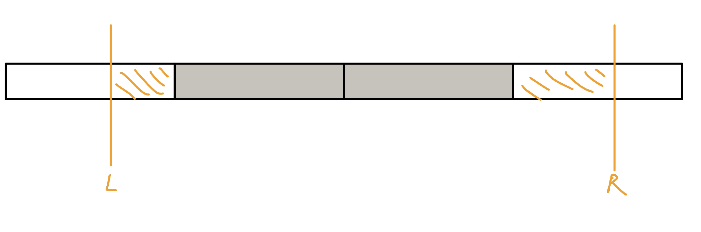
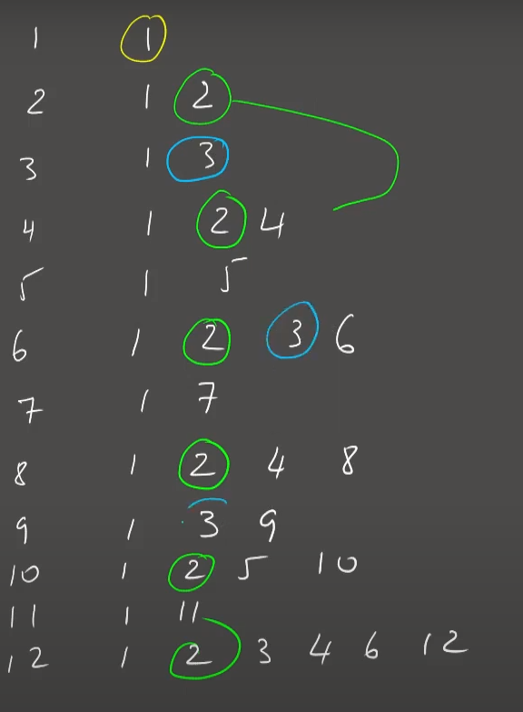
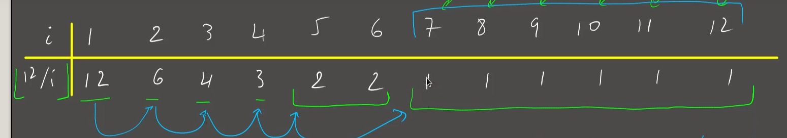

雖然時間複雜度比線段樹還差，但分塊的強處在維護資訊上更加彈性，特別是修改時難以快速更新的類型，這部分是線段樹所不及的

## 序列分塊

我們將序列每 k 個當成一個 Block，對於每筆 query，會包含中間完整的 Block 與旁邊兩個不完整的 Block，對於完整的我們需要先預處理好答案，對於不完整的直接暴力算，複雜度 O(n / k + k)

<figure markdown>
  { width="500" }
</figure>

???+note "[CS Academy Modulo Queries](https://csacademy.com/contest/archive/task/modulo-queries/statement/)"
	給一個長度為 $n$ 的陣列 $a_1, \ldots, a_n$，有 $q$ 筆查詢如下 :
	
	- $\text{query}(l, r, k):$ 輸出 $\max \limits_{i=l\ldots r} a_i$ % $k$
	
	$1\le n,q,a_i,k\le 4\times 10^4$
	
	??? note "思路"
		先將 a 複製一個新陣列，將新陣列 sort 好然後慢慢放寬 threshold，將每個元素加到各自的 block 裡面，對於每個 block 令 mx[i] 為 block 內 < i 的最大值，這可以用類似前綴和的方式建好，對於每個 block 我們令 dp[i] 為 block 內 mod i 之下的最大值，這個可以去跑 mx[i], mx[i * 2], mx[i * 3], ... 取 max。最後，對於每筆詢問暴力處理不完整塊，O(1) 查表完整塊即可。這樣複雜度 $O(\frac{n}{B}\times k\log k + qB)$，$B$ 取 $k \log k$ 可得 $O(k\sqrt{k \log k})$

???+note "[CF 785 E. Anton and Permutation](https://codeforces.com/problemset/problem/785/E)"
	給一個 $1\ldots n$ 的 permutation，$q$ 次 swap$(i,j)$，每次 swap 完輸出逆序數對數量
	
	$n\le 2\times 10^5, q\le 5\times 10^4$
	
	??? note "思路"
		將序列每 sqrt(n) 個當成一個 block。假如交換 i 位置和 j 位置（假設 i < j），那麼只需要統計 [i + 1, j - 1] 這個區間內比 a[i] 大的有幾個, 小的有幾個，比 a[j] 位置的數大的有幾個, 小的有幾個即可。所以在 query 時對於完整的 block 直接在 block 內二分（對於每個 block 開一個大小為 n 的 BIT）。

???+note "[CF 617 E. XOR and Favorite Number](https://codeforces.com/problemset/problem/617/E)"
	給一個長度為 $n$ 的序列 $a_1, \ldots ,a_n$，與 $q$ 次詢問 :
	
	- $\text{query}(l,r):$ 輸出區間內有多少個 subarray 的 $a_i \oplus \ldots \oplus a_j=k$
	
	$n,q\le 10^5,0\le k\le 10^6$
	
	??? note "思路"
		先建好前綴 xor pre[i]。對於一個 pre[j]，能湊到 k 的 pre[i] 就是 cnt[pre[j] $\oplus$ k] 個。add, del 的代碼如下
		
		```cpp
		void add(int x) {
	        ans += cnt[x ^ k];
	        cnt[x]++;
	    }
	    void del(int x) {
	        cnt[x]--;
	        ans-=flag[x ^ k];
	    }
	    ```

## 值域分塊

一般來說，值域分塊會作為一個輔助工具出現在題目當中。

依照將值域分成每 k 個一塊，修改操作就直接 O(1) 更新「值域」所在的 block 的資訊，查詢操作就一樣分成完整的 block 與不完整的，不完整的 block 就直接暴力算，完整的直接取整個 block 的資訊

???+note "集合第 k 小"
	給一個長度為 $n$ 的序列，維護以下操作 :
	
	- $\text{insert}(x):$ 插入 $x$
	
	- $\text{erase}(x):$ 刪除 $x$
	
	- $\text{query}(k):$ 詢問集合中第 $k$ 小的元素
	
	$n,x\le 5\times 10^4$
	
	??? note "思路"
		將值域 C 分成每 sqrt(C) 一塊
		
		對於每個 insert，我們直接將值域 x 所在的塊的 cnt++，並將 v[x]++
		
		對於每個 query，我們一次 jump 一整個 block 直到我們發現當前 jump 過的 block 的總和 <= k，再去暴力掃過該 block，看 v[x] 總和何時會 >= k

???+note "求第 k 小（支持單點修改）"
	給一個長度為 $n$ 的陣列 $a$，有 $q$ 筆操作 :
	
	- 單點修改
	
	- 詢問區間第 k 小
	
	$1\le n\le 5\times 10^4$
	
	??? note "思路"
		分成 sqrt(n) 塊， 塊的大小為 sqrt(n)，塊內維護有序數列。修改就暴力重構塊，這不會超時。對於每一個詢問，先二分一個區間權值（發現這道題是1~1e9），然後去統計所求的區間內小於這個數的個數有多少。對於兩邊不完整的塊暴力統計，對於完整的塊，則二分查找最小的數，即可在 log 時間內得到答案。
		
		> 參考自 : [洛谷題解](https://www.luogu.com.cn/blog/wsr/fen-kuai-qiu-di-k-xiao-zhi-chi-dan-dian-xiu-gai-post)

???+note "[洛谷 P4867 Gty的二逼妹子序列](https://www.luogu.com.cn/problem/P4867)"
	給 $n$ 個數 $a_1, \ldots ,a_n$，有 $q$ 筆查詢如下 :
	
	- $\text{query}(l,r,a,b):$ 問在 $a_l,\ldots ,a_r$ 中，值域在 $[a,b]$ 之間有幾種
	
	$n\le 10^5, m\le 10^6, 1\le l,r,a,b\le n$
	
	??? note "思路"
		利用莫隊離線維護 query，對於詢問 [a, b] 之間的數字，使用值域分塊
		
		因為不管是陣列大小還是值域都是 $\le n$，所以莫隊與值域分塊的 block size 都可設成 $O(\sqrt{n})$
		
	??? note "code"
		```cpp linenums="1"
		#include <bits/stdc++.h>
	    #define pb push_back
	    #define ALL(x) x.begin(), x.end()
	
	    using namespace std;
	
	    const int N = 1e5 + 5;
	    const int Q = 1e6 + 5;
	    int n, q, k;
	    int a[N], lb[N], rb[N], cnt[N], sum[N], block[N], ans[Q];
	
	    struct Query {
	        int l, r, x, y, id;
	
	        bool operator<(const Query &rhs) const {
	            if (block[l] == block[rhs.l]) {
	                return r < rhs.r;
	            }
	            return block[l] < block[rhs.l];
	        }
	    };
	
	    void add(int x) {
	        if (cnt[x] == 0) {
	            sum[block[x]]++;
	        }
	        cnt[x]++;
	    }
	
	    void del(int x) {
	        cnt[x]--;
	        if (cnt[x] == 0) {
	            sum[block[x]]--;
	        }
	    }
	
	    int query(int l, int r) {
	        int ans = 0;
	        if (block[l] == block[r]) {
	            for (int i = l; i <= r; i++) {
	                if (cnt[i]) {
	                    ans++;
	                }
	            }
	            return ans;
	        }
	        for (int i = block[l] + 1; i <= block[r] - 1; i++) {
	            ans += sum[i];
	        }
	        for (int i = l; i <= rb[l]; i++) {
	            if (cnt[i]) {
	                ans++;
	            }
	        }
	        for (int i = lb[r]; i <= r; i++) {
	            if (cnt[i]) {
	                ans++;
	            }
	        }
	        return ans;
	    }
	
	    signed main() {
	        cin >> n >> q;
	        k = sqrt(n);
	        for (int i = 0; i < n; i++) {
	            cin >> a[i];
	            a[i]--;
	        }
	        for (int i = 0; i < n; i++) {
	            block[i] = i / k;
	            lb[i] = (i / k) * k;
	            rb[i] = lb[i] + k - 1;
	            if (rb[i] > n - 1) rb[i] = n - 1;
	        }
	        vector<Query> queries;
	        for (int i = 0; i < q; i++) {
	            int l, r, x, y;
	            cin >> l >> r >> x >> y;
	            l--, r--, x--, y--;
	            queries.pb({l, r, x, y, i});
	        }
	        sort(ALL(queries));
	        int l = 0, r = -1;
	        for (auto i : queries) {
	            while (i.l < l) add(a[--l]);
	            while (r < i.r) add(a[++r]);
	            while (l < i.l) del(a[l++]);
	            while (i.r < r) del(a[r--]);
	            ans[i.id] = query(i.x, i.y); 
	        }
	        for (int i = 0; i < q; i++) {
	            cout << ans[i] << '\n';
	        }
	    } 
	    ```

## 操作分塊

常常出現在「不帶修改很可做，但帶了修就都沒法維護了，而且只有修改的話不難維護」的題上。

操作分塊就是對操作序列（詢問 + 修改）進行分塊。處理到一塊時，我們已經將操作分成了兩個部分：

1. 先前塊內的修改。這個在每次做完一個 Block 的時候就可以直接修改原本的陣列。
2. 當前塊內的修改。而這些修改總數不會達到塊大小，因此可以樸素地計算這部分的貢獻。

在 block 裡的，暴力掃過，複雜度 O(q * k)

每次看完一個 block 將直接修改原本的陣列，複雜度 O((q / k) * q)

???+note "[LOJ #6280. 数列分块入门 4](https://loj.ac/p/6280)"
	給一個長度為 $n$ 的陣列 $a$，有 $q$ 筆操作 :
	
	- 區間加值
	
	- 區間求和
	
	$1\le n\le 5\times 10^4$
	
	??? note "思路"
		將操作依照時間小到大分塊，每 k 個一組。對於每個 query(ql, qr)，暴力掃過跑該 block 裡面所有的 add(l, r)，計算 [l, r] 在 [ql, qr] 的貢獻。對於每個 block 結束後再重新執行一次前綴和，複雜度 O(q * k + (n / k) * n)

???+note "[APIO2019 桥梁](https://loj.ac/p/3145)"
	給定一張 $n$ 個點 $m$ 邊的無向圖和 $q$ 次詢問。可以：  
	
	1. 修改某條邊的邊權
	
	2. 從點 $u$ 出發，只經過邊權 $\le k$ 的邊，可以到幾個點
	
	$1\le n\le 5\times 10^4,0\le m\le 10^5,1\le q\le 10^5$
	
	??? note "思路"	
		將操作依照時間小到大分塊，每 k 個一組。每組將裡面的 query 從大到小處理，對於每一個 query，依序加入非修改的邊，有修改的邊就直接全部暴力掃過，掃完之後要到下一個 query 的時候需要 rollback。
		
		非修改邊在一個 block 中最多掃到 m 個，共 O(m * (q / k))，修改的邊 O(q * k)，還要乘上 rollback dsu 的 O(log n)，複雜度 O(m * (q / k) * logn + q * k * log n) 

## 數論分塊

???+note "[Zerojudge d193. 11526 - H(n)](https://zerojudge.tw/ShowProblem?problemid=d193)"
	給定 $1\le n\le 10^9$，求
	
	$$
	\sum \limits_{i=1}^n \lfloor\frac{n}{i}\rfloor
	$$

<figure markdown>
  { width="500" }
</figure>

對於 $i\le \sqrt{n}$，最多只有 $\sqrt{n}$ 種不同的值

對於 $i > \sqrt{n}$，$\frac{n}{i}$ 最多只有 $\sqrt{n}$ 種不同的值

??? note "code"
    ```cpp linenums="1"
    #include <bits/stdc++.h>
    #define int long long

    using namespace std;
    
    void solve() {
        int n;
        cin >> n;
    
        int total = 0, at = 1;
        while (at <= n) {
            int cur = n / at;  // n / i 到多少了
            int last_same = n / cur; // 這個 n/i 的質最多可以延續到哪格
    
            total += cur * (last_same - at + 1);
            at = last_same + 1;
        }
    
        cout << total << endl;
    }
    
    signed main() {
        int t;
        cin >> t;
        while (t--) {
            solve();
        }
    }
    ```

???+note "[CSES - Sum of Divisors](https://cses.fi/problemset/task/1082)"
	令 $\sigma(n)$ 為 $n$ 的因數相加總和，問 $\sum \limits_{i=1}^n \sigma(n)$
	
	$1\le n\le 10^{12}$
	
	??? note "思路"
	    觀察 12
	
		<figure markdown>
	      { width="300" }
	    </figure>
	
	    每個數字出現 $\frac{n}{i}$ 次，答案就是 $\sum\frac{n}{i}\times i$ 其中 $i=1...n$
	
		<figure markdown>
	      { width="300" }
	    </figure>
		
	    就變成 zerojudge - H(n) 的題目了
	
	??? note "code"
	    ```cpp linenums="1"
	    #include <iostream>
	
	    using std::cout;
	    using std::endl;
	
	    const int MOD = 1e9 + 7;
	
	    int main() {
	        long long n;
	        std::cin >> n;
	
	        long long total = 0;
	        long long at = 1;
	        while (at <= n) {
	            long long add_amt = n / at;  // n / i 到多少了
	            long long last_same = n / add_amt; // 這個 n/i 的質最多可以延續到哪格
	
	            total = (total + add_amt * (last_same - at + 1));
	            at = last_same + 1;
	        }
	
	        cout << total << endl;
	    }
	    ```

???+note "[洛谷 P2261 [CQOI2007] 余数求和](https://www.luogu.com.cn/problem/P2261)"
	給 $n,k$ 問

	$$
	\sum _ {i=1}^n k \% i
	$$
	
	$n,k\le 10^9$
	
	??? note "思路"
		原式可以寫成 $\displaystyle \sum _ {i=1}^n k - i\times \lfloor \frac{k}{i} \rfloor = n\times k - \sum \limits_{i=1}^n \lfloor \frac{k}{i} \rfloor \times i$

## 根號分治

???+note "[洛谷 P3396 哈希冲突](https://www.luogu.com.cn/problem/P3396)"
	給定一個長度 $n$ 陣列 $a_0 \dots, a_{n-1}$，初始每數皆為 $0$，

    1. $\text{add}(i,v):$ 將 $a_i$ 加 $v$
    2. $\text{query}(p, x):$ 輸出所有 $i$ % $p = x$ 的 $a_i$ 值加總
    
    $n,m\le 1.5 \times 10^5, 1\le a_i \le 1000$
    
    ??? note "思路"
    	定義 $sum[p][x]$ 為 $i$ % $p = x$ 的 $a_i$ 值加總，但 $p\le \sqrt{n}$。
    	
    	在 $\text{add}(i,v)$ 的時候將 $a_i$ += $v$，也將 $sum[x][i\% x]$ += $v,x\in \{ 1, 2, \ldots ,\sqrt{n} \}$
    	
    	這樣當 $p \le \sqrt{n}$，我們直接輸出 $sum[p][x]$，$p > \sqrt{n}$，直接暴力加總 $a[x] + a[p + x] + a[2 \times p + x] + \ldots$

???+note "例題"
	給一個 $n$ 個點 $m$ 邊無向圖，每個節點上有一個數字，一開始都是 $0$。接下有有 $q$ 個操作 :

    - $\text{query}(x):$ 輸出編號 $x$ 的節點上面的數字
    
    - $\text{add}(x):$ 把編號 $x$ 的節點以及它的所有鄰居上面的數字都加上 $1$
    
    $O(q \sqrt{m})$ 
    
    ??? note "思路"
    	- add(v)
            
            - $\deg(v) \le \sqrt{m}$ :  暴力更新自己和鄰居的數值
    
            - $\deg(v)>\sqrt{m}$ : 只更新自己，並在自己將 lazy tag++
    
    	- query(v):
    	
    		- 回傳自己點上的數值和暴力查詢 $\deg(v) > \sqrt{m}$ 的鄰居，因為 $\deg(v) > \sqrt{m}$ 的數量 $<O(\sqrt{m})$
    
        - degree 總和為 $2m$

???+note "[CF 13 E. Holes](https://codeforces.com/contest/13/problem/E)"
	有 $n$ 個點，點 $i$ 有一個權值 $a_i$，表示站下一步會跳到點 $i+a_i$，可能跳出區間 $[1,n]$。給 $q$ 筆操作 :
	
	- $\text{update}(i,x):$ 將某個 $a_i$ 改成 $x$
	
	- $\text{query}(x):$ 詢問從點 $x$ 開始，需要多少步才能跳到 $n$ 以外，以及最後一個經過的點是哪一個。
	
	$n,m\le 10^5$
	
	??? note "思路"
		對於每個塊，對於每個點，維護需要多少步跳出此塊，並且跳出此塊後將跳向哪個點。單點修改只需要動一塊就好，query 只會跳 $\sqrt{n}$ 次
		
	??? note "code"
		```cpp linenums="1"
		# include <bits/stdc++.h>
	
	    typedef long long ll;
	    using namespace std;
	
	    const int N = 1e5 + 5;
	    const int M = 4e2 + 50;
	    int n, m;
	    int l[N], r[N], belong[N];
	    int cnt, num, x, v, ans;
	    int a[N], tot[M], go[N], nxt[N];
	
	    void init() {
	        num = sqrt(n);
	        cnt = n / num;
	        if (n % num)
	            cnt++;
	        for (int i = 1; i <= n; i++) {
	            belong[i] = (i - 1) / num + 1;
	        }
	        for (int i = 1; i <= cnt; i++) {
	            l[i] = (i - 1) * num + 1;
	            r[i] = min(n, i * num);
	            for (int j = r[i]; j >= l[i]; j--) {
	                if (nxt[j] > r[i]) {
	                    tot[j] = 1;
	                    go[j] = nxt[j];
	                } else {
	                    tot[j] = tot[nxt[j]] + 1;
	                    go[j] = go[nxt[j]];
	                }
	            }
	        }
	    }
	
	    int main() {
	        int op, ll, rr, x, y;
	        scanf("%d%d", &n, &m);
	        for (int i = 1; i <= n; i++) {
	            scanf("%d", &a[i]);
	            nxt[i] = min(n + 1, a[i] + i);
	        }
	        init();
	        while (m--) {
	            scanf("%d", &op);
	            if (!op) {
	                scanf("%d%d", &x, &y);
	                int b = belong[x];
	                nxt[x] = min(n + 1, x + y);
	                for (int j = r[b]; j >= l[b]; j--) {
	                    if (nxt[j] > r[b]) {
	                        tot[j] = 1;
	                        go[j] = nxt[j];
	                    } else {
	                        tot[j] = tot[nxt[j]] + 1;
	                        go[j] = go[nxt[j]];
	                    }
	                }
	            } else {
	                scanf("%d", &x);
	                int b, y;
	                int ans1, ans2 = 0;
	                while (x <= n) {
	                    ans2 += tot[x];
	                    if (go[x] > n) y = x;
	                    x = go[x];
	                }
	                while (y <= n) {
	                    ans1 = y;
	                    y = nxt[y];
	                }
	                printf("%d %d\n", ans1, ans2);
	            }
	        }
	        return 0;
	    }
	    ```

???+note "[CF 797 E. Array Queries](https://codeforces.com/problemset/problem/797/E)"
	給長度為 $n$ 的序列 $a_1, \ldots, a_n$，有 $q$ 筆詢問 :
	
	- $\text{query(p, k):}$ 不斷進行操作 $p=p + a_p + k$，直到 $p > n$ 為止，共幾次操作
	
	$n,\le 10^5, 1\le a_i, p, k\le n$
	
	??? note "思路"
		若 k >= sqrt(n)，那麼暴力跳，做多 sqrt(n) 次
		
		若 k < sqrt(n)，令 sum[p][k] 為詢問的答案，O(n * sqrt(n)) 預處理
		
		> 參考 : <https://blog.csdn.net/weixin_44178736/article/details/110395582>

???+note "[NPSC 2020 高中組初賽 pA. 邊緣人](https://contest.cc.ntu.edu.tw/npsc2020/teamclient/semi_senior.pdf#page=3)"
	有 $N$ 個人，當 $x$ 個人分成一組時，最後 $N \space \text{mod} \space x$ 會自成一組，稱這些人為邊緣人。令 $f(i)=$ 所有 $1\le x\le N$ 中，會使第 $i$ 人是邊緣人的數量。給定 $L, R$，請求出 $f(L), f(L + 1), \ldots , f(R)$。
	
	$1\le N\le 2^{30}, L\le R\le N, R - L \le 3\times 10^5$
	
	??? note "思路"
		可以列出 $i$ 在 $x$ 人一組時是邊緣人的範圍是 [1 + [N/x] * x, N]
		
		我們先想暴力怎麼做 :
		
		```cpp
		f[] = 0
	    for x = 1 ~ N:
	        u = 1 +[N/x] * x
	        v = N
	        f[u] += 1, f[v+1] -= 1
	    ```
	    
	    我們發現對於 $\lfloor \frac{N}{x} \rfloor$ 是一樣的 $x$，$\lfloor \frac{N}{x} \rfloor\times x$ 會形成一個等差數列，這樣我們就得到了一個類似塞法的做法
	    
	    ```cpp
	    f[] = 0
	    for d = 1 ~ sqrt(N):
	        minx = ???
	        maxx = ???
	        u = 1 + d * x
	        v = N
	        for (i = minx; i<= maxx; i++) {
	                if (1 + d*i <= L): f[L] += 1
	                else: f[1 + d*i] += 1     // O( (R-L+1) / d )
	    			f[v+1] -= 1; 
	    	}
		```
		
		其中，在 $1 + d\times i$ 在 $L$ 以下的可以用數學算，所以我們其實只要枚舉 $\lfloor \frac{N}{x} \rfloor\times x$ 在 $[L, R]$ 之間的即可，這樣對於 $\lfloor \frac{N}{x} \rfloor$ 為 $d$ 時複雜度是 $O( (R-L+1) / d )$，類似篩法，加起來就是 $O((R - L + 1) \times \log \sqrt{N})$

其他練習可上[LOJ 題單](https://loj.ac/p?tagIds=207%2C79)

---

## 資料

- <https://zhuanlan.zhihu.com/p/452977429>

- <https://www.tw511.com/a/01/51322.html>

- <https://blog.csdn.net/weixin_45675097/article/details/119709367>

- <https://zhuanlan.zhihu.com/p/594018645>