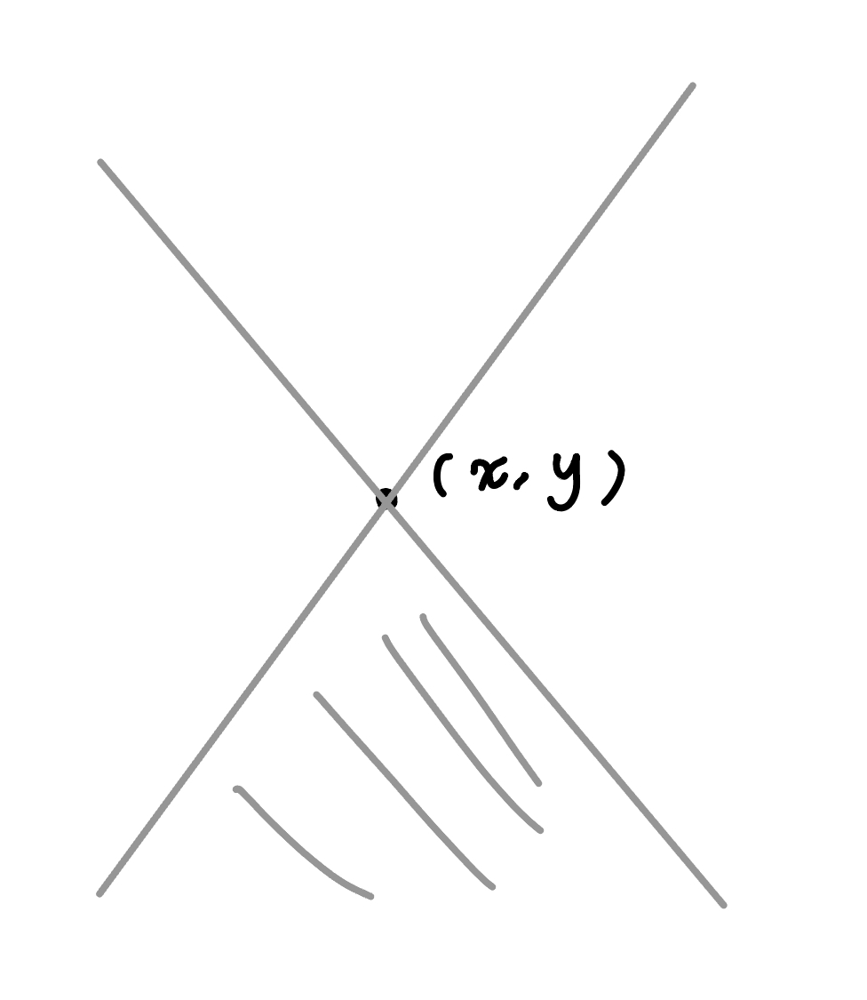
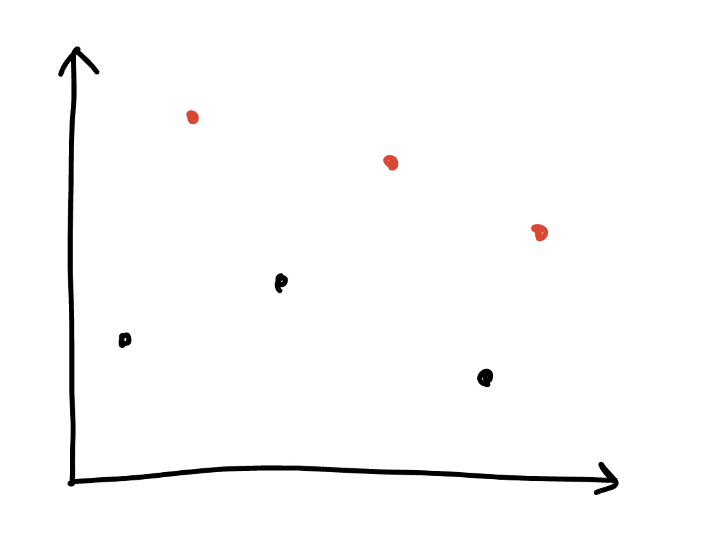

## 介紹

- 歐幾里德：$\sqrt{(x_i - x_j)^2 + (y_i - y_j)^2}$

- 曼哈頓（計程車幾何）：$|x_i - x_j| + |y_i - y_j|$

- 切比雪夫：$\max(|x_i - x_j|, |y_i - y_j|)$

## 轉換

先來看圖

<figure markdown>
  { width="400" }
</figure>

- 曼哈頓 ⇒ 切比雪夫

	- $$(x,y)\Rightarrow (x+y,x-y)$$

	- 原本座標的曼哈頓距離 = 新座標中的切比雪夫距離

- 切比雪夫 ⇒ 曼哈頓

	- $$(x,y)\Rightarrow (\frac{x+y}{2},\frac{x-y}{2})$$

	- 原本座標的切比雪夫距離 = 新座標中的曼哈頓距離 

## 例題

???+note "[IOI 2007 Pairs](https://tioj.ck.tp.edu.tw/problems/1345)"
	有一個盤面大小為 $m$，給 $n$ 個 $B$ 座標點 $p_i$，問有幾對 $(i,j)$ 使曼哈頓距離 $dis(p_i,p_j)$ 不超過 $D$
	
	$B\in \{1,2,3\}, n\le 10^5,m\le \{7.5\times 10^7, 7.5\times 10^4, 75\}$
	
	??? note "思路"
		一維: two pointer
		
		二維: sweep line
		
		- (x-d, y) ⇒ +1
	
		- (x, y) ⇒ query[y-d, y+d]
	
		- (x+d, y) ⇒ -1
	
		三維: m^2 枚舉 z，變二維的問題，注意自己會算到自己，所以答案要減 n

???+note "[JOI 2023 Advertisement 2](https://loj.ac/p/3941)"
	一維座標上，有 $n$ 個點，第 $i$ 個點在 $x_i$，影響力為 $e_i$。若選擇一個點 $i$，能覆蓋點 $j$ 若且唯若 $|x_i-x_j| \le e_i - e_j$，問最少要選幾個點才能使所有點都被覆蓋
	
	$n\le 5\times 10^5, 1\le x_i, e_i\le 10^9$
	
	??? note "思路"
		想成在二維座標平面上的點 $(x_i, e_i)$，會發現要選的區域恰好是
		
		<figure markdown>
          { width="400" }
        </figure>
        
        轉 45 度後，問題就變成，有選的點會覆蓋左下，至少要選幾個點才能使全部被覆蓋。會發現答案就是從 x 左往右看過去 y 座標遞減的一些點，可用單調 stack 維護
        
        <figure markdown>
          { width="400" }
        </figure>
	
---

- <https://hackmd.io/@FHVirus/SJ0kzMGM_#/9/5>
