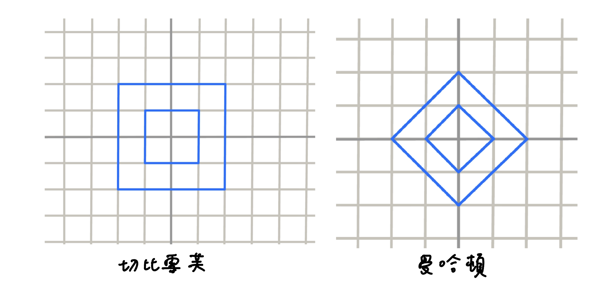

## 介紹

- 歐幾里德：$\sqrt{(x_i - x_j)^2 + (y_i - y_j)^2}$

- 曼哈頓（計程車幾何）：$|x_i - x_j| + |y_i - y_j|$

- 切比雪夫：$\max(|x_i - x_j|, |y_i - y_j|)$

## 轉換

先來看圖

<figure markdown>
  { width="100" }
</figure>

### 曼哈頓 ⇒ 切比雪夫

$$(x,y)\Rightarrow (x+y,x-y)$$

原本座標的曼哈頓距離 = 新座標中的切比雪夫距離

### 切比雪夫 ⇒ 曼哈頓

$$(x,y)\Rightarrow (\frac{x+y}{2},{x-y}{2})$$

原本座標的切比雪夫距離 = 新座標中的曼哈頓距離 

???+note "[IOI 2007 Pairs](https://tioj.ck.tp.edu.tw/problems/1345)"
	有一個盤面大小為 $m$，給 $n$ 個 $B$ 座標點 $p_i$，問有幾對 $(i,j)$ 使曼哈頓距離 $dis(p_i,p_j)$ 不超過 $D$
	
	$B\in \{1,2,3\}, n\le 10^5,m\le \{7.5\times 10^7, 7.5\times 10^4, 75\}$
	
	??? note "思路"
		一維: two pointer
		
		二維: sweep line
		
		- (x-d, y) ⇒ +1

		- (x, y) ⇒ query[y-d, y+d]

		- (x+d, y) ⇒ -1

		三維: m^2 枚舉 z，變二維的問題，注意自己會算到自己，所以答案要減 n
		

---

- <https://hackmd.io/@FHVirus/SJ0kzMGM_#/9/5>
