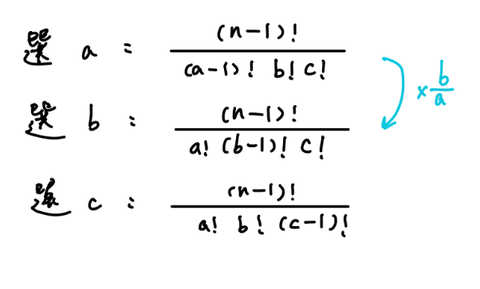

## 定義

string $a$ 比 string $b$ 字典序還小符合以下條件之一

- $a$ 是 $b$ 的 prefix

- 存在 $1\le i\le \min(|a|, |b|)$ 使得 $a_i < b_i$，且 $1\le j < i$，$a_j=b_j$

利用 c++ string operator `<` 可以判斷兩個字串的字典序，複雜度 O(n)

???+note "性質應用 [CF 1886 C. Decreasing String](https://codeforces.com/contest/1886/problem/C)"
	給一個字串 $s$，每次會將 $s$ 移除一個字元，使剩下的 $s$ 字典序最小。將這個過程的 $s$ 併起來變成一個大字串，問第 $k$ 項是多少
	
	$1\le |s| \le 10^6,s$ 為 a-z
	
	??? note "思路"
		我們先來思考要怎麼刪除比較好，依照字典序的定義，他是從左往右看，直到看到一個 i 滿足 $a_i<b_i$。我們也是一樣從左往右看，若發現當前元素滿足 $s_{i} > s_{i+1}$，那我們得刪除 $s_i$，然後盡量將 $s_{i+1}$ 移往開頭（也就是 pop 到前面是第一個比 $s_{i+1}$ 小的）會是最好的，這個過程其實就是可用單調 stack 來維護。若發現當前整個序列 $s$ 都是遞增的，那麼我們將最後一個元素刪除會是最好的，因為如果刪除其他元素會使大的被往前推。
		
		所以我們可以用上面那種方式模擬，然後每次模擬出一個字串後（刪掉一個元素後），讓 k 減掉當前序列的長度，直到無法再減即模擬到我們要的答案所在的字串 $s$。
		
	??? note "code"
		```cpp linenums="1"
		#include <bits/stdc++.h>

        using namespace std;

        int t;
        long long p, n;
        string s;

        int main() {
            cin >> t;
            while (t--) {
                cin >> s >> p;
                n = s.length();
                s = " " + s + " ";
                vector<char> stk;
                bool done = (p <= n);
                for (int i = 1; i <= s.length() + 1; ++i) {
                    while ((!done) && (!stk.empty()) && (stk.back() > s[i])) {
                        stk.pop_back();
                        p -= (n--);
                        done = (p <= n);
                    }
                    stk.push_back(s[i]);
                }
                cout << stk[p - 1];
            }
            return 0;
        }
        ```

## 字典序第 k 小

一般這種問題會問以字典序排列後，字典序第 k 小的是多少，例如說輸出一個字典序第 k 小的 permutation。我們將 k 定義為「必須跳過 k 項」，也就是 0-base，這樣在實作上會比較容易思考。

<figure markdown>
  { width="300" }
</figure>

我們每次確定一位，計算目前確定的前綴 + 該位為開頭的數字有多少個，我們把它叫做 num，k < num，則我們就確定了當前位，可以往下一位去確定，否則 k 減去 num，並繼續考慮當前位需要放什麼。

```linenums="1" title="pseudocode"
while (k > 0) {
	int num = f(); // 計算以當前前綴開頭的數量
	if (k >= num) {
		// 可將這 num 項跳過，同層移動
		// 若 k = num，代表我必須跳過 num 項
		k -= num;
	} else {
		// 往下層考慮
	}
}
```

??? info "實際例子"
	假如我們要求字串 "abc" 的第 5 小的 permutation，也就是要跳過 k = 4 項
	
	<figure markdown>
	  { width="300" }
	</figure>
	
	我們看以 a 開頭的 permutation 有幾個，發現是 2 個，但 k >= 2，所以我們必須繼續找這一位要放什麼，並將 k -= 2，所以目前 k = 2。以 b 開頭的 permutation 也有 2 個，我們發現 k = 2，所以我們必須跳過 2 個，也就是將 b 開頭的這 2 個 permutation 給跳過，然後繼續找這一位要放什麼，並將 k -= 2，所以目前 k = 0。c 開頭數量也是 2 個，而此時 k < 2，代表我們已經確定這一位要放 c，可以往下一位繼續考慮，以 ca 為開頭的數量是 1 個，而此時 k = 0，又 k < 2，代表我們確定了以 ca 為開頭，繼續坐下去後最後就得到了 cab 

???+note "[Leetcode 440.K-th Smallest in Lexicographical Order](https://leetcode.com/problems/k-th-smallest-in-lexicographical-order/)"
	將 [1, n] 內的元素按照字典序小到大排序後，問第 k 項（1-base）是多少
	
	$1 \le k \le n \le 10^9$
	
	??? note "思路"
		我們先將答案的第一位確定下來，再確定第二位，第三位，...。例如說以 1 開頭的不足 k，k -= 1 開頭的數量，我們就要考慮 2，如果這時夠了，就先將 k -= 1（扣掉單純是 2 ），我們下一位就是要確定 2 後面要放什麼，可能是 0~9，所以我們再看 20 開頭的數量夠不夠 k，...。
		
		<figure markdown>
	      { width="450" }
	    </figure>
		
		如果還是不懂得話，這邊有[bilibili的影片](https://m.bilibili.com/video/BV1944y1N7ha)可以參考
	
	??? note "code"
		```cpp linenums="1"
		class Solution {
	    public:
	        int f(int cur, long long n) {
	        	// return 以 cur 開頭的數字數量
	            long long le = cur, ri = cur;
	            int ans = 0;
	            while (le <= n) {
	                ans += min(ri, n) - le + 1;
	                le = le * 10;
	                ri = ri * 10 + 9;
	            }
	            return ans;
	        }
	        int findKthNumber(int n, int k) {
	            int cur = 1;
	            k--;
	            while (k > 0) {
	                int num = f(cur, n);
	                if (k >= num) {
	                	// 改變當前位的數字
	                    k -= num;
	                    cur++;
	                } else {
	                	// 確定了當前位，之後換成考慮下一位
	                    k -= 1;
	                    cur = cur * 10;
	                }
	            }
	            return cur;
	        }
	    };
	    ```

???+note "[2018 TOI 初選 pB. 排列第幾個？（Permutation）](https://tioj.ck.tp.edu.tw/problems/2052)"
	給一個字串 s，問這是字典序幾小的排列
	
	$|s|\le 1024$
	
	??? note "思路"
		跟上面的方法差不多，只是現在是加上去的
		
	??? note "code"	
		```cpp linenums="1"
		#include <bits/stdc++.h>
	    #define int long long
	
	    using namespace std;
	
	    const int MAXN = 1200 + 5;
	
	    int n, M;
	    string s;
	    int C[MAXN][MAXN];
	
	    void build() {
	        C[0][0] = 1;
	        for (int i = 1; i <= n; i++) {
	            for (int j = 0; j <= i; j++) {
	                if (j == 0) {
	                    C[i][j] = 1;
	                } else {
	                    C[i][j] = (C[i - 1][j] + C[i - 1][j - 1]) % M;
	                }
	            }
	        }
	    }
	
	    map<int, int> mp;
	
	    int get(int i) {
	        int cnt = n - i;
	        int res = 1;
	        for (auto [u, v] : mp) {
	            if (v > 0) {
	                res = (res * C[cnt][v]) % M;
	                cnt -= v;
	            }
	        }
	        return res;
	    }
	
	    int convert(char c) {
	        if ('a' <= c && c <= 'z') {
	            return c - 'a' + 1 + 26;
	        } else if ('A' <= c && c <= 'Z') {
	            return c - 'A' + 1;
	        }
	    }
	
	    signed main() {
	        cin >> M >> s;
	        n = s.size();
	        s = "$" + s;
	        for (int i = 1; i <= n; i++) {
	            mp[convert(s[i])]++;
	        }
	
	        build();
	        int k = 0;
	        for (int i = 1; i <= n; i++) {
	        	// 計算以當前位字典序小於 s[i] 時的 permutation 數量
	            for (auto [u, v] : mp) {
	                if (convert(s[i]) == u) {
	                    mp[u]--;
	                    break;
	                }
	                if (v > 0) {
	                    mp[u]--;
	                    k += get(i);
	                    k %= M;
	                    mp[u]++;
	                }
	            }
	        }
	        cout << k << '\n';
	    }
		```

???+note "[2022 全國賽 pG. 算樹 (tree)](https://sorahisa-rank.github.io/nhspc-fin/2022/problems.pdf#page=21)"
	設 $T$ 為一棵有 $n$ 個節點的樹，節點編號 $1, 2, \ldots , n$，已知 $T$ 每個節點的 degree 為 $d_1,d_2,\ldots ,d_n$，其中 $d_i$ 為點 $i$ 的 degree，求出 $T$ 所有可能的 Prüfer 序列中，字典序第 $k$ 小的，如果沒有輸出 $-1$
	
	$3<n\le 10^3,1\le k\le 10^9$
	
	??? note "思路"
		根據上面 Prüfer 序列的性質 2，題目就變成 :
		
		有一個陣列，第 $i$ 個數字出現 $d_i-1$ 次，求字典序第 $k$ 小的，至於要怎麼求字典序第 $k$ 小，我們可以沿用上面提到的技巧。我們一位一位填，然後枚舉當前這位要填的數字，假設當前還剩 $n$ 個空格可以填，我們的方法數就可以表示成：
		
		$$\frac{n!}{a!\times b!\times c! \times d!}$$
		
		我們可以用取 $\log$ 的方法來估計「大概」的答案，同時也用 $C^n_k\pmod{10^9+7}$ 的方法算出「精確」的答案。$\log$ 的方法是因為 $\frac{n!}{a!\times b!\times c! \times d!}=\log n!-\log a!-\log b! - \log c! - \log d!$。可以先預處裡 $\log n!=\sum_{i=1}^n \log i$，因為最後的答案 $\le 10^9$，依照**模逆元的正確性**，將 $\frac{n!}{a!\times b!\times c! \times d!}$ 直接算出來再 $\pmod{10^9+7}$ 跟 $\frac{n!}{a!\times b!\times c! \times d!}$ 利用組合數 + 模逆元的方法算出來是相同的。
		
		以下我們給出具體的例子，以下圖來說，當我們換選另一個數的時候：
		
		<figure markdown>
	      { width="300" }
	    </figure>
		
		$\log$ 的計算將會需要加上: $-\log(a-1)! + \log a! - \log (b-1)! + \log b!$
		
		$C^n_k\pmod{10^9+7}$ 的計算會需要乘上: $\times b \times \text{inv}(a)$
	
	??? note "code"
		```cpp linenums="1"
		#include <bits/stdc++.h>
	    #define int long long
	    #define pii pair<int, int>
	    #define pb push_back
	    #define mk make_pair
	    #define F first
	    #define S second
	    #define ALL(x) x.begin(), x.end()
	
	    using namespace std;
	
	    const double mxLog = 9;
	    const int INF = 1e18;
	    const int maxn = 3e5 + 5;
	    const int M = 1e9 + 7;
	    const long double EPS = 1e-8;
	
	    int n, k;
	    int d[maxn];
	    double preLog[maxn];  // preLog[i] = log(i!)
	    int prei[maxn], pinv[maxn], pref[maxn];
	
	    void build() {
	        preLog[0] = 0;
	        for (int i = 1; i <= n; i++) {
	            preLog[i] = preLog[i - 1] + log10(i);
	        }
	
	        prei[0] = prei[1] = pinv[0] = pinv[1] = pref[0] = pref[1] = 1;
	        for (int i = 2; i < maxn; i++) {
	            pref[i] = pref[i - 1] * i % M;
	            pinv[i] = (M - (M / i) * pinv[M % i] % M) % M;
	            prei[i] = prei[i - 1] * pinv[i] % M;
	        }
	    }
	
	    vector<int> work(int _n, int _k, const int _d[]) {
	        n = _n;
	        k = _k;
	        k--;
	        for (int i = 1; i <= n; i++) {
	            d[i] = _d[i];
	            d[i]--;
	        }
	
	        build();
	        vector<int> ans;
	        for (int t = n - 2; t >= 1; t--) {
	            int f, flag = false;
	            for (int i = 1; i <= n; i++) {
	                if (d[i]) {
	                    f = i;
	                    break;
	                }
	            }
	            double big = preLog[t - 1];
	            int small = pref[t - 1];
	
	            for (int i = 1; i <= n; i++) {
	                if (i == f) {
	                    big = big - preLog[d[i] - 1];
	                    small = (small * prei[d[i] - 1]) % M;
	                } else if (d[i]) {
	                    big = big - preLog[d[i]];
	                    small = (small * prei[d[i]]) % M;
	                }
	            }
	            int val;
	            if (big - mxLog > EPS) {
	                val = INF;
	            } else {
	                val = small;
	            }
	            for (int i = 1; i <= n; i++) {
	                if (d[i]) {
	                    if (i != f) {
	                        big += preLog[d[f] - 1] + preLog[d[i]];
	                        big -= preLog[d[f]] + preLog[d[i] - 1];
	                        small = (((small * pinv[d[f]]) % M) * d[i]) % M;
	                        if (big - mxLog > EPS) {
	                            val = INF;
	                        } else {
	                            val = small;
	                        }
	                        f = i;
	                    }
	                    if (k >= val) {
	                        k -= val;
	                    } else {
	                        ans.pb(i);
	                        d[i]--;
	                        flag = true;
	                        break;
	                    }
	                }
	            }
	            if (flag == false) {
	                return {-1};
	            }
	        }
	        return ans;
	    }
	
	    signed main() {
	        int n, k;
	        cin >> n >> k;
	        int d[1005];
	        for (int i = 1; i <= n; i++) cin >> d[i];
	        vector<int> ans = work(n, k, d);
	        for (auto ele : ans) cout << ele << '\n';
	    }
	    ```

???+note "<a href="/wiki/cp/contest/images/TOI-2023-3.pdf" target="_blank">2023 TOI 模擬賽決賽 pB. TOI 也會出字串題？</a>"
	給 n 個點 $\dfrac{n(n-1)}{2}$ 條邊的 DAG，滿足任意 $1\le i< j\le n$ 都存在 $i$ 到 $j$ 的有向邊。每個點都是一個字元。有 $q$ 筆詢問如下：
	
	- $\text{query}(s, t):$ 輸出 $s$ 到 $t$ 的字典序最小路徑（路徑上所有字元按照順序拼起來的字串字典序最小）
	
	$2\le n\le 800$
	
	??? note "思路"
		【subtask】
	
		我們要去進行轉移，但轉移要有正確的順序。令 $s_1, s_2$ 是字串，$c$ 是字元，$s_1$ 的字典序比 $s_2$ 小**不代表**$s_1+c<s_2+c$。例如說 $s_1=$a,$s_2=$aa,$c=$c。所以我們可以得到一個引理：點 x 到點 y 的字典序最小路徑一定是 x 走恰一條邊至某個點 i，再從點 i 走字典序最小路至點 y（如果改成「點 x 到點 y 的字典序最小路徑一定是 x 走字典序最小路到某個點 i，再從點 i 走恰一條邊至 y」依照上面提到的性質，就會發現是錯的）。
		
		所以我們可以令 dp(i, j) 代表點 i 至點 j 路徑上字典序最小字串，根據引裡可列出轉移式：
		
		$$
		dp(i, j) = \min\limits_{k=i+1}^j{s(i, k)+dp(k, j)}
		$$
		
		時間複雜度為 $O(n^4)$。