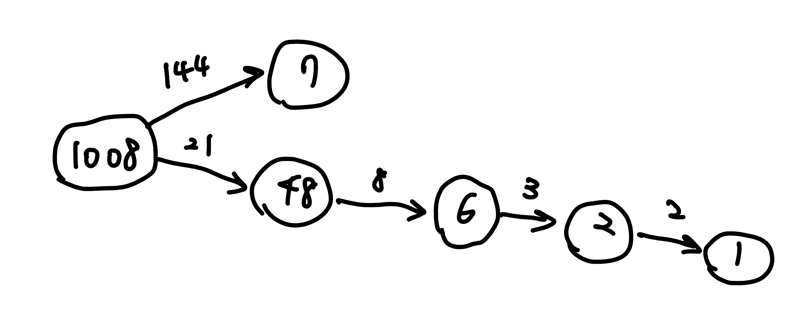

???+note "[Atcoder arc163 C. Harmonic Mean](https://atcoder.jp/contests/arc163/tasks/arc163_c)"
    $T$ 筆詢問，每次輸入 $N$，對於每次詢問，構造出 $A=(A_1,A_2,\ldots ,A_N)$，並符合以下條件 :

    - $\displaystyle \sum\limits_{i=1}^{N}\frac{1}{A_i}=1$
    
    - 全部都不相同
    
    - $1\le A_i \le 10^9(1\le i\le N)$
    
    $1\le T\le 500,1\le N\le 500$
    
    ??? note "思路"
    
        $\Rightarrow$ 國中小數競常用手法
    
        $\begin{cases}\displaystyle 1-\frac{1}{2}+\frac{1}{2}-\frac{1}{3}+ \ldots + \frac{1}{N-1}-\frac{1}{N}+\frac{1}{N}=1 \\ \displaystyle \frac{1}{i-1}-\frac{1}{i}=\frac{1}{(i-1)\times(i)}\end{cases}$
    
        $\displaystyle \frac{1}{1\times2}+\frac{1}{2\times3}+\ldots +\frac{1}{(N-1\times N)}+\frac{1}{N}=1$
    
        但若 $\displaystyle \frac{1}{N}=\frac{1}{(i-1)\times i}$ 這樣就會與前面的數字有重複 ex : 
        
        $\displaystyle \frac{1}{1\times2}+\frac{1}{2\times3}+\frac{1}{3\times4}+\frac{1}{4\times5}+\frac{1}{5\times6}+\frac{1}{6}$
    
        解決方法 :
    
        考慮到 $2,6,12,\ldots$ 差距成遞增，所以若 $\displaystyle \frac{1}{N}=\frac{1}{(i-1)\times i}$，$\displaystyle \frac{1}{N-1}$ 必會合法，所以先設定 $\displaystyle \frac{1}{1\times2}+\frac{1}{2\times3}\ldots \frac{1}{(N-2)\times (N-1)}+\frac{1}{N-1}+x=1$
    
        將前半部和 $x$ 看成兩部分，若前後各 $\displaystyle \frac{1}{2}$ 就會合法。
    
    ??? note "code"
        ```cpp linenums="1"
        #pragma GCC optimize("Ofast,no-stack-protector")
        #include <bits/stdc++.h>
        #define int long long
        #define pb push_back
        using namespace std;
    
        const int MAXN=2e5+10,INF=1e18;
        int t,n;
    
        signed main(){
            cin.tie(0);
            cin.sync_with_stdio(0);
    
            cin>>t;
            while(t--){
                cin>>n;
                if(n==2) cout<<"No\n";
                else{
                    cout<<"Yes\n";
                    int x=sqrt(n);
                    if(n==x*(x+1)){
                        for(int i=1;i<n-1;i++) cout<<i*(i+1)*2<<" ";
                        cout<<(n-1)*2<<" ";
                        cout<<2<<"\n";
                    }
                    else{
                        for(int i=1;i<n;i++) cout<<i*(i+1)<<" ";
                        cout<<n<<"\n";
                    }
                }
            }
        }
        ```

???+note "[2022 TOI pD. 2022](https://tioj.ck.tp.edu.tw/problems/2249)"
	給你兩個正整數 $x, y$，定義一個「好的數字」：

    - 只由 $0$ 和 $2$ 組成，恰有 $x$ 個 $0$ 和 $y$ 個 $2$
    
    - 是 $22$ 的倍數
    
    - 可以有 leading zeroes
    
    請問第二大和第二小的「好的數字」？
    
    $x,y \le 100000$

???+note "<a href="/wiki/problem/images/2024_toi_mock_0_pE.pdf" target="_blank">2024 TOI 模擬賽 測試 pE. 孤獨的吉姆</a>"
	給一個長度為 n 的序列 a，將其 reorder 使 $\min \limits_{i=2\ldots n} \{ a_i - a_{i - 1}\}$ 盡量大。輸出 reorder 後的 a。
	
	$n\le 2\times 10^5, -10^9\le a_i\le 10^9$
	
	??? note "思路"
		打表觀察。
		
		【subtask 1 - n 是偶數】:
		
		假設 $a_1, \ldots ,a_n$ 已經排序好，那答案就是 $a_{\frac{n}{2}+1}, a_1,a_{\frac{n}{2}+2}, a_2,a_{\frac{n}{2}+3}, a_3,\ldots,a_n,a_{n/2}$。也就是每一項跟他後面 n/2 的那一項一組。
		
		之所以會想到要這樣構造，是因為我們會想要讓在重新排列後的相鄰兩個數字，在原來排序好的數列裡距離最近的那兩個盡可能遠，而這樣構造就能使得此重新排列裡相鄰兩個數字在排序好的數列裡編號差至少都達到 n/2。
	
		> 參考: <https://hackmd.io/@aacp/aatoi2024_pre>

???+note "<a href="/wiki/problem/images/2024_TOI_mock1_pA.pdf" target="_blank">2024 TOI 模擬賽 I pA. 按讚數與追蹤數的神秘挑戰</a>"
    給 $x,y$，問 $x$ 最少要加多少才能變成 $y$ 的重排列

    $x,y$ 位數相同，且位數都 $\le 10^6$
    
    ??? note "思路"
    	【暴力的 O(n^2)】
    
        令答案為 $a$。因為要使 $a$ 稍微比 $x$ 大，所以我們會想說有沒有辦法讓 $a$ 跟 $x$ 的前綴盡量一樣，所以我們從高位到低位開始枚舉，看 $a$ 的前 $i$ 位能否跟 $x$ 的前 $i$ 位相同，我們可以讓 $y$ 裡面還沒有填上去的數字大到小依序填在 $a$ 的後面，看能否使 $a > x$，所以這個檢查是 $O(n)$ 的，因為還要枚舉位數，所以總時間複雜度是 $O(n^2)$。
        
        【貪心 O(n)】
        
        考慮貪心，我們從高位到低位開始枚舉，看 $a[i]$ 是否能填一個大於等於 $x[i]$ 的數，可以的話就填進去，然後我們再檢查 $a[i]$ 是否能填一個大於 $x[i]$ 的數，如果可以的話再做個標記，繼續檢查一下位，若我們發現沒辦法填時，我們就去找最近的標記，回到那個時代，後面的按照 Greedy 填就好。
        
        【貪心另解 O(n)】
        
         考慮貪心，我們從高位到低位開始枚舉，prefix 可以一樣就要盡量先讓 prefix 一樣，當 prefix 不能一樣的時候，greedy 找比 prefix 大的最小數字，現在的重點就是檢查對於一個 prefix，後面還有沒有辦法填，其實我們只要去紀錄每個 index 後面有幾個跟他一樣且連續的一段，我們就能去比較 a 跟 x 如果最大的數字一樣，而且在 x 的第一位，那就查表看 x 的這一段到底有幾個最大的數字，如果 x 比較多，那抱歉 a 目前這位就只能填比 x 這位大的最小數字，然後後面小到大填；如果 a 比較多，那就 prefix 就固定了，可以往下一位看；如果數量一樣，那就看 x 最大的數字那一段後面接的是什麼數字，如果還是跟 a 排除最大數字以外的最大數字一樣，那就用上面的方法繼續檢查，直到比較出來為止。

    	
    	【貪心另解 O(n)】
    	
        但如果我們考慮從後面枚舉回來，也就是先假設 $a=x$，然後從低位到高位看，如果 $y$ 是沒有辦法負荷當前 $a$ 裡面的數字，那就把 $a$ 的最低位拔掉，直到 $y$ 有辦法負荷，再來，我們看是否能從 $y$ 裡面還沒放的數字挑出一個比 $x[i]$ 大的數字，如果有辦法，我們就選最小的那個，接在 $a$ 的尾端，然後之後的部分因為前綴已經比 $x$ 大了所以可以隨便填，但又要最小化所以我們選擇小到大填。也就是我們 $a$ 的組成就會是「$x$ 的前綴」+「比 $x[i]$ 大的數字」+「$y$ 剩下的小到大填」。
    
        例如 $x=1198,y=1197$，會依序執行以下步驟：
    
        - $a=1198$，發現 $y$ 是沒有辦法負荷，拔掉最後一位
    
        - $a=119\space \_$，$y$ 有辦法負荷，$y$ 剩下的數字有 $\{7\}$，但沒有大於 $8$ 的所以不能填
    
        - $a=11\space \_\space \_$，$y$ 有辦法負荷，$y$ 剩下的數字有 $\{7,9 \}$，但沒有大於 $9$ 的所以不能填
    
        - $a=1\space \_\space \_\space \_$，$y$ 有辦法負荷，$y$ 剩下的數字有 $\{1,7,9 \}$， 大於 $1$ 最小的是 $7$，所以可以填，我們先將 $7$ 填下去變 $a=17\space \_\space \_$，再將 $y$ 剩下的數字小到大填，所以 $a=1719$

???+note "<a href="/wiki/problem/images/2024_TOI_mock1_pB.pdf" target="_blank">2024 TOI 模擬賽 I pB. 錯誤的正確答案</a>"
	給一個正整數 x，構造一個由 `o` 跟 `x` 構成的字典序最小的字串，滿足這個字串做爬樓梯問題的方案數為 x
	
	$2\le x\le 10^{18}$
	
	??? note "思路"
		先考慮給定字串，如果快速的算爬樓梯問題的答案。key observation 是一旦我們的樓梯出現一階不能走的情況，方案數就是左邊的方案數 * 右邊的方案數。也能觀察到每一個區塊的方案數都是費式數列的一項。
		
		<figure markdown>
          { width="400" }
          <figcaption>方法數為 5 * 2 = 10</figcaption>
        </figure>
        
        所以我們能想到 x 這個方案數一定是由若干個費式數列的項相乘得到的，只是我們要怎麼讓字典序最小呢? 首先我們有一個貪心的想法就是從大到小枚舉費式數列的項，然後能將 x 整除就讓 x 除上那個數字，並將對應數量的圈圈 push back 到答案的序列，但這樣做可能會遇到除不下去的情況，例如說 1008，費式數列 = [1, 1, 2, 3, 5, 8, 13, 21, 34, 55, 89, 144]，先把 1008 / 144 後得 7，7 就除不下去所以會判定無解。但實際上 1008 = 21 * 8 * 3 * 2 是有解的。這是因為貪心法則會讓大的項把好的因數都吸走，將費式數列裡不存在的因數留下來，讓 x 除不下去。
        
        由於 x 的因數最多也才 sqrt(x) = 10^5 種，所以我們可以暴力的去遞迴，每次從大到小枚舉費式數列的項，如果能整除就繼續遞迴下去，若發現不可行則回溯，往下選更小的項來除，然後繼續遞迴。用圖論的觀點來說，可以想成每個數字都是一個節點，他相鄰的點都是除上費式數列裡面的項能整除才聯的，如果有一條 path 能走到 1 就 ok 了。
        
        <figure markdown>
          { width="300" }
        </figure>