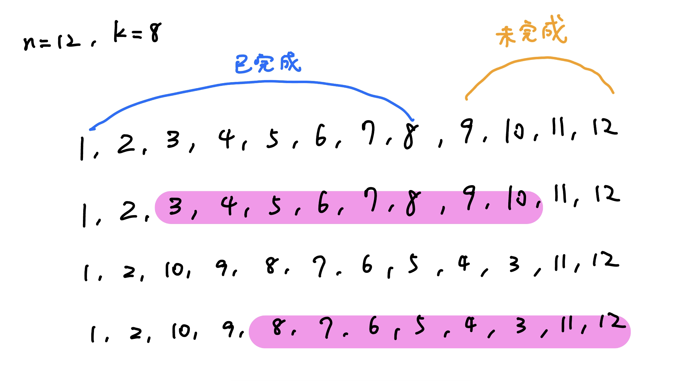
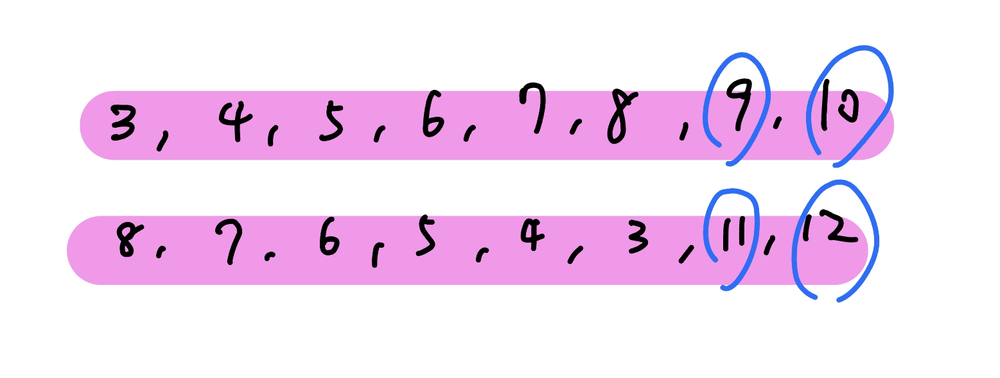

???+note "[CF 1867 E2. Salyg1n and Array (hard version)](https://codeforces.com/contest/1867/problem/E2)"
	有一個長度為 $n$ 的陣列 $a_1,\ldots ,a_n$，目標是輸出 $a_1\oplus \ldots \oplus a_n$。給 $k$，你可以做以下查詢至多 57 次 :
	
	- $\text{query}(i):$ 問 $a_i \oplus a_{i + 1} \oplus \ldots \oplus a_{i + k - 1}$ 是多少，問了之後，這個區間內的元素就會被 reverse
	
	$n,k\le 2500,n,k$ 皆為偶數
	
	??? note "思路"
		若 n % k == 0，那我們可以每次從左到右依序詢問長度為 k 的區間即可。若 n % k != 0，代表我們左到右依序詢問長度為 k 的區間後會剩下一段，我們的目標就是將這段的值算出來。可以發現若我們以剩下區間的一半做為 query 的結尾 query 一次，在以 n 作為結尾 query 一次，中間多餘的貢獻會剛好消除
		
		<figure markdown>
	      { width="400" }
	    </figure>
		
		<figure markdown>
	      { width="400" }
	    </figure>
	    
	??? note "code"
		```cpp linenums="1"
		#include <bits/stdc++.h>
	    #define int long long
	
	    using namespace std;
	
	    int query(int i) {
	        cout << "? " << i << endl;
	        int res;
	        cin >> res;
	        return res;
	    }
	
	    void solve() {
	        int n, k;
	        cin >> n >> k;
	
	        int ans = 0, now = 1;
	        while (now + k - 1 <= n) {
	            int res = query(now);
	            ans ^= res;
	            now += k;
	        }
	
	        if (now < n) {
	            int tmp = (n - now + 1) / 2;
	            int res1 = query(now + tmp - k);
	            ans ^= res1;
	            int res2 = query(now + tmp + tmp - k);
	            ans ^= res2;
	        }
	
	        cout << "! " << ans << '\n';
	    }
	
	    signed main() {
	        int t = 1;
	        cin >> t;
	        while (t--) {
	            solve();
	        }
	    } 
	    ```
	    
???+note "[CF 1918 E. ace5 and Task Order](https://www.luogu.com.cn/problem/CF1918E)"
    有一個長度為 $n$ 的 $1\sim n$ 的 permutation 以及一個介於 $1$ 和 $n$ 之間的正整數$x$。目標是要去確定這個 permutation。可以通過 `? i` 進行詢問，返回值有三種：

    - `<`：表示 $a_i<x$，該次詢問後，$x\leftarrow x-1$

    - `>`：表示 $a_i>x$，該次詢問後，$x\leftarrow x+1$

    - `=`：表示 $a_i=x$

    $n\leq 2000,$ 詢問次數 $\le 40n$
    
    ??? note "思路"
    	首先，對於一個有 $O(n^2)$ 次查詢的問題，解答很明顯：對於每個位置 i，持續查詢直到返回等於，然後通過大小關係直接對這 n 個數進行排序，從而獲得答案。
    	
    	既然排序可以得到答案，我們考慮那些 $O(n \log n)$ 的排序算法，比如借鑒快速排序的思路。
    
    	但我們發現在無法確定 x 是多少個情況下，我們什麼都很難做。所以首先我們必須去能有權力控制 x，而最好的辦法就是知道 1 還有 n 在哪裡，一般題目在分析時也很常從最小和最大開始找。
    
		具體來講，我們只要掃一遍 1 ~ n，對於每個位置，如果詢問返回 < 就繼續查直到不是 < 為止，否則直接不管。顯然這樣最多查詢 O(n) 次（因為 x 最多增大 n 次），並且在 x = 1 的地方一定可以取到 x = 1。我們只要看 x 在哪裡取到最小值即可。找 x = n 同理。
		
		再來，我們借鑑<a href="/wiki/basic/sorting_algorithms/#quick-sort" target="_blank">快速排序</a>的想法，我们需要對值域進行分治。在控制 x 的值不變的情況下，我們需要查詢若干個位置的答案，從而將這些位置分成兩組：「大於 x」 和 「小於 x 」的兩組（等於 x 的位置可以直接得到答案）。遞迴下去就可以得到答案。複雜度 O(n log n)。
    	
    	> 參考: <https://www.luogu.com.cn/blog/wosile/solution-cf1918e>
    
    ??? note "code"
    	```cpp linenums="1"
    	#include <bits/stdc++.h>
        using namespace std;
        int p1, pn;
        int ans[2005];
        int query(int x) {
            cout << "? " << x << endl;
            cout.flush();
            string s;
            cin >> s;
            if (s[0] == '=') return 0;
            if (s[0] == '<') return -1;
            if (s[0] == '>') return 1;
            return 0114507537;
        }
        int cur;
        void solve(int l, int r, vector<int>& v) {
            // v 是值在 [l,r] 中的下标集合
            if (l > r) return;
            if (l == r) {
                ans[v[0]] = l;
                return;
            }
            int mid = (l + r) / 2;
            while (cur > mid) {
                query(p1);
                cur--;
            }
            while (cur < mid) {
                query(pn);
                cur++;
            }
            vector<int> vl, vr;
            vl.clear();
            vr.clear();
            // 分成 [l,mid-1] 和 [mid+1,r]
            for (int x : v) {
                int tmp = query(x);
                if (tmp == 0) ans[x] = mid;
                if (tmp == -1) {
                    vl.push_back(x);
                    query(pn);
                }
                if (tmp == 1) {
                    vr.push_back(x);
                    query(p1);
                }
            }
            solve(l, mid - 1, vl);
            solve(mid + 1, r, vr);
        }
        int main() {
            int T;
            cin >> T;
            while (T--) {
                int n;
                cin >> n;
                // find 1&n
                p1 = pn = 1;
                int md = 0x3f3f3f3f, d = 0;
                for (int i = 1; i <= n; i++) {
                    int tmp = query(i);
                    d += tmp;
                    while (tmp == -1) {
                        tmp = query(i);
                        d += tmp;
                    }
                    if (d < md) p1 = i, md = d;
                }
                md = -0x3f3f3f3f, d = 0;
                for (int i = 1; i <= n; i++) {
                    int tmp = query(i);
                    d += tmp;
                    while (tmp == 1) {
                        tmp = query(i);
                        d += tmp;
                    }
                    if (d > md) pn = i, md = d;
                }
                ans[p1] = 1, ans[pn] = n;

                vector<int> tmp;
                tmp.clear();
                for (int i = 1; i <= n; i++)
                    if (i != p1 && i != pn) tmp.push_back(i);
                int val = query(pn);
                while (val == 1) val = query(pn);
                cur = n;
                solve(2, n - 1, tmp);
                cout << "! ";
                for (int i = 1; i <= n; i++) cout << ans[i] << ' ';
                cout << endl;
                cout.flush();
            }
            return 0;
            // quod erat demonstrandum
        }
    	```
    	
