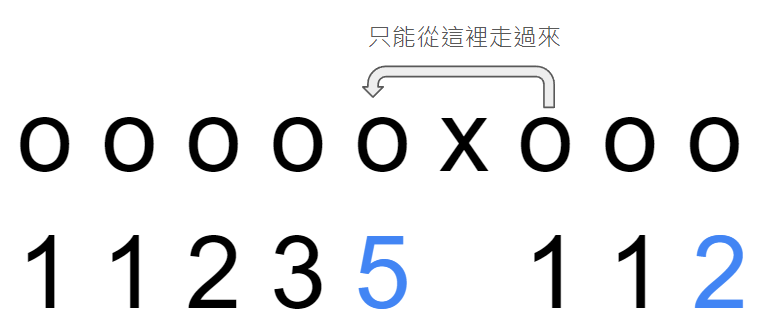

???+note "[TIOJ  2221 . 足球場](https://tioj.ck.tp.edu.tw/problems/2221)"
	給 $n$ 個二維座標點，問能組成多少個矩形
	
	$1\le n\le 1000,0\le x_i, y_i \le 10^9$
	
	??? note "思路"
		矩形由「對角線長度」和「中心座標」決定。所以我們枚舉 $i,j$，將 pair(i 跟 j 的距離, i 跟 j 的中點)++，最後對於每個 distinct pair 的方法數就是 $C^k_2$
		
	??? note "code"
		```cpp linenums="1"
		#include <bits/stdc++.h>
	    #define StarBurstStream ios_base::sync_with_stdio(false); cin.tie(0);
	    #define mp(a, b) make_pair(a, b)
	    #define F first
	    #define S second
	    using namespace std;
	    typedef long long ll;
	    using pll = pair<ll, ll>;
	
	    ll dis(pll a, pll b){
	        ll x = a.F - b.F;
	        ll y = a.S - b.S;
	        return x * x + y * y;
	    }
	
	    pll operator+(pll a, pll b){
	        return mp(a.F + b.F, a.S + b.S);
	    }
	
	    int main(){
	        StarBurstStream
	
	        int n;
	        cin >> n;
	
	        vector<pll> p(n);
	        for(int i = 0; i < n; i++){
	            cin >> p[i].F >> p[i].S;
	        }
	
	        map<pair<pll, ll>, ll> cnt;
	
	        for(int i = 0; i < n; i++){
	            for(int j = i + 1; j < n; j++){
	                cnt[mp(p[i] + p[j], dis(p[i], p[j]))]++;
	            }
	        }
	
	        ll ans = 0;
	        for(auto i : cnt){
	            ans += i.S * (i.S - 1) / 2;
	        }
	        cout << ans << "\n";
	
	        return 0;
	    }
	    ```

???+note "[Atcoder abc218 D. Rectangles](https://atcoder.jp/contests/abc218/tasks/abc218_d)"
	給 $n$ 個二維座標點，問能組成多少個矩形滿足該矩形平行 $x$ 軸和 $y$ 軸
	
	$4\le n\le 2000,0\le x_i,y_i\le 10^9$
	
	??? note "思路"
		跟上一題的差別是我們在枚舉 i, j 時需要固定一個維度，然後去做一樣的事情
		
	??? note "code"
		```cpp linenums="1"
		#include <bits/stdc++.h>
	    #define int long long
	    #define pb push_back
	    #define mk make_pair
	    #define F first
	    #define S second
	    #define ALL(x) x.begin(), x.end()
	
	    using namespace std;
	    using pii = pair<int, int>;
	
	    struct Node {
	        int x, y;
	    };
	
	    const int N = 2005;
	    int n;
	    Node a[N];
	
	    signed main() {
	        cin >> n;
	        for (int i = 0; i < n; i++) {
	            cin >> a[i].x >> a[i].y;
	        }
	        map<pii, int> mp;
	        int ans = 0;
	        for (int i = 0; i < n; i++) {
	            for (int j = i + 1; j < n; j++) {
	                if (a[i].y == a[j].y) {
	                    int len = abs(a[j].x - a[i].x);
	                    int point = (a[i].x + a[j].x);
	                    mp[{len, point}]++;
	                }
	            }
	        }
	        int ans = 0;
	        for (auto it : mp) {
	            ans += it.S * (it.S - 1) / 2;
	        }
	        cout << ans << '\n';
	    } 
	    ```

???+note "[2016 全國賽 p3. 框架區間](https://tioj.ck.tp.edu.tw/problems/1913)"
	給一個 $1 \ldots n$ 的 permutation $p$，問有幾個 $(i,j)$ 滿足 $i$ 在 $p$ 內與 $j$ 在 $p$ 內的位置所形成的區間內，數字集合恰好是 $\{ i,\ldots ,j \}$
	
	$n\le 5000$
	
	??? note "思路"
		枚舉 i, j，看 pos[i], ..., pos[j] 的 min 是否為 pos[i] 且 max 是否為 pos[j]

???+note "[2022 全國賽 pD. 文字編輯器 (editor)](https://nhspc2022.twpca.org/release/problems/problems.pdf#page=11)"
	有一個由 $\texttt{+}, \texttt{[}, \texttt{]}, \texttt{x}$ 組成合法序列，此時將其中一個 $\texttt{+}$ 改成 $\texttt{|}$，並將所有 $\texttt{[}, \texttt{]}$ 換成 $\texttt{|}$。給你這個改完的序列 $s$，輸出任意一個原來的合法序列。
	
	$|s| \le 10^6$
	
	??? note "思路"
		兩個 $\texttt{x}$ 中一定要有 $\texttt{+}$，看哪兩個 $\texttt{x}$ 之間沒有 $\texttt{+}$，Greedy 的放即可

???+note "[全國賽模擬賽 2022 pI. 子集合和 (SOS)](https://www.csie.ntu.edu.tw/~b11902109/PreNHSPC2022/IqwxCSqc_Pre_NHSPC_zh_TW.pdf#page=25)"
	令函數 $f(S)=S\times \prod\limits_{x\in S}x$，問 $\sum\limits_{S\subseteq A} f(S)$
	
	$1\le n\le 10^6, 1\le a_i\le 10^9$
	
	??? note "思路"
	
		令 $G(S)=\prod \limits_{x\in S} x,\space F(S) =|S| \times \prod \limits_{x\in S} x$
	
	    則
	
	    $\begin{align}F(S \cup \{t \}) &= (|S|+1)\times \left(\prod \limits_{x\in S} x \right)\times t \\ &= F(S) \times t+G(S)\times t\end{align}$
	
	    $G(S \cup \{ t\})=G(S)\times t$
	
	    假設我們已知 $\sum \limits_{S \subseteq A}F(S)$ 和 $\sum \limits_{S \subseteq A}G(S)$，則我們可將新的 $F=$ 沒有 $t$ + 有 $t$ 
	
	    $\begin{align}\sum \limits_{S \subseteq (A + \{t \})}F(S) &= \sum \limits_{S \subseteq A}F(S)+\sum \limits_{S \subseteq A}F(S+\{ t \}) \\ &= \sum \limits_{S \subseteq A}F(S)+\left(\sum \limits_{S \subseteq A}F(S) \right)\times t +  \left(\sum \limits_{S \subseteq A}G(S) \right)\times t\end{align}$
	
	    $\sum \limits_{S \subseteq (A + \{t \})}G(S)=\sum \limits_{S \subseteq A}G(S)+\left(\sum \limits_{S \subseteq A}G(S) \right)\times t$
	    
	    ---
	    
	    > 參考自 : <https://hackmd.io/@victor26/Bkc_YXpdo>
	    
	    觀察到可能跟 $(a_1 + 1)(a_2 + 1)(a_3 + 1) \ldots (a_n + 1)$ 有關
		
		答案為 
		
		$$a_1(a_2 + 1)(a_3 + 1) \ldots (a_n + 1)+a_2(a_1 + 1)(a_3 + 1) \ldots (a_n + 1) + a_n(a_1 + 1)(a_2 + 1) \ldots (a_{n-1} + 1)$$
		
		預處理 $(a_1+1)(a_2+1)(a_3+1)...(a_n+1)$ 即可

???+note "[CF 1886 D. Monocarp and the Set](https://codeforces.com/contest/1886/problem/D)"
	問符合條件的 $1\ldots n$ 的 permutation $p$ 有幾個。給一個長度為 $(n-1)$ 的序列 $s$，$s_i$ 的意義如下 :
	
	- 若 $s_i=$ `>`，則 $p_i$ 是前綴的 max
	
	- 若 $s_i=$ `<`，則 $p_i$ 是前綴的 min
	
	- 若 $s_i=$ `?`，則 $p_i$ 兩者皆不是
	
	現在有 $q$ 筆對 $s$ 的單點修改，每次修改完輸出答案是多少
	
	$2\le n\le 3\times 10^5, 1\le m\le 3\times 10^5$
	
	??? note "思路"
		考慮列出 $p_0,\ldots ,p_{n-1}$ 的大小關係，例如 $[2,1,5,3,4]$ 的大小關係為 $p_1<p_0<p_3<p_4<p_2$。
	
	    - 若當前加入一個 `>` ，他只能放在大小關係的最後面。
	
	    - 若當前加入一個 `<`，他只能放在大小關係的最前面。
	
	    - 若當前加入一個 `?`，他可以放在大小關係的中間。
	
	    所以實際上整體的變動是由 `?` 決定的，因此，總可能性是所有 $(i-1)$ 的乘積，其中 $s_i$ == `?`（1-based）
	
	    舉例來說，$s=$ `<?>?`
	
	    - $s_1=$ `<` 則 $p_1<p_0$
	
	    - $s_2=$ `?` 則 $p_2$ 只能插入在 $p_1,p_0$ 之間，所以 $p_1<p_2<p_0$
	
	    - $s_3=$ `>` 則 $p_1<p_2<p_0<p_3$
	
	    - $s_4=$ `?` 則 $p_4$ 可以插入在中間 $3$ 個空隙中
	
	    所以答案為 $(2-1)\times (4-1)=3$

???+note "[CSES - Food Division](https://cses.fi/problemset/task/1189)"
	有 $n$ 個人圍成一圈，第 $i$ 個人目前的分數為 $a_i$，期望分數為 $b_i$。每次操作能讓一個人分一單位的分數給相鄰的人，問最少幾次操作，使每個人都答到自己的期望分數。

	$n\le 2\times 10^5, 0\le a_i,b_i\le 10^6$
	
	??? note "思路"
		我們可以先得到一個 difference 序列 $c$，使 $c_i=a_i-b_i$，這樣問題就變成: 給一個陣列，每次可移動一單位的分數，最少幾次使滿項都變 $0$。
		
	    先限制題目給的是陣列，從第一項開始，我們可以利用跟右邊借的方式，來讓每一項都變成 0。
	
	    ```
	    ex1:
	    [5 -3 -1 4 -3 -2]
	    [0 2 -1 4 -3 -2] +5
	    [0 0 1 4 -3 -2] +2
	    [0 0 0 5 -3 -2] +1
	    [0 0 0 0 2 -2] +5
	    [0 0 0 0 0 0] +2
	    cost = 5+2+1+5+2
	
	    ex2:
	    [-7 2 -1 2 4]
	    [0 -5 -1 2 4] 7
	    [0 0 -6 2 4] 5
	    [0 0 0 -4 4] 6
	    [0 0 0 0 0] 4
	    cost = 7+5+6+4
	    ```
	
	    這其實就是在做一個前綴和，而 cost 就是 $\sum \limits_{i=1}^n |pre_i|$，回到環的問題，我們發現一定存在一個邊，斷掉後還是能達到最佳解（見下方）。所以現在就是要暴力枚舉要切在哪，會有 n 個可能的一維問題，因為是環，所以我們可以先列出一個長度為 2n 的陣列，那麼對於一個長度為 n 的區間 [l, r]，答案就是 $\sum |pre_i-pre_{l-1}|$，這個可以用線段樹來維護。
	
	    ```
	    a   [-7   2  -1   2  4  -7   2  -1   2  4]
	    pre  -7  -5  -6  -4  0  -7  -5  -6  -4  0 
	    ```
	
	    其實觀察可發現，長度為 n 的區間所形成的 $pre_i$ 的集合都是一樣的，而且 $pre_{l-1}$ 也是這個集合的其中一個數字，所以根據數學，選集合內的中位數就會是最好的。


        我們想證明: 每個 node 出去 & 進來的量不變的前提下，把一條 edge 的流量變成 0
    
        對於一條邊先將流量 -1，那依序:
    
        - 若對於一個點兩邊流向都是相同的，則兩邊都一起 +1 or -1，使得流出去的總量（差值）不變
    
        - 若對於一個點兩邊的流向是相反的，則一邊 +1，一邊就要 -1，反之亦然，使得流出去的總量（總和）不變
    
        <figure markdown>
          { width="300" }
        </figure>

???+note "[2021 附中模競 III pF. 歡樂耶誕城 (Christmas)](https://codeforces.com/group/3Xn3T5DO0a/contest/375522/problem/F)"
	有 $n$ 條燈飾，一開始上面都沒燈泡，燈泡有 $m$ 種顏色，有以下 $q$ 次操作:
	
	1. 將指定顏色的燈泡加到指定燈飾的尾端

	2. 移除某條燈飾的最後一個燈泡

	3. 把某條燈飾變成跟另一條一模一樣

	4. 問某條燈飾的某個燈泡是什麼顏色

	$n,q\le 2\times 10^5, m\le 10^9$
	
	??? note "思路"
		把某條燈飾複製後，各自可以再延伸 ⇒ 類似 Tree 的結構
		
		用 1. 2. 3. 操作讀進來後建立完 tree 後，建 lca，對於 4. O(log n) 回答