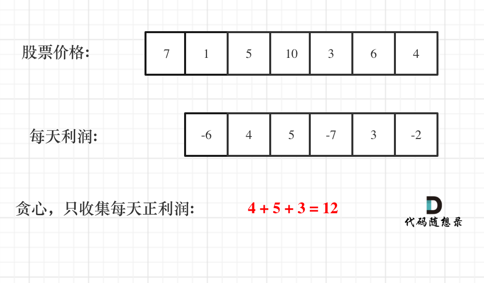

???+note "[LeetCode 122. Best Time to Buy and Sell Stock II](https://leetcode.com/problems/best-time-to-buy-and-sell-stock-ii/)"
	給你 $n$ 個股價 $a_1,\ldots ,a_n$，你可以做最多一次買跟賣，且買跟賣可以在同一天，獲利最大是多少
	
	$n\le 3\times 10^4,a_i\le 10^4$
	
	??? note "思路"
		因為可以當天賣又當天買，利潤變成可以拆解的，那我們就 Greedy 的選即可
	
		<figure markdown>
	      { width="300" }
	      <figcaption>Image caption</figcaption>
	    </figure>
	    
	??? note "code"
		```cpp linenums="1"
		class Solution {
	    public:
	        int maxProfit(vector<int>& prices) {
	            int result = 0;
	            for (int i = 1; i < prices.size(); i++) {
	                result += max(prices[i] - prices[i - 1], 0);
	            }
	            return result;
	        }
	    };
		```

???+note "[LeetCode 714. Best Time to Buy and Sell Stock with Transaction Fee](https://leetcode.com/problems/best-time-to-buy-and-sell-stock-with-transaction-fee/)"
	給你 $n$ 個股價 $a_1,\ldots ,a_n$，買跟賣不能在同一天，且一次買賣會扣 w 元的手續費，獲利最大是多少
	
	$k\le n\le 2\times 10^6,a_i\le 10^7$
	
	??? note "思路"
		dp[i][0/1]: i 之前的最後一張是賣出/還是買進
	
		dp[i][0] = max(dp[i - 1][0], dp[i - 1][1] + a[i])
		
		dp[i][1] = max(dp[i - 1][0] - a[i] - w, dp[i - 1][1])

???+note "[2017 全國賽 AI-666 賺多少](https://tioj.ck.tp.edu.tw/problems/2039)"
	給你 $n$ 個股價 $a_1,\ldots ,a_n$，你可以做最多 k 買跟賣，且買跟賣不能在同一天，獲利最大是多少
	
	$k\le n\le 2\times 10^6,a_i\le 10^7$
	
	??? note "思路"
		Aliens 優化可蒐得 k 次的最佳解，可用上面手續費的方式解，手續費越多，k 就越小。再與上面無限次數的作 max
	
## 相關

- <https://www.luogu.com.cn/problem/P1484>

- CF 125E

	