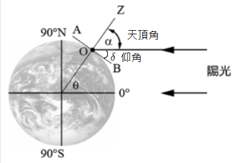

## 1-2 天球概念 

<figure markdown>
  { width="300" }
</figure>

太陽直射北半球 $\delta$ 度

- 若我在北半球 $\theta$ 度，那麼天頂角 $\alpha=|\delta-\theta|$

- 若我在南半球 $\theta$ 度，那麼天頂角 $\alpha=\delta+\theta$

引理 : 天頂角 + 仰角 $=90^\circ$

<a href="/wiki/school/images/1.png" target="_blank">參考圖片</a>

## 1-3 

克卜勒定律 : 近日點速率快，遠日點速率慢

自轉方向 : 從天球的北極點鳥瞰，地球自轉是逆時針方向旋轉；從南極點上空看是順時針方向旋轉。

公轉方向 : 由北極上方向下看，地球以逆時鐘方向由西向東繞著太陽公轉。

恆星日較平均太陽日短約 4 分鐘

地球自轉一周後，也繞著太陽公轉了 $0.986$ 度 (約 $\displaystyle \frac{360度}{365日}$)，因此必須再多轉約 $0.986$ 太陽才會到中天子午線，也就是 $\displaystyle \frac{0.986}{360}\times (24\times 60)=4\texttt{ min}$

