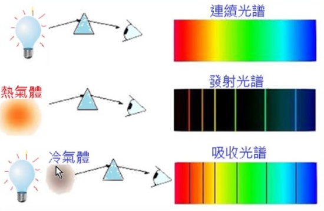
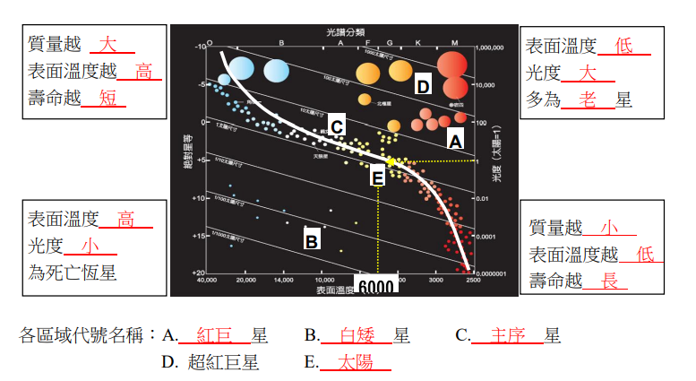
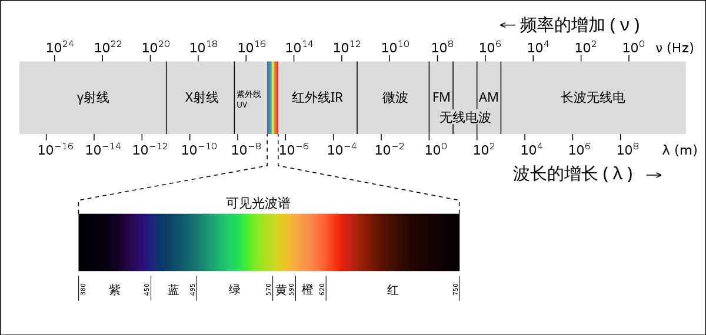

http://www.cysh.khc.edu.tw/webadmin/upload/2101270933115a.pdf

https://wp.cjhs.kh.edu.tw/earth/wp-content/uploads/sites/30/2013/04/e69599e7acace4b883e7aba0e5a49ae8ae8ae79a84e5a4a9e6b0a3.pdf

## 1-2 

<figure markdown>
  { width="300" }
</figure>

太陽直射北半球 $\delta$ 度

- 若我在北半球 $\theta$ 度，那麼天頂角 $\alpha=|\delta-\theta|$

- 若我在南半球 $\theta$ 度，那麼天頂角 $\alpha=\delta+\theta$

引理 : 天頂角 + 仰角 $=90^\circ$

<a href="/wiki/school/images/1.png" target="_blank">參考圖片</a>

天北極 : 真正地球的北極

北極 : 以觀測者角度來說，北方的放向

地表受到太陽輻射能量的多寡，受到

- 主要 : 太陽照射角度

- 小部分 : 距日遠近 

## 1-3 

克卜勒定律 : 近日點速率快，遠日點速率慢

自轉方向 : 從天球的北極點鳥瞰，地球自轉是逆時針方向旋轉；從南極點上空看是順時針方向旋轉。

公轉方向 : 由北極上方向下看，地球以逆時鐘方向由西向東繞著太陽公轉。

恆星日較平均太陽日短約 4 分鐘

地球自轉一周後，也繞著太陽公轉了 $0.986$ 度 (約 $\displaystyle \frac{360度}{365日}$)，因此必須再多轉約 $0.986$ 太陽才會到中天子午線，也就是 $\displaystyle \frac{0.986}{360}\times (24\times 60)=4\texttt{ min}$

朔望月比恆星月多轉了 $30^\circ$ (約 $\displaystyle \frac{360度}{12月}$)

陽曆 : 四年一閏，百年不閏，四百年再閏

陰陽合曆 : 

- 一年是以太陽在天空的視運動為基準 (回歸年)
	- 24 節氣
- 一個月是以月相變化為基準的曆法 (朔望月)
	- 每 19 年需加入 7 個閏月，配合節氣變化 

太陽日每日長度皆不同的主要原因 : 因為不同季節時，地球公轉的速率不相同

回歸年長度皆不同的主要原因 : 因為地球自轉軸指向會有週期性的變化

## 2-1

<figure markdown>
  { width="300" }
</figure>

## 2-2

<figure markdown>
  { width="500" }
</figure>

## 2-3

望遠鏡前方最大的那片鏡片稱作物鏡，<mark>物鏡的直徑就稱為口徑</mark>

- 集光力 : 口徑的半徑成正比
- 解析度 : 加大物鏡口徑
- 放大倍率 : $倍率 =\displaystyle \frac{物鏡焦距}{目鏡焦距}$

圖 : 講義 p.29 (折射式望遠鏡) 

放向 : 物鏡 $\xrightarrow{物鏡焦距}$ 焦點 $\xrightarrow{目鏡焦距}$ 目鏡

<figure markdown>
  { width="600" }
</figure>

折射式 : 

- 只需鏡片表面完美

- 重心偏後面

- 鏡片易受重力影響造成變形 (因為只有鏡片周圍支撐於鏡筒，重心都在後面)

反射式 :

- 現在大型望遠鏡多採用反射式

- 鏡片表面及透鏡內部完美

- 重心偏前面

- 鏡片不易受重力影響造成變形

## 2-4

哈伯定律 : 

$$V=H_0\times d$$

- $V:$ 為星系遠離速度
- $d:$ 星系與地球距離
- $H_0:$ 哈伯常數，$72$

## 題目

???+note "例題"

	若人的眼睛瞳孔約直徑8 mm，可看見最暗星等是6等星，今小泰使用一口徑80 mm之望遠鏡，則可觀測到最暗星等為何？ 
	
	(A)1 (B)4 (C)8 (D)11
	
	??? note "解答"
	    根據望遠鏡的口徑和人眼的瞳孔大小，我們可以用下面的公式估算可觀測到的最暗星等：
	
	    $$
	    m_{max} = m_{eye} + 2.5 \log_{10}\left(\frac{A_{scope}}{A_{eye}}\right)
	    $$
	
	    其中，$m_{max}$ 是可觀測到的最暗星等，$m_{eye}$ 是人眼可以看到的最暗星等（在這個問題中是6），$A_{scope}$ 是望遠鏡的有效口徑，$A_{eye}$ 是人眼的瞳孔面積。
	
	    將數值代入上式中，可得：
	
	    $$
	    m_{max} = 6 + 2.5 \log_{10}\left(\frac{(\pi\times 80^2)~~mm^2}{\pi\times 8^2~~mm^2}\right) \approx 11
	    $$
	
	    因此，使用口徑為80 mm的望遠鏡時，最暗可觀測到的星等約為11等星。

???+note "例題"
 	下列哪一選項為太陽一生的大致演化歷程？
 	
	(A) 星際介質→主序星→紅巨星→白矮星
	
	(B) 星際介質→主序星→紅巨星→白矮星→黑洞
	
	(C) 星際介質→主序星→紅巨星→白矮星→中子星
	
	(D) 星際介質→主序星→紅巨星→超新星→白矮星
	
	(E) 星際介質→主序星→紅巨星→超新星→中子星
	
	答案為 (A)

---

## 參考資料

- [講義 - 恆星, 光譜](https://wp.cjhs.kh.edu.tw/earth/wp-content/uploads/sites/30/2013/04/e69599e7acace58d81e7aba0e787a6e7889be79a84e6989fe7a9ba.pdf)
- [講義 - 天球](https://wp.cjhs.kh.edu.tw/earth/wp-content/uploads/sites/30/2013/04/e69599e7acace585abe7aba0e68ea2e7b4a2e69982e5ba8fe79a84e6a0b9e6ba90.pdf)
	    

