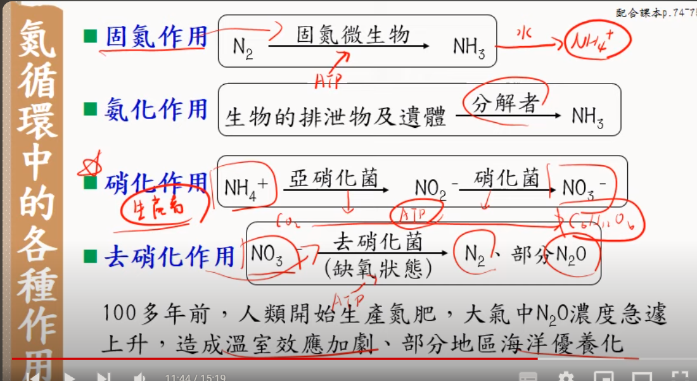
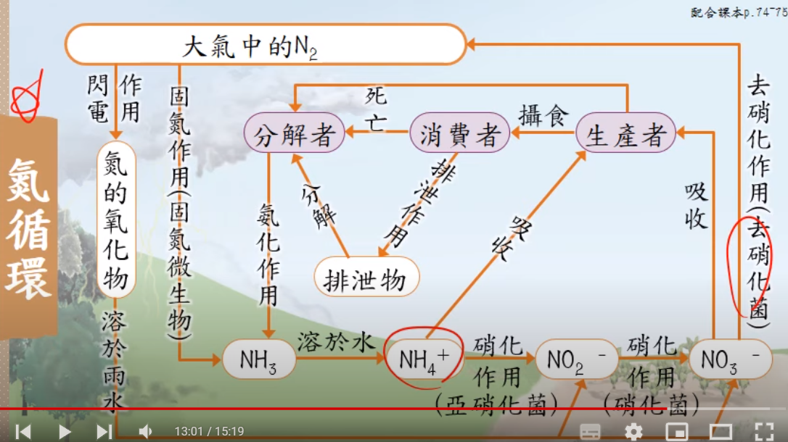

2-2至第二章完

生態區位: 物種在各種環境因子中適合生存的範圍總和

## 群集結構與演替

物種結構: 生物的物種數及其個體數，ex: 優勢種

關鍵種: 對群集結構具有重大影響，在食物鏈最高的位置

空間結構: 森林的垂直分層

群集結構隨著時間或環境條件的變化而逐漸改變的過程稱為演替或消長

依照起始狀態的不同，演替可以分為

- 初級消長: 起始於沒有生物的環境

- 次級消長: 起始於遭受干擾，導致原有群集被破壞的地區。ex: 火災

	- 更快

極相群集: 物種取代現象已經不再明顯

演替消長重點:

1. 過程不可逆
2. 是連續性的漸變
3. 無明顯界線
4. 次級比初級變化快、歷程少
5. 極相群極不一定是森林
6. 生活中常見的: 次級

## 生態系

生態系指的是生物群集 & 生存環境

- 生產者: 將無機物合成有機物

- 消費者: 直接或間接從生產者或其他消費者取得能量的生物
	- 初級: 以生產者為食 ex: 蝗蟲
	- 次級: 以初級消費者為食 ex: 青蛙
	- 三級: 以次級消費者為食 ex: 蛇
	- 清除者: 以動物遺體為食 ex: 禿鷹、馬路

- 分解者: 將無機物 -> 有機物
	- 分泌酵素至體外，分解生物的排遺或遺體 ex: 細菌

生產者 & 分解者是溝通橋樑 

生物量塔: 質量

<figure markdown>
  { width="600" }
</figure>

<figure markdown>
  { width="600" }
</figure>

## 陸域生態系

- 凍原 亞高山植權帶
	- 草本植物: 阿里山龍膽 南湖柳葉菜
	- 多年生木本灌叢: 玉山圓柏、玉山杜鵑

- 草原 高山草原
	- 玉山箭竹、高山茫 

- 草原 平地草原
	- 屏東旭海草原
	- 耐旱、耐強風的草本植物: 五節芒、狗牙根

- 針葉林
	-　耐乾冷的裸子植物 
	-　台灣黑熊、台灣山椒魚、冷杉、櫻花鉤吻鮭（孑遺生物）

- 針闊葉混和林
	- 阿里山、太平山
	- 闊葉樹: 昆蘭、森氏櫟
	- 地衣和蘚苔附生於樹幹上（片利）

- 溫帶闊葉林
	- 常綠闊葉樹
	- 章殼林、榕楠林
	- 落葉堆積: 產生真菌

- 熱帶雨林 熱帶季風林
	- 生長快速，有特化根
	- 競爭激烈有纏勒現象
	- 幹生花，較易被鳥類傳粉

- 沙漠 砂丘生態系
	- 耐鹽，耐強風，耐乾旱
	- 馬鞍藤，林投，濱刺麥

## 河流生態系

- 上游
	- 水流湍急
	- 吃枯枝落葉
	- 溶氧量高
	- 櫻花鉤吻鮭

- 中游
	- 生物多樣性最多 

- 下游
	- 汙染物高
	- 吳郭魚 

## 湖泊生態系

- 水平分層

- 缺乏生產者

- 挺水植物 -> 沉水植物 漂浮性植物

- 上面是透光區下面是無光區

## 海洋生態系

- 潮間帶
	- 海浪衝擊，漲潮退潮每日兩次
	- 洋菜（多醣類）
	- 泥岸: 種少量大
	- 沙岸: 少，人類遊戲活動
	- 岩岸: 高
	- 礁岸: 最高

- 近海區（水深 200m 處）
	- 有豐富的營養鹽 & 有機物，初級生產力高
	- 大型藻類、浮游藻類
	- 珊瑚礁生態系
	
- 遠洋區
	- 有光區: 矽藻

## 沼澤

- 溼地: 長久被水淹沒的地方

- 淡水沼澤生態系
	- 過渡時期 
	- 夢幻湖 

- 河口沼澤
	- 出海口
	- 種少量多
	- 草澤: 高美濕地
	- 林澤: 紅樹林

## 單字

| 單字 | 中文 |
| --- | --- |
| Carnivore | 肉食動物 |
| Herbivore | 草食動物 |
| Omnivore | 雜食動物 |
| Detritivore | 食碎屑動物 |
| primary consumer | 初級消費者 |
| secondary consumer | 次級消費者 |
| tertiary consumer | 三級消費者 |
| decomposer | 分解者 |