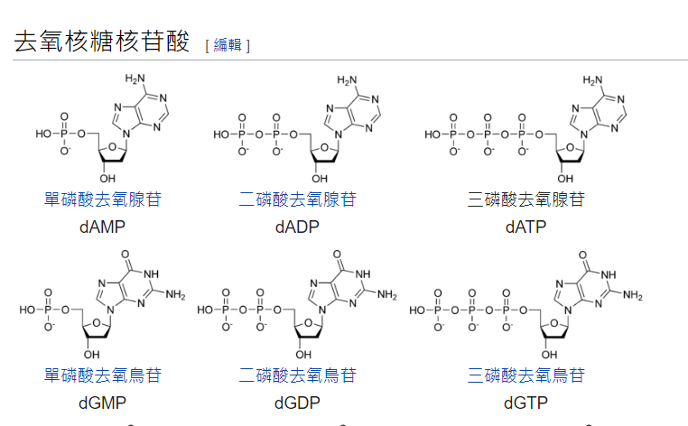
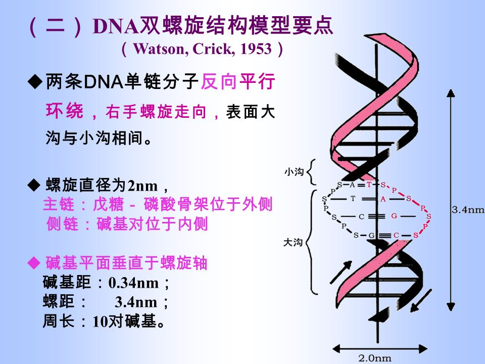

### 單字

| 中文               | 單字              |
| ------------------ | ----------------- |
| polymerase         | 聚合酶            |
| plasmid            | 質體              |
| recombinant        | 重組的            |
| ligase             | 接合酶(DNA連接酶) |
| translation        | 轉譯              |
| phosphate          | 磷酸              |
| transcription      | 轉錄              |
| Restriction enzyme | 限制酶            |
| bacteria           | 細菌              |
| transformation     | 轉型作用          |
| Hydrogen bond      | 氫鍵              |
| nucleotides        | 核甘酸            |

<figure markdown>
  { width="300" }
</figure>

---

### 重點概念

#### 交配

- 互交 : 互換親代性別做之交配，如雄 $Aa\times$ 雌 $AA$，互交則為雄 $AA\times$ 雌 $Aa$

- 雜交 : 不同基因型之個體相互交配，例 $Aa\times aa$ 或 $AA\times aa$ 

- 試交 : 將欲測知其基因之個體與另一表行為隱性之個體交配稱之試交

酵母菌是真菌

#### 含氮鹼基

嘌呤

- 腺嘌呤 (A)
- 鳥糞嘌呤 (G)

嘧碇

- 胸腺嘧碇 (T)
- 胞嘧啶 (C)
- 尿嘧啶 (U)

DNA : $\texttt{ATCG}$ 腺胸胞鳥

RNA : $\texttt{AUCG}$ 腺尿胞鳥

$\texttt{A}=\texttt{T},\texttt{C}\equiv \texttt{G}$

<figure markdown>
  { width="600" }
</figure>

<figure markdown>
  { width="600" }
</figure>

#### DNA 複製過程

> 參考影片 : <https://youtu.be/VisJOA-7Ef0>

