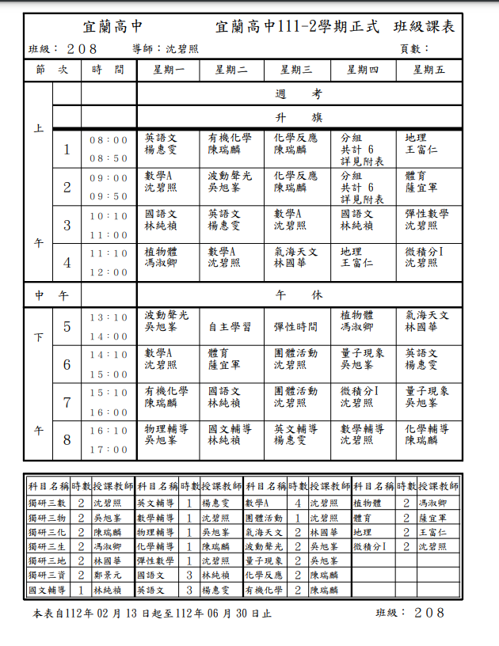

### 考程

#### day 1

| 時間        | 考科                              |
| ----------- | --------------------------------- |
| 8:00~9:00   | 生物                              |
| 9:00~9:20   | 打掃  |
| 9:30~10:30  | 化學                              |
| 11:00~12:00 | 自習  |
| 12:40~13:20 | 午休  |
| 13:30~14:30 | 地科                              |
| 15:00~16:00 | 數學                              |

#### day2

| 時間        | 考科                           |
| ----------- | ------------------------------ |
| 8:00~9:00   | 作文                           |
| 9:00~9:20   | 打掃 |
| 9:30~10:30  | 自習 |
| 11:00~12:00 | 物理                           |
| 12:40~13:20 | 午休 |
| 13:30~14:30 | 地理                           |
| 15:00~16:00 | 國文                           |

#### day3

| 時間       | 考科                           |
| ---------- | ------------------------------ |
| 8:00~9:00  | 英聽                           |
| 9:00~9:20  | 打掃 |
| 9:30~10:30 | 英文                           |
| 11:00~     | 無   |

### 範圍

| 考科 | 範圍                                                         |
| ---- | ------------------------------------------------------------ |
| 英文 | 1.龍騰第四冊 U4、U5、U6全 2.空中美語雜誌三月號： U7、U8、U9、U11 |
| 化學 | C1-1至C1-5酸/脂                                              |
| 生物 | 2-2呼吸作用至4-1 DNA複製 含探討活動2-1、2-2、3-1          |
| 地理 | Ch3至CH5                                                     |

### 班級課表

<figure markdown>
  { width="500" }
</figure>
