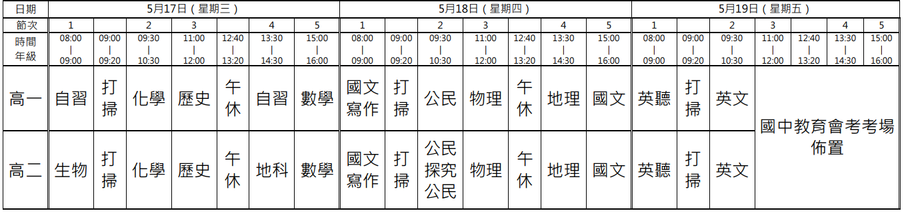

| 考科 | 範圍                                                         |
| ---- | ------------------------------------------------------------ |
| 英文 | 1.龍騰第四冊 U4、U5、U6全 2.空中美語雜誌三月號： U7、U8、U9、U11 |
| 化學 | C1-1至C1-5酸/脂                                              |
| 生物 | 2-2呼吸作用至4-1 DNA複製 含探討活動2-1、2-2、3-1          |
| 地理 | Ch3至CH5                                                     |

<figure markdown>
  { width="800" }
</figure>

