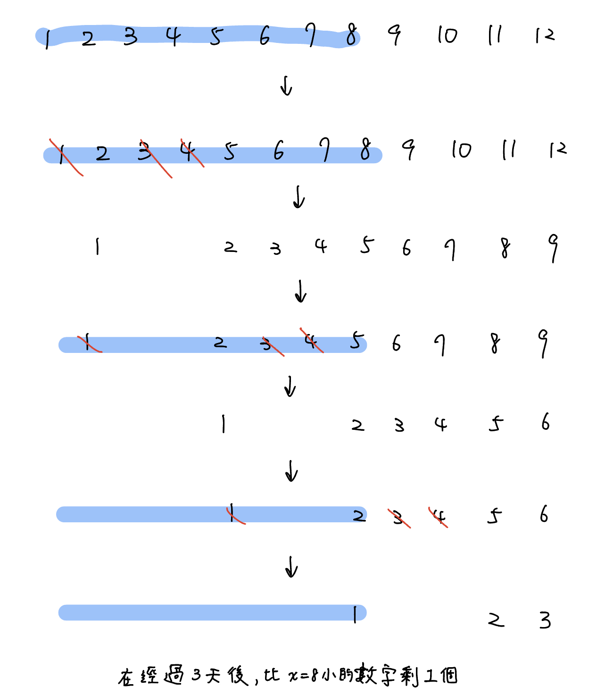
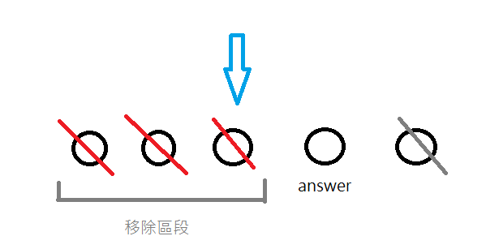

- [全國賽 2019 史蒂芬與獵人](https://sorahisa-rank.github.io/nhspc-fin/2019/problems.pdf#page=10)

- [neoj 田忌賽馬](https://neoj.sprout.tw/problem/69/)

- 2023 TOI mock double cnt

- <https://tioj.ck.tp.edu.tw/problems/1669>

- [JOI Kingdom](https://loj.ac/p/2334)

- 2021 nhspc pD

- whale Atcoder 

- 全國賽 2021 pG subtask 1, 2

## 細節

- check(x) 的 x 太大的時候，有些情況會造成 cnt overflow

- 記得需要開 double 的時候，l, r, mid, check(x) 都要用 double，不能有一些是 int 有一些又是 double

- 注意 l, r 一開始的有沒有還蓋答案的左界右界

- while(l < r) 還是 while(r - l > 1)

- TLE 有可能是二分搜壞掉導致, 可能一開始推導時有誤

	- 當 (l + r) / 2 是負的時候，可能會出問題[^1]

## 第 k 小

令 k 為 0-base，我們都是去找最大的 threshold t 滿足「小於」 t 的個數 <= k

???+note "[CF EDU A. K-th Number in the Union of Segments](https://codeforces.com/edu/course/2/lesson/6/5/practice/contest/285084/problem/A)"
	有一個 multiset，$n$ 次 insert $l_i,\ldots ,r_i$ 進去，問 multiset 第 $k$ 小的數字（$k$ 為 0-base）　
	
	$n\le 50,0\le k\le 2\times 10^9,-2\cdot 10^9 \le l_i \le r_i \le 2\cdot 10^9$
	
	??? note "code"
		```cpp linenums="1"
		#pragma GCC optimize("O3,unroll-loops")
	    #pragma GCC target("avx2,bmi,bmi2,lzcnt,popcnt")
	
	    #include <bits/stdc++.h>
	    #define pb push_back
	
	    using namespace std;
	    using ll = long long;
	
	    struct Interval {
	        int l, r;
	    };
	
	    int n, k;
	    vector<Interval> intervals;
	
	    bool check(ll t) {
	        ll cnt = 0;
	        for (auto &[l, r] : intervals) {
	            if (t > r) {
	                cnt += r - l + 1;
	            } else if (t > l) {
	                cnt += (ll)t - l;
	            }
	        }
	
	        return cnt <= k;
	    }
	
	    signed main() {
	        ios::sync_with_stdio(0);
	        cin.tie(0);
	        cin >> n >> k;
	        for (int i = 0; i < n; i++) {
	            int l, r;
	            cin >> l >> r;
	            intervals.pb({l, r});
	        }
	
	        ll l = -3e9, r = 3e9;
	        // 找到最大的 x 滿足小於 x 的個數 <= k
	        while (r - l > 1) {
	            ll mid = (l + r) / 2;
	            if (check(mid)) l = mid;
	            else r = mid;
	        }
	        cout << l << '\n';
	    } 
	    ```

???+note "[CF EDU C. K-th Sum](https://codeforces.com/edu/course/2/lesson/6/5/practice/contest/285084/problem/C)"
	給長度為 $n$ 的兩個陣列 $a,b$，問將所有 $(i,j)$ 的 $a_i+b_j$ 列出來後第 $k$ 小是多少
	
	$n\le 10^5,1\le k\le n^2$
	
	??? note "code"
		```cpp linenums="1"
		#include <bits/stdc++.h>
	    #define int long long
	    #define pii pair<int, int>
	    #define pb push_back
	    #define mk make_pair
	    #define F first
	    #define S second
	    #define ALL(x) x.begin(), x.end()
	
	    using namespace std;
	
	    const int INF = 2e18;
	    const int maxn = 3e5 + 5;
	    const int M = 1e9 + 7;
	
	    int n, k;
	    int a[maxn], b[maxn];
	
	    bool check(int x) {
	        // 求 < x 的數字有幾個
	        int cnt = 0;
	        int j = n;
	        for (int i = 1; i <= n; i++) {
	            while (1 <= j && a[i] + b[j] >= x) {
	                j--;
	            }
	            cnt += j;
	        }
	
	        return cnt <= k;
	    }
	
	    signed main() {
	        cin >> n >> k;
	        k--;
	        for (int i = 1; i <= n; i++) {
	            cin >> a[i];
	        }
	        for (int i = 1; i <= n; i++) {
	            cin >> b[i];
	        }
	        sort(a + 1, a + n + 1); sort(b + 1, b + n + 1);
	        // 找到最大的 x 滿足小於 x 的個數 <= k
	
	        int l = 1, r = 1e11;
	        while (r - l > 1) {
	            int mid = (l + r) / 2;
	            if (check(mid)) l = mid;
	            else r = mid;
	        }
	        cout << l << '\n';
	    } 
	    ```

???+note "[TIOJ 1208 . 第K大連續和](https://tioj.ck.tp.edu.tw/problems/1208)"
	給一個長度為 $n$ 的陣列 $a_1 ,\ldots ,a_n$，輸出所有 subarray sum 中第 $k$ 大的
	
	$n\le 2\times 10^4 , 1\le k \le \frac{n(n+1)}{2}$
	
	??? note "思路"
		二分搜最小的 x 滿足「大於 x 的 subarray sum 個數 <= k」，但要注意會有 (l + r) / 2 可能會是負的，所以必須 mid = l + (r - l) / 2
		
		也可以把問題轉換成第 k 小，後二分搜最大的 x 滿足「小於 x 的 subarray sum 個數 <= k」
		
	??? note "code"
		```cpp linenums="1"
		#include <bits/stdc++.h>
        #include <bits/extc++.h>
        #define int long long
        #define pii pair<int, int>
        #define mk make_pair<int, int>
        using namespace std;
        using namespace __gnu_pbds;

        template <typename T>
        using rank_set = tree<T, null_type, std::less<T>, rb_tree_tag,tree_order_statistics_node_update>;

        const int maxn = 2e5 + 5;
        int n, k;
        int a[maxn], pre[maxn];

        bool check(int x) {
            rank_set<pii> st;
            // pre[i] - pre[j] > x
            // pre[i] - x > pre[j]
            int cnt = 0;
            for (int i = 0; i <= n; i++) {
                cnt += st.order_of_key(mk(pre[i] - x + 1, 0));
                st.insert({pre[i], i + 1});
            }
            return cnt <= k;
        }

        void solve () {
        	k--;
            for (int i = 1; i <= n; i++) {
                cin >> a[i];
                pre[i] = pre[i - 1] + a[i];
            }
            int l = -2e9, r = 2e9;
            while (r - l > 1) {
                int mid = (l + r) / 2;

                if (check(mid)) r = mid;
                else l = mid;
            }
            cout << l << "\n";
        }

        signed main () {
            while (cin >> n >> k) {
                if(n == 0 && k == 0) break;
                solve();
            }
        }
        ```

???+note "[2023 TOI 初選 pB. 裁員風暴 (storm)](https://zerojudge.tw/ShowProblem?problemid=k185)"


## 雙層二分搜
	
???+note "[Google Code Jam 2020 Round2 P1. Incremental House of Pancakes](https://www.acmicpc.net/problem/27811)"

???+note "[JOI 2014 Final 年轮蛋糕](https://loj.ac/p/2758)"
	

## 其他

???+note "[CF 1853 C. Ntarsis' Set](https://codeforces.com/contest/1853/problem/C)"
	給一個包含 $1,2,\ldots ,10^{1000}$ 所有數字的 Set $S$，每天從 $S$ **同時**移除第 $a_1,a_2,\ldots ,a_n$ 個數字，問 $k$ 天之後 $S$ 中最小的數字是多少
	
	$n,k\le 2\times 10^5,1\le a_i \le 10^9,a_1<a_2<\ldots < a_n$
	
	??? note "hint"
		令 $a_i\le x < a_{i+1}$，過了一天之後，小於等於 $x$ 的數字就會剩下 $x-i$ 個
		
	??? note "思路"
		觀察 :
		
		- 令答案為 ans，在 ans 之前的數字一定都會被移除
	
		- 令 $a_i\le x < a_{i+1}$，當過了一天之後，小於等於 $x$ 的數字會被移除 $i$ 個，也就是小於等於 $x$ 的數字就會剩下 $x-i$ 個，然後我們再去找 $a_j\le x - i < a_{j+1}$，過了一天後，小於等於 $x$ 的數字就會剩下 $x-i-j$ 個，以此類推
	
		<figure markdown>
	      { width="400" }
	      <figcaption>$a=[1,3,4],k=3,x=8$</figcaption>
	    </figure>
	
		二分搜最後一個在「移除區段」的數字，去 check : mid 之前的數字在經過 $k$ 天的移除後剩下幾個 
		
		<figure markdown>
	      { width="400" }
	    </figure>
		
	??? note "code"
		```cpp linenums="1"
		#include <bits/stdc++.h>
	
	    using namespace std;
	
	    typedef long long ll;
	    typedef double ld;
	    typedef pair<ll, ll> pll;
	    typedef pair<int, int> pii;
	    #define F first
	    #define S second
	    #define all(x) x.begin(), x.end()
	    #define MP(x, y) make_pair(x, y)
	
	    const int maxn = 2e5 + 10;
	
	    int T = 1, n, k, a[maxn];
	
	    bool check(ll x) {
	        ll tmp = x;
	        int ptr = n;
	
	        for (int i = 1; i <= k; i++) {
	            while (ptr && a[ptr] > x) {
	                ptr--;
	            }
	
	            x -= ptr;
	        }
	
	        return (x == 0);
	    }
	
	    int main() {
	        cin >> T;
	
	        while (T--) {
	            cin >> n >> k;
	
	            for (int i = 1; i <= n; i++) {
	                cin >> a[i];
	            }
	
	            ll l = 0, r = 1e18;
	            while (r - l > 1) {
	                ll mid = (l + r) >> 1;
	
	                if (check(mid)) l = mid;
	                else r = mid;
	            }
	
	            cout << r << '\n';
	        }
	    }
		```


???+note "[CF 1856 C. To Become Max](https://codeforces.com/contest/1856/problem/C)"
	給一個長度為 $n$ 的序列 $a$，你能做以下操作至多 $k$ 次，並輸出 $\max(a_1, a_2, \ldots a_n)$ 最大能到多少 :
	
	- 選一個 index $i$ 滿足 $1\le i \le n - 1$ 且 $a_{i}\le a_{i+1}$，將 $a_i$ 加 $1$
	
	$2\le n\le 1000,1\le k\le 10^8,1\le a_i \le 10^8$
	
	??? note "思路"
		考慮二分搜 $x$，檢查是否能使 $\max(a_1,\ldots, a_n) \ge x$。對於一個最大值 $x$，若此最大值是 $a_i=x$，可以觀察到後面會有一段連續遞減序列，且恰好是以 $1$ 最為差在遞減，因為 $a_i$ 要是 $x$，$a_{i+1}$ 就必須達到 $x-1$，$a_{i+2}$ 就必須達到 $x-2$，以此類推，也有可能到某個 $a_{i+}$ 他本身就已經大於等於要達到的 threshold，那項即為遞減序列的終止處。
		
		所以我們在檢查的時候只需枚舉每一項作為最大值，然後看 $k$ 是否能夠應付要將 $a_i=x$ 的成本即可（詳見代碼）　
		
	??? note "code"
		```cpp linenums="1"
		#include <bits/stdc++.h>
	    #define int long long
	    #define pii pair<int, int>
	    #define pb push_back
	    #define mk make_pair
	    #define F first
	    #define S second
	    #define ALL(x) x.begin(), x.end()
	
	    using namespace std;
	
	    const int INF = 2e18;
	    const int maxn = 3e5 + 5;
	    const int M = 1e9 + 7;
	
	    int n, k;
	    int a[maxn];
	
	    bool check(int x) {
	        for (int i = 0; i < n; i++) {
	            int t = x, cnt = 0;
	            for (int j = i; j < n; j++) {
	                if (a[j] >= t) {
	                    return true;
	                }
	                cnt += (t - a[j]);
	                if (cnt > k) {
	                    break;
	                }
	                t--;
	            }
	        }
	        return false;
	    }
	
	    void solve() {
	        cin >> n >> k;
	        for (int i = 0; i < n; i++) {
	            cin >> a[i];
	        }
	        int mx = *max_element(a, a + n);
	
	        int l = mx, r = mx + k + 1;
	        while (r - l > 1) {
	            int mid = (l + r) / 2;
	            if (check(mid)) l = mid;
	            else r = mid;
	        }
	        cout << l << '\n';
	    }
	
	    signed main() {
	        int t = 1;
	        cin >> t;
	        while (t--) {
	            solve();
	        }
	    } 
		```

???+note "[2021 附中模競 II pD. 調色盤 (Palette)](https://drive.google.com/file/d/1Qw4eUf0uSrLDOsdrq11xZxrCAVubAW4P/view)"
	給一個長度為 $n$ 的陣列 $a_1 ,\ldots ,a_n$，有 $q$ 筆詢問如下 :
	
	- $\text{query}(l,r):$ 問 $a_l \sim a_r$ 裡有幾個 subarray 滿足最大最小差 $\le k$
	
	$n,k\le 10^6,c_i\le 10^6,q\le 10^6$
	
	??? note "思路"
		對於每個 i 定義 last[i] = 從 i 開始最大可以到哪個 index 滿足區間 max - min <= k
		
		這可以用 two pointer + sparse table 預處理
		
		然後對於 query(l, r) 就可以二分搜最大的分界點 t，滿足前面的 last[i] 都 <= r，後面的都 > r。前面的可以對於 last[ ] 維護 prefix sum，後面用數學解 O(1) 算即可

???+note "[CS Academy - Farey Sequence](https://csacademy.com/contest/archive/task/farey_sequence)"

???+note "[LOJ #2086. 「NOI2016」区间](https://loj.ac/p/2086)"
	
[^1]: 見此處<a href="/wiki/search/images/1.html" target="_blank">此處</a>