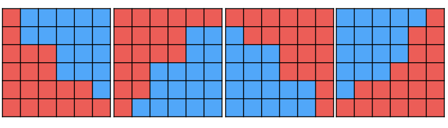

## Jumping 寫法

紀錄目前位置 pos 與跳躍距離 jump，只要不滿足條件就往前跳，jump 每次減半

??? note "code"
	```cpp linenums="1"
	// 找到第一個比 key 大的元素的 index 
    void find(int key) {
        if (a[0] >= key) {
            return 0;
        }
        int pos = 0;
        for (int jump = n / 2; jump; jump >>= 1) {
            while (pos + jump < n && a[pos + jump] < key) {
                pos += jump;
            }
        }
        return pos + 1;
    }
    ```

## 第 k 小

令 k 為 0-base，我們都是去找最大的 threshold t 滿足「小於」 t 的個數 <= k

???+note "[CF EDU A. K-th Number in the Union of Segments](https://codeforces.com/edu/course/2/lesson/6/5/practice/contest/285084/problem/A)"
	有一個 multiset，$n$ 次 insert $l_i,\ldots ,r_i$ 進去，問 multiset 第 $k$ 小的數字（$k$ 為 0-base）　
	
	$n\le 50,0\le k\le 2\times 10^9,-2\cdot 10^9 \le l_i \le r_i \le 2\cdot 10^9$
	
	??? note "code"
		```cpp linenums="1"
		#pragma GCC optimize("O3,unroll-loops")
	    #pragma GCC target("avx2,bmi,bmi2,lzcnt,popcnt")
	
	    #include <bits/stdc++.h>
	    #define pb push_back
	
	    using namespace std;
	    using ll = long long;
	
	    struct Interval {
	        int l, r;
	    };
	
	    int n, k;
	    vector<Interval> intervals;
	
	    bool check(ll t) {
	        ll cnt = 0;
	        for (auto &[l, r] : intervals) {
	            if (t > r) {
	                cnt += r - l + 1;
	            } else if (t > l) {
	                cnt += (ll)t - l;
	            }
	        }
	
	        return cnt <= k;
	    }
	
	    signed main() {
	        ios::sync_with_stdio(0);
	        cin.tie(0);
	        cin >> n >> k;
	        for (int i = 0; i < n; i++) {
	            int l, r;
	            cin >> l >> r;
	            intervals.pb({l, r});
	        }
	
	        ll l = -3e9, r = 3e9;
	        // 找到最大的 x 滿足小於 x 的個數 <= k
	        while (r - l > 1) {
	            ll mid = (l + r) / 2;
	            if (check(mid)) l = mid;
	            else r = mid;
	        }
	        cout << l << '\n';
	    } 
	    ```

???+note "[CF EDU C. K-th Sum](https://codeforces.com/edu/course/2/lesson/6/5/practice/contest/285084/problem/C)"
	給長度為 $n$ 的兩個陣列 $a,b$，問將所有 $(i,j)$ 的 $a_i+b_j$ 列出來後第 $k$ 小是多少
	
	$n\le 10^5,1\le k\le n^2$
	
	??? note "code"
		```cpp linenums="1"
		#include <bits/stdc++.h>
	    #define int long long
	    #define pii pair<int, int>
	    #define pb push_back
	    #define mk make_pair
	    #define F first
	    #define S second
	    #define ALL(x) x.begin(), x.end()
	
	    using namespace std;
	
	    const int INF = 2e18;
	    const int maxn = 3e5 + 5;
	    const int M = 1e9 + 7;
	
	    int n, k;
	    int a[maxn], b[maxn];
	
	    bool check(int x) {
	        // 求 < x 的數字有幾個
	        int cnt = 0;
	        int j = n;
	        for (int i = 1; i <= n; i++) {
	            while (1 <= j && a[i] + b[j] >= x) {
	                j--;
	            }
	            cnt += j;
	        }
	
	        return cnt <= k;
	    }
	
	    signed main() {
	        cin >> n >> k;
	        k--;
	        for (int i = 1; i <= n; i++) {
	            cin >> a[i];
	        }
	        for (int i = 1; i <= n; i++) {
	            cin >> b[i];
	        }
	        sort(a + 1, a + n + 1); sort(b + 1, b + n + 1);
	        // 找到最大的 x 滿足小於 x 的個數 <= k
	
	        int l = 1, r = 1e11;
	        while (r - l > 1) {
	            int mid = (l + r) / 2;
	            if (check(mid)) l = mid;
	            else r = mid;
	        }
	        cout << l << '\n';
	    } 
	    ```

???+note "[TIOJ 1208 . 第K大連續和](https://tioj.ck.tp.edu.tw/problems/1208)"
	給一個長度為 $n$ 的陣列 $a_1 ,\ldots ,a_n$，輸出所有 subarray sum 中第 $k$ 大的
	
	$n\le 2\times 10^4 , 1\le k \le \frac{n(n+1)}{2}$
	
	??? note "思路"
		二分搜最小的 x 滿足「大於 x 的 subarray sum 個數 <= k」，但要注意會有 (l + r) / 2 可能會是負的，所以必須 mid = l + (r - l) / 2
		
		也可以把問題轉換成第 k 小，後二分搜最大的 x 滿足「小於 x 的 subarray sum 個數 <= k」
		
	??? note "code"
		```cpp linenums="1"
		#include <bits/stdc++.h>
	    #include <bits/extc++.h>
	    #define int long long
	    #define pii pair<int, int>
	    #define mk make_pair<int, int>
	    using namespace std;
	    using namespace __gnu_pbds;
	
	    template <typename T>
	    using rank_set = tree<T, null_type, std::less<T>, rb_tree_tag,tree_order_statistics_node_update>;
	
	    const int maxn = 2e5 + 5;
	    int n, k;
	    int a[maxn], pre[maxn];
	
	    bool check(int x) {
	        rank_set<pii> st;
	        // pre[i] - pre[j] > x
	        // pre[i] - x > pre[j]
	        int cnt = 0;
	        for (int i = 0; i <= n; i++) {
	            cnt += st.order_of_key(mk(pre[i] - x + 1, 0));
	            st.insert({pre[i], i + 1});
	        }
	        return cnt <= k;
	    }
	
	    void solve() {
	    	k--;
	        for (int i = 1; i <= n; i++) {
	            cin >> a[i];
	            pre[i] = pre[i - 1] + a[i];
	        }
	        int l = -2e9, r = 2e9;
	        while (r - l > 1) {
	            int mid = (l + r) / 2;
	
	            if (check(mid)) r = mid;
	            else l = mid;
	        }
	        cout << l << "\n";
	    }
	
	    signed main() {
	        while (cin >> n >> k) {
	            if(n == 0 && k == 0) break;
	            solve();
	        }
	    }
	    ```

???+note "[2023 TOI 初選 pB. 裁員風暴 (storm)](https://zerojudge.tw/ShowProblem?problemid=k185)"
	給一個長度為 $n$ 的序列 $a_1, \ldots ,a_n$，有以下兩種團隊:
	
	- 有 $n$ 個團隊，第 $i$ 個團隊權重為 $a_i$
	
	- 有 $\binom{n}{2}$ 個團隊，挑選 $i,j$ 的團隊權重為 $\frac{a_i+a_j}{2}$
	
	合起來共有 $\frac{n(n+1)}{2}$ 個團隊，問權重第 $k$ 大的是多少，輸出分數
	
	$n\le 2\times 10^5,k\le \frac{n(n+1)}{2},|a_i|\le 10^9$
	
	??? note "思路"
		先將所有 $a_i$ 變成 $2a_i$，我們二分搜最大的 $x$ 使 $\ge x$ 的團隊數量恰為 $k$，這樣選兩個的就能用雙指針解決，最後輸出答案再看 x 除 2 是否可整除即可
		
	??? note "code"
		```cpp linenums="1"
		#include <algorithm>
	    #include <iostream>
	    #include <vector>
	
	    #define int long long
	
	    using namespace std;
	
	    int n, k;
	    vector<int> a;
	
	    int cal(int val) {
	        int ans = 0;
	        for (int i = 0, j = n; i < n; i++) {
	            if (2 * a[i] > val) break;
	            while (j > i && a[j - 1] + a[i] > val) j--;
	            ans += j - i;
	        }
	        return ans;
	    }
	
	    // 找第 k 小的 a[i] + a[j], 其中 i <= j
	    // 若第 k 小的答案是 m, 會滿足 cal(m-1) < k && cal(m) >= k
	    int solve() {
	        sort(a.begin(), a.end());
	
	        int l = 2 * a[0], r = 2 * a[n - 1];
	        while (l != r) {
	            int mid = l + (r - l) / 2;
	            if (cal(mid) >= k) {
	                r = mid;
	            } else {
	                l = mid + 1;
	            }
	        }
	        return r;
	    }
	
	    signed main() {
	        cin.tie(0);
	        cin.sync_with_stdio(0);
	
	        cin >> n >> k;
	        k = n * (n + 1) / 2 - k + 1;  // 改成找第 k 小
	
	        a = vector<int>(n);
	        for (int i = 0; i < n; i++) {
	            cin >> a[i];
	        }
	
	        int ans = solve();
	
	        if (ans % 2 == 0) {
	            cout << ans / 2 << '\n' << 1 << '\n';
	        } else {
	            cout << ans << '\n' << 2 << '\n';
	        }
	        return 0;
	    }
	    ```

???+note "[2023 全國賽模擬賽 pG. 吃午餐 (lunch)](https://codeforces.com/gym/104830/attachments/download/23302/zh_TW.pdf)"
	給兩個長度為 $n$ 的序列 $a,b$，將兩兩分成一組，定義 cost 為每組的 $\max(a_i, a_j) + \max(b_i, b_j)$ 取 max，問 cost 最小是多少
	
	$2\le n\le 10^5, 1\le a_i, b_i \le 10^8$
	
	??? note "思路"
		我們先固定一個維度，使其具有單調性，這樣就只要著重於處理另一個維度。二分搜後，我們先將 $a$ 大到小 sort，假設目前二分搜的 threshold 為 $t$，則 i 可以配的就是符合 $b_j\le t - a_i$，那這時候我們就要來思考要怎麼取最好，我們發現 $t-a_i$ 只會單調遞增，所以能取的 $b_j$ 之後只會越來越多，那麼這時我們就挑 $b_j\le t - a_i$ 中 $a_j$ 最大的，因為這時我們才能有效的使用 $a_i$ 來覆蓋 $a_j$ 的貢獻。

???+note "法里西數列 [CS Academy - Farey Sequence](https://csacademy.com/contest/archive/task/farey_sequence/statement/)"
    給 $n$，序列 $F_n$ 舉例來說如下 :

    - $F_3$ = 2/3, 1/2, 1/3
    
    - $F_4$ = 3/4, 2/3, 1/2, 1/3, 1/4
    
    - $F_5$= 4/5, 3/4, 2/3, 3/5, 1/2, 2/5, 1/3, 1/4, 1/5
    
    問 $F_n$ 的小到大 sort 好後的第 $k$ 項 
    
    ??? note "思路"
    	見<a href="/wiki/search/images/CS Academy - Farey Sequence 題解.html" target="_blank">此處</a>

## 雙層二分搜

???+note "[Google Code Jam 2020 Round2 P1. Incremental House of Pancakes](https://www.acmicpc.net/problem/27811)"
	有兩堆鬆餅，其中分別有 $L$ 和 $R$ 片，第 $i$ 個人想從較多的那堆拿走 $i$ 片鬆餅，若兩堆鬆餅數量皆不足 $i$ 片，則鬆餅店會結束營業。問有幾個人能拿到鬆餅
	
	$1\le L, R\le 10^{18}$

???+note "[JOI 2014 Final 年轮蛋糕](https://loj.ac/p/2758)"
	

## 其他

???+note "[CF 1853 C. Ntarsis' Set](https://codeforces.com/contest/1853/problem/C)"
	給一個包含 $1,2,\ldots ,10^{1000}$ 所有數字的 Set $S$，每天從 $S$ **同時**移除第 $a_1,a_2,\ldots ,a_n$ 個數字，問 $k$ 天之後 $S$ 中最小的數字是多少
	
	$n,k\le 2\times 10^5,1\le a_i \le 10^9,a_1<a_2<\ldots < a_n$
	
	??? note "hint"
		令 $a_i\le x < a_{i+1}$，過了一天之後，小於等於 $x$ 的數字就會剩下 $x-i$ 個
		
	??? note "思路"
		觀察 :
		
		- 令答案為 ans，在 ans 之前的數字一定都會被移除
	
		- 令 $a_i\le x < a_{i+1}$，當過了一天之後，小於等於 $x$ 的數字會被移除 $i$ 個，也就是小於等於 $x$ 的數字就會剩下 $x-i$ 個，然後我們再去找 $a_j\le x - i < a_{j+1}$，過了一天後，小於等於 $x$ 的數字就會剩下 $x-i-j$ 個，以此類推
	
		<figure markdown>
	      { width="400" }
	      <figcaption>$a=[1,3,4],k=3,x=8$</figcaption>
	    </figure>
	
		二分搜最後一個在「移除區段」的數字，去 check : mid 之前的數字在經過 $k$ 天的移除後剩下幾個 
		
		<figure markdown>
	      { width="400" }
	    </figure>
		
	??? note "code"
		```cpp linenums="1"
		#include <bits/stdc++.h>
	
	    using namespace std;
	
	    typedef long long ll;
	    typedef double ld;
	    typedef pair<ll, ll> pll;
	    typedef pair<int, int> pii;
	    #define F first
	    #define S second
	    #define all(x) x.begin(), x.end()
	    #define MP(x, y) make_pair(x, y)
	
	    const int maxn = 2e5 + 10;
	
	    int T = 1, n, k, a[maxn];
	
	    bool check(ll x) {
	        ll tmp = x;
	        int ptr = n;
	
	        for (int i = 1; i <= k; i++) {
	            while (ptr && a[ptr] > x) {
	                ptr--;
	            }
	
	            x -= ptr;
	        }
	
	        return (x == 0);
	    }
	
	    int main() {
	        cin >> T;
	
	        while (T--) {
	            cin >> n >> k;
	
	            for (int i = 1; i <= n; i++) {
	                cin >> a[i];
	            }
	
	            ll l = 0, r = 1e18;
	            while (r - l > 1) {
	                ll mid = (l + r) >> 1;
	
	                if (check(mid)) l = mid;
	                else r = mid;
	            }
	
	            cout << r << '\n';
	        }
	    }
		```


???+note "[CF 1856 C. To Become Max](https://codeforces.com/contest/1856/problem/C)"
	給一個長度為 $n$ 的序列 $a$，你能做以下操作至多 $k$ 次，並輸出 $\max(a_1, a_2, \ldots a_n)$ 最大能到多少 :
	
	- 選一個 index $i$ 滿足 $1\le i \le n - 1$ 且 $a_{i}\le a_{i+1}$，將 $a_i$ 加 $1$
	
	$2\le n\le 1000,1\le k\le 10^8,1\le a_i \le 10^8$
	
	??? note "思路"
		考慮二分搜 $x$，檢查是否能使 $\max(a_1,\ldots, a_n) \ge x$。對於一個最大值 $x$，若此最大值是 $a_i=x$，可以觀察到後面會有一段連續遞減序列，且恰好是以 $1$ 最為差在遞減，因為 $a_i$ 要是 $x$，$a_{i+1}$ 就必須達到 $x-1$，$a_{i+2}$ 就必須達到 $x-2$，以此類推，也有可能到某個 $a_{i+}$ 他本身就已經大於等於要達到的 threshold，那項即為遞減序列的終止處。
		
		所以我們在檢查的時候只需枚舉每一項作為最大值，然後看 $k$ 是否能夠應付要將 $a_i=x$ 的成本即可（詳見代碼）　
		
	??? note "code"
		```cpp linenums="1"
		#include <bits/stdc++.h>
	    #define int long long
	    #define pii pair<int, int>
	    #define pb push_back
	    #define mk make_pair
	    #define F first
	    #define S second
	    #define ALL(x) x.begin(), x.end()
	
	    using namespace std;
	
	    const int INF = 2e18;
	    const int maxn = 3e5 + 5;
	    const int M = 1e9 + 7;
	
	    int n, k;
	    int a[maxn];
	
	    bool check(int x) {
	        for (int i = 0; i < n; i++) {
	            int t = x, cnt = 0;
	            for (int j = i; j < n; j++) {
	                if (a[j] >= t) {
	                    return true;
	                }
	                cnt += (t - a[j]);
	                if (cnt > k) {
	                    break;
	                }
	                t--;
	            }
	        }
	        return false;
	    }
	
	    void solve() {
	        cin >> n >> k;
	        for (int i = 0; i < n; i++) {
	            cin >> a[i];
	        }
	        int mx = *max_element(a, a + n);
	
	        int l = mx, r = mx + k + 1;
	        while (r - l > 1) {
	            int mid = (l + r) / 2;
	            if (check(mid)) l = mid;
	            else r = mid;
	        }
	        cout << l << '\n';
	    }
	
	    signed main() {
	        int t = 1;
	        cin >> t;
	        while (t--) {
	            solve();
	        }
	    } 
		```

???+note "[2021 附中模競 II pD. 調色盤 (Palette)](https://drive.google.com/file/d/1Qw4eUf0uSrLDOsdrq11xZxrCAVubAW4P/view)"
	給一個長度為 $n$ 的陣列 $a_1 ,\ldots ,a_n$，有 $q$ 筆詢問如下 :
	
	- $\text{query}(l,r):$ 問 $a_l \sim a_r$ 裡有幾個 subarray 滿足最大最小差 $\le k$
	
	$n,k\le 10^6,c_i\le 10^6,q\le 10^6$
	
	??? note "思路"
		對於每個 i 定義 last[i] = 從 i 開始最大可以到哪個 index 滿足區間 max - min <= k
		
		這可以用 two pointer + sparse table 預處理
		
		然後對於 query(l, r) 就可以二分搜最大的分界點 t，滿足前面的 last[i] 都 <= r，後面的都 > r。前面的可以對於 last[ ] 維護 prefix sum，後面用數學解 O(1) 算即可

???+note "[LOJ #2086. 「NOI2016」区间](https://loj.ac/p/2086)"
	給 $n$ 個 interval $[l_i,r_i]$，選 $m$ 個 interval，使得至少有一個 point 被這 $m$ 個 interval 都覆蓋到。問選出來的最大 interval 長度 - 最小 interval 長度最小可以是多少，或無解。
	
	$n\le 5\times 10^5, m\le 2\times 10^5, 0\le l_i\le r_i\le 10^9$
	
	??? note "思路"
		將 interval 按照長度小到大排序，這樣我們就可以使用 two pointer 對於每個 l，找出最少到哪個 r，選 l, ..., r 的這些 interval 是合法的，可以用線段樹檢查。

???+note "[2021 全國賽 pH. 天竺鼠遊行](https://tioj.ck.tp.edu.tw/problems/2258)"
	有 $n$ 隻天竺鼠，第 $i$ 隻的高度是 $h_i$。你要選 $p$ 組各 $k$ 隻，然後把每一組的天竺鼠排成一個環，使得兩兩相鄰的天竺鼠高度差的最大值盡量小。
	
	$1\le n\le 10^6,1\le h_i\le 10^9$
	
	??? note "subtask"
	    === "subtask 1"
	
	        $k=n,n\le 10,p=1$
	
	    === "subtask 2"
	
	        $k=n,n\le 10^5,p=1$
	
	    === "subtask 3"
	
	        $p=1$
	
	    === "subtask 4"
	
	        無額外限制
	
	??? note "思路"
		顯然由小到大 sort 好會使環的頭跟尾的高度差最大。我們先暴力做 subtask 1，例如 :
		
		$$
		[1,2,3,4,5,6,7,8] \to [1, 3, 5, 7, 8, 6, 4, 2]
		$$
		
		會觀察到答案就是 $\max \{ h_i − h_{i−2} \}$。對於 subtask 3 $p=1$，顯然選連續的 $k$ 個一定最好，可用 sliding window 維護答案。對於滿分解，我們去二分 threshold $t$，檢查最前面的 $ans \le t$ 的區間是否有 $p$ 個即可，複雜度 $O(n \log C)$

???+note "[2021 TOI pB. 掃地機器人 30%](https://tioj.ck.tp.edu.tw/problems/2194)"
	$n$ 間教室，一開始你在第一間，給你 $T$ 分鐘的打掃時間每間教室第一分鐘可以吸到 $s[i]$ 的灰塵，每分鐘遞減 $d[i]$ 個灰塵，從第 $i$ 間教室移動到第 $i+1$ 間教室花 $t[i]$ 的時間，問這 $T$ 分鐘最多可以掃到多少灰塵
	
	$n\le 1000, m\le 10^9,0\le t[i], d[i] \le 10^9, 1\le s[i] \le 10^9$
	
	??? note "思路"
		我們先枚舉掃到哪間教室，將中間換教室的時間扣掉，$k=T-t_1-t_2-..t_{e}$。依照 greedy 的想法，我們一定是每次拿最大的，所以我們可以去二分一個 threshold $x$ 滿足最小可以掃到 $x$ 個灰塵。
		
	??? note "code"
		```cpp linenums="1"
		#include <bits/stdc++.h>
	    #define int long long
	    #define pb push_back
	    #define mk make_pair
	    #define pii pair<int, int>
	    using namespace std;
	
	    const int INF = 9e18;
	    const int maxn = 1e3 + 5;
	    int s[maxn], d[maxn], t[maxn];
	    int n, m;
	
	    int check (int idx, int x, int k) {
	        int res = 0;
	        for (int i = 1; i <= idx; i++) {
	            if (d[i] == 0) {
	                if (s[i] >= x) return true;
	                // 代表有無限個 a_x 或 b_x 那 (無限)一定大於 k
	                continue;
	            }
	            if (s[i] >= x) {
	                res += (s[i] - x) / d[i] + 1;
	            }
	        }
	        return res >= k; 
	    }
	
	    int get_ans(int idx, int x, int k) {
	        int res = 0;
	        int x_cnt = 0; // 恰等於 x 的有幾個
	        int greater_cnt = 0; // > x 的有幾個
	        for (int i = 1; i <= idx; i++) {
	            if (s[i] > x) {
	                int mx = s[i];
	                int mn = s[i] - (s[i] - x) / d[i] * d[i];
	                int tmp = (s[i] - x) / d[i];
	                if (mn == x) {
	                    mn += d[i];
	                    x_cnt++;
	                }
	                int c = (mx-mn) / d[i] + 1;
	                res += (mx+mn) * c / 2LL;
	                greater_cnt += c;
	            }
	            if (s[i] == x) {
	                if (d[i] != 0) x_cnt++;
	                else x_cnt = INF;
	            }
	        }
	        res += min(x_cnt, k - greater_cnt) * x;
	        // 真正可取等於x 的量 = min(等於 x 的, 全 - 大於 x 的)
	        return res;
	    }   
	
	    void init() {
	        cin >> n >> m;
	        for (int i = 1; i < n; i++) {
	            cin >> t[i];
	        }
	        for (int i = 1; i <= n; i++) {
	            cin >> s[i];
	        }
	        for (int i = 1; i <= n; i++) {
	            cin >> d[i];
	        }
	    }
	
	    void work () {
	        int ans = 0;
	        int k = m;
	        for (int i = 1; i <= n; i++) {
	            k -= t[i - 1];
	            if (k < 0) continue;
	            // bin search x: min dust per minute
	            int l = 0, r = 2e9;
	            while (l < r - 1) {
	                int mid = (l + r) >> 1;
	                if (check(i, mid, k)) {
	                    l = mid;
	                } else { // 時間還有剩, mid 不可能是答案
	                    r = mid;
	                }
	            } 
	            ans = max(ans, get_ans(i, l, k));
	        }
	        cout << ans << "\n";
	    }
	
	    signed main () {
	        init();
	        work();
	    }
		```

???+note "[CS Academy - K Inversions](https://csacademy.com/contest/archive/task/k-inversions/statement/)"
	給 $n,k$，求 $1\ldots n$ 的 permutation 滿足恰有 $k$ 個逆序數對，輸出字典序最小的
	
	$2\le n\le 10^5, 0\le k\le \frac{n(n+1)}{2}$
	
	??? note "思路"
		首先考慮開頭要放哪個數字，可以二分搜最小可以放哪個數字，然後將這格刪掉就變子問題了
		
	??? note "code"
		```cpp linenums="1"
		#include <bits/stdc++.h>
	    #include <bits/extc++.h>
	    using namespace __gnu_pbds;
	    using namespace std;
	
	    #define ll long long
	    typedef tree<int, null_type, less<int>, rb_tree_tag, tree_order_statistics_node_update> ordered_set;
	
	    int main() {
	        ios::sync_with_stdio(0);
	        cin.tie(0);
	        cout.tie(0);
	        ll n, k;
	        cin >> n >> k;
	        ordered_set st;
	        for (int i = 1; i <= n; i++) st.insert(i);
	        vector<int> ans;
	        for (ll i = n - 1; i >= 0; i--) {
	            int l = 0, r = st.size() - 1;
	            while (l != r) {
	                int mid = (l + r) / 2;
	                if (mid + i * (i - 1) / 2 >= k) r = mid;
	                else l = mid + 1;
	            }
	            ans.push_back(*st.find_by_order(l));
	            k -= l;
	            st.erase(st.find_by_order(l));
	        }
	        for (auto &i : ans) cout << i << ' ';
	    }
	    ```

???+note "[2021 全國賽 pD. 汽車不再繞圈圈](https://tioj.ck.tp.edu.tw/problems/2254)"
	給一張 $n$ 點 $m$ 邊的有向圖，反轉第 $i$ 條邊至少要擁有權限 $c_i$。問至少要有多少權限才能讓整張圖沒有環 ? 並輸出反轉方案。
	
	$n\le 10^5, m\le 10^5, 1\le c_i\le 10^9$
	
	??? note "思路"
		二分搜權限，在 check 的時候只考慮權限 > t 所形成的圖是否有環（可以用拓樸排序檢查），因為其他邊一定可以按照拓樸順序比較小的指向比較大的。

???+note "[全國賽 2019 史蒂芬與獵人](https://sorahisa-rank.github.io/nhspc-fin/2019/problems.pdf#page=10) / [LeetCode 363. Max Sum of Rectangle No Larger Than K](https://leetcode.com/problems/max-sum-of-rectangle-no-larger-than-k/)"
	給你一個 $n\times m$ 的 Matrix，找出並傳回矩形區域的不超過 $k$ 的最大數值和
	
	$1\le n,m \le 100, -100\le a_{i,j}\le 100, -10^5 \le k\le 10^5$
	
	??? note "思路"
		枚舉 row $l,r$，將他壓成一維的問題。這樣就可以用前綴和 + 二分搜（在 set 內 lower bound）解決

???+note "[TIOJ  1669 . 征戰天龍國](https://tioj.ck.tp.edu.tw/problems/1669)"
	給一個 $n\times m$ 的 grid，grid 上的數字只會是 $-1,0,1$，選一個矩形區域滿足區域內的數字總和 $\ge k$，問這個矩形區域的面積最少可以是多少
	
	$1\le n,m \le 500, 0\le k\le 2.5\times 10^5$
	
	??? note "思路"
		一樣枚舉 row $l,r$，將他壓成一維的問題，我們當然可以去二分搜，但是會 TLE。其實就是[這題](https://leetcode.com/problems/shortest-subarray-with-sum-at-least-k/)，具體做法可參考[這篇題解](https://blog.51cto.com/u_15003301/6330063)。觀察到若一個點 $i$ 的 prefix sum 若比 $i-1$ 的 prefix sum 還小，那對於後面的肯定選 $i$ 比較好。還有，對於一個 $i$ 若已經能跟 $j$ 配，那 $j$ 之後都不用考慮了，所以我們可以用單調隊列維護，將已經能配地給 pop 掉
		
	??? note "code"
		```cpp linenums="1"
		#include <bits/stdc++.h>
	    #define int long long
	    #define F first
	    #define S second
	    using namespace std;
	
	    int a[505][505];
	
	    signed main() {
	        int n, m, K;
	        cin >> n >> m >> K;
	        for (int i = 1; i <= n; i++) {
	            for (int j = 1; j <= m; j++) {
	                char c;
	                cin >> c;
	                if (c == '+') {
	                    a[i][j] += 1;
	                } else if (c == '-') {
	                    a[i][j] -= 1;
	                }
	                a[i][j] += a[i - 1][j];
	            }
	        }
	        int mn = 2e9;
	        for (int lx = 1; lx <= n; lx++) {
	            for (int rx = lx; rx <= n; rx++) {
	                vector<int> s(m + 1);
	                deque<pair<int, int>> dq;
	                dq.push_back({0, 0});
	                for (int i = 1; i <= m; i++) s[i] = s[i - 1] + (a[rx][i] - a[lx - 1][i]);
	                for (int i = 1; i <= m; i++) {
	                    while (!dq.empty() && s[i] - dq.front().F >= K) {
	                        mn = min(mn, (i - dq.front().S) * (rx - lx + 1));
	                        dq.pop_front();
	                    }
	                    while (!dq.empty() && dq.back().F >= s[i]) {
	                        dq.pop_back();
	                    }
	                    dq.push_back({s[i], i});
	                }
	            }
	        }
	        if (mn == 2e9) {
	            cout << -1 << "\n";
	        } else {
	            cout << mn << "\n";
	        }
	    }
		```

???+note "[JOI 2017 Final JOIOI 王国](https://loj.ac/p/2334)"
	給一張 $n\times m$ 的 Grid，求讓 $a_{i,j}$ 用以下條件分兩組，同組內的最大差 max 起來最小是多少
	
	- 同一組必須連通
	
	- 單獨每個 row 或 col 看下去同組的是連在一起的
	
	$2\le n, m\le 2000, a_{i, j} \le 10^9$
	
	??? note "思路"
		最小化最大值 $\rightarrow$ 二分搜答案
		
	    要讓 max 跟 min 盡量在不同組，所以我們可以先假設 max 跟 min 是在不同組，最後答案再跟 max - min 取 min 即可。
	    
	    <figure markdown>
	      { width="400" }
	    </figure>
	    
	    發現如上圖同組一定是隨著 col 遞增，不是遞增把它旋轉到某個角度一定也是 col 遞增的，所以我們可以直接假設 max 在靠左的組，min 在靠右的組（如第 2 張圖的 case），然後就可以 Greedy 的選紅色的，剩下就是藍色的，至於怎麼 Greedy，同一個 row 只要不超過 threshold 能選多少就選多少，也要判斷不能選超過上一個 row 的選的長度，見代碼
	    
	??? note "code"
		```cpp linenums="1"
		#include <bits/stdc++.h>
	    #define int long long
	
	    using namespace std;
	
	    const int INF = 2e18;
	    const int MAXN = 2e3 + 5;
	    int n, m, mx, mn;
	    int a[MAXN][MAXN];
	    int g[MAXN][MAXN];
	
	    void rotate() {
	        for (int i = 1; i <= n; i++) {
	            for (int j = 1; j <= m; j++) {
	                g[j][n - i + 1] = a[i][j];
	            }
	        }
	        swap(n, m);
	        for (int i = 1; i <= n; i++) {
	            for (int j = 1; j <= m; j++) {
	                a[i][j] = g[i][j];
	            }
	        }
	    }
	
	    bool check(int x) {
	        int lim = m + 1;
	        for (int i = 1; i <= n; i++) {
	            int r = 0;
	            for (int j = 1; j <= min(lim, m); j++) {
	                if (mx - x <= a[i][j]) {
	                    r = max(r, j);
	                } else {
	                    break;
	                }
	            }
	            lim = r;
	            for (int j = r + 1; j <= m; j++) {
	                if (a[i][j] - x > mn) {
	                    return false;
	                }
	            }
	        }
	        return true;
	    }
	
	    int search() {
	        int l = 0, r = 2e9 + 5;
	        while (l < r) {
	            int mid = (l + r) >> 1;
	            if (check(mid)) {
	                r = mid;
	            } else {
	                l = mid + 1;
	            }
	        }
	        return r;
	    }
	
	    signed main() {
	        cin >> n >> m;
	        mx = -INF, mn = INF;
	        for (int i = 1; i <= n; i++) {
	            for (int j = 1; j <= m; j++) {
	                cin >> a[i][j];
	                mx = max(mx, a[i][j]);
	                mn = min(mn, a[i][j]);
	            }
	        }
	
	        int ans = INF;
	        ans = min(ans, search());
	        rotate();
	        ans = min(ans, search());
	        rotate();
	        ans = min(ans, search());
	        rotate();
	        ans = min(ans, search());
	
	        ans = min(mx - mn, ans);
	        cout << ans << "\n";
	    }
		```

???+note "[2020 全國賽 pG. 矩陣相乘](https://tioj.ck.tp.edu.tw/pmisc/nhspc109.pdf#page=25)"
	給兩個 $n\times n$ 的矩陣 $A$ 與 $B$，已知 $C=A\times B$ 最多只有 $2n$ 個非零項，求 $C$
	
	$n\le 2800$

???+note "[2023 全國賽模擬賽 pG. 吃午餐 (lunch)](https://codeforces.com/gym/104830/attachments/download/23302/zh_TW.pdf#page=19)"
	給兩個長度為 n 的序列 a, b，將兩兩分成一組，定義 cost 為每組的 max(a[i], a[j]) + max(b[i], b[j]) 取 max，問 cost 最小是多少
	
	$n \le 10^5, 1 \le a, b \le 10^8$
	
	??? note "思路"
		二分搜 thresthold t，然後我們考慮 check(t)。我們規定 i 是從 a 大到小來取，那問題就變成我們要怎麼取 j。可以發現目前唯一有關係的就是 b 了，因為 t - a[i] 只會越來越大，能取的 b[j] 自然也會變多，所以我們當前取 b[j] <= t - a[i] 最大的 b[j] 即是最好的。

## 細節

- check(x) 的 x 太大的時候，有些情況會造成 cnt overflow

- 記得需要開 double 的時候，l, r, mid, check(x) 都要用 double，不能有一些是 int 有一些又是 double

- 注意 l, r 一開始的有沒有還蓋答案的左界右界

- while(l < r) 還是 while(r - l > 1)

- TLE 有可能是二分搜壞掉導致, 可能一開始推導時有誤

	- 當 (l + r) / 2 是負的時候，可能會出問題[^1]

---

## 參考資料

- <https://drive.google.com/file/d/1xxn2H5HSd5hl0573RWoKgJ_YdG3kNIu_/view>

[^1]: 見此處<a href="/wiki/search/images/1.html" target="_blank">此處</a>
