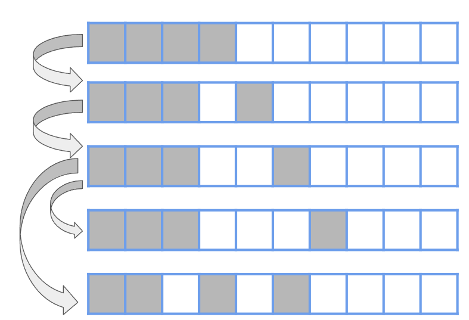
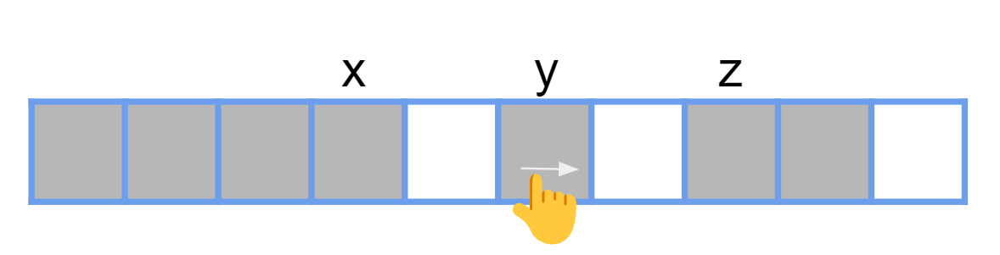

## 概念

Fracturing search 主要是探討一些「前 k 優解的問題」。下面的內容主要翻譯自 [USACO Guide](https://usaco.guide/adv/fracturing-search?lang=cpp)

???+note "USACO Guide Problem"
	給一個有向樹，第 i 個 node 有權值 v[i]。如果 i 並非 root 的話則有父親 p[i] 滿足 $v_{p_i}\le v_i$。每個 node 最多只有 d 個小孩，問樹中第 k 小的 v[i]
    
**方法1**：使用一個 priority queue，最初只包含 root。在每一步中，從 pq 中取出具有最小值的節點，然後將其所有子節點 push 進去，取出 k 個值之後就結束。在 pq 中插入了 O(k * d) 個節點，所以這個方法的時間複雜度是 $O(kd \log(kd))$。有點類似 dijkstra 的想法。

**方法2**：假設我們知道第 k 小的值是在範圍 [0, C]，那麼對於任意 $x\in [0, C]$，我們可以在 O(kd) 的時間內檢查樹中小於或等於 x 的值是否少於 k 個，這可以透過 dfs 實現，一旦找到 k 個值，就中直接 return。這個方法的時間複雜度是 $O(kd \log(C))$。

## 題目

???+note "[POI 2016 Korale](https://www.luogu.com.cn/problem/P5967)"
	給一個長度為 n 的序列 $a_1, \ldots ,a_n$，問第 k 小的方案價值總和，以及方案的集合，如果價值總和相同的以 index 串起來的字典序小到大排序

	$n\le 10^6, 1\le k\le 10^6, 1\le a_i\le 10^9$
	
	??? note "思路"
		這類型題目的關鍵字是[Fracturing Search](https://usaco.guide/adv/fracturing-search?lang=cpp)。
		
		**【問題一: 方案的價值總和】**
		
		注意到 $k \le 10^6$，所以我們可以暴力的建立方案，因為我們目前不處理字典序，所以可以先將 a 小到大 sort(我叫做 b)。這時候有兩種做法:
		
		**<u>作法1 小根堆</u>:**
		
		以 (sum, i) 表示前 i 個數中，選出若干數(必選第i個數)，且價值和為 sum。我們可以利用 heap 不斷地取出最小值，並把 
		
		- (sum + a[i + 1], i + 1)
		- (sum + a[i + 1] - a[i], i + 1)
	
		加入到 heap 中，這種方法可以將所有情況不重不漏遍歷且具有單調性。因為取到 k 個元素後就會停止，所以複雜度為 $O(k \log n)$。
		
		**<u>作法2 值域二分搜</u>:**
		
		我們暴力的去遞迴枚舉各種方案，取的時候從重量最小的開始考慮要不要取，當方案有 k 個的時候就停下來。複雜度為 $O(k \log C)$。
		
		```cpp linenums="1"
		void dfs(int now, int sum) {
	        cnt++;
	        if (cnt >= k) return;
	        for (int i = now; i <= n; i++) {
	            if (b[i] <= sum) {
	                dfs(i + 1, sum - b[i]);
	                if (cnt > k) return;
	            } else {
	                break;
	            }       
	        }
	    }
	
	    bool check(int x) {
	        cnt = 0;
	        dfs(1, x);
	        return cnt >= k;
	    }
	
	    int l = 0, r = total_sum;
	    while (l + 1 < r) {
	        int mid = (l + r) / 2;
	        if (check(mid)) {
	            r = mid;
	        } else {
	            l = mid;
	        }
	    }
	    ```
		
		**【問題二: 方案的集合】**
		
		跟上面類似，只是我們目前是用 a 這個未排序的陣列進行遞迴枚舉，但要怎麼保證每次的方案都是字典序最小呢? 假設我們目前枚舉完 [1, i]，價值剩餘 sum，我們要往下一步拓展時我們就選擇 i 右邊第一個比 sum 小的元素加入當前的集合，這樣就可以保證字典序最小，複雜度為 $O(k \log n)$
		
		```cpp linenums="1"
		void cnt_ans(int now, int sum) {
	        if (!sum) {
	            cnt--;
	            if (!cnt) {
	                for (int i = 1; i <= top; i++) {
	                    cout << stk[i] << '\n';
	                }
	                exit(0);
	            }
	            return;
	        }
	        for (int i = now + 1; i <= n; i++) {
	            i = seg.query(1, n, 1, i, sum);  // query i 右邊第一個比 sum 小的元素
	            if (!i) return; // i 右邊不存在比 sum 小的
	            stk[++top] = i; // 紀錄答案
	            cnt_ans(i, sum - a[i]);
	            top--;
	        }
	    }
	    ```

???+note "[USACO 2016 DEC Robotic Cow Herd P](https://www.luogu.com.cn/problem/P2541)"
	給你 n 個序列，第 i 個序列長度 m[i]，在每個序列中選擇一個數，cost 為元素之和，問第 k 小的 cost 為何
	
	$n, k\le 10^5, m_i\le 10$
	
	??? note "思路"
		先把每個序列 sort 好，初始狀態就是大家的第一項總和。我們的想法是一直從 1...n 向後依個序列一個序列考慮，然後只記錄最後一個序列的狀態。考慮當前的狀態 (sum, i, j) 為在第 i 個序列，目前選到第 j 小的元素，和為 sum，轉移如下:
		
		- 第 i 個序列改成選第 j + 1 小的元素
	
		- 往後面一個序列考慮了，第 i + 1 個序列選第 2 小的元素
	
		- 若 j = 2，將第 i 個序列改成選第 1 小的元素，將第 i + 1 個序列選第 2 小的元素
	
		為什麼需要第三種轉移呢? 因為一旦轉移到 i 了，i 就沒辦法回到選第 1 小的元素的時候。初始狀態就是 (每個序列的第 1 項總和 + a[1][2], 1, 2)。
		
		注意到第三種狀態可能會出現負代價的轉移，(a[i+1][2] - a[i+1][1]) - (a[i][2] - a[i][1]) < 0，想想看 dijkstra 是不允許負邊的，這邊的道理也一樣，所以我們必須按照 a[i][2] - a[i][1] 升序排序即可
		
	??? note "code"
		```cpp linenums="1"
		#include <bits/stdc++.h>
	    #define ll long long
	    using namespace std;
	    const int N = 1e5 + 10;
	    int n, k, m[N];
	    ll ans;
	    array<int, 20> p[N];
	    bool cmp(array<int, 20> a, array<int, 20> b) {
	        return a[2] - a[1] < b[2] - b[1];
	    }
	
	    struct node {
	        ll val;
	        int x, y;
	    };
	    bool operator<(node x, node y) {
	        return x.val > y.val;
	    }
	    priority_queue<node> pq;
	
	    int main() {
	        cin >> n >> k;
	        for (int i = 1; i <= n; i++) {
	            p[i].fill(1e9 + 1);
	            cin >> m[i];
	            for (int j = 1; j <= m[i]; j++)
	                cin >> p[i][j];
	            sort(p[i].data() + 1, p[i].data() + m[i] + 1);
	            ans += p[i][1];
	        }
	        sort(p + 1, p + n + 1, cmp);
	        pq.push({ans - p[1][1] + p[1][2], 1, 2});
	        for (int i = 2; i <= k; i++) {
	            int x = pq.top().x, y = pq.top().y;
	            ll val = pq.top().val;
	            pq.pop();            
	            ans += val;        
	            pq.push({val - p[x][y] + p[x][y + 1], x, y + 1});          
	            if (x == n) continue;                           
	            pq.push({val - p[x + 1][1] + p[x + 1][2], x + 1, 2});   
	            if (y == 2) pq.push({val - p[x + 1][1] + p[x + 1][2] - p[x][2] + p[x][1], x + 1, 2}); 
	        }
	        cout << ans;
	    }
	    ```

???+note "<a href="/wiki/search/images/2024_TOI_mock2_pE.pdf" target="_blank">2024 TOI 模擬賽第二場 pE. ⼜双叒叕⼀個⼦集問題</a>"

	給一個 multiset $a_1, \ldots ,a_n$，你需要從中選擇一些數構成子集，但選取的個數要在 $[l,r]$ 之間。問前 $k$ 大的子集和
	
	$n \leq 2 \times 10^5, l, r \leq 10^9, a_i \leq 10^9$
	
	??? note "思路"
		【subtask: l = r】
		
		因為有數量的限制，我們沒辦法用上面 POI 那題的狀態去做轉移，因為我們沒辦法定義一個好的「初始狀態」。例如說初始狀態為 a 大到小排序過的前 l 個，我們去做轉移的話，只有辦法改動到有選的最後一個剩餘的狀態是湊不出來的。所以我們要想辦法來定義一個狀態，我們發現一種選法轉移到另一種選法，等價於放棄當前選擇的一個物品，然後選擇它後面的一個物品。這樣可以得到一個更差的狀態。顯然若將每個有選的位置都紀錄狀態會達到 O(n)，所以我們試著觀察一些性質，先讓 a 大到小排序，假設我們初始狀態是選前 l 個，我們下一個狀態一定是將最後一個有選的往後移動一格較佳。
		
		<figure markdown>
          { width="300" }
        </figure>
        
        不過以上圖來看，我們發現到了第三排我們可以將最後一個有選的往後拉一格，或是把倒數第二個有選的，往後拉一格。所以我們得到了一個做法，從有選的末端開始將他們往後拉，固定了一個之後，再去拉有選的末端的倒數第二個，將其拉到固定的位置，再去拉有選的末端的倒數第三個，將其拉到固定的位置...。所以我們可以用三種變數來定義一個狀態：目前還沒移動的緊密前綴、目前在移動的那格。不過我們目前在移動的那格是不能超過他後面已經固定的位置，所以必須再多紀錄他後面有選的那格的 index。$(x, y, z,sum)$ 來表示當前狀態，其中：

        - $x$ 表示緊密前綴的末端

        - $y$ 表示當前再移動的那格

        - $z$ 表示 $y$ 後面第一個選擇的物品

        - $sum$ 表示我們當前狀態的權值和
		
		<figure markdown>
          { width="300" }
        </figure>
		
		轉移就是將當前的 y 往後移動一格，或是考慮從緊密前綴的末端他往後開始挪動（也就是 x）。
		
        $$
        (x, y, z, sum) \rightarrow \begin{cases} (x, y+1, z, sum-a_{y}+a_{y+1}) \\ (x-1, x + 1, y, sum) \end{cases}
        $$

        發現第二種狀態本來應該要是 $(x-1, x, y, sum)$，不過這跟原本的狀態是一模一樣的，所以我們往後選一格變成 $(x-1, x + 1, y, sum)$ 就好。最後初始狀態的部分，就是 $(l-1, l, n+1, 0)$。
        
        【subtask: full】
        
        我們其實只要改動初始狀態的部分，具體來說，我們對於 $i\in [l, r]$，將 $(i-1, i, n+1, 0)$ 都 push 進去 priority queue 做為初始狀態即可。
		
## 參考資料

- <https://www.luogu.com.cn/blog/Junko-Youmu/shopping-plans>