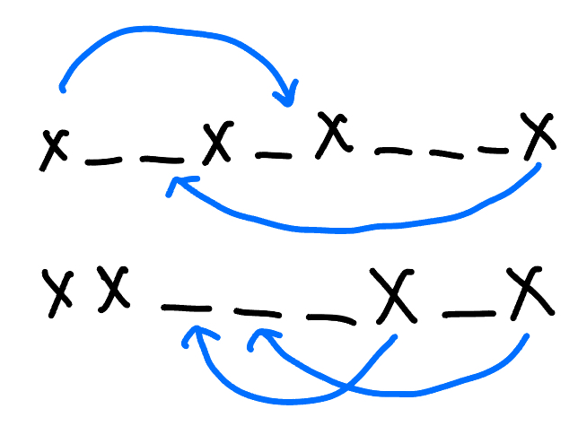
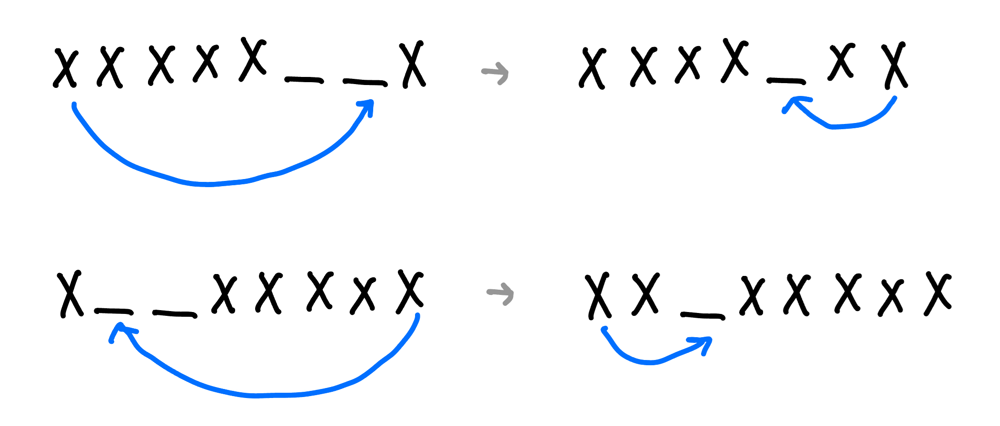
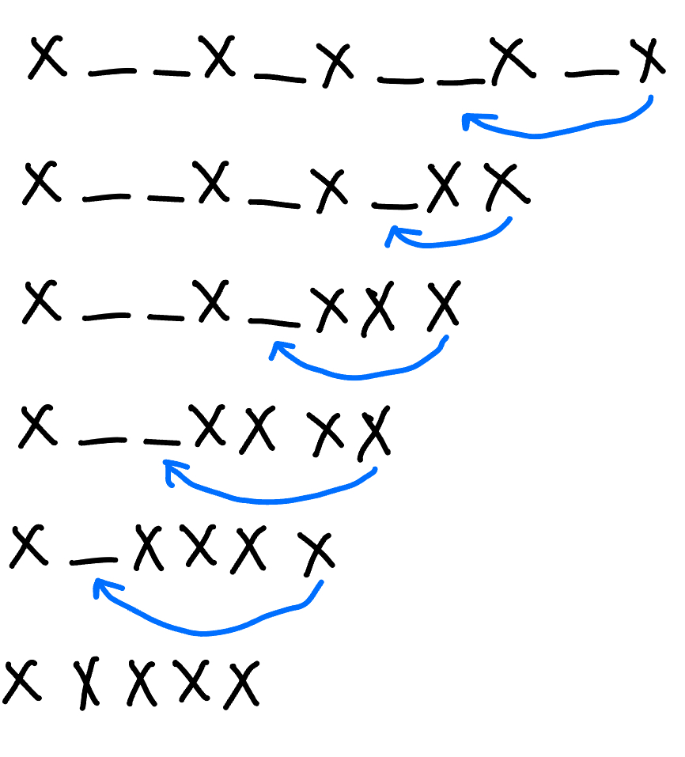
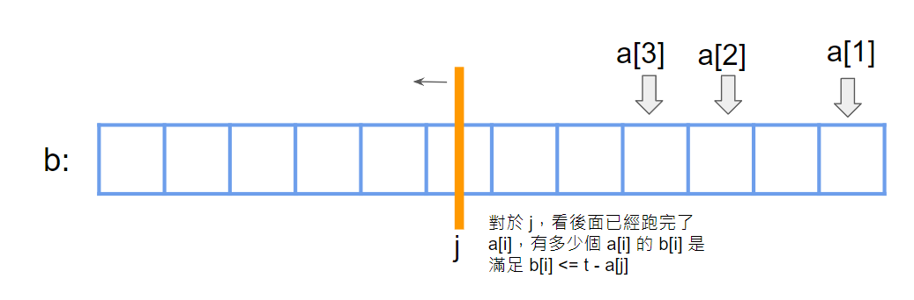

???+note "[CSES - Sum of Two Values](https://cses.fi/problemset/task/1640)"
	給一個長度為 n 的序列 $a_1, \ldots ,a_n$，以及數字 x，問這 n 個數字中哪兩個數字和為 x，輸出任何一組解
	

	$n\le 2\times 10^5, 1\le x,a_i\le 10^9$
	
	??? note "思路"
		排序後使用雙指針
		
	??? note "code"
		```cpp linenums="1"
		void solve() {
	        vector<pair<int, int>> v;
	        int n, x;
	        cin >> n >> x;
	        for (int i = 1; i <= n; i++) {
	            int x;
	            cin >> x;
	            v.push_back({x, i});
	        }
	        sort(v.begin(), v.end());
	        int l = 0, r = n - 1;
	        while (r > l) {
	            if (v[l].first + v[r].first > x) {
	                r--;
	            } else if (v[l].first + v[r].first < x) {
	                l++;
	            } else {
	                cout << v[l].S << ' ' << v[r].S << endl;
	                exit(0);
	            }
	        }
	        cout << "IMPOSSIBLE\n";
	    }
	    ```

???+note "[CSES - Sum of Three Values](https://cses.fi/problemset/task/1641)"
	給一個長度為 n 的序列 $a_1, \ldots ,a_n$，以及數字 x，問這 n 個數字中哪三個數字和為 x，輸出任何一組解
	
	$n\le 5000, 1\le x, a_i\le 10^9$
	
	??? note "思路"
		枚舉第一項，後續套用 Sum of Two Values

???+note "Sum of Two values 變化"
	給一個長度為 n 的序列 $a_1, \ldots ,a_n$，以及數字 x，問有幾組 (i, j) 使 $a_i+a_j=x$
	
	$n\le 2\times 10^5, 1\le x, a_i\le 10^9$
	
	??? note "思路"
		開一個桶 cnt[ ] 紀錄每種數字出現的次數，然後我們就可以將 a[ ] sort，並使用 unique 去除重複的元素，然後用雙指針（枚舉 l，r 會單調遞減）
		
	??? note "code"
		```cpp linenums="1"
		int j = n - 1;
		for (int i = 0; i < n; i++) {
			while (i < j && a[i] + a[j] >= x) {
				if (a[i] + a[j] == x) {
					ans += cnt[i] * cnt[j];
				}
				j--;
			}
		}
		```

???+note "[USACO 2021 December Contest, Silver Problem 2. Connecting Two Barns](https://www.usaco.org/index.php?page=viewproblem2&cpid=1159)"
	給 $n$ 點 $m$ 邊，點邊號 $1\ldots n$，可以額外建最多兩條邊，在點 $i,j$ 之間建邊花費 $(i-j)^2$，問最小花費使點 $1$ 跟點 $n$ 連通
	
	$n,m\le 10^5$
	
	??? note "思路"
		對於 1 和 n 有兩種情況:
		
		1. 在同一個連通塊裡。
		2. 在兩個不同的連通塊裡。
	
		接下來用 f[i] 來表示 i  所在的連通塊的代表點。對於情況 1，很明顯不需要連任何一邊，所以花費為 0。對於情況 2，一定是一個在 f[1]，連到中間的連通塊 f[i]，再從 f[i] 連到 f[n]。我們去預處理 f[1] 到 f[i] 的最近距離，存在 cost1[f[i]]，也去去預處理 f[i] 到 f[n] 的最近距離，存在 costn[f[i]]。最後的答案就是 cost1[i] + costn[n] 取最小值。至於要怎麼預處理有兩種方法，第一種是二分，也就是假設要算 f[i] 到 f[j] 的最小距離，先枚舉 f[i] 內的點，假設叫 k，我們就在 f[j] 內二分第一個比 k 大的數字與第一個比 k 小的數字，取 min 即可。第二種方法是 two pointer，我們去枚舉一個點 i，對於這個 i 一定是想要選數值越接近自己的點越好，假設現在是看到 f[1] 的距離，就是用 two pointer 維護在 f[1] 第一個比 i 大的數字與第一個比 i 小的數字（見代碼 line 54 ~ 72），最後把這個更新在 cost1[f[i]] 即可。
		
		講不清楚可以參考[官方詳解](https://www.usaco.org/current/data/sol_prob2_silver_dec21.html)
		
	??? note "code(from usaco)"
		```cpp linenums="1"
		#include <algorithm>
        #include <iostream>
        #include <numeric>
        #include <vector>

        using namespace std;

        void dfs(const vector<vector<int>> &G, vector<int> &cc, const int u, const int id) {
            for (int v : G[u]) {
                if (cc[v] != id) {
                    cc[v] = id;
                    dfs(G, cc, v, id);
                }
            }
        }

        void solve() {
            int n, m;
            cin >> n >> m;
            vector<vector<int>> G(n);
            for (int i = 0; i < m; i++) {
                int a, b;
                cin >> a >> b;
                a--;
                b--;
                G[a].push_back(b);
                G[b].push_back(a);
            }

            vector<int> cc(n);
            iota(cc.begin(), cc.end(), 0);
            for (int i = 0; i < n; i++) {
                if (cc[i] == i) {
                    dfs(G, cc, i, i);
                }
            }

            if (cc[0] == cc[n - 1]) {
                cout << "0\n";
                return;
            }

            vector<vector<int>> st(n);
            for (int i = 0; i < n; i++) {
                st[cc[i]].push_back(i);
            }

            long long ans = 1e18;
            vector<long long> cost1(n, 1e9);
            vector<long long> costn(n, 1e9);
            int idx1 = 0;
            int idxn = 0;
            for (int i = 0; i < n; i++) {
                while (idx1 < st[cc[0]].size()) {
                    cost1[cc[i]] = min(cost1[cc[i]], (long long)abs(i - st[cc[0]][idx1]));
                    if (st[cc[0]][idx1] < i) {
                        idx1++;
                    } else {
                        break;
                    }
                }
                if (idx1) idx1--;

                while (idxn < st[cc[n - 1]].size()) {
                    costn[cc[i]] = min(costn[cc[i]], (long long)abs(i - st[cc[n - 1]][idxn]));
                    if (st[cc[n - 1]][idxn] < i) {
                        idxn++;
                    } else {
                        break;
                    }
                }
                if (idxn) idxn--;
            }

            for (int i = 0; i < n; i++) {
                ans = min(ans, cost1[i] * cost1[i] + costn[i] * costn[i]);
            }

            cout << ans << "\n";
        }

        int main() {
            ios_base::sync_with_stdio(false);
            cin.tie(NULL);
            int t;
            cin >> t;

            for (int i = 0; i < t; i++) {
                solve();
            }

            return 0;
        }
	    ```

???+note "[USACO 2013 JAN Cow Lineup G](https://www.luogu.com.cn/problem/P3069)"
	有 n 頭牛排成一列，其中第 i 個的品種是 a[i]。只能刪掉至多 k 種品種的情況下，問品種相同的連續段的最大長度
	
	$n\le 10^5, a_i \le 10^9$
	
	??? note "思路"
		可以把題目看成: 對於每個有 k + 1 種品種的 subarray，問同種種類最多可以是多少。
		
		最暴力的想法就是枚舉右界 r，然後暴力的找到 l 使 [l, r] 恰有 k + 1 種品種，用 r 的品種來更新答案。但我們可以發現，這種 subarray 具有單調性，我們可以用 two pointer 維護，詳見代碼。
		
	??? note "code"
		```cpp linenums="1"
		#include <iostream>
	    #include <map>
	
	    using namespace std;
	
	    const int N = 100005;
	
	    int a[N];
	
	    int main() {
	        int n, k;
	        cin >> n >> k;
	
	        for (int i = 1; i <= n; ++i) {
	            cin >> a[i];
	        }
	
	        map<int, int> mp;
	        int ans = 0;
	        int l = 1;
	        for (int r = 1; r <= n; ++r) {
	            ++mp[a[r]];
	
	            while (mp.size() > k + 1) {
	                --mp[a[l]];
	                if (mp[a[l]] == 0) {
	                    mp.erase(a[l]);
	                }
	                ++l;
	            }
	
	            ans = max(ans, mp[a[r]]);
	        }
	
	        cout << ans;
	    }
		```

???+note "[USACO 2019 FEB Sleepy Cow Herding S](https://www.luogu.com.cn/problem/P5541)"
	一維數線上有 n 頭牛，每次只能挪動 edge point（最右邊或最左邊）的牛到任意位置，不過不能使他移動後還是在 edge point，問讓這些牛完全相鄰的最少和最多挪動次數。

	$n\le 10^5$
	
	??? note "思路"
		對於第一個問題求最小操作次數，由於每一步操作都在佔領空位，而最終狀態為一段包含連續 $n$ 個位置的區間，所以可以從結果出發，用 two pointer，枚舉這個最終區間的左端點 $a_i$，找到右端點長度 $a_j$，使 $a_j-a_i+1\le n$，這段區間的答案就會是 n - 區間內的牛的數量（將外面的牛都移進來這個區間內），即 n - (i - j + 1)。可以看一下下圖的移動方式。
		
		<figure markdown>
	      { width="300" }
	    </figure>
	
	    因為我們 edge point 移動過去之所以合法是因為我們能找到中間的空格，或者是另一端也有 edge point，可以讓牛安心的過去另一端 edge point 的旁邊。如果兩者都沒有，就會是以下兩種特殊情況。如果前 $n-1$ 個位置緊鄰，而最後一個位置離倒數第二個位置距離大於 $2$，比如 $1,2,3,4,7$，答案應為 $2$。同理，如果後 $n-1$ 個位置緊鄰，而第一個位置離第二個位置距離大於 $2$，答案也應為 $2$。
	
	    <figure markdown>
	      { width="400" }
	    </figure>
	
	    因為不能從 edge point 還到 edge point ，所以會比較類似一個區間一直在縮小（一個大的區間縮小成為一個長度為 n 的區間）。由於要讓移動次數越大越好，所以我們要盡量慢慢移動，而收攏的區間一定是越大越好，所以我們可以朝最左邊慢慢收攏過去，或是朝最右邊慢慢收攏過去。假如現在是朝最左邊慢慢收攏過去，我們一開始先將第 n 頭牛移動到區間 [a[1], a[n - 1]] 的最右邊的空格，這樣才不會讓他成為 edge point，然後再來我們就只要計算 [a[1], a[n - 1]] 內空格的數量，就可以得知接下來的操作次數。假如區間是 [l, r]（在這邊 l = a[1], r = a[n - 1]），答案也就是區間長度 - 區間內的牛的數量 + 一開始第 n 頭牛移過去的一次操作 = (r - l + 1) - n + 1。同理朝最右邊慢慢收攏過去就是 l = a[2], r = a[n]。
	    
	    <figure markdown>
	      { width="300" }
	    </figure>
		
	??? note "code"
	    ```cpp linenums="1"
	    #include <bits/stdc++.h>
	    using namespace std;
	
	    int n, a[100005], ans, ans2;
	
	    int main() {
	        cin >> n;
	        for (int i = 1; i <= n; i++) {
	            cin >> a[i];
	        }
	        sort(a + 1, a + n + 1);
	        if ((a[n - 1] - a[1] == n - 2 && a[n] - a[n - 1] > 2) || (a[n] - a[2] == n - 2 && a[2] - a[1] > 2)) {
	            ans = 2;  // 特判
	        } else {
	            int j = 1, res = 0;
	            for (int i = 1; i <= n; i++) {
	                while (j < n && a[j + 1] - a[i] + 1 <= n) {
	                    j++;
	                }
	                res = max(res, j - i + 1);
	            }
	            ans = n - res;
	        }
	        cout << ans << '\n';
	        cout << max(a[n - 1] - a[1], a[n] - a[2]) - n + 2 << '\n';
	        return 0;
	    }
	    ```
	    
???+note "自編題"
	給一個長度為 $n$ 的序列，第 $i$ 項有兩個數值 $(a_i,b_i)$。問有幾組 $(i,j)$ 滿足 $a_i+b_j\le t$，注意 $(i,j)$ 跟 $(j,i)$ 是同一種方案。

	$n\le 10^5,1\le a_i,b_i,t\le 10^9$
	
	??? note "思路"
		我們可以先算出來全部的方法數（包含 $(i,j),(j,i)$ 都算進去），然後再扣掉同時滿足 $a_i+b_j\le t,a_j+b_i\le t$ 的方案。這種方法數都可以透過下面的方法算出來。我們可以將式子移向寫成 $b_j\le t-a_i$，我們讓 $a_i$ 從小到大排序，這樣合法的 $b_j$ 會越來越少。我們將 $b_j$ 排序好後放在一個陣列，我們枚舉 $i$，因為具有單調性，所以我們可以慢慢拓展滿足 $b_j\le t-a_i$ 的後綴區間，相當於讓一個掃描線從右邊往左掃過來，在這裡就可以維護全部的方法數（對於每個 i，ans += j）。現在的問題就變成說要怎麼看滿足 $b_j\le t-a_i$ 的這些 $b_j$，滿足 $b_i\le t - a_j$ 的有幾個。我們維護一個資料結構 DS，假設目前跑過的 $i$ 的 $b_i$ 都已經加入 DS，那每掃過一個 $b_j$ 要在 DS 內看的就是有幾個 $b_i\le t - a_j$。注意到這樣也會重複計算，不過我們只要扣掉 $a_i + b_i \le t$ 的這種情況後，就可以將方法數除 2 即可。所以最後答案就是「全部的法數」 - 「重複的方法數（扣掉 a[i] + b[i] <= t） / 2 」。這裡給出<a href="/wiki/search/images/12.png" target="_blank">一個例子</a>。
		
		<figure markdown>
          { width="300" }
        </figure>
		
	??? note "code"
		```cpp linenums="1"
		#include <bits/extc++.h>
        #include <bits/stdc++.h>
        using namespace std;
        using namespace __gnu_pbds;
        template <typename T>
        using rank_set = tree<T, null_type, less<T>, rb_tree_tag, tree_order_statistics_node_update>;

        struct DS {
            rank_set<int> st;
            void insert(int x) {
                st.insert(x);
            }
            int query(int x) {
                return st.order_of_key(x + 1);
            }
        };

        struct Node {
            int a, b;
        };

        bool cmp_a(Node x, Node y) {
            return x.a < y.a;
        }

        bool cmp_b(Node x, Node y) {
            return x.b < y.b;
        }

        const int MAXN = 1e5 + 5;
        Node va[MAXN], vb[MAXN];

        signed main() {
            int n, t;
            cin >> n >> t;
            for (int i = 1; i <= n; i++) {
                cin >> va[i].a;
                vb[i].a = va[i].a;
            }
            for (int i = 1; i <= n; i++) {
                cin >> va[i].b;
                vb[i].b = va[i].b;
            }
            DS ds;
            sort(va + 1, va + n + 1, cmp_a);
            sort(vb + 1, vb + n + 1, cmp_b);
            int j = n, ans1 = 0, ans2 = 0;
            for (int i = 1; i <= n; i++) {
                // 枚舉 i, 維護掃描線使 b[j] <= t - a[i]
                while (1 <= j && vb[j].b > t - va[i].a) {
                    // 重複的方法數計算
                    ans2 += ds.query(t - vb[j].a);
                    j--;
                }
                ans1 += j; // 全部的方法數
                ds.insert(va[i].b);
            }
            // 最後還每跑到的 j 也要記得結算
            while (1 <= j) {
                // 重複的方法數計算
                ans2 += ds.query(t - vb[j].a);
                j--;
            }
            for (int i = 1; i <= n; i++) {
                if (va[i].a + va[i].b <= t) {
                    ans2--;
                }
            }
            cout << ans1 - (ans2 / 2) << '\n';
        }

        /*
        3 5
        2 3 4
        2 1 3
        */
        ```