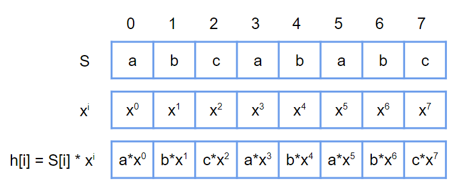

## 內建字串

S(l, r) : 表示字 S[l], S[l+1], ..., S[r] 這個連續區間形成的字串，在 C++ 中可以寫成 

```
S.substr(l, r - l + 1)
```

## rolling hash

### 判斷兩子字串是否相等

???+note "問題"
	輸入一個長度 n 的字串 S，接著有 q 次詢問，每次詢問 S 中兩個子字串 S(l<sub>1</sub>, r<sub>1</sub>) 和 S(l<sub>2</sub>, r<sub>2</sub>) 是否相同
	
	??? note "思路"
	
	    <figure markdown>
	      { width="500" }
	    </figure>
	    
	    x 隨意帶入一個比字母數量還大的數字（例如字母 = A...Z，那 x 至少需要 26）
	
	??? note "code"
	    ```cpp linenums="1"
	    struct Hash {
	        static const int M = 998244353;
	        static const int X = 131;
	        vector<int> H;
	        vector<int> h;
	        vector<int> pre;
	        vector<int> inv;
	        int n;
	
	        Hash(string &s) {
	            n = s.size ();
	            H.resize(n);
	            h.resize(n);
	            pre.resize(n);
	            inv.resize(n);
	
	            H[0] = 1;
	            for (int i = 0; i < n; i++) {
	                if (i) H[i] = (H[i - 1] * X) % M;
	                inv[i] = fastpow (H[i], M - 2);
	            }
	
	            for (int i = 0; i < n; i++) {
	                h[i] = ((s[i] - '0' + 1) * H[i]) % M;
	
	                if (i == 0) pre[i] = h[i];
	                else pre[i] = (pre[i - 1] + h[i]) % M;
	            }
	        }
	
	        int query(int l, int r) {
	            if (l == 0) return pre[r];
	            return ((pre[r] - pre[l - 1] + M) % M * inv[l]) % M;
	        }
	
	    private:
	        int fastpow(int a, int b) {
	            int ret = 1;
	            while (b != 0) {
	                if (b & 1) ret = ret * a % M;
	                a = (a * a) % M;
	
	                b >>= 1;
	            }
	            return ret;
	        }
	    }; 
	    ```

### 判斷兩個字串字典序

???+note "問題"
	輸入一個長度 n 的字串 S，接著有 q 次詢問，每次詢問 S 中兩個子字串 S(l<sub>1</sub>, r<sub>1</sub>) 和 S(l<sub>2</sub>, r<sub>2</sub>) 的字典序哪個比較小
	
	??? note "思路"
		二分搜第一個 S(l<sub>1</sub>, l<sub>1</sub> + i) 與 S(l<sub>2</sub>, l<sub>2</sub> + i) 不一樣的地方，用 rolling hash 檢查

???+note "[CSES - Minimal Rotation](https://cses.fi/problemset/task/1110/)"
	給一個長度為 n 的字串 S，問 S 的哪一個 rotation 的字典序最小
	
	??? note "思路"
		枚舉開頭，對於當前最佳解與當前枚舉到的開頭用上面的方法比較
		
	??? note "code"
		```cpp linenums="1"
		#include <bits/stdc++.h>
	    #define int long long
	    #define pii pair<int, int>
	    #define pb push_back
	    #define mk make_pair
	    #define F first
	    #define S second
	    #define ALL(x) x.begin(), x.end()
	
	    using namespace std;
	
	    struct Hash {
	        static const int M = 998244353;
	        static const int X = 131;
	        vector<int> H;
	        vector<int> h;
	        vector<int> pre;
	        vector<int> inv;
	        int n;
	
	        Hash(string &s) {
	            n = s.size ();
	            H.resize(n);
	            h.resize(n);
	            pre.resize(n);
	            inv.resize(n);
	
	            H[0] = 1;
	            for (int i = 0; i < n; i++) {
	                if (i) H[i] = (H[i - 1] * X) % M;
	                inv[i] = fastpow (H[i], M - 2);
	            }
	
	            for (int i = 0; i < n; i++) {
	                h[i] = ((s[i] - '0' + 1) * H[i]) % M;
	
	                if (i == 0) pre[i] = h[i];
	                else pre[i] = (pre[i - 1] + h[i]) % M;
	            }
	        }
	
	        int query(int l, int r) {
	            if (l == 0) return pre[r];
	            return ((pre[r] - pre[l - 1] + M) % M * inv[l]) % M;
	        }
	
	    private:
	        int fastpow(int a, int b) {
	            int ret = 1;
	            while (b != 0) {
	                if (b & 1) ret = ret * a % M;
	                a = (a * a) % M;
	
	                b >>= 1;
	            }
	            return ret;
	        }
	    }; 
	
	    signed main() {
	        string s;
	        cin >> s;
	        int n = s.size();
	        s = s + s;
	        Hash S(s);
	
	        int ansL = 0;
	        for (int i = 1; i < n; i++) {
	            // [i, i + n - 1]
	            int l = 0, r = n + 1;
	            while (r - l > 1) {
	                int mid = (l + r) / 2;
	                if (S.query(i, i + mid - 1) == S.query(ansL, ansL + mid - 1)) {
	                    l = mid;
	                } else {
	                    r = mid;
	                }
	            }
	            if (l == n) continue;
	            if (s[i + l] < s[ansL + l]) {
	                ansL = i;
	            }
	        }
	        cout << s.substr(ansL, n) << '\n';
	    } 
		```

### 失敗機率分析

[class 20](https://drive.google.com/file/d/1c9A1MrB-9D3EVr3eZPNWgaO4Rti3CN4K/view)

### 例題

???+note "[CSES - String Matching](https://cses.fi/problemset/task/1753/)"
	給一個長度 $n$ 的字串 $S$ 和一個長度 $m$ 的字串 $T$，問 $T$ 在 $S$ 內出現幾次
	
	$n,m\le 10^6$
	
	??? note "code"
		```cpp linenums="1"
		#include <bits/stdc++.h>
	    #define int long long
	    #define pii pair<int, int>
	    #define pb push_back
	    #define mk make_pair
	    #define F first
	    #define S second
	    #define ALL(x) x.begin(), x.end()
	
	    using namespace std;
	
	    struct Hash {
	        static const int M = 998244353;
	        static const int X = 131;
	        vector<int> H;
	        vector<int> h;
	        vector<int> pre;
	        vector<int> inv;
	        int n;
	
	        Hash(string &s) {
	            n = s.size ();
	            H.resize(n);
	            h.resize(n);
	            pre.resize(n);
	            inv.resize(n);
	
	            H[0] = 1;
	            for (int i = 0; i < n; i++) {
	                if (i) H[i] = (H[i - 1] * X) % M;
	                inv[i] = fastpow (H[i], M - 2);
	            }
	
	            for (int i = 0; i < n; i++) {
	                h[i] = ((s[i] - '0' + 1) * H[i]) % M;
	
	                if (i == 0) pre[i] = h[i];
	                else pre[i] = (pre[i - 1] + h[i]) % M;
	            }
	        }
	
	        int query(int l, int r) {
	            if (l == 0) return pre[r];
	            return ((pre[r] - pre[l - 1] + M) % M * inv[l]) % M;
	        }
	
	    private:
	        int fastpow(int a, int b) {
	            int ret = 1;
	            while (b != 0) {
	                if (b & 1) ret = ret * a % M;
	                a = (a * a) % M;
	
	                b >>= 1;
	            }
	            return ret;
	        }
	    }; 
	
	    signed main() {
	        string s, t;
	        cin >> s >> t;
	        Hash S(s), T(t);
	
	        int cnt = 0;
	        for (int i = 0; i < (int)s.size (); i++) {
	            if (S.query (i, i + t.size () - 1) == T.query (0, t.size () - 1)) cnt++;
	        }
	        cout << cnt << '\n';
	    } 
	    ```

???+note "[CSES - Finding Borders](https://cses.fi/problemset/task/1732/)"
	給一個長度為 $n$ 的字串 S，輸出 S 中所有的前綴和後綴相等字串的長度
	
	$n\le 10^6$
	
	??? note "code"
		```cpp linenums="1"
		#include <bits/stdc++.h>
	    #define int long long
	    #define pii pair<int, int>
	    #define pb push_back
	    #define mk make_pair
	    #define F first
	    #define S second
	    #define ALL(x) x.begin(), x.end()
	
	    using namespace std;
	
	    struct Hash {
	        static const int M = 998244353;
	        static const int X = 131;
	        vector<int> H;
	        vector<int> h;
	        vector<int> pre;
	        vector<int> inv;
	        int n;
	
	        Hash(string &s) {
	            n = s.size ();
	            H.resize(n);
	            h.resize(n);
	            pre.resize(n);
	            inv.resize(n);
	
	            H[0] = 1;
	            for (int i = 0; i < n; i++) {
	                if (i) H[i] = (H[i - 1] * X) % M;
	                inv[i] = fastpow (H[i], M - 2);
	            }
	
	            for (int i = 0; i < n; i++) {
	                h[i] = ((s[i] - '0' + 1) * H[i]) % M;
	
	                if (i == 0) pre[i] = h[i];
	                else pre[i] = (pre[i - 1] + h[i]) % M;
	            }
	        }
	
	        int query(int l, int r) {
	            if (l == 0) return pre[r];
	            return ((pre[r] - pre[l - 1] + M) % M * inv[l]) % M;
	        }
	
	    private:
	        int fastpow(int a, int b) {
	            int ret = 1;
	            while (b != 0) {
	                if (b & 1) ret = ret * a % M;
	                a = (a * a) % M;
	
	                b >>= 1;
	            }
	            return ret;
	        }
	    }; 
	
	    signed main() {
	        string s;
	        cin >> s;
	        Hash S(s);
	        int n = s.size();
	
	        for (int i = 1; i < n; i++) {
	            // [0, i - 1]
	            // [n - i, n - 1]
	            int l1 = 0, r1 = i - 1;
	            int l2 = n - i, r2 = n - 1;
	            //if (l2 <= r1) break;
	            if (S.query(l1, r1) == S.query(l2, r2)) {
	                cout << i << ' ';
	            }
	        }
	    } 
		```

???+note "[CSES - Finding Periods](https://cses.fi/problemset/task/1733/)"
	給長度 $n$ 的字串 S，輸出子字串的所有重複週期
	
	$n\le 10^6$
	
	??? note "code"
		```cpp linenums="1"
		#include <bits/stdc++.h>
	    #define int long long
	    #define pii pair<int, int>
	    #define pb push_back
	    #define mk make_pair
	    #define F first
	    #define S second
	    #define ALL(x) x.begin(), x.end()
	
	    using namespace std;
	
	    struct Hash {
	        static const int M = 998244353;
	        static const int X = 131;
	        vector<int> H;
	        vector<int> h;
	        vector<int> pre;
	        vector<int> inv;
	        int n;
	
	        Hash(string &s) {
	            n = s.size ();
	            H.resize(n);
	            h.resize(n);
	            pre.resize(n);
	            inv.resize(n);
	
	            H[0] = 1;
	            for (int i = 0; i < n; i++) {
	                if (i) H[i] = (H[i - 1] * X) % M;
	                inv[i] = fastpow (H[i], M - 2);
	            }
	
	            for (int i = 0; i < n; i++) {
	                h[i] = ((s[i] - '0' + 1) * H[i]) % M;
	
	                if (i == 0) pre[i] = h[i];
	                else pre[i] = (pre[i - 1] + h[i]) % M;
	            }
	        }
	
	        int query(int l, int r) {
	            if (l == 0) return pre[r];
	            return ((pre[r] - pre[l - 1] + M) % M * inv[l]) % M;
	        }
	
	    private:
	        int fastpow(int a, int b) {
	            int ret = 1;
	            while (b != 0) {
	                if (b & 1) ret = ret * a % M;
	                a = (a * a) % M;
	
	                b >>= 1;
	            }
	            return ret;
	        }
	    }; 
	
	    signed main() {
	        string s;
	        cin >> s;
	        Hash S(s);
	        int n = s.size();
	
	        for (int i = 1; i <= n; i++) {
	            int fg = 1;
	            for (int j = i; j < n; j += i) {
	                // [j, j + i - 1]
	                int len = min(i, (n - 1) - j + 1);
	                if (S.query(0, len - 1) != S.query(j, j + len - 1)) {
	                    fg = 0;
	                    break;
	                }
	            }
	            if (fg) cout << i << '\n';
	        }
	    } 
		```

???+note "[CSES - Longest Palindrome](https://cses.fi/problemset/task/1111/)"
	給一個長度為 n 的字串 S，問最長迴文子字串
	
	$n\le 10^6$
	
	??? note "思路"
		可以觀察到對於每一個字串中點，延伸出去的長度是不是迴文有單調性質。實作上，對於每一個字串中點 $O(\log n)$ 搜尋最長迴文，時間複雜度共 $O(n\log n)$
		
		【細節】 : 若使用上面的模板會 TLE，需要將 H[ ] 與 inv[ ] 拉出來建
		
		【註】 : 這題可以使用 [Manacher's Algorithm](https://cp-algorithms.com/string/manacher.html) 做到 $O(n)$
	
	??? note "code"
		```cpp linenums="1"
		#include <bits/stdc++.h>
	    #define int long long
	    #define pii pair<int, int>
	    #define pb push_back
	    #define mk make_pair
	    #define F first
	    #define S second
	    #define ALL(x) x.begin(), x.end()
	
	    using namespace std;
	
	    const int INF = 2e18;
	    const int maxn = 1e6 + 5;
	    const int M = 1e9 + 7;
	    const int X = 131;
	
	    int H[maxn], inv[maxn];
	
	    struct hah {
	        int n;
	        vector<int> pre;
	        vector<int> h;
	
	        void build (string &s) {
	            n = s.size ();
	            pre.resize (n);
	            h.resize (n);
	
	            for (int i = 0; i < n; i++) {
	                h[i] = H[i] * (s[i] - 'a' + 1) % M;
	                int tmp = H[i] * (s[i] - 'a' + 1);
	                if (i) pre[i] = (pre[i - 1] + h[i]) % M;
	                else pre[i] = h[i] % M;
	            }
	        }
	
	        int query (int l, int r) {
	            if (l == 0) return pre[r];
	            return (((pre[r] - pre[l - 1]) % M + M) % M) * inv[l] % M;
	        }
	    };
	
	    int fastpow (int a, int b) {
	        int ret = 1;
	        while (b != 0) {
	            if (b & 1) ret = ret * a % M;
	            a = (a * a) % M;
	
	            b >>= 1;
	        }
	        return ret;
	    }
	
	    string s, t;
	    int n;
	    hah *Hs = new hah ();
	    hah *Ht = new hah ();
	
	    void init () {
	        cin >> s;
	        reverse (ALL(s));
	        t = s;
	        reverse (ALL(s));
	        n = s.size ();
	        H[0] = 1;
	        for (int i = 1; i < n; i++) {
	            H[i] = H[i - 1] * X % M;
	            inv[i] = fastpow (H[i], M - 2);
	        }
	    }
	
	    bool check (int l, int r) {
	        if (l < 0) return 0;
	        if (r > n - 1) return 0;
	        if (l > r) return 0;
	
	        return Hs->query (l, r) == Ht->query (n - r - 1, n - l - 1);
	    }
	
	    void solve () {
	        Hs->build (s);
	        Ht->build (t);
	
	        int ans = 0, L = 0;
	        // ODD
	        for (int i = 0; i < n; i++) {
	            int l = 0, r = n;
	
	            while (l < r - 1) {
	                int mid = (l + r) >> 1;
	                if (check (i - mid, i + mid)) l = mid;
	                else r = mid;
	            }
	            if (2 * l + 1 > ans) {
	                ans = 2 * l + 1;
	                L = i - l;
	            }
	        }
	
	        // EVEN
	        for (int i = 0; i < n - 1; i++) {
	            int l = 0, r = n;
	
	            while (l < r - 1) {
	                int mid = (l + r) >> 1;
	                if (check (i - mid + 1, i + mid)) l = mid;
	                else r = mid;
	            }
	            if (2 * l > ans) {
	                ans = 2 * l;
	                L = i - l + 1;
	            }
	        }
	        cout << s.substr (L, ans) << "\n";
	    } 
	
	    signed main() {
	        // ios::sync_with_stdio(0);
	        // cin.tie(0);
	        int t = 1;
	        //cin >> t;
	        while (t--) {
	            init();
	            solve();
	        } 
	    } 
		```