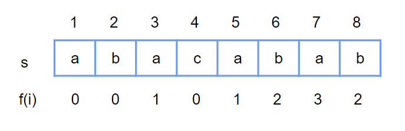
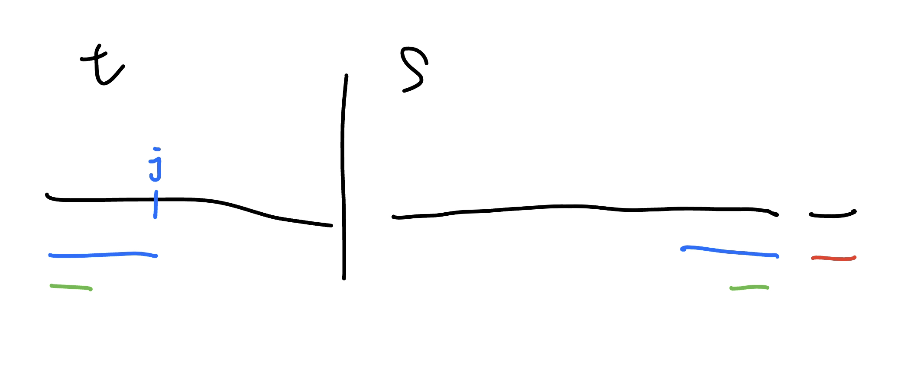

## 引入

???+note "問題"
	定義 input string s[1 ~ n] (1-base)
	
	令 f[i] : s[1~i] 的 「次長」共同前後綴長度

### 性質1

s[1~i] 的所有共同前後綴長度 :

- 最長 i

- 第 2 長 f[i]

- 第 3 長 f[f[i]]

- 第 4 長 f[f[f[i]]]

- …

### 性質2

f[i] - 1 一定是 s[1 ~ (i-1)] 的一個共同前後綴長度，但不一定是最長

⇒ 想要找 f[i] : 從 s[1~(i-1)] 共同前後綴去找

<figure markdown>
  { width="500" }
</figure>

### 實作

???+note "code"
	```cpp linenums="1"
    vector<int> kmp(string s) {  // 1-based string
        int n = s.size();
        vector<int> f(n, -1);
        for (int i = 1; i < n; i++) {
            int w = f[i - 1];
            while (w >= 0 && s[w + 1] != s[i]) {
                w = f[w];
            }
            f[i] = w + 1;
        }
        return f;
    }
    ```

## 例題

???+note "[CSES - String Matching](https://cses.fi/problemset/task/1753/)"
	給一個長度 $n$ 的字串 $S$ 和一個長度 $m$ 的字串 $T$，問 $T$ 在 $S$ 內出現幾次
	
	$n,m\le 10^6$
	
	??? note "思路"
		
	    - new_str = target + "$" + str
	    - f = build_f(new_str), 看幾個 f[i] = target.size()

### fail link dp

???+note "[CF 432 D. Prefixes and Suffixes](https://codeforces.com/problemset/problem/432/D)"
	給一個字串 s，問對於每個 s 的共同前後綴，在 s 出現幾次
	
	$1\le |s| \le 10^5$
	
	??? note "思路"
		根據性質 2，也就是當 f(i) 出現時，f(f(i)) 也會出現，我們可以推得一個 dp 轉移 :
		
		```
		for (int i = n ~ 1)
	        cnt[i]++;
	        cnt[f[i]] += cnt[i]
		```

???+note "[CF 955 D. Scissors](https://codeforces.com/contest/955/problem/D)"
	給一個字串 s，你可以拿兩段 s 中長度為 k 的 substring，再將他們兩個拼起來。問有沒有可能使裡面包含 substring t，若有可能輸出兩段分別的開頭 index
	
	$2\le |t| \le 2\times k\le |s|\le 5\times 10^5$
	
	??? note "思路"
		令 pre[i]: t[1:i] 首次出現位置，存結尾位置，suf[i]: t[i:m] 最後出現位置，存開頭位置，我們就只要枚舉 i，看是否符合 pre[i] < suf[i] 即可
		
		至於 pre, suf 要怎麼建立呢 ? 我們可以利用 kmp 看 s 的每一項與 t 的次長共同前後綴，然後再用 fail link dp 轉移。或是也可以用 rolling hash + two pointer
	
	??? note "code"
		```cpp linenums="1"
		#include <algorithm>
	    #include <cstdlib>
	    #include <iostream>
	    #include <string>
	    #include <vector>
	
	    using namespace std;
	
	    const int INF = 1e9;
	
	    vector<int> kmp(string s) {  // 1-based string
	        int n = s.size();
	        vector<int> f(n, -1);
	        for (int i = 1; i < n; i++) {
	            int w = f[i - 1];
	            while (w >= 0 && s[w + 1] != s[i]) {
	                w = f[w];
	            }
	            f[i] = w + 1;
	        }
	        return f;
	    }
	
	    vector<int> make_pre(int k, string s, string t) {
	        int n = s.size();
	        int m = t.size();
	
	        auto f = kmp("$" + t + "$" + s);              // $aaaa$baabaab
	                                                      //
	        if (*max_element(f.begin(), f.end()) >= m) {  // 不用分兩段就是好的
	
	            cout << "Yes" << '\n';
	            int pos = max_element(f.begin(), f.end()) - f.begin();
	            pos -= m + 1;
	            pos = max(pos, 2 * k);
	            cout << pos - 2 * k + 1 << ' ' << pos - k + 1 << '\n';
	
	            exit(0);
	        }
	
	        vector<int> pre(m + 1, INF);  // pre[i]: t[1:m] 第一次出現位置
	        for (int i = m + 1 + k; i < n + m + 2; i++) {
	            int len = f[i];
	            pre[len] = min(pre[len], i - m - 1);
	        }
	
	        // fail link dp
	        // 長度i 的位置出現的地方，也同時會有長度 f[i] 出現
	        for (int i = m; i >= 1; i--) {
	            int j = f[i];
	            pre[j] = min(pre[j], pre[i]);
	        }
	        return pre;
	    }
	
	    int main() {
	        cin.tie(0);
	        cin.sync_with_stdio(0);
	
	        int n, m, k;
	        string s;
	        string t;
	        cin >> n >> m >> k;
	        cin >> s >> t;
	
	        string rs(s.rbegin(), s.rend());
	        string rt(t.rbegin(), t.rend());
	
	        auto pre = make_pre(k, s, t);  // pre[i]: t[1:i] 首次出現位置，存結尾位置
	        auto suf = make_pre(k, rs, rt);  // suf[i]: t[i:m] 最後出現位置，存開頭位置
	        reverse(suf.begin(), suf.end());
	        for (int i = 0; i <= m; i++) {
	            suf[i] = n + 1 - suf[i];
	        }
	
	        /*
	        cout << s << '\n';
	        cout << t << '\n';
	        for (int i = 0; i <= m; i++) {
	            cout << pre[i] << '\t' << suf[i] << '\n';
	        }
	        */
	
	        bool good = false;
	        for (int i = 0; i <= m; i++) {
	            if (i <= k && m - i <= k && pre[i] < suf[i]) {
	                cout << "Yes" << '\n';
	                cout << pre[i] - k + 1 << ' ' << suf[i] << '\n';
	                /*
	                cout << s.substr(pre[i] - k, k) << ' ' << s.substr(suf[i] - 1, k)
	                     << '\n';
	                */
	                good = true;
	                break;
	            }
	        }
	        if (good == false) {
	            cout << "No" << '\n';
	        }
	        return 0;
	    }
	    ```

### kmp+dp

利用 dp(i, j)，代表對於 s[1, i]，次長共同前後綴為 t[1, j]。

轉移的部分 dp(i + 1, k) = dp(i, j) + ...，其中 k 就是 s[1, i+1] 的次長共同前後綴會是 t[1, k]。這部分可以利用 kmp 預處理 t 的失敗函數，轉移過程直接從 w = j 去找次長共同前後綴（詳見 CSES - Required Substring 的代碼）

<figure markdown>
  { width="300" }
</figure>

???+note "[CSES - Required Substring](https://cses.fi/problemset/task/1112/)"
	給一個長度 $m$ 的字串 t，問有幾個長度為 $n$ 的字串 s 包含 substring t
	
	$1\le n\le 100,1\le m\le 100,$ s, t 由字母 A–Z 組成
	
	??? note "思路"
		- dp(i, j) = s[1, i] 的最長匹配為 t[1, j] 的方案數
		
		- dp(i + 1, k) += dp(i, j) 其中 t[1, k] 為 s[1, i] + c 後的最長匹配
		
			- dp(*, m) 不能拿來轉移
		
		- 答案為 total - dp(n, 0~(m - 1))
		 
	??? note "code"
		```cpp linenums="1"
		#include <bits/stdc++.h>
	    #define int long long
	    #define pb push_back
	    #define mk make_pair
	    #define F first
	    #define S second
	    #define ALL(x) x.begin(), x.end()
	
	    using namespace std;
	    using pii = pair<int, int>;
	
	    const int INF = 2e18;
	    const int M = 1e9 + 7;
	
	    int fpow(int a, int b) {
	        int ret = 1;
	        a %= M;
	        while (b != 0) {
	            if (b & 1) ret = (ret * a) % M;
	            a = (a * a) % M;
	            b >>= 1;
	        }
	        return ret;
	    }
	
	    vector<int> kmp(string s) { 
	        int n = s.size();
	        vector<int> f(n, -1);
	        for (int i = 1; i < n; i++) {
	            int w = f[i - 1];
	            while (w >= 0 && s[w + 1] != s[i]) {
	                w = f[w];
	            }
	            f[i] = w + 1;
	        }
	        return f;
	    }
	
	    signed main() {
	        int n;
	        cin >> n;
	        string t;
	        cin >> t;
	        int m = t.size();
	        t = "$" + t;
	
	        vector<int> f = kmp(t);
	        vector<vector<int>> dp(n + 1, vector<int>(n + 1, 0));
	        dp[0][0] = 1;
	        for (int i = 0; i < n; i++) {
	            for (int j = 0; j < m; j++) {
	                for (int k = 0; k < 26; k++) {
	                    int w = j;
	                    while (w >= 0 && t[w + 1] != ('A' + k)) w = f[w];
	                    w += 1;
	                    dp[i + 1][w] = (dp[i + 1][w] + dp[i][j]) % M;
	                }
	            } 
	        }
	        int sum = 0;
	        for (int j = 0; j < m; j++) {
	            sum = (sum + dp[n][j]) % M;
	        }
	        // total - fail
	        cout << (fpow(26, n) - sum + M) % M << endl;
	    } 
		```

???+note "[2015 北市賽 pD. 猜謎遊戲 (Guess)](https://tioj.ck.tp.edu.tw/problems/1091)"
	給字串 s 跟 t，問最少要刪幾個 s 中的字元，讓 t 不是 s 的 substring

	$|s| \le 100,|t| \le 1000,$ s, t 由字元 A 與 B 組成
	
	??? note "思路"
		- dp(i, j) = 把 s[1, i] 刪掉一些字元變成 s'，且 s' 與 t 的次大共同前後綴為 t[1, j]
	        - 因為不能匹配到 t[1, m]，所以 dp(*, m) 不拿去轉移
	
	    - 刪 s[i + 1] :
	        - dp(i + 1, j) ← min( dp(i, j) + 1)
	
	    - 不刪 s[i + 1] :
	        - dp(i + 1, k) ← dp(i, j)
	        - k 為 t 與 s[1, i+1] 的次長共同前後綴長度
	            - 可從 w = j 轉移
		
		- 複雜度 O(nm<sup>2</sup>)
	
		<figure markdown>
	      { width="300" }
	    </figure>
		
	??? note "code"
		```cpp linenums="1"
		#include <bits/stdc++.h>
	    #define int long long
	    #define pii pair<int, int>
	    #define pb push_back
	    #define mk make_pair
	    #define F first
	    #define S second
	    #define ALL(x) x.begin(), x.end()
	
	    using namespace std;
	
	    const int INF = 2e18;
	
	    vector<int> KMP(string s) { // 1-based string
	        int n = s.size() - 1;
	        vector<int> F(n + 1, -1);
	
	        for (int i = 1; i <= n; i++) {
	            int w = F[i - 1];
	            while (w >= 0 && s[w + 1] != s[i]) w = F[w];
	
	            F[i] = w + 1;
	        }
	        return F;
	    }
	
	    signed main() {
	        string s, t;
	        cin >> t >> s;
	
	        int n = s.size();
	        int m = t.size();
	        t = "$" + t;
	        s = "$" + s;
	        vector<int> f = KMP(t);
	
	        vector<vector<int>> dp(n + 1, vector<int>(m + 1, INF));
	        dp[0][0] = 0;
	        for (int i = 0; i < n; i++) {
	            for (int j = 0; j < m; j++) {
	                dp[i + 1][j] = min(dp[i + 1][j], dp[i][j] + 1);
	                int w = j;
	                while (w >= 0 && t[w + 1] != s[i + 1]) w = f[w];
	                w += 1;
	                dp[i + 1][w] = min(dp[i + 1][w], dp[i][j]);
	            }
	        }
	        cout << *min_element(dp[n].begin(), dp[n].begin() + m) << '\n';
	    } 
		```

???+note "[CF 1303 E. Erase Subsequences](https://codeforces.com/contest/1303/problem/E)"
	給 s, t，至多能從 s 中選出兩個 subsequence，問是否能組成 t
	
	$|t| \le |s| \le 400$
	
	??? note "思路"
		我們很明顯可以想出來一步：枚舉 t 在哪裡拆開，然後將 t 轉化為 t1 + t2，再判斷 s 中能不能拆出 t1, t2 就好了。 那麼問題轉化為了 s 中能不能拆出來的問題了。發現可能需要 dp 解。
		
		很顯然的狀態是: dp(i, j, k) 表示 s 的前 i 位能不能拆出 t1 的前 j 位和 t2 的前 k 位，因為狀態量過大我們就考慮優化這個狀態，dp(i, j) 表示 s 的前 i 位拆出 t1 的前 j 位，最多再拆出 t2 的前多少位。
		
		- 當 s[i + 1] = t1[j + 1] 時，dp(i, j) → dp(i + 1, j + 1)

		- 當 s[i + 1] = t2[dp(i, j) + 1] 時，dp(i, j) + 1 → dp(i + 1, j)

		- 任何情況下，dp(i, j) → dp(i + 1, j)

		複雜度 O(n) * O(n ^ 2) = O(n ^ 3)

	??? note "code"
		```cpp linenums="1"
		#include <bits/stdc++.h>
        using namespace std;

        const int MAXN = 805;
        int dp[MAXN][MAXN];

        bool check(string s, string t1, string t2) {
            memset(dp, -1, sizeof(dp));
            dp[0][0] = 0;
            s = "$" + s;
            t1 = "$" + t1;
            t2 = "$" + t2;
            for (int i = 0; i < s.size(); i++) {
                for (int j = 0; j < t1.size(); j++) {
                    if (dp[i][j] == -1) continue;
                    dp[i + 1][j] = max(dp[i + 1][j], dp[i][j]);
                    if (s[i + 1] == t1[j + 1]) dp[i + 1][j + 1] = max(dp[i + 1][j + 1], dp[i][j]);
                    if (s[i + 1] == t2[dp[i][j] + 1]) dp[i + 1][j] = max(dp[i + 1][j], dp[i][j] + 1);
                }
            }
            if (dp[s.size() - 1][t1.size() - 1] == t2.size() - 1) {
                return true;
            }
            return false;
        }

        bool solve(string s, string t) {
            for (int i = 0; i <= t.size(); i++) {
                string t1, t2;
                for (int j = 0; j < i; j++) {
                    t1 = t1 + t[j];
                }
                for (int j = i; j < t.size(); j++) {
                    t2 = t2 + t[j];
                }
                if (check(s, t1, t2)) {
                    return true;
                }
            }
            return false;
        }

        int main() {
            int n;
            cin >> n;
            while (n--) {
                string s, t;
                cin >> s >> t;
                if (solve(s, t)) {
                    printf("YES\n");
                } else {
                    printf("NO\n");
                }
            }
            return 0;
        }
        ```
		
---

## 資料

- <https://hackmd.io/@penguin71630/stringprob>