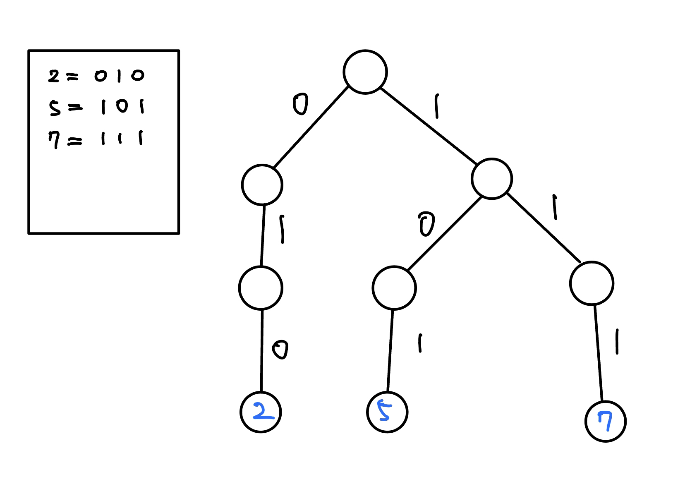

## 模板

???+note "code"
	```cpp linenums="1"
	struct Node {
        Node *ch[26];
        int idx = 0;
    };

    void add (Node* rt, string s, int idx) {
        for (int i = 0; i < s.size(); i++) {
            int c = s[i] - 'a';
            if (rt->ch[c] == nullptr) {
                rt->ch[c] = new node();
            }
            rt = rt->ch[c];
        } 
        rt->idx = idx;
    }
    ```

## 例題

???+note "[CSES - Word Combinations](https://cses.fi/problemset/task/1731/)"
	給長度為 $n$ 字串 $S$ 及 $k$ 個字串 $T_i$，問有多少種組合可以組出目標字串可（重複使用）
	
	$n\le 5000,k\le 10^5,\sum |T_i| \le 10^6$
	
	??? note "思路"
		使用動態規劃 : 
		
		- 狀態 $dp(i) =$ 要組合出 $S(1, i)$ 的方法數
	
		- 轉移 $dp(i) = \sum dp(i - |T_j|)$ 若 $T_j = S(i - |T_j| + 1, i)$
		
		如何快速判斷 $T_j$ 和 $S(i - |T_j| + 1, i)$ 是否相等 ? 使用 Trie 幫助轉移。先建出每個 $T_i$ 反向字串的 Trie，轉移過程按照 $S$ 走訪 Trie，若遇到單字則轉移。時間複雜度 : 狀態數 $O(n)$，轉移為 $O(n)$，共 $O(n^2)$
	
	??? note "code"
		```cpp linenums="1"
	    #include <bits/stdc++.h>
	    #define int long long
	    #define lowbit(x) (x & (-x))
	    #define IO ios::sync_with_stdio(0);cin.tie(0);
	    #define pii pair<int, int>
	    #define mk make_pair
	    #define pb push_back
	    using namespace std;
	
	    const int INF = 0x3f3f3f3f;
	    const int maxn = 1e6 + 5;
	    const int M = 1e9 + 7;
	    int dp[maxn];
	
	    struct node {
	        node *ch[26];
	        int idx = 0;
	    };
	
	    void add (node *rt, string s, int idx) {
	        for (int i = 0; i < s.size(); i++) {
	            int c = s[i] - 'a';
	            if (rt -> ch[c] == nullptr) {
	                rt -> ch[c] = new node();
	            }
	            rt = rt -> ch[c];
	        } 
	        rt -> idx = idx;
	    }
	
	    void solve (node *rt, int idx, string str) {
	        for (int i = idx; i >= 1; i--) {
	            rt = rt -> ch[str[i - 1] - 'a'];  
	            if (rt == nullptr) break;
	            if (rt -> idx) {
	                dp[idx] += dp[i - 1];
	                dp[idx] %= M;
	            }
	        }
	    }
	
	    signed main () {
	        string str;
	        int n;
	        cin >> str;
	        cin >> n;
	        vector<string> s(n + 1);
	        node *rt = new node();
	        for (int i = 1; i <= n; i++) {
	            cin >> s[i];
	            reverse(s[i].begin(), s[i].end());
	            add(rt, s[i], i);
	        }
	        dp[0] = 1;
	        for (int i = 1; i <= str.size(); i++) {
	            solve(rt, i, str);
	        }
	        cout << dp[str.size()] << "\n";
	    }
	    ```

## 0-1 Trie

將數字轉成二進位，當成字串打到 Trie 上面

<figure markdown>
  { width="500" }
</figure>

### 最大異或數對

???+note "[LOJ #10050. 「一本通 2.3 例 2」The XOR Largest Pair](https://loj.ac/p/10050)"
	給 $N$ 個數字 $a_i$，找出其中兩個數字使得兩數 xor 數值最大
	
	$1\le N\le 10^5,0\le A_i < 2^{31}$
	
	??? note "思路"
		將 $a$ 打到 01 Trie 上，對於每個數字從 root Greedy 的走下去

???+ note "變化題 K-th Maximum XOR of Two Numbers in an Array"
	給長度為 $n$ 的陣列 $a$，問兩個元素 xor 起來，第 $k$ 大是多少
	
	$n\le 10^5$
	
	??? note "想法"
	    - 二分搜 $O(\log C)$
	
	    - 用 $\texttt{Trie}$ 檢查 $O(n\log C)$ 
	        - 對於每個 $a_i$ 找 $a_i \oplus a_j \le x$ 的 $a_j$ 有幾個
	        - 每次在 $\texttt{Trie}$ 上 $\texttt{find }O(\log C)$ (深度)
	        - 有 $n$ 個 $a_i$ 所以才是 $O(n\log C)$
	        - $\Rightarrow O(n\log^2 C)$

### 最大異或路徑		

???+note "[LOJ #10056. 「一本通 2.3 练习 5」The XOR-longest Path](https://loj.ac/p/10056)"
	給定一棵 n 個點的帶權樹，求樹上最長的異或和路徑。
	
	$1\le n\le 10^5, 0\le w < 2^{31}$
	
	??? note "思路"
		$f(u,v)=f(rt,u)\oplus f(rt,v)$
		
		問題就轉成挑兩個數起來最大的

???+ note "變化題 [CF 1055 F. Tree and Xor](https://codeforces.com/contest/1055/problem/F)"
    給一顆 $n$ 個點樹，設 $f(u,v)$ 為 $u$ 到 $v$ 的邊權異或和，問對於所有的 $f(u,v)$ 第 $k$ 大是多少
    
    $n\le 2\times 10^5$
    
    ??? note "想法"
        - k-th Xor path problem
        - $f(u,v)=f(rt,u)\oplus f(rt,v)$
        - 問題就轉成挑兩個 XOR 起來第 $k$ 大

### 習題

???+ note "[CSES - Maximum Xor Subarray](https://cses.fi/problemset/task/1655/)"
	給長度為 $n$ 的陣列 $a$，最大 xor 起來的 Subrray 是多少
	
	$n\le 2\times 10^5,0\le x_i\le 10^9$
	
	??? note "想法"
		S[i, j] = S[j] ^ S[i - 1]，就變成上面最大異或數對的問題了
	 
	??? note "code" 
	    ```cpp linenums="1"
	    #include <bits/stdc++.h>
	    #define int long long
	    #define pii pair<int, int>
	    #define pb push_back
	    #define mk make_pair
	    #define F first
	    #define S second
	    #define ALL(x) x.begin(), x.end()
	
	    using namespace std;
	    using PQ = priority_queue<int, vector<int>, greater<int>>;
	
	    const int INF = 2e18;
	    const int maxn = 3e5 + 5;
	    const int M = 1e9 + 7;
	
	    struct node {
	        node *ch[2];
	
	        vector<int> con (int x) {
	            vector<int> res;
	            for (int i = 0; i <= 30; i++) {
	                if (x & (1 << i)) res.pb (1);
	                else res.pb (0);
	            }
	            return res;
	        }
	
	        void add (int x, node *rt) {
	            vector<int> res = con (x);
	            int n = res.size ();
	
	            for (int i = n - 1; i >= 0; i--) {
	                if (rt -> ch[res[i]] == nullptr) rt -> ch[res[i]] = new node ();
	                rt = rt -> ch[res[i]];
	            }
	        }
	
	        int find (int x, node *rt) {
	            vector<int> res = con (x);
	            int n = res.size();
	
	            int ret = 0;
	            for (int i = n - 1; i >= 0; i--) {
	                if (rt -> ch[res[i] ^ 1] == nullptr) rt = rt -> ch[res[i]], ret += (res[i] << i);
	                else rt = rt -> ch[res[i] ^ 1], ret += ((res[i] ^ 1) << i);
	            }
	            return ret;
	        }
	    };
	
	    int n;
	    int a[maxn], pre[maxn];
	
	    void init () {
	        cin >> n;
	        for (int i = 1; i <= n; i++) cin >> a[i];
	    }
	
	    void solve () {
	        node *rt = new node ();
	
	        int res = 0;
	        rt -> add (0, rt);
	        for(int i = 1; i <= n; i++) {
	            pre[i] = pre[i - 1] ^ a[i];
	            int ret = rt -> find (pre[i], rt) ^ pre[i];
	            res = max (res, ret);
	            rt -> add (pre[i], rt);
	        }
	
	        cout << res << "\n";
	    } 
	
	    signed main() {
	        // ios::sync_with_stdio(0);
	        // cin.tie(0);
	        int t = 1;
	        //cin >> t;
	        while (t--) {
	            init();
	            solve();
	        }
	    } 
	    ```

???+note "<a href="/wiki/graph/tree_greedy/?h=ioic#2023-ioic-308" target="_blank">2023 IOIC 308 . 數字遊戲</a>"
	給定 $a_1, a_2, \ldots, a_{2N}$，Alice 可以將這個數列任意排列，之後 Bob 要做最少次操作使得 $a_{i} = a_{i+N}$ 對所有 $i$ 從 $1$ 到 $N$ 都成立，Bob 每次可以進行的操作為選擇一個足標 $i$，將 $a_i$ 改成 $\lfloor \frac{a_i}{2} \rfloor,2a_i$ 或 $2a_i+1$。Alice 想讓 Bob 需要的操作次數盡量多，那最多可以是多少？
	
	Alice 會進行 $Q$ 次操作，每一次操作都會選擇數列的某個數修改成新的數字，輸出修改後整個陣列的答案是多少。
	
	$N,Q\le 10^5,1\le a_i\le 10^6$

???+note "[CF 1864 E. Guess Game](https://codeforces.com/contest/1864/problem/E)"
	給一個陣列 $a_1,\ldots ,a_n$，選隨意兩個數 i, j，令 a = a[i], b = a[j]
    
    a 和 b 會輪流說出一些以下訊息，他們是可以聽到對方訊息的，一開始他們只知道 a | b 是多少，他們的目標是確定 a, b 的關係是 $a < b, a > b, a=b$ 哪種
    
    - 說 : 「I don't know」
    
    - 或說 : 「I know, 答案是 $a < b, a > b, a=b$」，說完後遊戲即結束
    
    a 和 b 都 play optimally，問說話次數的期望值是多少
    
    $1\le n\le 2\times 10^5,0\le a_i\le 2^{30}$
    
    ??? note "思路"
    	先觀察值域範圍只有 [0, 1] 的 case，a 為先手
    	
    	- 若當前 a = 0, b = 0，因為 a|b 的這位就是 0，他們會直接忽視
    
    		- 說話次數 += 0
    	
    	- 若當前 a = 0, b = 1，因為 a|b 的這位就是 1，a 可以直接輸出 $a<b$
    		
    		- 說話次數 += 1
    		
    	- 若當前 a = 1, b = 0，因為 a|b 的這位就是 1，不確定 b 是 0 或 1，a 會說 idk，輪到 b 時他就知道 $b>a$
    
    		- 說話次數 += 2
    	
    	- 若當前 a = 1, b = 1，因為 a|b 的這位就是 1，a 會說 idk，輪到 b 就知道 a 是 1（若後面還有位數則變子問題）
    
    		- 說話次數 += 1
    	
    	跟平常一樣，越高位越優先，我們考慮隨意兩個數 a, b，從 i = lgC … 0
    
        - 若 a[i] = b[i] = 0 跳過
    
        - 若 a[i] = b[i] = 1, cnt +=1, 交換先後手
            - a: idk, b: 知道 a[i] = 1 了, 直接去比較 i + 1
    
        - 若 a[i] = 0 ⇒ ans = cnt ; 若 b[i] = 0 ⇒ ans = cnt + 1，然後遊戲就停止了
    
    	記得判當 a = b 時，他們會說話的次數恰好是 1-bit 的數量 +1
    
    	使用 01 Trie 枚舉 a[i]，考慮跟除了 a[i] 以外的 a[j] 的貢獻
    
    	> 比較詳細可以參考 : <https://www.bilibili.com/video/BV1Bp4y1P7u6/?p=5>
    
    ??? note "code"
    	```cpp linenums="1"
    	#include <bits/stdc++.h>
        #define int long long
        #define pii pair<int, int>
        #define pb push_back
        #define mk make_pair
        #define F first
        #define S second
        #define ALL(x) x.begin(), x.end()
    
        using namespace std;
    
        const int M = 998244353;
        int ans, cnt, now;
    
        struct Node {
            Node *lc = nullptr;
            Node *rc = nullptr;
            int sz = 0;
    
            void pull() {
                sz = 0;
                if (lc) sz += lc->sz;
                if (rc) sz += rc->sz;
            }
        };
    
        void add(Node *root, int x, int i) {
            if (i == -1) {
                root->sz++;
                return;
            }
            if (x & (1 << i)) {
                if (root->rc == nullptr) {
                    root->rc = new Node();
                }
                add(root->rc, x, i - 1);
                root->pull();
            } else {
                if (root->lc == nullptr) {
                    root->lc = new Node();
                }
                add(root->lc, x, i - 1);
                root->pull();
            }
        }
    
        void query(Node *root, int x, int i) {
            if (i == -1) {
                ans = (ans + root->sz * (cnt + 1)) % M;
                return;
            }
            if (x & (1 << i)) { // me = 1, other = 0
                if (root->lc) {
                    if (now) {
                        ans = (ans + (cnt + 2) * root->lc->sz % M) % M;
                    } else {
                        ans = (ans + (cnt + 1) * root->lc->sz % M) % M;
                    }
                } 
                cnt++;
                now ^= 1;
                query(root->rc, x, i - 1);
            } else { // me = 0, other = 1
                if (root->rc) {
                    if (now) {
                        ans = (ans + (cnt + 1) * root->rc->sz % M) % M;
                    } else {
                        ans = (ans + (cnt + 2) * root->rc->sz % M) % M;
                    }
                }  
                query(root->lc, x, i - 1);
            }
        }
    
        int fpow(int a, int b) {
            int ret = 1;
            a %= M;
            while (b != 0) {
                if (b & 1) ret = (ret * a) % M;
                a = (a * a) % M;
                b >>= 1;
            }
            return ret;
        }
    
        void solve() {
            ans = 0;
            int n;
            cin >> n;
    
            vector<int> a(n);
            for (int i = 0; i < n; i++) {
                cin >> a[i];
            }
            Node *root = new Node();
            for (int i = 0; i < n; i++) {
                add(root, a[i], 29);
            }
            for (int i = 0; i < n; i++) {
                cnt = 0;
                now = 1;
                query(root, a[i], 29);
            }
            cout << (ans * fpow(n * n, M - 2)) % M << '\n';
        }
    
        signed main() {
            int t = 1;
            cin >> t;
            while (t--) {
                solve();
            }
        } 
    	```

???+note "[USACO 2019 Dec. Gold p1. Cow Land](http://www.usaco.org/index.php?page=viewproblem2&cpid=921)"
    給一顆 $n$ 個點的樹，賦予每個 Node $a_i$，$q$ 筆詢問
    
    - $\text{modify}(i,x):$ 把 $a_i = x$
    
    - $\text{query}(u,v):$ 問把 $u \rightarrow v$ 的 path 上的 $a_i$ xor 起來是多少
    
    $2\le n\le 10^5,1\le q\le 10^5,0\le a_i\le 10^9$
    
    ??? note "解析"
        - 相關的問題(不是 Trie)
        
        - $f(u,v)=f(u,rt) \oplus f(v,rt)$
    
        - 問題就轉成了 CSES path queries I
    
        - 用 euler technique 解決

???+note "[CF 1895 D. XOR Construction](https://codeforces.com/contest/1895/problem/D)"
	給一個長度為 $n - 1$ 的序列 $a_1, \ldots ,a_n$，構造一個 $0\ldots (n - 1)$ 的 permutation $b_1, \ldots ,b_n$，對於所有 $1\le i\le n - 1$ 滿足 $b_i\oplus b_{i+1}=a_i$
	
	$2\le n\le 2\times 10^5$
	
	??? note "hint"
		當 b[1] 決定後，b[2], ..., b[n] 就可以被推出來
		
	??? note "思路"
		我們可以看到數組 b 的第一個元素決定了所有其他值，即 b[i + 1] = b[1] ⊕ a[1] ⊕ ⋯ ⊕ a[i]。

        枚舉所有 b[1] 可能的值，對於每個 b[1] 的值，我們需要檢查它是否產生合法的 permutation（即所有 b[i] < n）。為了有效率地檢查，我們開一個陣列 c，其中 c[i] 是 a 的前 i 個元素的 xor（即 c[i] = a[1] ⊕ a[2] ⊕ ⋯ ⊕ a[i]，其中 c[0] = 0）。我們可以看到 b[i + 1] = b[1] ⊕ c[i]。我們將所有 c[i] 的值存在一個 trie。要檢查 b[1] 是否生成了所有元素都小於 n 的數組，我們可以在 trie 上找到 b[1] ⊕ c[i] 的最大值，如果小於 n，那麼就是一個合法的 permutation。

        我們實際上不需要檢查最小值是否為 0，以及所有元素是否都不同：因為保證存一組解，因此所有值 0, c[1], c[2], c[3], ⋯, c[n-1] 都會兩兩不同，所以無論選擇哪個 b[1]，所有 b[i] 也都將兩兩不同，那麼既然最大值都小於 n 了，一定就會是 {0, ..., n - 1} 這個集合